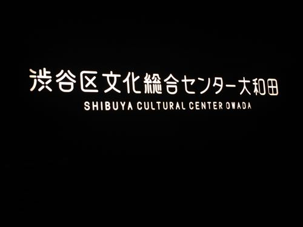
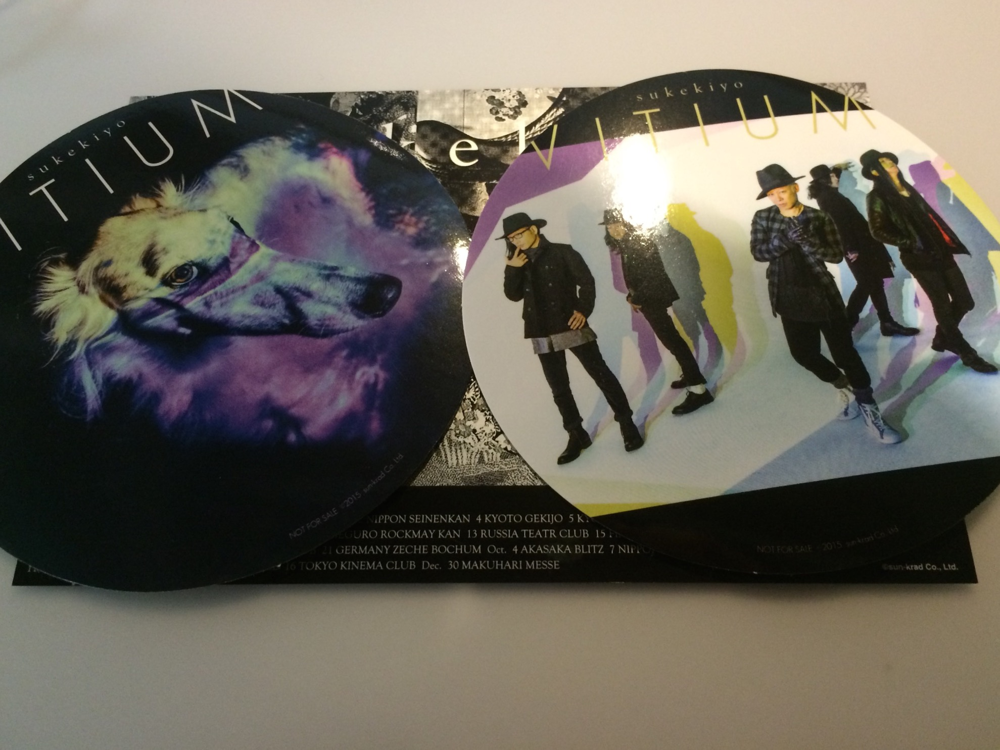

---
categories:
- sukekiyoのLIVEレポ
date: Mon, 09 Feb 2015 15:21:26 +0000
slug: post-7144
tags:
- LIVEレポ
- sukekiyo
title: 【ライブレポ】sukekiyo 二〇一五年公演「The Unified Field」2015_2_9 @渋谷区総合文化センター大和田 さくらホール
---

極寒の真冬に咲いた花はさくらの花でした。<!--more-->ハロー。しんぺー(<a href="https://twitter.com/s_s_p_y" target="_blank">@s_s_p_y</a> )です。

オフィより詳しくて、wikiよりも有用なsukekiyo情報サイト「Gadget Zombie Parasite(ガジェットゾンビィパラサイト)」へようこそ。

<h2>The Unified Field 2/9のセトリ</h2>

aftermath
leather Field
dunes
hidden one
zephyr
dot
foster mother
focus

烏有の空
nine melted fiction
班人間
vandal

in all weathers
celeste
mama
雨上がりの優詩

<h2>セットとメンバー衣装</h2>

下手から、UTAさん、未架さん、匠、YUCHI氏でセンター京さん

これが噂に聞く新フォーメーションかという感じでした。ただ匠の所でトラブった場合上手の袖近くにいた方が都合いいんでないの？とも思いました。あとはインスト2日間でUTAさんおしになりましたので、上手側でもよかったです←

メンバー衣装は、暗くてあまり見えませんでしたが、京さんは薄手の黒い布を終始被っていて、女性の黒髪のようでした。あとは黒ジャケットに八分丈くらいのパンツ？かな。素肌にチョーカーで、メイクをしていました。おそらくメンバー全員メイクをしていたかと思われます。

<h2>演出</h2>

いつものブザーが流れると注意事項がアナウンスされました。

2回目のブザーが流れると同時にステージ中央に額縁に模したモニターに映像が投影され、京さんの語りに合わせて文字が映し出されました。

見慣れた 冷たい地面
見慣れた 冷たい足
夢を  喰らう

その後演奏が始まるという流れでスタート。インストやニコ生にて2日間合わせて全曲やりたいと言っていましたが、本日はVITIUM全9曲中7曲も披露してくれました。
Manieraと白露は明日かな？

以下順不同で感想です。一部重要な演出があったけど、それはご自身の目でどうぞ。

不覚にも、大変失礼ながら同じ過ちを•••ウトウトと。。いや、でも聞いてくれ。隣の人始まる前から寝てたでヽ(´o｀；

まぁでも、ぼくzephyrで覚醒

京さんの喉絶好調。本日最初の鳥肌が立ちました。さすが1年以上演奏してきた楽曲だけあって、これこそsukekiyoという迫力でした。そして、込められた感情に涙腺が緩みました。

その後は新曲と旧曲を織り交ぜつつ新しい世界を表現してたわけですが、ふと、気がつきました。なんか、なんというか曲に、温かさを感じて。照明も桃色が多用されていた気がします。

後半のmamaでそれを確信しました。この極寒の渋谷に春を咲かせようとしてるんだと

https://twitter.com/s_s_p_y/status/564744476841619457

おそらく、だからツアー初日に「さくらホール」を選んだんだと。

それとmamaへの入り方が神がかってた。。。この曲個人的に大好きなんですが、いつも演奏しないのかな？と思うタイミングでぶっこんでくるからいつも驚きます。

そして、まだ終わらない

雨上がりの優詩では、バックに巨大な聖堂が映し出され、やがて黄色く照らされ回転しだして、そのあと桜の木を思わすようなピンク色に変わった。

最後、いつものように京からのおやすみはなく、かわりにバックスクリーンに映像がながれた。
京の語りと文字がながれ、さいごに

「おやすみ」

そして流れるエンドロール

最後はSpecial Thanksで締めくくられていた。
DIRENGREY「a knot」／sukekiyo official web site／official mobie site 京 online

<h2>しんぺーはこう思った。</h2>

すごい、LIVEだった。映画というよりも演劇を見ている感覚。

そして、終わった瞬間にこの素晴らしいものを他のsukekiyoに関心がない人に教えたいなって、純粋に思った。

親とかおばあちゃんとかそういう人に

そして

https://twitter.com/s_s_p_y/status/564744761152520192

ちなみにCDについていた引き換え券の特典はこちらでした。どちらかがon-line限定の方のです。

といったところで、本日は以上です。おやすみなさい。