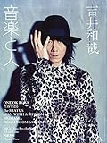
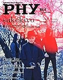
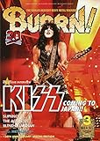

---
categories:
- sukekiyo
date: Sat, 14 Feb 2015 16:00:00 +0000
slug: post-7158
tags:
- sukekiyoまとめ
title: 【sukekiyoまとめ】The Unified Fieldさくらホール公演終了と各雑誌掲載情報
---

素晴らしいの一言で語りつくせないツアーの東京公演が終了しました。次は京都劇場、そして追加公演の調布のみとなりました。セトリ含めて、ちょこっと追加の情報をまとめておきます。<!--more-->ハローしんぺー(<a href="https://twitter.com/s_s_p_y" target="_blank">@s_s_p_y</a> )です。
オフィより詳しくて、wikiよりも有用なsukekiyo情報サイト「Gadget Zombie Parasite(ガジェットゾンビィパラサイト)」へようこそ。
LINE@のページを作りました。LINEで更新情報を受け取るにはこちらをどうぞ

<h2>今週のsukekiyo</h2>

<h3>東京キネマ倶楽部での通販限定豪華版購入者特典のイベント</h3>

詳細はこちらをご確認ください。
【sukekiyo】通販限定豪華版購入者限定イベント＠東京キネマ倶楽部 | Gadget Zombie Parasite  

この日は300名前後の方が入場されていたみたいです。
また、キネマ倶楽部にいったことがない方のためにこの会場の特徴をご紹介

・入場は、10名くらずつエレベーターに乗せられ上がります。
・ロッカーは会場のステージが見える位置にあります。上手の方に。
・退場の際は、エレベーターではなく階段を降りることになります。この時はじめてここがビルの５階？ということを知ります。

<h3>新宿タワーレコードでのVITIUM発売記念のインストアイベント</h3>

メンバー全員参加で、司会は増田さんです。
押しあり、運ばれる人ありのとても”アツい”インストでした。

今日の格好がかわいかったのと、さすがの増田さんということで、前日のキネマ倶楽部以上の情報をメンバーから引き出しておりました。

詳細はこちらの記事を

<a style="color:#0070C5;" href="https://www.warawareotoko.com/2015/02/09/post-7137/" target="_blank">【sukekiyo】VITIUM発売記念タワーレコードインストアイベント | Gadget Zombie Parasite</a>  

それと最後UTAさんはけるときにしゃがんだら真っ赤なおパンティが見えましたとさ

<h3>VITIUM発売記念ニコ生</h3>

京さんのかわ◯さ爆発でしたね！これまた増田さんが司会で、観覧ありの素晴らしい放送でした。

どうやら30分で区切って100人くらいで入れ替えでの観覧だったみたいです。寒すぎて自宅からぼくは、放送を見守っておりました。

そうしたら！！放送終了後のプレミアム会員枠で事件は起こりました。

<blockquote class="twitter-tweet" lang="ja">
プレミアム会員限定内容&#10;・授業中の居眠りポーズでマイク肩にあたる&#10;・BL発言&#10;・楽屋でひたすら「唐揚げ博士の唐揚げ」CMが流れる&#10;・きょさん調べる（ジェスチャー付き）でてこない&#10;・運営側から説明&#10;・「あ、ボーイズラブの」それ以降めっさテンションあがって早口
&mdash; しんぺー@大和田ホール (@s_s_p_y) <a href="https://twitter.com/s_s_p_y/status/564383317831593984">2015, 2月 8</a></blockquote> 

<h3>The UIfied Field 2/9さくらホール</h3>

LIVEレポをどうぞ。

<a style="color:#0070C5;" href="https://www.warawareotoko.com/2015/02/10/post-7144/" target="_blank">【LIVEレポ】sukekiyo「The Unified Field」2/9 @さくらホール | Gadget Zombie Parasite</a>  

また、LIVEレポにはあえて書きませんでしたが、演出がいつもと異なっておりました。というのもパフォーマーを今回は使って表現を行っていました。それがこちらの方

<blockquote class="twitter-tweet" lang="ja">
初日終演につき情報解禁ということで、&#10;DIR EN GREYのvocal京さんのサイドプロジェクトsukekiyoのライヴ「The Unified Field」に舞踏パフォーマーとして参加させて貰っております。 <a href="http://t.co/8G3BqxRZvH">pic.twitter.com/8G3BqxRZvH</a>
&mdash; 飛永　聖 (@AsianCrack) <a href="https://twitter.com/AsianCrack/status/564772005707137025">2015, 2月 9</a></blockquote>

サイレントヒルのナースのような動きでステージ現れました。
見る方が見るとこのあたりと近しい空気感のようです。なるほど、確かに同じ怪しさを感じます。

http://youtu.be/6hXSSHqGjXY

<h3>he UIfied Field 2/10さくらホール</h3>

こちらは参列しておりませんので、セトリのみ

1. in all weathers
2. celeste
3. leather field
4. dunes
5. 雨上がりの優詩
6. aftermath
7. elisabeth addict
8. 烏有の空
9. hemimetabolism
10. scars like velvet
11. maniera
12. latour
13. zephyr
14. 鵠
15. focus

<h2>雑誌掲載情報</h2>

<table  border="0" cellpadding="5" style="border:none"><tr><td style="border:none;text-align:left"><a href="http://www.amazon.co.jp/exec/obidos/ASIN/B00S5TLS40/warawareotoko-22/ref=nosim/" rel="nofollow" target="_blank" target="_top">音楽と人 2015年 03月号</a></td></tr><tr><td style="border:none"><table  border="0" cellpadding="0" style="border:none"><tr><td valign="top" style="border:none"></td><td valign="top" style="border:none;text-align:left">
 音楽と人 2015-02-05
<table style="border:none;margin-top:10px"><tr><td style="border:none;text-align:left;">
<a href="http://www.amazon.co.jp/gp/search?keywords=%89%B9%8Ay%82%C6%90l&__mk_ja_JP=%83J%83%5E%83J%83i&tag=warawareotoko-22" rel="nofollow" target="_blank" title="アマゾン" >Amazon</a>

<a href="http://hb.afl.rakuten.co.jp/hgc/0f6e221b.2eb9748a.0f6e221c.35cc1e84/?pc=http%3A%2F%2Fsearch.rakuten.co.jp%2Fsearch%2Fmall%2F%25E9%259F%25B3%25E6%25A5%25BD%25E3%2581%25A8%25E4%25BA%25BA%2F-%2Ff.1-p.1-s.1-sf.0-st.A-v.2%3Fx%3D0%26scid%3Daf_ich_link_urltxt%26m%3Dhttp%3A%2F%2Fm.rakuten.co.jp%2F" rel="nofollow" target="_blank" title="楽天市場" >楽天市場</a>

<a href="http://ck.jp.ap.valuecommerce.com/servlet/referral?sid=3041033&pid=882528283&vc_url=http%3A%2F%2Fshopping.search.yahoo.co.jp%2Fsearch%3FuIv%3Don%26ei%3DUTF-8%26tab_ex%3Dcommerce%26slider%3D0%26va%3D%25E9%259F%25B3%25E6%25A5%25BD%25E3%2581%25A8%25E4%25BA%25BA" rel="nofollow"  target="_blank" title="Yahooショッピング" >Yahooショッピング</a>

<a href="http://ck.jp.ap.valuecommerce.com/servlet/referral?sid=3041033&pid=882660047&vc_url=http%3A%2F%2Fauctions.search.yahoo.co.jp%2Fsearch%3Fvo%3D%26ve%3D%26auccat%3D0%26aucminprice%3D%26aucmaxprice%3D%26aucmin_bidorbuy_price%3D%26aucmax_bidorbuy_price%3D%26loc_cd%3D0%26abatch%3D0%26istatus%3D0%26filtered%3D1%26ei%3DUTF-8%26tab_ex%3Dcommerce%26va%3D%25E9%259F%25B3%25E6%25A5%25BD%25E3%2581%25A8%25E4%25BA%25BA" rel="nofollow"  target="_blank" title="ヤフオク!" >ヤフオク!</a>
</td><td style="vertical-align:bottom;padding-left:10px;font-size:x-small;border:none">by <a href="http://kaereba.com" rel="nofollow" target="_blank">カエレバ</a></td></tr></table></td></tr></table></td></tr></table>

<table  border="0" cellpadding="5" style="border:none"><tr><td style="border:none;text-align:left"><a href="http://www.amazon.co.jp/exec/obidos/ASIN/B00S5TK2J2/warawareotoko-22/ref=nosim/" rel="nofollow" target="_blank" target="_top">PHY【ファイ】Vol.4 音楽と人 2015年3月号増刊</a></td></tr><tr><td style="border:none"><table  border="0" cellpadding="0" style="border:none"><tr><td valign="top" style="border:none"></td><td valign="top" style="border:none;text-align:left">
 音楽と人 2015-02-04
<table style="border:none;margin-top:10px"><tr><td style="border:none;text-align:left;">
<a href="http://www.amazon.co.jp/gp/search?keywords=%89%B9%8Ay%82%C6%90l&__mk_ja_JP=%83J%83%5E%83J%83i&tag=warawareotoko-22" rel="nofollow" target="_blank" title="アマゾン" >Amazon</a>

<a href="http://hb.afl.rakuten.co.jp/hgc/0f6e221b.2eb9748a.0f6e221c.35cc1e84/?pc=http%3A%2F%2Fsearch.rakuten.co.jp%2Fsearch%2Fmall%2F%25E9%259F%25B3%25E6%25A5%25BD%25E3%2581%25A8%25E4%25BA%25BA%2F-%2Ff.1-p.1-s.1-sf.0-st.A-v.2%3Fx%3D0%26scid%3Daf_ich_link_urltxt%26m%3Dhttp%3A%2F%2Fm.rakuten.co.jp%2F" rel="nofollow" target="_blank" title="楽天市場" >楽天市場</a>

<a href="http://ck.jp.ap.valuecommerce.com/servlet/referral?sid=3041033&pid=882528283&vc_url=http%3A%2F%2Fshopping.search.yahoo.co.jp%2Fsearch%3FuIv%3Don%26ei%3DUTF-8%26tab_ex%3Dcommerce%26slider%3D0%26va%3D%25E9%259F%25B3%25E6%25A5%25BD%25E3%2581%25A8%25E4%25BA%25BA" rel="nofollow"  target="_blank" title="Yahooショッピング" >Yahooショッピング</a>

<a href="http://ck.jp.ap.valuecommerce.com/servlet/referral?sid=3041033&pid=882660047&vc_url=http%3A%2F%2Fauctions.search.yahoo.co.jp%2Fsearch%3Fvo%3D%26ve%3D%26auccat%3D0%26aucminprice%3D%26aucmaxprice%3D%26aucmin_bidorbuy_price%3D%26aucmax_bidorbuy_price%3D%26loc_cd%3D0%26abatch%3D0%26istatus%3D0%26filtered%3D1%26ei%3DUTF-8%26tab_ex%3Dcommerce%26va%3D%25E9%259F%25B3%25E6%25A5%25BD%25E3%2581%25A8%25E4%25BA%25BA" rel="nofollow"  target="_blank" title="ヤフオク!" >ヤフオク!</a>
</td><td style="vertical-align:bottom;padding-left:10px;font-size:x-small;border:none">by <a href="http://kaereba.com" rel="nofollow" target="_blank">カエレバ</a></td></tr></table></td></tr></table></td></tr></table>

<table  border="0" cellpadding="5" style="border:none"><tr><td style="border:none;text-align:left"><a href="http://www.amazon.co.jp/exec/obidos/ASIN/B00S5TN14U/warawareotoko-22/ref=nosim/" rel="nofollow" target="_blank" target="_top">BURRN! (バーン) 2015年 03月号</a></td></tr><tr><td style="border:none"><table  border="0" cellpadding="0" style="border:none"><tr><td valign="top" style="border:none"></td><td valign="top" style="border:none;text-align:left">
 シンコーミュージック 2015-02-05
<table style="border:none;margin-top:10px"><tr><td style="border:none;text-align:left;">
<a href="http://www.amazon.co.jp/gp/search?keywords=BURN&__mk_ja_JP=%83J%83%5E%83J%83i&tag=warawareotoko-22" rel="nofollow" target="_blank" title="アマゾン" >Amazon</a>

<a href="http://hb.afl.rakuten.co.jp/hgc/0f6e221b.2eb9748a.0f6e221c.35cc1e84/?pc=http%3A%2F%2Fsearch.rakuten.co.jp%2Fsearch%2Fmall%2FBURN%2F-%2Ff.1-p.1-s.1-sf.0-st.A-v.2%3Fx%3D0%26scid%3Daf_ich_link_urltxt%26m%3Dhttp%3A%2F%2Fm.rakuten.co.jp%2F" rel="nofollow" target="_blank" title="楽天市場" >楽天市場</a>

<a href="http://ck.jp.ap.valuecommerce.com/servlet/referral?sid=3041033&pid=882528283&vc_url=http%3A%2F%2Fshopping.search.yahoo.co.jp%2Fsearch%3FuIv%3Don%26ei%3DUTF-8%26tab_ex%3Dcommerce%26slider%3D0%26va%3DBURN" rel="nofollow"  target="_blank" title="Yahooショッピング" >Yahooショッピング</a>

<a href="http://ck.jp.ap.valuecommerce.com/servlet/referral?sid=3041033&pid=882660047&vc_url=http%3A%2F%2Fauctions.search.yahoo.co.jp%2Fsearch%3Fvo%3D%26ve%3D%26auccat%3D0%26aucminprice%3D%26aucmaxprice%3D%26aucmin_bidorbuy_price%3D%26aucmax_bidorbuy_price%3D%26loc_cd%3D0%26abatch%3D0%26istatus%3D0%26filtered%3D1%26ei%3DUTF-8%26tab_ex%3Dcommerce%26va%3DBURN" rel="nofollow"  target="_blank" title="ヤフオク!" >ヤフオク!</a>
</td><td style="vertical-align:bottom;padding-left:10px;font-size:x-small;border:none">by <a href="http://kaereba.com" rel="nofollow" target="_blank">カエレバ</a></td></tr></table></td></tr></table></td></tr></table>

<h2><a href="https://twitter.com/s_s_p_y" target="_blank">しんぺー</a> はこう思った。</h2>

京都公演の際には京都での京のサイン会もあります。。。

いまからでも、予想される阿鼻叫喚・・・

どうなることやら

と言ったところで本日は以上になります。
おやすみなさい。