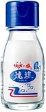
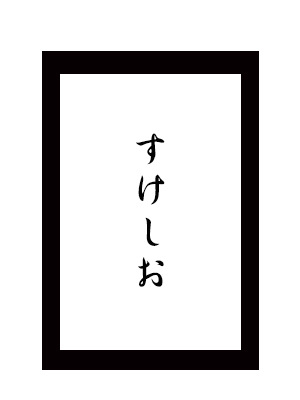
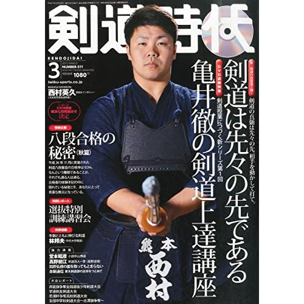

---
categories:
- sukekiyo
date: Sun, 15 Feb 2015 16:00:00 +0000
slug: post-7165
tags:
- sukekiyo
title: 【sukekiyo】男の和装とは？The Unified Field-VITIUM-調布グリーンホールに何を着ていけばいいの？
---

和装だと粗品がもらえる今回のThe Unified Field-VITIUM-調布グリーンホールでのsukekiyoの追加公演ですが、皆さんはがっつり和装していきますか？？<!--more-->ハローしんぺー(<a href="https://twitter.com/s_s_p_y" target="_blank">@s_s_p_y</a> )です。
オフィより詳しくて、wikiよりも有用なsukekiyo情報サイト「Gadget Zombie Parasite(ガジェットゾンビィパラサイト)」へようこそ。

LINE@のページを作りました。LINEで更新情報を受け取るにはこちらをどうぞ
 
 

ぼくは今大変困っています。

男の喪服の和装がよくわからないからです。

<h2>男性　喪服　和装</h2>

Twitterで色々教えていただいたのでちょこっと追加でググってみました。

最初、男性の喪服で和装ってダメなんじゃね？って勝手思ってました。というのも和装ってなんか結婚式っぽい感じだするんですよね。
そうなると葬式ではダメだろうなーとか勝手に思ってたんですが、どうもそんなことないっぽいです。

<a style="color:#0070C5;" href="http://detail.chiebukuro.yahoo.co.jp/qa/question_detail/q1051394765" target="_blank">身内以外の和装喪服について喪主やごく近い近親者が葬儀... - Yahoo!知恵袋</a>  

礼服なので、和装は葬式でも結婚式でもありっぽいです。

さーて困ったことになったー

持ってねーし

そんなん持ってねーし

ということでさらにググりました。

<h2>男性　喪服　和装　レンタル</h2>

<table border="0" cellpadding="0" cellspacing="0"><tr><td valign="top">

<a href="http://hb.afl.rakuten.co.jp/hgc/13b274a6.82a797fc.13b274a7.d31ac925/?pc=http%3a%2f%2fitem.rakuten.co.jp%2fisyou-nb%2fnt-01%2f%3fscid%3daf_link_tbl&amp;m=http%3a%2f%2fm.rakuten.co.jp%2fisyou-nb%2fi%2f10002507%2f" target="_blank">【新郎黒紋付】【結婚式　紋付　レンタル:　男性　新郎　袴レンタル　紋付袴　着物レンタル　男...</a> 価格：24,800円（税込、送料込） 

</td></tr></table>

えーっとたけーよ！！！ゔぉい！！！

まじっすか！！！レンタル衣装ってこんな高いの！！？？

まじかよ

<h2>もらえる粗品について冷静に考えてみた</h2>

<blockquote>
お客様にとっての「喪服」でご来場ください。又、和装にてお越しのお客様には粗品を進呈致します。

引用元：<a href="http://sukekiyo-official.jp/live/index.html">sukekiyo-official</a>
</blockquote>

粗品・・・
<blockquote>
粗品（そしな、そひん）とは、他人に贈呈する品物の謙遜した呼び方である。粗末な品物という意味で用いられることもある。
ただし商業的な宣伝活動の一種として、来店や商品の購入、契約などのお礼として贈呈される品物のことを指すこともあり、日常的には主に商用目的におけるお礼の品物として解される。

引用元：<a href="http://ja.wikipedia.org/wiki/%E7%B2%97%E5%93%81">wikipedia「粗品」</a>
</blockquote>

wikipediaには粗品の例が記載されてました。

<blockquote>
筆記用具（鉛筆、ボールペン、シャープペンシル、蛍光ペンなど）
メモ用紙、付箋紙、ノートなど
下敷き、ファイル、バインダーなど
洗剤、石鹸
ティッシュペーパー、ウェットティッシュ
タオル、ハンカチなど
食料品、調味料（しょうゆ、サラダ油、レトルト食品など）
カレンダー
ぬいぐるみ
入浴剤
</blockquote>

で、ぼく思ったんですよ。葬式いくと渡されるものってなんだろうって

<table  border="0" cellpadding="5" style="border:none"><tr><td style="border:none;text-align:left"><a href="http://www.amazon.co.jp/exec/obidos/ASIN/B000FQOJ9C/warawareotoko-22/ref=nosim/" rel="nofollow" target="_blank" target="_top">伯方の塩 焼塩 80gビン入り</a></td></tr><tr><td style="border:none"><table  border="0" cellpadding="0" style="border:none"><tr><td valign="top" style="border:none"></td><td valign="top" style="border:none;text-align:left">
 伯方塩業 

売り上げランキング : 57715
<table style="border:none;margin-top:10px"><tr><td style="border:none;text-align:left;">
<a href="http://www.amazon.co.jp/gp/search?keywords=%94%8C%95%FB%82%CC%89%96%20%8F%C4%89%96&__mk_ja_JP=%83J%83%5E%83J%83i&tag=warawareotoko-22" rel="nofollow" target="_blank" title="アマゾン" >Amazon</a>

<a href="http://hb.afl.rakuten.co.jp/hgc/0f6e221b.2eb9748a.0f6e221c.35cc1e84/?pc=http%3A%2F%2Fsearch.rakuten.co.jp%2Fsearch%2Fmall%2F%25E4%25BC%25AF%25E6%2596%25B9%25E3%2581%25AE%25E5%25A1%25A9%2520%25E7%2584%25BC%25E5%25A1%25A9%2F-%2Ff.1-p.1-s.1-sf.0-st.A-v.2%3Fx%3D0%26scid%3Daf_ich_link_urltxt%26m%3Dhttp%3A%2F%2Fm.rakuten.co.jp%2F" rel="nofollow" target="_blank" title="楽天市場" >楽天市場</a>

<a href="http://ck.jp.ap.valuecommerce.com/servlet/referral?sid=3041033&pid=882528283&vc_url=http%3A%2F%2Fshopping.search.yahoo.co.jp%2Fsearch%3FuIv%3Don%26ei%3DUTF-8%26tab_ex%3Dcommerce%26slider%3D0%26va%3D%25E4%25BC%25AF%25E6%2596%25B9%25E3%2581%25AE%25E5%25A1%25A9%2520%25E7%2584%25BC%25E5%25A1%25A9" rel="nofollow"  target="_blank" title="Yahooショッピング" >Yahooショッピング</a>

<a href="http://ck.jp.ap.valuecommerce.com/servlet/referral?sid=3041033&pid=882660047&vc_url=http%3A%2F%2Fauctions.search.yahoo.co.jp%2Fsearch%3Fvo%3D%26ve%3D%26auccat%3D0%26aucminprice%3D%26aucmaxprice%3D%26aucmin_bidorbuy_price%3D%26aucmax_bidorbuy_price%3D%26loc_cd%3D0%26abatch%3D0%26istatus%3D0%26filtered%3D1%26ei%3DUTF-8%26tab_ex%3Dcommerce%26va%3D%25E4%25BC%25AF%25E6%2596%25B9%25E3%2581%25AE%25E5%25A1%25A9%2520%25E7%2584%25BC%25E5%25A1%25A9" rel="nofollow"  target="_blank" title="ヤフオク!" >ヤフオク!</a>
</td><td style="vertical-align:bottom;padding-left:10px;font-size:x-small;border:none">by <a href="http://kaereba.com" rel="nofollow" target="_blank">カエレバ</a></td></tr></table></td></tr></table></td></tr></table>

塩です。

葬式から帰るとお家に入る前に体に塩をふりかけます。これは体を清めるためです。

で葬式いくと塩をもらうことが多いので、今回の粗品は塩なんじゃねーかと思ってます。

で！！！こうなると思う

<h2><a href="https://twitter.com/s_s_p_y" target="_blank">しんぺー</a> はこう思った。</h2>

どうしよかな、、、本当にもう剣道着でいこうかな。。。
剣道着に羽織あれば和装です、、といえますか？というか臭いがやばそう。。。周りにご迷惑を。。。

 

と言ったところで本日は以上になります。おやすみなさい。