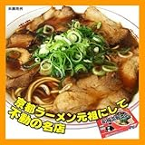
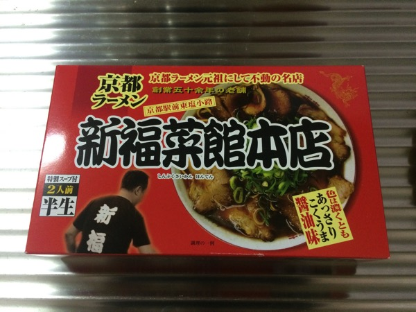
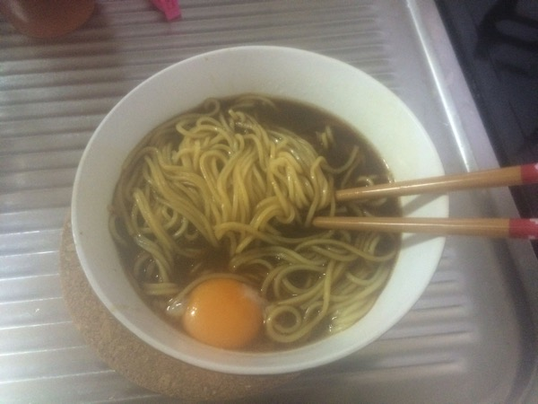

---
categories:
- グルメ
date: Sat, 21 Feb 2015 16:00:41 +0000
slug: post-7192
tags:
- sukekiyo
title: sukekiyo御用達の京都新福菜館のラーメンを通販で喰らう
---

京都公演も終了しました！ということで今回もいったのか！？あのラーメン屋によー！！！？？？匠さんよー！YUCHIさんよーーー！！！そして京はどうせ一人東京に帰ったんだろう！？？？えー？？？

<!--more-->

&nbsp;

ということで以前の記事でご紹介しましたsukekiyoメンバー御用達のラーメン屋「新福菜館」

<a style="color: #0070c5;" href="https://www.warawareotoko.com/2014/05/07/post-5329/" target="_blank" rel="noopener">sukekiyo後始末！「別れを惜しむフリは貴方の為」メンバーが訪れたお店 | Gadget Zombie Parasite</a> 
ここのラーメンって通販でも購入でいるって知ってましたかい？？
<h2>新福菜館のラーメンは楽天で買える</h2>
楽天といわず、Amazonでも買えます。
<table style="border: none;" border="0" cellpadding="5">
<tbody>
<tr>
<td style="border: none; text-align: left;"><a href="http://www.amazon.co.jp/exec/obidos/ASIN/B002LS9RO4/warawareotoko-22/ref=nosim/" target="_blank" rel="nofollow noopener">京都ラーメン新福菜館本店4食入（醤油・２食×２箱）【超人気ご当地ラーメン】</a></td>
</tr>
<tr>
<td style="border: none;">
<table style="border: none;" border="0" cellpadding="0">
<tbody>
<tr>
<td style="border: none;" valign="top"></td>
<td style="border: none; text-align: left;" valign="top">

アイランド食品

売り上げランキング : 84706

<table style="border: none; margin-top: 10px;">
<tbody>
<tr>
<td style="border: none; text-align: left;">

<a title="アマゾン" href="http://www.amazon.co.jp/gp/search?keywords=%90V%95%9F%8D%D8%8A%D9&amp;__mk_ja_JP=%83J%83%5E%83J%83i&amp;tag=warawareotoko-22" target="_blank" rel="nofollow noopener">Amazon</a>

<a title="楽天市場" href="http://hb.afl.rakuten.co.jp/hgc/0f6e221b.2eb9748a.0f6e221c.35cc1e84/?pc=http%3A%2F%2Fsearch.rakuten.co.jp%2Fsearch%2Fmall%2F%25E6%2596%25B0%25E7%25A6%258F%25E8%258F%259C%25E9%25A4%25A8%2F-%2Ff.1-p.1-s.1-sf.0-st.A-v.2%3Fx%3D0%26scid%3Daf_ich_link_urltxt%26m%3Dhttp%3A%2F%2Fm.rakuten.co.jp%2F" target="_blank" rel="nofollow noopener">楽天市場</a>

<a title="Yahooショッピング" href="http://ck.jp.ap.valuecommerce.com/servlet/referral?sid=3041033&amp;pid=882528283&amp;vc_url=http%3A%2F%2Fshopping.search.yahoo.co.jp%2Fsearch%3FuIv%3Don%26ei%3DUTF-8%26tab_ex%3Dcommerce%26slider%3D0%26va%3D%25E6%2596%25B0%25E7%25A6%258F%25E8%258F%259C%25E9%25A4%25A8" target="_blank" rel="nofollow noopener">Yahooショッピング</a>
</td>
<td style="vertical-align: bottom; padding-left: 10px; font-size: x-small; border: none;">by <a href="http://kaereba.com" target="_blank" rel="nofollow noopener">カエレバ</a></td>
</tr>
</tbody>
</table>
&nbsp;</td>
</tr>
</tbody>
</table>
</td>
</tr>
</tbody>
</table>
ぼくは楽天で購入しようと思います。
あす楽対象の商品だったみたいで、当日13時までの注文ですぐ届けてくれるみたいです。

ということで早速ポチってみました。

ポチッとな
<h2>新福菜館のラーメンを食べてみる</h2>
ということで、届きました。さっそく食べてみようと思います。

作り方はカンタン。普通のラーメンと一緒です。

①お湯を沸かす

②袋を開ける

③麺を茹でる

④スープをつくる

⑤麺を入れる

⑥食す

ということでお店の味がどんなだったか忘れましたが、おいしかったです！
<h2>今回メンバーが訪れたラーメン屋</h2>
今回は新福菜館はいってないのかな？YUCHI氏のブログの更新はこちら

<map id="map_6xf2fehr" name="map_6xf2fehr"> <area alt="" coords="0,297,405,310" shape="rect" href="http://ameblo.jp/yuchi-bassist/image-11991435617-13221692553.html" /></map>

<a href="http://ameblo.jp/yuchi-bassist/">YUCHI OFFICIAL BLOG 「discharge!」Powered by Ameba</a> via <a href="http://kwout.com/quote/6xf2fehr">kwout</a>

どこのラーメンでしょうか？

ということで、わたし調べました。

テーブルの木目、器、もやしの量からここではないかと思われます。違ったらごめん

<strong><a href="http://tabelog.com/kyoto/A2601/A260303/26003256/" target="_blank" rel="noopener">ラーメン荘 夢を語れ</a></strong>

<strong>関連ランキング：</strong><a href="http://tabelog.com/rstLst/ramen/">ラーメン</a> | <a href="http://tabelog.com/kyoto/A2601/A260303/R806/rstLst/">一乗寺駅</a>、<a href="http://tabelog.com/kyoto/A2601/A260303/R4903/rstLst/">修学院駅</a>、<a href="http://tabelog.com/kyoto/A2601/A260302/R6234/rstLst/">茶山駅</a>

いやいやいや、京都駅からめっちゃ遠いじゃないですかwww
ってか以前の<a href="https://www.warawareotoko.com/2014/06/18/post-5728/">五反田のラーメン屋</a>もそうだけど、YUCHI氏こういう系好きなのねw二郎系？

ぼくはちょっと苦手だw家系が好きです。

きっと歩いて来て、帰りも歩いて帰ったんだろうなw
<h2><a href="https://twitter.com/s_s_p_y" target="_blank" rel="noopener">しんぺー</a> はこう思った。</h2>
最近ラーメンが食べたくて食べたくて仕様がなかったんですが、これでちょっと気が紛れました。

たぶん、お店の味ほどの美味しさはなかったと思います。お店の味忘れちゃったけど、滞在中に2回いくくらいだからたぶん相当美味しかったはず。

次回京都行くときも絶対行きたい！

それと母親に聞いてみたら、羽織袴ありましたw調布グリーンホールは、剣道着じゃなくて済みそうですw

と言ったところで本日は以上になります。
おやすみなさい。
<table style="border: none;" border="0" cellpadding="5">
<tbody>
<tr>
<td style="border: none; text-align: left;"><a href="http://www.amazon.co.jp/exec/obidos/ASIN/B002LS9RO4/warawareotoko-22/ref=nosim/" target="_blank" rel="nofollow noopener">京都ラーメン新福菜館本店4食入（醤油・２食×２箱）【超人気ご当地ラーメン】</a></td>
</tr>
<tr>
<td style="border: none;">
<table style="border: none;" border="0" cellpadding="0">
<tbody>
<tr>
<td style="border: none;" valign="top"></td>
<td style="border: none; text-align: left;" valign="top">

アイランド食品

売り上げランキング : 84706

<table style="border: none; margin-top: 10px;">
<tbody>
<tr>
<td style="border: none; text-align: left;">

<a title="アマゾン" href="http://www.amazon.co.jp/gp/search?keywords=%90V%95%9F%8D%D8%8A%D9&amp;__mk_ja_JP=%83J%83%5E%83J%83i&amp;tag=warawareotoko-22" target="_blank" rel="nofollow noopener">Amazon</a>

<a title="楽天市場" href="http://hb.afl.rakuten.co.jp/hgc/0f6e221b.2eb9748a.0f6e221c.35cc1e84/?pc=http%3A%2F%2Fsearch.rakuten.co.jp%2Fsearch%2Fmall%2F%25E6%2596%25B0%25E7%25A6%258F%25E8%258F%259C%25E9%25A4%25A8%2F-%2Ff.1-p.1-s.1-sf.0-st.A-v.2%3Fx%3D0%26scid%3Daf_ich_link_urltxt%26m%3Dhttp%3A%2F%2Fm.rakuten.co.jp%2F" target="_blank" rel="nofollow noopener">楽天市場</a>

<a title="Yahooショッピング" href="http://ck.jp.ap.valuecommerce.com/servlet/referral?sid=3041033&amp;pid=882528283&amp;vc_url=http%3A%2F%2Fshopping.search.yahoo.co.jp%2Fsearch%3FuIv%3Don%26ei%3DUTF-8%26tab_ex%3Dcommerce%26slider%3D0%26va%3D%25E6%2596%25B0%25E7%25A6%258F%25E8%258F%259C%25E9%25A4%25A8" target="_blank" rel="nofollow noopener">Yahooショッピング</a>
</td>
<td style="vertical-align: bottom; padding-left: 10px; font-size: x-small; border: none;">by <a href="http://kaereba.com" target="_blank" rel="nofollow noopener">カエレバ</a></td>
</tr>
</tbody>
</table>
&nbsp;</td>
</tr>
</tbody>
</table>
</td>
</tr>
</tbody>
</table>