---
categories:
- DIR EN GREY
date: Sun, 22 Feb 2015 16:00:58 +0000
slug: post-7217
tags:
- DIR EN GREYまとめ
title: 【DIR EN GREYまとめ】2015年海外ツアー各会場まとめ
---

4月から始まるDIR EN GREY 春のツアー「TOUR15 THE UNSTOPPABLE LIFE」ですが、海外での公演も日程が発表されました。今回は各会場の様子をまとめたいと思います。<!--more--><h2>「TOUR15 THE UNSTOPPABLE LIFE」各会場まとめ</h2> 

今回のツアーは8箇所、ポーランド、ドイツ、イギリス、フランス、オランダの5カ国を回ります。

<ul>
 <li>2015/5/17(日) BELARUS MINSK RE:PUBLIC</li>
 <li>2015/5/18(月) POLAND WARSAW PROGRESJA MUSIC ZONE</li>
 <li>2015/5/20(水) GERMANY BERLIN Astra Kulturhaus</li>
 <li>2015/5/21(木) GERMANY DORTMUND FZW</li>
 <li>2015/5/23(土) ENGLAND LONDON O2 Academy Islington</li>
 <li>2015/5/24(日) ENGLAND LONDON O2 Academy Islington</li>
 <li>2015/5/26(火) FRANCE PARIS Le Bataclan</li>
 <li>2015/5/27(水) HOLLAND EINDHOVEN Effenaar</li> 
</ul>

<h3>2015/5/17(日) BELARUS MINSK RE:PUBLIC</h3> 

そもそもですが・・・ ベラルーシってどこやねんって感じですが、ここです。

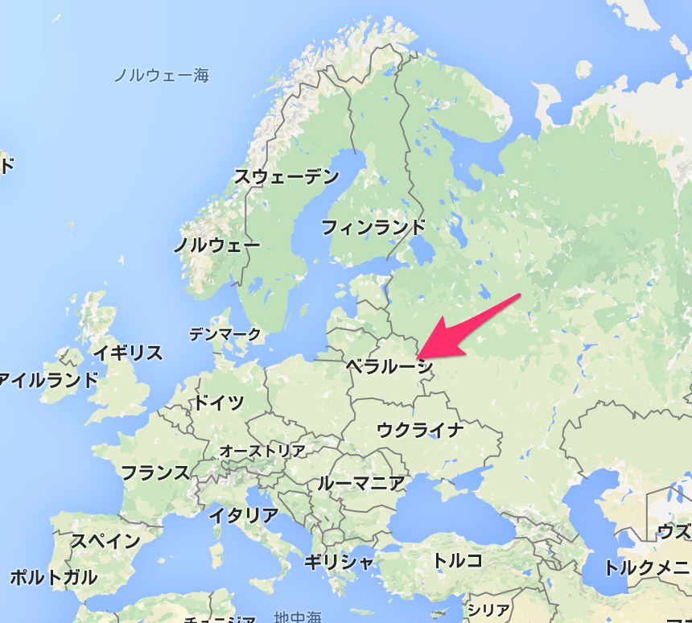 

建物の密度が低いです。 

 
というかストリートビューに対応していません。 
 

DIRが行くのはもしかして始めての国じゃないでしょうか？？旧ソ連の支配下にあった地域らしく、崩壊後に独立した国みたいです。今いろいろと話題になっているウクライナと違って、割とロシアとは友好的みたいです。それとベラルーシ語というのがあるそうです、またロシア語も多く使われているみたいですね。 なお、食文化に関してですが、ジャガイモやら穀物やらが主食らしく、おかゆ上にして食べられるらしいです。 会場はこちら 

<iframe style="border: 0;" src="https://www.google.com/maps/embed?pb=!1m18!1m12!1m3!1d9401.97713901482!2d27.459930749921398!3d53.905191997313835!2m3!1f0!2f0!3f0!3m2!1i1024!2i768!4f13.1!3m3!1m2!1s0x46dbc52d3992efe1%3A0x79449566f113b650!2sRe%3APublic!5e0!3m2!1sja!2sjp!4v1424485855888" width="600" height="450" frameborder="0"></iframe> 

綺麗っぽいし広めの会場な気がします。けっこう雰囲気があって、ぱっと見ぼくは好きです！ 

<iframe src="https://www.youtube.com/embed/fwH7vLjAebg" width="560" height="315" frameborder="0" allowfullscreen="allowfullscreen"></iframe> 

極端に情報が少ない気がします。ググると今回のDIRが上から3番目にでてきたりするし、何よりホームページ持っていないみたい。 

<a style="color: #0070c5;" href="http://www.minsknightlife.net/nightclubs/republic.htm" target="_blank">Republic club | Minsk Nightlife</a>  

ホテルとかあるのか・・・ 

<h3>2015/5/18(月) POLAND WARSAW PROGRESJA MUSIC ZONE</h3> 

続いてはポーランです。ワルシャワってポーランドの首都だったのか、知らなかった。会場はこちら

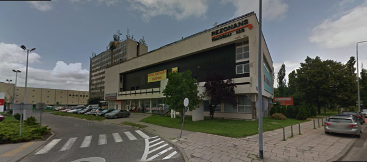

<iframe src="https://www.google.com/maps/embed?pb=!1m18!1m12!1m3!1d19552.29405474417!2d20.929366!3d52.22455!2m3!1f0!2f0!3f0!3m2!1i1024!2i768!4f13.1!3m3!1m2!1s0x0%3A0x15c4814195f799d9!2sProgresja+music+zone!5e0!3m2!1sja!2spl!4v1424569068488" width="600" height="450" frameborder="0" style="border:0"></iframe>

ステージの様子は下のリンクから見られます。バーがしっかりしてそうな印象です。

<map id="map_hqzn4x5a" name="map_hqzn4x5a"><area coords="1,2,455,296" href="http://progresja.com/wp-content/uploads/IMG_9594-800x533.jpg" alt="" shape="rect" /><area coords="1,2,455,296" href="http://progresja.com/wp-content/uploads/IMG_9584-800x533.jpg" alt="" shape="rect" /></map>
Main Stage - Progresja Music Zone via <a href="http://kwout.com/quote/hqzn4x5a">kwout</a>

サイトにもしっかりと紹介されていました。

Dir En Grey [JP] - Progresja Music Zone  

<h3>2015/5/20(水) GERMANY BERLIN Astra Kulturhaus</h3> 

ドイツは何度か入っている国だと思います。 会場はここ 

<a style="color: #0070c5;" href="http://www.astra-berlin.de/" target="_blank">Astra Berlin - Events</a>  

ちゃんとホームページにも掲載されていました。 中身はこんな感じみたいです。 

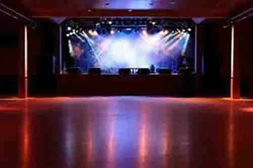 

場所はここです。周囲も雰囲気のある感じです。 

<iframe style="border: 0;" src="https://www.google.com/maps/embed?pb=!1m14!1m8!1m3!1d2428.44739465009!2d13.451803!3d52.507242!3m2!1i1024!2i768!4f13.1!3m3!1m2!1s0x47a84e5a48d250f1%3A0x1e9c5c9268b3da62!2sAstra+Kulturhaus!5e0!3m2!1sja!2sjp!4v1424488700680" width="600" height="450" frameborder="0"></iframe>

<h3>2015/5/21(木) GERMANY DORTMUND FZW</h3>

ドイツ2日目の会場はここ

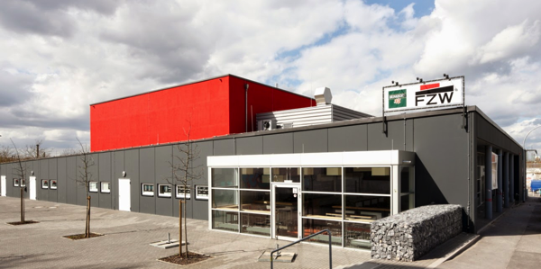

サイトはこちら
<a style="color:#0070C5;" href="http://www.fzw.de/programm/detail/21.05.2015/Dir+En+Grey/818/" target="_blank">FZW</a>  

前日の会場からの距離はこんな感じです。500km離れているみたいです。
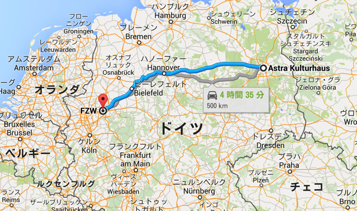

<iframe src="https://www.google.com/maps/embed?pb=!1m14!1m8!1m3!1d9931.6171352605!2d7.45018!3d51.514972!3m2!1i1024!2i768!4f13.1!3m3!1m2!1s0x0%3A0x6a955b6eea54f560!2sFZW!5e0!3m2!1sja!2sjp!4v1424569749974" width="600" height="450" frameborder="0" style="border:0"></iframe>

<h3>2015/5/23(土) ENGLAND LONDON O2 Academy Islington</h3>

次は海を渡ってイギリスで2デイズです。

サイトはこちら
<a style="color:#0070C5;" href="http://www.o2academyislington.co.uk/event/74676/dir-en-grey-tour15-the-unstoppable-life-tickets" target="_blank">O2 Academy Islington | Dir En Grey: Tour15 The Unstoppable Life | Event information</a>  

綺麗で、広いですね。
ここのサイトに内部の写真がのっております。クラブって感じかな？
<a href="http://www.academy-music-group.co.uk/gallery/index.aspx?galleryName=SEARCH_O2%20Academy2%20Islington">http://www.academy-music-group.co.uk/</a>

場所はこちら
<iframe src="https://www.google.com/maps/embed?pb=!1m14!1m8!1m3!1d2481.847873993523!2d-0.105884!3d51.534349999999996!3m2!1i1024!2i768!4f13.1!3m3!1m2!1s0x48761b42c64656fd%3A0xa174cb671dbaa0d0!2sO2+Academy+Islington!5e0!3m2!1sja!2sjp!4v1424570366453" width="600" height="450" frameborder="0" style="border:0"></iframe>

<h3>2015/5/24(日) ENGLAND LONDON O2 Academy Islington</h3>

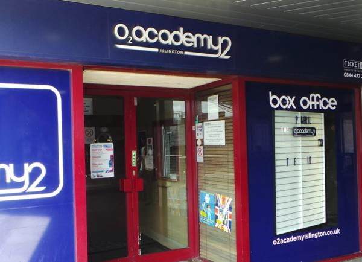

ちなみに、周辺はこんな感じみたいです。

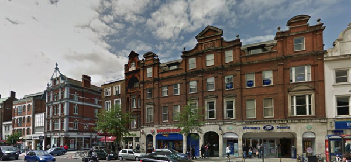

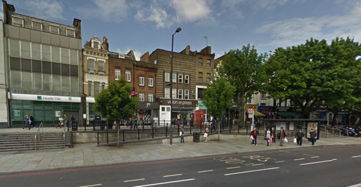

<h3>2015/5/26(火) FRANCE PARIS Le Bataclan</h3>

次はフランスです。今までの会場と違っているのがまず外観。
なんじゃんこりゃw
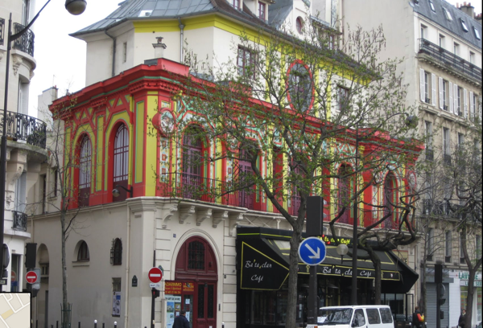

ただ、中身はすごいしっかりしているみたいで、キネマ倶楽部と同じような匂いを感じました。

Le Bataclan - Concerts et soirées - Paris - Site Officiel via <a href="http://kwout.com/quote/64d6dc36">kwout</a>

周辺も落ち着いた雰囲気で、1階はバールというかカフェみたいです。ここで京さんエスプレッソでも飲むのかしらね。
<iframe src="https://www.google.com/maps/embed?pb=!1m14!1m8!1m3!1d10498.458659660286!2d2.36505846292113!3d48.86555790539003!3m2!1i1024!2i768!4f13.1!3m3!1m2!1s0x47e66dfc56fa1dc7%3A0x852bb2ca8759e6e1!2sBataclan!5e0!3m2!1sja!2sjp!4v1424576220568" width="600" height="450" frameborder="0" style="border:0"></iframe>

<h3>2015/5/27(水) HOLLAND EINDHOVEN Effenaar</h3> 

オランダです。ツアーファイナルです。

え、めちゃめちゃおしゃれな外観
さっきのフランスと違って近代的な感じです。

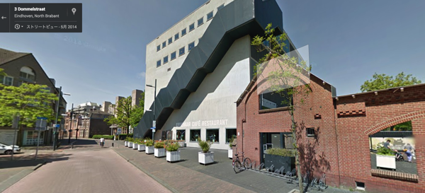

広そうです。ゼップクラスと思われます。
<blockquote class="instagram-media" data-instgrm-captioned data-instgrm-version="4" style=" background:#FFF; border:0; border-radius:3px; box-shadow:0 0 1px 0 rgba(0,0,0,0.5),0 1px 10px 0 rgba(0,0,0,0.15); margin: 1px; max-width:658px; padding:0; width:99.375%; width:-webkit-calc(100% - 2px); width:calc(100% - 2px);">
 
 

 
 <a href="https://instagram.com/p/wzelEnTHmw/" style=" color:#000; font-family:Arial,sans-serif; font-size:14px; font-style:normal; font-weight:normal; line-height:17px; text-decoration:none; word-wrap:break-word;" target="_top">Jett Rebel in een volle grote zaal #effenaar #jettrebel</a>
 
Effenaar Eindhovenさん(@effenaar)が投稿した写真 - <time style=" font-family:Arial,sans-serif; font-size:14px; line-height:17px;" datetime="2014-12-19T22:02:25+00:00">2014 12月 19 2:02午後 PST</time>

</blockquote>

紹介文もしっかり。
<a style="color:#0070C5;" href="http://www.effenaar.nl/agenda/8123" target="_blank">Effenaar | Agenda | Dir En Grey</a>  

<iframe src="https://www.google.com/maps/embed?pb=!1m14!1m8!1m3!1d2486.9036128884773!2d5.483378999999999!3d51.44156400000001!3m2!1i1024!2i768!4f13.1!3m3!1m2!1s0x47c6d91d702939cd%3A0x2e6953be1d13d04d!2sEffenaar!5e0!3m2!1sja!2sjp!4v1424577220579" width="600" height="450" frameborder="0" style="border:0"></iframe>

<h2>ドイツのフェスにも参戦決定</h2> 

さて、ツアーが終わってまだメンバーは帰国しません。なぜならフェスへの参戦が決定しているからです。

<h3>DER RING</h3>

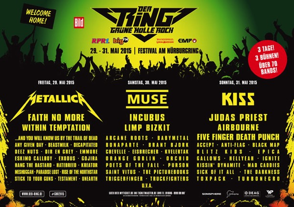

【イベント情報】
"DER RING - Grüne Hölle Rock"
開催期間：2015/5/29～5/31
会場：Nürburgring (ニュルブルクリンク / ドイツ) 
公式サイト：<a href="http://www.der-ring.de">http://www.der-ring.de</a>
チケット情報：<a href="http://www.der-ring.de/tickets">http://www.der-ring.de/tickets</a>
Hashtag：#ghr2015

メタリカやら、ミューズやらキッスといったビッグネームが揃ってます。
それと日本からはBABYMETALも参戦wwwまじかwww日本始まったなwww

ちなみにDIR EN GREYが参加するには初日の29日です。

<h3>ROCKAVARIA</h3>

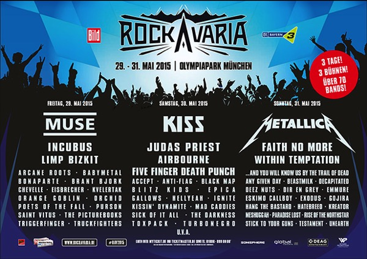

【イベント情報】
ROCKAVARIA
開催期間： 2015/5/29～5/31
会場： Olympiapark München (オリンピアパーク・ミュンヘン / ドイツ)
公式サイト： <a href="http://www.rockavaria.de">http://www.rockavaria.de</a>
チケット情報： <a href="http://www.rockavaria.de/tickets">http://www.rockavaria.de/tickets</a>
Hashtag：#rav2015

前日の会場から500kmくらい離れています。

ちなみに、これ以外にもRock in Viennaというフェスがオーストリアでありまして、それぞれの参加者が3日間3ヶ所を順番にまわるとうフェスみたいです。

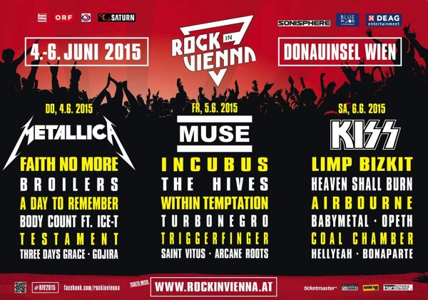

<h2>バイオハザード リベレーションズタイアップ決定</h2> 

突然の発表でしたね。ってかオフィでの告知前に記者発表でした。
<blockquote class="twitter-tweet" lang="ja">
『バイオハザード リベレーションズ2』のCMタイアップ曲のDIR EN GREYさんが登場よ！ <a href="https://twitter.com/hashtag/%E3%82%A2%E3%83%8A%E3%83%99%E3%83%AB?src=hash">#アナベル</a> <a href="https://twitter.com/hashtag/%E3%83%90%E3%82%A4%E3%82%AA%E3%83%8F%E3%82%B6%E3%83%BC%E3%83%89?src=hash">#バイオハザード</a> <a href="http://t.co/n7x4oVCfxQ">pic.twitter.com/n7x4oVCfxQ</a>
&mdash; 映画『アナベル 死霊館の人形』 (@annabelle_mov) <a href="https://twitter.com/annabelle_mov/status/565345178190618626">2015, 2月 11</a></blockquote>

<blockquote class="twitter-tweet" lang="ja">
DIR EN GREY、『バイオハザード』とのコラボに「待ってました！」 <a href="https://twitter.com/hashtag/DIR?src=hash">#DIR</a> EN GREY <a href="https://twitter.com/hashtag/%E3%83%90%E3%82%A4%E3%82%AA%E3%83%8F%E3%82%B6%E3%83%BC%E3%83%89?src=hash">#バイオハザード</a>（ゲーム） <a href="http://t.co/puHxP1AVSr">http://t.co/puHxP1AVSr</a> <a href="http://t.co/vDU9edji0N">pic.twitter.com/vDU9edji0N</a>
&mdash; クランクイン！ (@crank_in_net) <a href="https://twitter.com/crank_in_net/status/565385173014171649">2015, 2月 11</a></blockquote>

どうでもいいけど薫の服装が BIOHAZARDというよりもサイレントヒルっぽいwww

<blockquote class="twitter-tweet" lang="ja">
カプコンのゲーム「バイオハザード リベレーションズ2」のプロデューサーの岡部氏熱望のもと「Un deux」（『ARCHE』収録）がCM曲に決定！&#10;自分もバイオハザードシリーズは好きなので、素で嬉しい！（最近のはムズいですねorz）&#10;マネージャーイノウエ
&mdash; DIR EN GREY (@DIRENGREY_JP) <a href="https://twitter.com/DIRENGREY_JP/status/565813909240565760">2015, 2月 12</a></blockquote>

ぼくは今ちょうど、PS4版のバイオハザートHDリマスター版をやってますので、次これやろーっと。
面白いのは、このゲーム毎週水曜日に新コンテンツがダウンロードできるようになり、新しいストーリーが追加されるみたいです。

ちなみにこちらはディスク版です。
<table  border="0" cellpadding="5" style="border:none"><tr><td style="border:none;text-align:left"><a href="http://www.amazon.co.jp/exec/obidos/ASIN/B00QGFS4TC/warawareotoko-22/ref=nosim/" rel="nofollow" target="_blank" target="_top">バイオハザード リべレーションズ2</a></td></tr><tr><td style="border:none"><table  border="0" cellpadding="0" style="border:none"><tr><td valign="top" style="border:none"></td><td valign="top" style="border:none;text-align:left">
 カプコン 2015-03-19

売り上げランキング : 121
<table style="border:none;margin-top:10px"><tr><td style="border:none;text-align:left;">
<a href="http://www.amazon.co.jp/gp/search?keywords=%83o%83C%83I%83n%83U%81%5B%83h%20%83%8A%82%D7%83%8C%81%5B%83V%83%87%83%93%83Y2&__mk_ja_JP=%83J%83%5E%83J%83i&tag=warawareotoko-22" rel="nofollow" target="_blank" title="アマゾン" >Amazon</a>

<a href="http://hb.afl.rakuten.co.jp/hgc/0f6e221b.2eb9748a.0f6e221c.35cc1e84/?pc=http%3A%2F%2Fsearch.rakuten.co.jp%2Fsearch%2Fmall%2F%25E3%2583%2590%25E3%2582%25A4%25E3%2582%25AA%25E3%2583%258F%25E3%2582%25B6%25E3%2583%25BC%25E3%2583%2589%2520%25E3%2583%25AA%25E3%2581%25B9%25E3%2583%25AC%25E3%2583%25BC%25E3%2582%25B7%25E3%2583%25A7%25E3%2583%25B3%25E3%2582%25BA2%2F-%2Ff.1-p.1-s.1-sf.0-st.A-v.2%3Fx%3D0%26scid%3Daf_ich_link_urltxt%26m%3Dhttp%3A%2F%2Fm.rakuten.co.jp%2F" rel="nofollow" target="_blank" title="楽天市場" >楽天市場</a>

<a href="http://ck.jp.ap.valuecommerce.com/servlet/referral?sid=3041033&pid=882528283&vc_url=http%3A%2F%2Fshopping.search.yahoo.co.jp%2Fsearch%3FuIv%3Don%26ei%3DUTF-8%26tab_ex%3Dcommerce%26slider%3D0%26va%3D%25E3%2583%2590%25E3%2582%25A4%25E3%2582%25AA%25E3%2583%258F%25E3%2582%25B6%25E3%2583%25BC%25E3%2583%2589%2520%25E3%2583%25AA%25E3%2581%25B9%25E3%2583%25AC%25E3%2583%25BC%25E3%2582%25B7%25E3%2583%25A7%25E3%2583%25B3%25E3%2582%25BA2" rel="nofollow"  target="_blank" title="Yahooショッピング" >Yahooショッピング</a>

<a href="http://ck.jp.ap.valuecommerce.com/servlet/referral?sid=3041033&pid=882660047&vc_url=http%3A%2F%2Fauctions.search.yahoo.co.jp%2Fsearch%3Fvo%3D%26ve%3D%26auccat%3D0%26aucminprice%3D%26aucmaxprice%3D%26aucmin_bidorbuy_price%3D%26aucmax_bidorbuy_price%3D%26loc_cd%3D0%26abatch%3D0%26istatus%3D0%26filtered%3D1%26ei%3DUTF-8%26tab_ex%3Dcommerce%26va%3D%25E3%2583%2590%25E3%2582%25A4%25E3%2582%25AA%25E3%2583%258F%25E3%2582%25B6%25E3%2583%25BC%25E3%2583%2589%2520%25E3%2583%25AA%25E3%2581%25B9%25E3%2583%25AC%25E3%2583%25BC%25E3%2582%25B7%25E3%2583%25A7%25E3%2583%25B3%25E3%2582%25BA2" rel="nofollow"  target="_blank" title="ヤフオク!" >ヤフオク!</a>
</td><td style="vertical-align:bottom;padding-left:10px;font-size:x-small;border:none">by <a href="http://kaereba.com" rel="nofollow" target="_blank">カエレバ</a></td></tr></table></td></tr></table></td></tr></table>

<h2><a href="https://twitter.com/s_s_p_y" target="_blank">しんぺー</a> はこう思った。</h2> 

さて。3月はチャージ期間です。このままだと懸念していた詩集の発売もまだのようです。

ほっ

でも調布グリーンホールで発表とかも油断できないからな・・・

と言ったところで本日は以上になります。おやすみなさい。