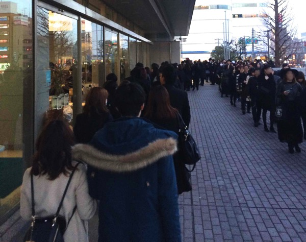
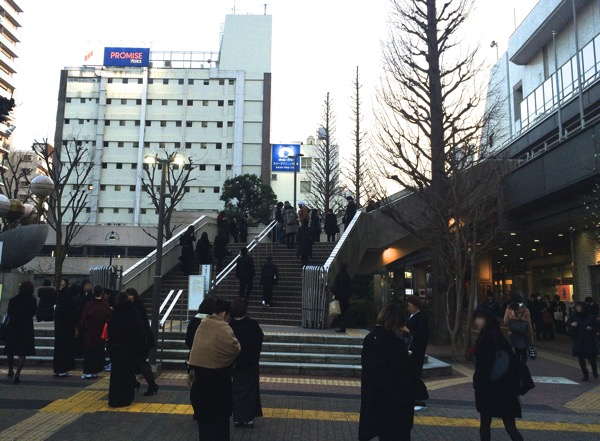
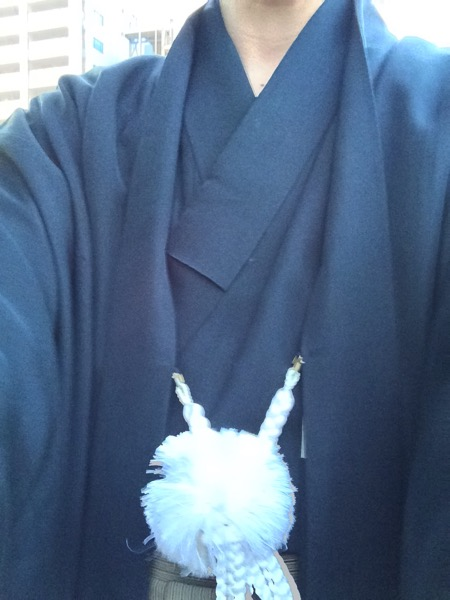
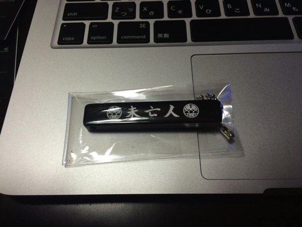
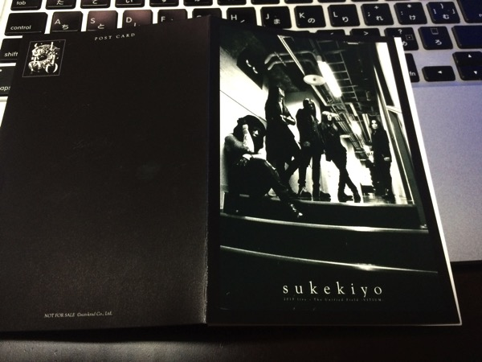
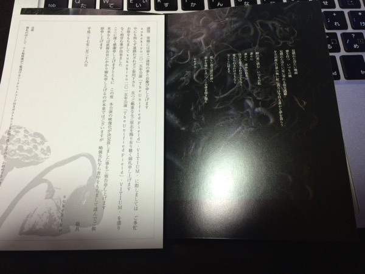

---
categories:
- sukekiyoのLIVEレポ
date: Sat, 28 Feb 2015 16:00:43 +0000
slug: post-7291
tags:
- LIVEレポ
- sukekiyo
title: 【ライブレポ】sukekiyo 二〇一五年公演「The Unified Field-VITIUM-」2015_2_28＠調布市グリーンホール
---

sukekiyoの「The Unified Field」ツアーの追加公演「-VITIUM-」@調布市グリーンホールに参列してまいりました。そのLIVEレポです。

<!--more-->

ハローしんぺー(<a href="https://twitter.com/s_s_p_y" target="_blank">@s_s_p_y</a> )です。
オフィより詳しくて、wikiよりも有用なsukekiyo情報サイト「Gadget Zombie Parasite(ガジェットゾンビィパラサイト)」へようこそ。

調布の駅前に喪服を着た人がたくさん。

行き交うおばあちゃんたちが、グリーンホールの看板を見てたw「あら、誰か亡くなったのかしら？ガイジンさん？」みたいなw

なんだろうな、、、なんか会場ついたとき、すっごい久しぶりにドキドキした。高揚感。

なんていうか、生まれて初めてLIVEに行った時の感覚。PIERROTの横浜アリーナのFORETELLER'S-ERROR FINALだったんですが、会場ついて全員真っ黒で頭だけカラフルな異様さに、すっごい高揚した。

そんな懐かしい感覚だった。

<h2>本日の格好はもちろん和装</h2>

男性の喪服の和装は礼服ということで、普通の羽織袴でOKらしいので、おじいちゃんの着物をきて参列

参考：<a href="https://www.warawareotoko.com/2015/02/16/post-7165/">【sukekiyo】男の和装とは？The Unified Field-VITIUM-調布グリーンホールに何を着ていけばいいの？ | Gadget Zombie Parasite</a>

芳名帳にもしっかり記名してまいりました。漢字名とローマ字でした。
おそらく映像化されたときに50音順に並ぶんじゃないかな？？

<blockquote class="twitter-tweet" lang="ja">
2月28日(土)調布市グリーンホールにて開催の＜sukekiyo 二〇一五年公演「The Unified Field」-VITIUM-＞の映像化が決定致しました。ご参列される皆様、会場に芳名帳がございますので是非ご記名ください。(S) <a href="http://t.co/ETh7vtSERz">pic.twitter.com/ETh7vtSERz</a>
&mdash; sukekiyo (@sukekiyo_band) <a href="https://twitter.com/sukekiyo_band/status/570187627522969600">2015, 2月 24</a></blockquote>

<h2>セトリ</h2>

1. elisabeth addict
2. celeste
3. leather field
4. dunes
5. 雨上がりの優詩
6. foster mother
7. aftermath
8. 烏有の空
9. nine melted fiction
10. maniera
11. 斑人間
12. latour
13. zephyr
14. 鵠
15. focus
16. mama
17. in all weathers

<h2>本日の演出</h2>

今回のツアーでは一貫した演出がされてきました。映像から入り、曲中もバックに映像、そしてダンサーによる演舞。どれもが去年のツアーよりも格段に深化しています。

<a style="color:#0070C5;" href="https://www.warawareotoko.com/2015/02/10/post-7144/" target="_blank">【LIVEレポ】sukekiyo「The Unified Field」2/9 @さくらホール | Gadget Zombie Parasite</a>  

本日の京は羽織を羽織って、いつものストールをかぶっていました。
羽織の下は裸ですが、これまた<a href="https://www.warawareotoko.com/2014/10/17/post-6429/">キネマ倶楽部</a>の時のようなセルフ緊縛をされていました。

セッションが終わるって一旦はけたあとは、ノースリーブに変わっていました。

また、いつものペットボトルでのセクシーサービスタイムが、なんとワイングラスになっていました。さらに中身はワインぽい液体だったとのこと。ぼくからは透明かな？って見えたんですが、実際どうだったんでしょうか。

ってかワイングラスとか「theV系ぽい曲」かよ←

あと、途中なんの曲だったか忘れましたが、バックの映像に歌詞が流れるのがあったんですが、京自身歌詩がわからなくなったのか、曖昧だったのか、後ろをあからさまにみて確認してた気がする・・・

ってか、歌詩を映し出すとかムックみたい。（ちなみに昔ムックのLIVEDVD</a>見てるときに、一緒に見てた父親が、「あーこれいいなーわかりやすい」とその演出を賞賛してたというのはどうでもいいお話）

<h2>いただいた「粗品」はこちら</h2>

まずは和装特典。

予想は外れました。。。塩ではなかったです。。。キーホルダーでした。チケットの半券にスタンプ押してもらって、箱からくじ引き方式でとるんですが、丸見えだったので黒にしました。他にも透明、赤っぽいのとか色々なバリエーションがありました。

<a style="color:#0070C5;" href="https://www.warawareotoko.com/2015/02/16/post-7165/" target="_blank">【sukekiyo】男の和装とは？The Unified Field-VITIUM-調布グリーンホールに何を着ていけばいいの？ | Gadget Zombie Parasite</a>  

続いて、全員プレゼントのポストカードがこちら

参列者限定の特典映像コードがついております。公開は3月入ってからのようです。

ちなみにポストカードの内容は、LIVE中に流れる映像の中の文章と参列者への喪主からのご挨拶でした。塩こそなかったものの、この辺の演出は凝ってますね。これで、黒い花とsukekiyo家葬儀会場はこちらとかあったらさらにすごかったですねwww

<h2><a href="https://twitter.com/s_s_p_y" target="_blank">しんぺー</a> はこう思った。</h2>

まだ上海公演が残っていますが、ようやく、、、sukekiyo第1章が終幕という感じですね。デビューから長いようで、まだ1年程度しかたってなかったのか・・・

もう数年やってるような気がします。

次の展開はいつかな？夏？いや、秋くらいじゃないの？
そしてまたアルバムとかぶっこんできそうな気がします。

さて・・・

３月はようやくチャージですね！！

そして4月はDIR EN GREYの春が始まる！！！！

英気を養え！！！というか財布を労わろう！！！

と言ったところで本日は以上になります。おやすみなさい。