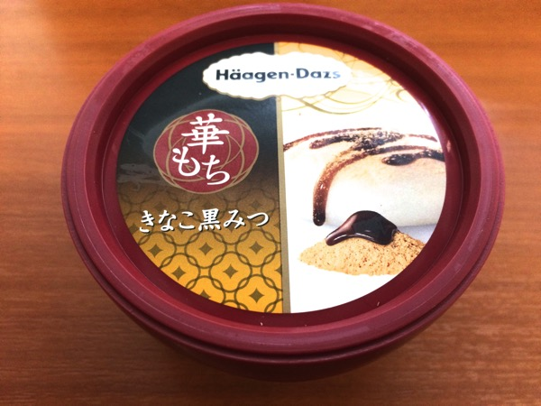
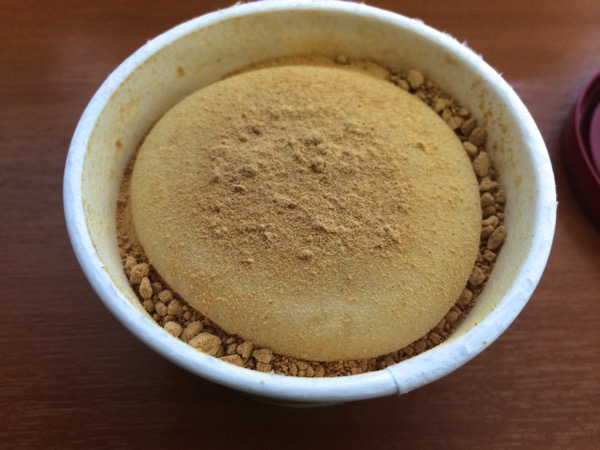
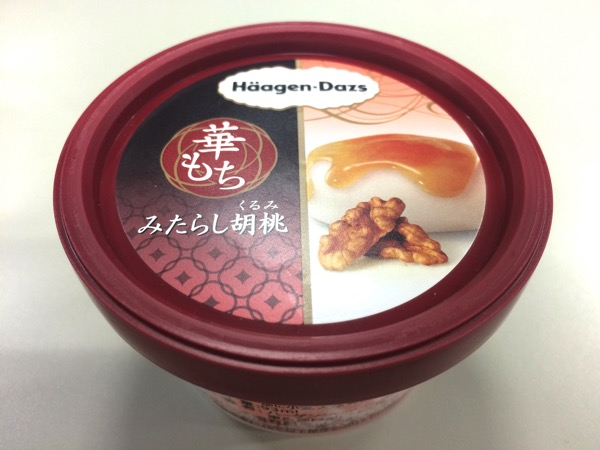
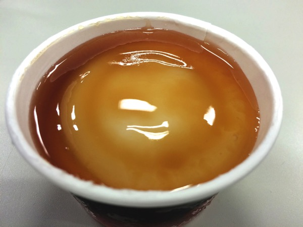
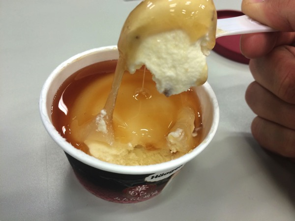

---
categories:
- グルメ
date: Thu, 26 Feb 2015 16:06:04 +0000
slug: post-7298
tags:
- アイス
- ハーゲンダッツ
title: 【販売休止】ハーゲンダッツ新作「ミニカップ 華もち」食べた感想
---

いやーセーフ！！先日発売しましたハーゲンダッツ新作の「ミニカップ 華もち」が売れすぎて販売休止になったとさ。いくつものコンビニを歩いても売り切れで焦りましたが、朝ごはんを買うコンビニに今朝立ち寄るとあったので思わず買って、そして朝ごはんとして食べてやりました。感想です。<!--more-->ハローしんぺー(<a href="https://twitter.com/s_s_p_y" target="_blank">@s_s_p_y</a> )です。
オフィより詳しくて、wikiよりも有用なsukekiyo情報サイト「Gadget Zombie Parasite(ガジェットゾンビィパラサイト)」へようこそ。

朝からアイスなんて食べたから胃が痛かった・・・

<h2>【悲報】ミニカップ 華もち売れすぎて販売停止</h2>

お知らせ・キャンペーン情報｜ハーゲンダッツ　Häagen-Dazs via <a href="http://kwout.com/quote/uuq48pmv">kwout</a>

<h2>ミニカップ　華もち　きなこ黒みつ</h2>

はっきり言って美味かった。きな粉餅の風味と見た目まんまでした。
食べるときにきなこが溢れるのも、それに似ています。

ただ、凍っていたので、少し間をおいて溶かしてから食べた方が、もちの食感も効いてきて美味しかったんじゃないかなと思います。

<h2>ミニカップ　華もち　みたらし胡桃</h2>

胡桃これでクルミと読むのか！！知らなかった！

で、味ははっきり言って失敗です。というか本当にみたらし団子のまんま。
バニラアイスとみたらし団子買ってきて一緒に食べているみたいだった。

みたらしの、ほのかなしょっぱさが「ん〜微妙・・・」って感じでした。

<h2><a href="https://twitter.com/s_s_p_y" target="_blank">しんぺー</a> はこう思った。</h2>

夜に入ったコンビニでは、みたらしだけ山積みで残っておりました。

もしかしたら、まだ奇跡的に残っているコンビニで販売しているかもしれません。

探してみてもいいかもしれませんね。

経験から言うとハーゲンダッツの季節限定のものは、気に入ったら買いだめししまくっておいて後悔はしないってことです。

と言ったところで本日は以上になります。おやすみなさい。