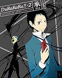
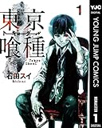

---
categories:
- アニメ
date: Sun, 01 Mar 2015 16:00:47 +0000
slug: post-7314
tags:
- アニメ
title: 最近「東京喰種（トーキョーグール）」「デュラララ!!×2承」がものすんごく面白くて土日で全部見た。
---

どっちも1期は少し前のアニメですが、最近このアニメにはまっております。デュラララの方は1期を見てて、続編を今見てる最中。東京喰種の方は、名前知ってたけど昨日から見初めてから一気に1期を見終わり、今はリアルタイムで放送中の2期を見ています。これだどっちもおもしれーーーんだ！！ということで今更ですがご紹介します。<!--more-->
<h2>デュラララ!!×2承</h2>
<h3>あらすじ！</h3>
デュラララとは池袋を舞台に繰り広げられる少年たちが繰り広げる非日常群像劇である。

主人公の竜ヶ峰帝人は気弱な少年。幼なじみの紀田正臣に誘われ、田舎から池袋の高校に入学するために上京するところから始まる。

そして池袋で過ごす日常の中、色々な人たちと関わり、やがて都市伝説の「首なしライダー」を中心としたカラーギャングの抗争や辻斬り事件に巻き込まれていく。
<h3>ここが面白い！！</h3>
なんといっても池袋という現実に存在する街が舞台なところ！街もリアルに忠実に描かれていて、行ったことある人ならどの辺かがすぐに分かったりする楽しさがあります。

そして登場人物がどれも際立っていて個性豊か！かならず一人は好きなキャラがいるはず！！

少年の日常を写すだけのノホホンとしたアニメかと思いきや、首なしライダーや妖刀の化身なんかも出てきたります。それでも、舞台が池袋であるということを思い出して、その現実感のアンマッチさが独特の雰囲気を醸しています。そこが魅力とも言えます。

途中までは本当にゆーっくり時間が流れてるんだけど、物語中盤あたりから一気に畳み掛けるように展開がスピードアップ。そのまま終幕に向けて盛り上がっていく。その疾走感がたまらなくいい。今回はネタバレ書かないけど、凄い楽しいのでおすすめです。

そして、その2期とも言えるのがデュラララ!!×2承です。物語は1期から少し時間がたった池袋を描いています。

これまた1期同様、登場人物の背景をまずだしてからの急展開。ゆっくりと1話ずつキャラクターの日常が語られていました。

そして今は事件がこれからまさに起きようとしているところです！！

これからおわりまで、楽しみだん！
<table style="border: none;" border="0" cellpadding="5">
<tbody>
<tr>
<td style="border: none; text-align: left;"><a href="http://www.amazon.co.jp/exec/obidos/ASIN/B00QRHSAMK/warawareotoko-22/ref=nosim/" target="_blank" rel="nofollow noopener">デュラララ!!×2 承 1【完全生産限定版】 [Blu-ray]</a></td>
</tr>
<tr>
<td style="border: none;">
<table style="border: none;" border="0" cellpadding="0">
<tbody>
<tr>
<td style="border: none;" valign="top"></td>
<td style="border: none; text-align: left;" valign="top">

沢城みゆき アニプレックス 2015-02-25

売り上げランキング : 167

<table style="border: none; margin-top: 10px;">
<tbody>
<tr>
<td style="border: none; text-align: left;">

<a href="http://www.amazon.co.jp/gp/search?keywords=%83f%83%85%83%89%83%89%83%89&amp;__mk_ja_JP=%83J%83%5E%83J%83i&amp;tag=warawareotoko-22" target="_blank" rel="nofollow noopener">Amazon</a>

<a href="http://hb.afl.rakuten.co.jp/hgc/0f6e221b.2eb9748a.0f6e221c.35cc1e84/?pc=http%3A%2F%2Fsearch.rakuten.co.jp%2Fsearch%2Fmall%2F%25E3%2583%2587%25E3%2583%25A5%25E3%2583%25A9%25E3%2583%25A9%25E3%2583%25A9%2F-%2Ff.1-p.1-s.1-sf.0-st.A-v.2%3Fx%3D0%26scid%3Daf_ich_link_urltxt%26m%3Dhttp%3A%2F%2Fm.rakuten.co.jp%2F" target="_blank" rel="nofollow noopener">楽天市場</a>

<a href="http://ck.jp.ap.valuecommerce.com/servlet/referral?sid=3041033&amp;pid=882528283&amp;vc_url=http%3A%2F%2Fsearch.shopping.yahoo.co.jp%2Fsearch%3Fp%3D%25E3%2583%2587%25E3%2583%25A5%25E3%2583%25A9%25E3%2583%25A9%25E3%2583%25A9" target="_blank" rel="nofollow noopener">Yahooショッピング</a>

<a href="http://ck.jp.ap.valuecommerce.com/servlet/referral?sid=3041033&amp;pid=882660047&amp;vc_url=http%3A%2F%2Fauctions.search.yahoo.co.jp%2Fsearch%3Fvo%3D%26ve%3D%26auccat%3D0%26aucminprice%3D%26aucmaxprice%3D%26aucmin_bidorbuy_price%3D%26aucmax_bidorbuy_price%3D%26loc_cd%3D0%26abatch%3D0%26istatus%3D0%26filtered%3D1%26ei%3DUTF-8%26tab_ex%3Dcommerce%26va%3D%25E3%2583%2587%25E3%2583%25A5%25E3%2583%25A9%25E3%2583%25A9%25E3%2583%25A9" target="_blank" rel="nofollow noopener">ヤフオク!</a>
</td>
<td style="vertical-align: bottom; padding-left: 10px; font-size: x-small; border: none;">by <a href="http://kaereba.com" target="_blank" rel="nofollow noopener">カエレバ</a></td>
</tr>
</tbody>
</table>
&nbsp;</td>
</tr>
</tbody>
</table>
</td>
</tr>
</tbody>
</table>
<h2>東京喰種（トーキョーグール）</h2>
これ名前だけ知ってたんですが、ずっと見ていませんでした。漫画で第１話だけ読んだかも。
なんかありがちな感じでした。DIR EN GREYのボーカル京が確か読んでるってなんかのアンケートで言ってた気がしなくもない。
<h3>あらすじ！</h3>
この世界には、人間しか食べられない喰種（グール）という怪物がいて、人々は怯えながらも普通に暮らしていた。
そんな中主人公はいきつけの喫茶店で女性と知り合い、デートすることになる。しかし、その女性こそがグールであり、主人公は殺される寸前まで追い込まれる。
とどめをさされる直前に建設途中の建物が崩れ、グールは下敷きとなり、少年は病院に搬送される。

グールは見た目は人間と同じため、主人公を救おうとした医師の独断で、一緒に担ぎ込まれた女性の内臓は助かる見込みがある主人公に移植さることになった。

こうして、半分人間、半分グールになってしまったのが、この物語の主人公カネキ・ケンである。

彼は、人とグールの間で揺れ動きながら、やがてその運命を受け入れ、自分の使命に気がつくのであった。。
<h3>ここが面白い！！</h3>
２つの種族、２つの立場の対立構造が描かれています。当然、同じ疑問を抱きながら、それぞれの利害や思いに則って自らなすことが正義だとして抗争を繰り返します。
そう、使い古されたテーマです。

さらに、主人公を取り巻くキャラクターもどこかで見たことのあるようなのばかり。
ツンデレでくらい過去を背負ったヒロイン、主人公や仲間を暖かく見守る老人、無口で強い頼れる兄貴分、主人公を殺す寸前まで追い込むイカれた何考えてるかわからないやつとか
人間側のキャラクターもそう。グールに仲間を殺さ、グールを駆逐することを目的に戦闘に参加するもの。疑問をもつもの。

そう、つまりこのアニメは古典に則って作られているのです。主人公の思いもきっとどこかのアニメで散々見てきた苦悩です。

でも、だからこそ安心して見られる。

そして、１期の最後が少し今までの古典と違っているところです。 守破離がしっかりしていて、次の展開が楽しみです。今は第２期を見ております。
<h3>ここが気になる！！！</h3>
グールとはなんなのか？グールはどうやって生まれたのか？この編の前提が全く描かれていません。
描かないことになんらかの意図があるのかもしれませんが。

さらに、こんだけ人を食べる怪物がいるにもかかわらず、人間側が普通に生活しすぎ。
それだけ治安を守る組織がしっかりしているのかというとそうでもない。結構ザルで、事後の捜査ばかり。。。

これでいいのか？？
<table style="border: none;" border="0" cellpadding="5">
<tbody>
<tr>
<td style="border: none; text-align: left;"><a href="http://www.amazon.co.jp/exec/obidos/ASIN/B00E5T9RLU/warawareotoko-22/ref=nosim/" target="_blank" rel="nofollow noopener">東京喰種トーキョーグール リマスター版 1 (ヤングジャンプコミックスDIGITAL)</a></td>
</tr>
<tr>
<td style="border: none;">
<table style="border: none;" border="0" cellpadding="0">
<tbody>
<tr>
<td style="border: none;" valign="top"></td>
<td style="border: none; text-align: left;" valign="top">

石田スイ 集英社 2013-08-02

<table style="border: none; margin-top: 10px;">
<tbody>
<tr>
<td style="border: none; text-align: left;">

<a href="http://www.amazon.co.jp/gp/search?keywords=%93%8C%8B%9E%8B%F2%8E%ED%81%40kindle&amp;__mk_ja_JP=%83J%83%5E%83J%83i&amp;tag=warawareotoko-22" target="_blank" rel="nofollow noopener">Amazon</a>

<a href="http://hb.afl.rakuten.co.jp/hgc/0f6e221b.2eb9748a.0f6e221c.35cc1e84/?pc=http%3A%2F%2Fsearch.rakuten.co.jp%2Fsearch%2Fmall%2F%25E6%259D%25B1%25E4%25BA%25AC%25E5%2596%25B0%25E7%25A8%25AE%25E3%2580%2580kindle%2F-%2Ff.1-p.1-s.1-sf.0-st.A-v.2%3Fx%3D0%26scid%3Daf_ich_link_urltxt%26m%3Dhttp%3A%2F%2Fm.rakuten.co.jp%2F" target="_blank" rel="nofollow noopener">楽天市場</a>

<a href="http://ck.jp.ap.valuecommerce.com/servlet/referral?sid=3041033&amp;pid=882528283&amp;vc_url=http%3A%2F%2Fsearch.shopping.yahoo.co.jp%2Fsearch%3Fp%3D%25E6%259D%25B1%25E4%25BA%25AC%25E5%2596%25B0%25E7%25A8%25AE%25E3%2580%2580kindle" target="_blank" rel="nofollow noopener">Yahooショッピング</a>

<a href="http://ck.jp.ap.valuecommerce.com/servlet/referral?sid=3041033&amp;pid=882660047&amp;vc_url=http%3A%2F%2Fauctions.search.yahoo.co.jp%2Fsearch%3Fvo%3D%26ve%3D%26auccat%3D0%26aucminprice%3D%26aucmaxprice%3D%26aucmin_bidorbuy_price%3D%26aucmax_bidorbuy_price%3D%26loc_cd%3D0%26abatch%3D0%26istatus%3D0%26filtered%3D1%26ei%3DUTF-8%26tab_ex%3Dcommerce%26va%3D%25E6%259D%25B1%25E4%25BA%25AC%25E5%2596%25B0%25E7%25A8%25AE%25E3%2580%2580kindle" target="_blank" rel="nofollow noopener">ヤフオク!</a>
</td>
<td style="vertical-align: bottom; padding-left: 10px; font-size: x-small; border: none;">by <a href="http://kaereba.com" target="_blank" rel="nofollow noopener">カエレバ</a></td>
</tr>
</tbody>
</table>
&nbsp;</td>
</tr>
</tbody>
</table>
</td>
</tr>
</tbody>
</table>
<h2>しんぺーはこう思った。</h2>
とりあえず、今放送中にどちらもおいつきました！
どちらも展開がスリリングで楽しみです。

そしてネタバレは書かないつもりですが、グールの方は髪の毛が白いってイメージだったのに主人公がずっと黒髪でなんで？？と思っていました。
そしたら最終話で白くなりました。まどマギか！

といったところで、本日は以上です。おやすみなさい。