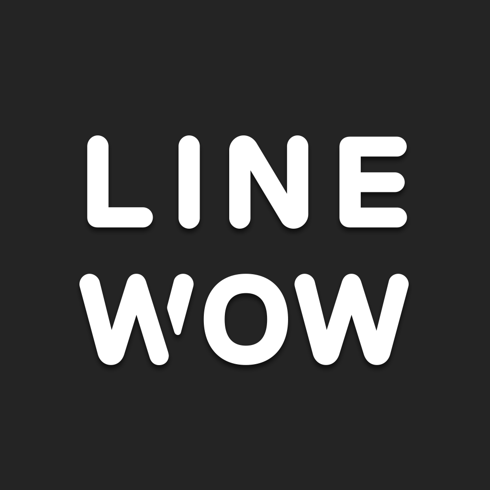

---
categories:
- LINE WOWの思い出
date: Sat, 14 Mar 2015 16:00:50 +0000
slug: post-7377
tags:
- LINE WOW
- ランチ
title: 高級弁当宅配アプリ【LINE WOW】を使ったらランチタイムがバラ色だったからマジでオススメ
---

平日のランチ、いつも決まったもの食べてませんか？だいたい決まったメンバーで決まった店をルーチンで回ってませんか？

ぼくもそう。ってか最近は人とご飯食べるってことがほとんどなくて、スタバで簡単に済ませます。
そんな中見つけたLINE WOWというアプリ。ということで本日は「LINE　WOW」を実際に使った感想をご紹介<!--more--><h2>LINE WOWとは？</h2>

LINE WOWとはLINEの子会社であるLINE　Brosが提供する高級飲弁当宅配サービスです。

<a href="https://itunes.apple.com/jp/app/line-wow/id934254642?mt=8&uo=4&at=11ld5P" target="_blank" >LINE WOW</a>

無料

(2015.03.14時点)

LINEBROS

posted with <a href="http://pochireba.com" rel="nofollow" target="_blank">ポチレバ</a>

アプリを起動するとGPSで自分が今いるところへ配達可能な店舗がリストアップされます。
そこから食べたい店舗を選んで、配達してほしい日時を指定します。

支払いはクレジットカード。必要情報を入力すればOKです。
また、オフィスに配達することを前提にしているようで、オフィスへの入り方や呼び出し方の入力を求められます。

ただ、アプリのデザインがかなりわかりやすいので、情報の入力もしやすく、すぐに完了します。

<h3>飲食店のラインナップ</h3>

サイトもめっちゃおしゃれ
<a style="color:#0070C5;" href="http://wow.line.me/" target="_blank">LINE WOW - Delivering the WOW WOWな体験を、あなたに。</a>  

<h2>実際に使ってみた</h2>

今回ぼくが頼んだお店はこちら

<strong><a href="http://tabelog.com/tokyo/A1308/A130803/13000415/" target="_blank">秋本</a></strong>

<strong>関連ランキング：</strong><a href="http://tabelog.com/rstLst/unagi/">うなぎ</a> | <a href="http://tabelog.com/tokyo/A1308/A130803/R3808/rstLst/">麹町駅</a>、<a href="http://tabelog.com/tokyo/A1308/A130803/R8108/rstLst/">半蔵門駅</a>、<a href="http://tabelog.com/tokyo/A1309/A130902/R10511/rstLst/">四ツ谷駅</a>

普通にミシュランに毎年載っているようなお店です。
普通にお店にいくと１万以上のコースがメインみたいです。

<a style="color:#0070C5;" href="http://www.unagi-akimoto.com/" target="_blank">麹町・半蔵門での接待、会食は「うなぎ秋本」で【ミシュラン獲得】</a>  

全身黒ずくめの爽やかなイケメンが配達してくれました。
（ドライバー情報もアプリから確認できます）

そして思ったよりも内容物がでかかった！これで2人分です。

おお、水まで入ってる。

お店からのお品書き！すごいしっかりしてる！

お店からのご挨拶！

全てにLINE　WOWロゴが入ってる！店舗のブランドをそのままに、この体験を全部LINE　WOWがお届けしてますってメッセージなんだろうなと思います。

あーそして驚いたのがこれ。なんだかわかりますか？

ご飯の方の弁当箱からでてるヒモを引くと、なんと温まりだしましたw湯気でてます。

別角度で。この時点で近くを通り過ぎる人が全員振り返ってました。美味しい匂いが漂い始めます。
<iframe src="https://vine.co/v/OE9zpm3avYn/embed/simple" width="600" height="600" frameborder="0"></iframe>

こちらはサイドメニュー。すっげーしっかりしてる。さすが高級店

さて温まったメインの方です。パッかーん

<iframe src="https://vine.co/v/OE9aQEva3V6/embed/simple" width="600" height="600" frameborder="0"></iframe>

えーっとあっちゅーまに喰らい尽くしました。というかボリュームありすぎwお腹いっぱい

<h2><a href="https://twitter.com/s_s_p_y" target="_blank">しんぺー</a> はこう思った。</h2>

すごいの一言に尽きます。

本当に久しぶりにランチでアガりました。

名前通りWOWな体験でした。１ヶ月に１回くらい注文してもいいくらいです。

ただ、高級店専門といううたい文句の通り、どれも値段がかなり高いです。
ぼくはたまたまキャンペーン中ということで半額で注文できました。

それでも正規の値段でも満足できたと思います。

また、きになるのが、やはり高級すぎて注文が少なかったのか最近は低価格店舗が増えてきました。普通にやすそうなお店のやすそうな弁当が入ってたりします。
その辺はちょっとバランス難しいかもなーとか思いつつ、今後に多いに期待して、また近々注文したいと思います。

これ同僚と一緒に注文すればぜったいたのしいランチタイムになりますよ！

おすすめ！！

と言ったところで本日は以上になります。おやすみなさい。

<a href="https://itunes.apple.com/jp/app/line-wow/id934254642?mt=8&uo=4&at=11ld5P" target="_blank" >LINE WOW</a>

無料

(2015.03.14時点)

LINEBROS

posted with <a href="http://pochireba.com" rel="nofollow" target="_blank">ポチレバ</a>

