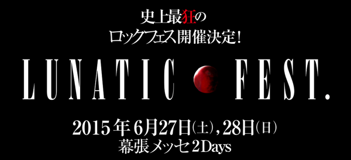

---
categories:
- LUNATIC FEST.
date: Sun, 15 Mar 2015 16:00:11 +0000
slug: post-7393
tags:
- LIVE
- LUNATIC FEST
title: '奇跡の狂演「LUNATIC FEST」に参戦希望バンドのスケジュール調べてみた #ルナフェス'
---

昨晩TLにルナシーがフェスやるというアンビリーバブルな情報が流れてきた。これは相当やばそうな気がする。もう、タイトルだけで往年のバンギャルちゃんたちが卒倒失禁ガクブル状態で場合によっては全財産をはたいてでもどうにかする価値がありそうな匂いがぷんぷんしてきた。ということでぜひとも参加してほしいバンドを勝手にあげつらってしかも、希望的観測の元発表されているスケジュール上で空きがあるかどうかをチェックしていきたいと思います。（同じ作業してるバンギャルが何人もいることでしょう）<!--more-->

<h2>LUNATIC FESTとは？</h2>

まずは黙って刮目せよ

<iframe width="560" height="315" src="https://www.youtube.com/embed/d7rg7fm52no" frameborder="0" allowfullscreen></iframe>

6月27日（土）と28日（日）2daysで幕張メッセにて開催です。
チケット代は1day15,000円。そしてフェスなのになぜかドリンク代をとられる500円。

詳細はこちら

<a style="color:#0070C5;" href="http://lunaticfest.com/" target="_blank">LUNATIC FEST. OFFICIAL WEBSITE</a>  

チケットは5月30日からローチケ.com、チケットぴあ、CNプレイガイドから発売。

【LUNATIC FEST.関連記事一覧】
<a href="https://www.warawareotoko.com/2015/03/16/post-7393/">奇跡の狂演「LUNATIC FEST」に参戦希望バンドのスケジュール調べてみた #ルナフェス</a>

<a href="https://www.warawareotoko.com/2015/03/18/post-7396/">続LUNATIC FEST. 参戦希望バンド調べてみた「あの麺はいま」 #ルナフェス</a>

<a href="https://www.warawareotoko.com/2015/03/22/post-7421/">【LUNATIC FEST.】ステージ構成発表される！ #ルナフェス</a>

<a href="https://www.warawareotoko.com/2015/04/10/post-7562/">【LUNATIC FEST.】参戦アーティスト発表かと思ったらバンド『数』の発表だったでござる#ルナフェス</a>

<h2>参加希望バンド</h2>

<blockquote class="twitter-tweet" lang="ja">
<a href="https://twitter.com/hashtag/%E3%83%AB%E3%83%8A%E3%83%86%E3%82%A3%E3%83%83%E3%82%AF%E3%83%95%E3%82%A7%E3%82%B9%E3%83%88%E5%8F%82%E6%88%A6%E5%B8%8C%E6%9C%9B%E3%83%90%E3%83%B3%E3%83%89?src=hash">#ルナティックフェスト参戦希望バンド</a>&#10;DIR EN GREY&#10;sukekiyo&#10;ムック&#10;カリガリ&#10;X&#10;PIERROT&#10;ラクリマ&#10;ディシェード&#10;シャムシェ&#10;ラムール&#10;ラレーヌ&#10;デュール&#10;メリー&#10;ファナ&#10;セックズマシンガンズ&#10;ペニシリン&#10;ラピュータ&#10;ラファエル&#10;マスケラ
&mdash; しんぺー@DIR春ツ全裸待機 (@s_s_p_y) <a href="https://twitter.com/s_s_p_y/status/576714282131292160">2015, 3月 14</a></blockquote>

どうでしょうか90年代後半から2000年代初頭にかけて活躍した（もちろん現役もいるが）バンドたちの夢の復活、そして共演です。

個人的にはDIR EN GREY、PIERROTの共演をなんとしてもここで果たしてほしいです。（過去にSHOXXのイベントにて同日LIVEをやったことはあるらしいですが）

<h3>PIERROT</h3>
各メンバーのスケジュールをチェックしました。

まずはAngeloです。この時期はどうやら「CREATING A SINGULARITY」というツアー中のようです。ただ、現在発表されているスケジュール上ではファイナルが6月13日の仙台ということでがっつり空いてるっぽいです。

次LM.Cですが、こちらは特にツアーなどの予定も発表されていません。

Alvinoも予定なし。

あとはSUGIZOあたりがAijiとキリトをどう説得するかあたりで決まりそうですね。

<h3>DIR EN GREY</h3>

現在発表されているスケジュールですと5月中はヨーロッパツアーで海外にいます。その後6月までのスケジュールは発表されていませんので可能性は十二分にありますね。

そういや、このあたりの時期は過去にhideメモリアルコンサートにまさかの参戦をした時期でもありますね〜

<h3>X</h3>

多分予定なし

<h3>BUCK-TICK</h3>

多分予定なし

<h3>cali≠gari</h3>

今のところ予定なし。アルバム発売したばっかなので、ツアー中ですがファイナルが6月21日のサッポロとなっております。

<h2><a href="https://twitter.com/s_s_p_y" target="_blank">しんぺー</a> はこう思った。</h2>

いやーーーラインアップどうなるんだ！！！これはマジである意味PIERROT復活の DICTATORS CIRCUSよりもアガるぜ！！！

そしてぜったいDIR EN GREYとsukekiyoはどっちかずつしかでないんでしょう！！
PIERROTでるならsukekiyoとの共演になりそう。。。

とにかく！！とにかく！！！全裸待機！！！！
追加情報をまてえええええ！！(3月20日？）

と言ったところで本日は以上になります。おやすみなさい。