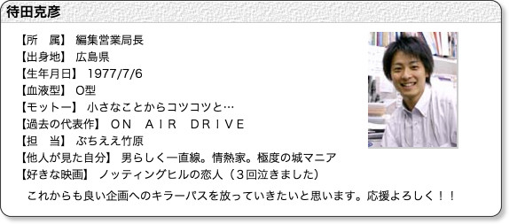

---
categories:
- LUNATIC FEST.
date: Tue, 17 Mar 2015 16:00:00 +0000
slug: post-7396
tags:
- LIVE
- LUNATIC FEST
- ルナフェス
title: '続LUNATIC FEST. 参戦希望バンド調べてみた「あの麺はいま」 #ルナフェス'
---

音楽お好きなんですか？どんなのきくんですか？DIR EN GREY？もう解散してますよね？って言われることがたまにあります。

解散してねーからああ！！と思いつつ、知らない人にとってはそんな感じなんでしょうね。

今回の記事で同じように思う方がいるかもしれません。最初に言っておきます。申し訳ございません。間違いがありましたらご指摘ください。<!--more-->ハローしんぺー(<a href="https://twitter.com/s_s_p_y" target="_blank">@s_s_p_y</a> )です。
オフィより詳しくて、wikiよりも有用なsukekiyo情報サイト「Gadget Zombie Parasite(ガジェットゾンビィパラサイト)」へようこそ。

先日のこちらのTweet
<blockquote class="twitter-tweet" lang="ja"><a href="https://twitter.com/hashtag/%E3%83%AB%E3%83%8A%E3%83%86%E3%82%A3%E3%83%83%E3%82%AF%E3%83%95%E3%82%A7%E3%82%B9%E3%83%88%E5%8F%82%E6%88%A6%E5%B8%8C%E6%9C%9B%E3%83%90%E3%83%B3%E3%83%89?src=hash">#ルナティックフェスト参戦希望バンド</a> DIR EN GREY sukekiyo ムック カリガリ X PIERROT ラクリマ ディシェード シャムシェ ラムール ラレーヌ デュール メリー ファナ セックズマシンガンズ ペニシリン ラピュータ ラファエル マスケラ

— しんぺー@DIR春ツ全裸待機 (@s_s_p_y) <a href="https://twitter.com/s_s_p_y/status/576714282131292160">2015, 3月 14</a></blockquote>

思った以上に反響がございました。しかもその後に軽い気持ちで書いたこちらの記事（<a href="https://www.warawareotoko.com/2015/03/16/post-7393/">奇跡の狂演「LUNATIC FEST」に参戦希望バンドのスケジュール調べてみた</a>）も反響いただき、さらには全バンドでお願いしますという煽りまでいただきましたので←

全バンド•••いってみたいと思います。おそらくですが、スケジュールを調べるというよりもあの人は今的なまとめ記事になると思います。長くなると思いますので•••　それでは•••いってみましょう。

<h2>DIR EN GREY、sukekiyo、cali≠gari、PIERROT</h2>

<a href="https://www.warawareotoko.com/2015/03/16/post-7393/">こちら</a>を参照ください。

<h2>ムック</h2>

今出ているスケジュールですとムックの日（6/9）とロットンの日（6/10）が最後みたい

→<a href="http://www.55-69.com/category/liveall/live">http://www.55-69.com/category/liveall/live</a>

それにしても、この人たち昨年LIVEしまくりだったみたいなのに、今年もすげー勢いでLIVEしまくってるのね。アルバムのレコーディングいつしたの。。

<h2>X</h2>

<a style="color: #0070c5;" href="http://www.sanspo.com/geino/news/20150316/oth15031619570030-n1.html" target="_blank">ＹＯＳＨＩＫＩ、１９年ぶりツアー終了後に手術「腱が半分切れている」 - 芸能社会 - SANSPO.COM（サンスポ）</a>

いやいやいやいや、暗雲立ち込めまくりじゃないですか。。。

<blockquote>
腱が半分切れている。ツアーが最後？あり得るかもしれない。ドアノブを回したり水のボトルを持つのも辛い。お医者さんにブロック注射を、これ以上打つと骨が溶けちゃうといわれた
</blockquote>

マジかよ

<h2>ラクリマ</h2>

La'cryma Christi（ラクリマクリスティ）
 かつてかつて、MALICE MIZER、FANATIC◇CRISIS、SHAZNAと共に「ヴィジュアル四天王」なんて呼ばれていました。

<a href="http://www.lacrymachristi.jp/">オフィ</a>によると復活しては、2013年にやったLIVEが最後ぽいですね。
 結構メンバー個人でサポート入ったりしてるみたいですね。確か、ぼくの記憶が正しければ金爆の音源の曲を弾いてたりしてるはず。

そうそう、あとはPIERROT解散後の潤と一緒にギターのKOJIがALvinoやってますね。

ということでまとめますと

ボーカル　TAKAはLibraianというユニットをギターのHIROとやってた。
 アメブロは少なくとも2013年まで更新されてる。ラクリマのオフィシャルサイトからのリンク先はなくなっている模様。
 ということで現在の行方が追えませんでした。

ギター　KOJIは前述の通りALvinoにて活動中です。

ベース　SHUSEは精力的に<a href="http://ameblo.jp/shuse/">アメブロ</a>更新中
 現在は†яi¢кというバンドに所属しております。このバンドが結構豪華でリュシフェルのMAKOTOがボーカルだったりします。3月19日にシングルリリース

ギター HIROは結構色々とサポートで活動しているのを見たりします。それこそゴールデンボンバーの音源弾いてたり、あとはアシッドブラックチェリーのバックやってたりしてるぽいです。

ドラムス　LEVINも精力的に<a href="http://ameblo.jp/levilimit/">アメブロ</a>更新中
 ALvinoのサポートしたりしてるんですね。

LUNATIC FEST出演は5分って感じでしょうか

<h2>ディシェード</h2>

D-SHADE知ってますか？80年代生まれならきっとビビッとくるはず。
 いいよね！知らない人は<a href="http://ja.wikipedia.org/wiki/D-SHADE">wiki</a>

それにしてもD-SHADEってDEAREST SHADEの略なんですね。

おそらくメンバー全員引退しております。ギターのKENの活動がよくわからなかったので、多分引退だと思われます。

しかしながら、驚くことにバンド後の人生がすごいです。
 ボーカルのHIBIKIは解散後、レーサーに転身、レーサー引退後は地方の出版社？の営業局長www

<a href="http://www.pressnet.co.jp/company/company_staff.shtml">スタッフ　プロフィル</a> via <a href="http://kwout.com/quote/7bzf5az8">kwout</a>

これきっとファンの人がずっと追って追って、探してwikiにしたんだろうな•••愛されてると思います。だって今もぼく歌うたえますんもん。

一発屋とかビジュアル系ブームとか確かにあったかもしれませんが、当時のぼくたちの記憶にはあのフレーズが刻み付けられたと思います。

「アイラビュー切なさも愛しさも〜」

ドラムのYUJIはどうやら、現在芸能プロダクションのCEOみたいです。（<a href="http://www.add-ing.jp/artist-yuji.html">http://www.add-ing.jp/artist-yuji.html</a>）さらにはSIAM SHADEボーカル栄喜とバンド組んでたりもするみたいです。

すげー

どうでもいいけど、結構バンドやめてCEOになる人多いの？？TOMMY社長とか<a href="https://www.warawareotoko.com/?s=%E6%9C%AA%E6%9E%B6&amp;x=0&amp;y=0">未架</a>さんとか

で結論としてはLUNATIC FESTへの出演は難しそうですね。

<h2>SIAM SHADE</h2>

えーっと今年の10月にさいたまスーパーアリーナでLIVEやるそうですwww熱いぜこりゃ！（<a href="http://siamshade.jp/">http://siamshade.jp/</a>）

ということは全然今回のフェスにも出られる可能性ありですね。

スケジュールも発表されていませんし、LUNATIC FESTへの出演の可能性は大ですね。

何よりインディーズ時代からLUNA SEAの弟分でしたので。

<h2>La'Mule</h2>

若い人は絶対知らないと思う。La'Mule（ラムール）

2003年に活動休止以降も連綿とその「血」は生き続けていたようです。
 解散後に結成されたCELLというバンドから去年の2月に音源でてるみたいです。

https://youtu.be/u1ujMq7eZAw

ラムールの「君がもしもぼくのエネルギーなら〜」って曲が好きでした。
 あと「人ではない、人の形をした虫だ」ってやつね。

こちらは完全に出演ないでしょう。LUNA SEAとも関係がなさそうだし。。

<h2>LAREINE</h2>

ラレーヌ。こちらは活動停止してしまっております。色々な出来事が重なってしまった結果のようですね。

ただ、ボーカルのKAMIJO様はソロで現在も活動されております。
 ってかMALICE MIZERのローディーやってたんですね、通りで耽美なわけですね。
 今は世界的に活動しているみたいで、ワールドツアーとかやってるんですね。

今年のスケジュールも今まで見た中では、一番先まで決まっているみたいです。
 8月までお忙しいようです。ただ6月後半は何もなさそうなので、出演の可能性はありそうです。

<h2>FANATIC CRISIS</h2>

ビジュアル系四天王の一角
 メンバーの現在は・・・

ボーカル石月努の髪型に当時ぼくは憧れていました。ツーブロックという髪型を発明したのはこの人です。うそです。

解散後はデザイナーとして活動し、会社を立ち上げています。確か宝石関係だったと思います。

<a style="color: #0070c5;" href="http://ishizuki.jp/order1.html" target="_blank">石月　努 [TSUTOMU ISHIZUKI]　オーダージュエリー</a>

また2012年に音楽活動も再開しているみたいです。昨年もツアーやったりしてて、すごい精力的に活動しています・・・

<blockquote class="twitter-tweet" lang="ja">
は？？え？？石月努メリーとコラボ？対バン？ 2015.05.03　TSUTOMU ISHIZUKI presents VVS1. 2015 ～キネマ倶楽部の変～開催決定！ ｜ 石月努 | <a href="http://t.co/pDgb5BXoaJ">http://t.co/pDgb5BXoaJ</a> <a href="http://t.co/XoThb1yPS0">pic.twitter.com/XoThb1yPS0</a>

— しんぺー@DIR春ツ全裸待機 (@s_s_p_y) <a href="https://twitter.com/s_s_p_y/status/577464169299099648">2015, 3月 16</a>
</blockquote>

いやーこの記事書くために調査してたらたまったま見つけた。。。まじかよ、、、何してんだ、、、このすげーコラボ

しかも、、、石月努のバンドがこれまたすごいのね。ギターがメリーの結生、ドラムがラクリマのLEVINってか。

その他のメンバーも見ていきましょう。ギターの和也は「THE MICRO HEAD 4N'S」というバンドで活動中。メンバーには元D'espairsRayのZERO、TSUKASAがおります。ボーカルはDASEINのRicky

https://www.youtube.com/watch?list=UUF4PMH6LZcmB7wsaeiwLPig&amp;feature=player_embedded&amp;v=WWq-_zLqQ1s

ギターのSHUNは、解散後様々な遍歴ののちに和也とともに「THE MICRO HEAD 4N'S」として活動中。

ベースRYUJIはでてきませんでした。

ドラムス徹は解散後はエンジニアやサポートドラマーとして活動しているみたいです。

うわー、どうですかね。このバンドは、、、石月努のバンドででそうな気がしなくもない。。。

うーむ
<h2><a href="https://twitter.com/s_s_p_y" target="_blank">しんぺー</a> はこう思った。</h2>
さて、長くなりましたのでこの辺で一旦切ります。次回につづく•••

と言ったところで本日は以上になります。おやすみなさい。