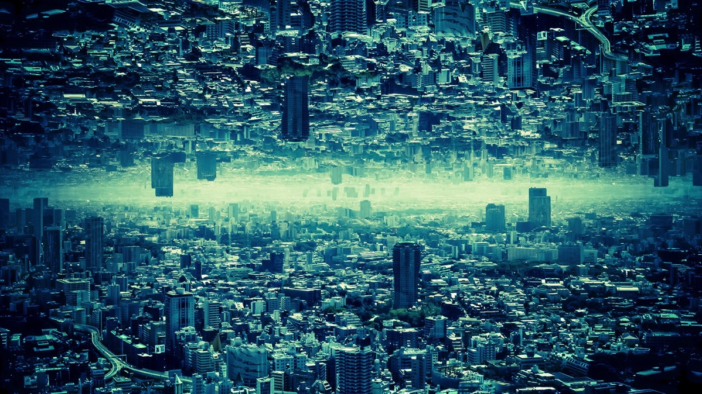
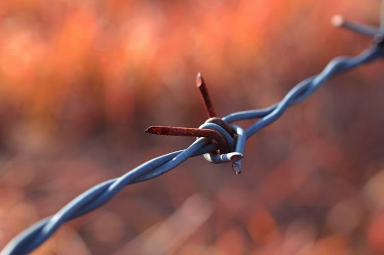

---
categories:
- ブログ
date: Tue, 24 Mar 2015 16:00:31 +0000
slug: post-7427
tags:
- ブログ
- 思ったこと
title: 懐かしさの境界。昔流行ってたものが単に懐かしいと思ったら大間違いだ。それは古い傷かもしれない。
---

先日、Youtubeで90年代後半から2000年代前半に流行った曲を流してたんですが、その中で自分でめっちゃ熱唱する曲と一切口をつぐんで歌わない上に、さらに嫌な気分になる曲があるなーと思いました。それについて少し考えてみました。<!--more-->ハローしんぺー(<a href="https://twitter.com/s_s_p_y" target="_blank">@s_s_p_y</a> )です。
オフィより詳しくて、wikiよりも有用なsukekiyo情報サイト「Gadget Zombie Parasite(ガジェットゾンビィパラサイト)」へようこそ。

最初にいっておきます。この記事はもしかしたら共感をいただけないかもしれません。

90年代後半から2000年代前半に流行った曲でいうとSPEEDとかMAXとかTMとか浜崎とかTMとか、モー娘。とかあとはビジュアル系各位とかだと思います。
まーようはビジュアル系の終焉時代とバンドブームの衰退の兆しと比例するように現れたラップブームの勃興。アクターズスクール出身アーティストとソロの歌姫たちの隆盛。そして、小室ファミリー縮小とつんくファミリーの栄華。そんな時代だったと思います。

太陽とシスコムーン、八反安未果、知念里奈、LOVEマシーン、歌舞伎町のミニモニ、見たい聴きたい歌いったい、シノラーアムラーピエラーミゼラー、EEジャンプ&Body&Soul、あーのーそらーをこえてーうまれーゆーくーたーましーいーよー、まわるまわるみぜらっぶろう、エリコウィズクランチ、1/3の純情なヒトエズゴナムーブ、ガメラ、ポケモン、イマクニ

この時期に小中高生を迎えた人たちなら「懐かしい！！」と叫ぶであろう

そう、懐かしい

この時期のぼくは中２まで自分でCD買って音楽を聴いたり、音楽番組を見たりなんてほとんどしたことがなかった。初めて買ったCDはドボルザークの新世界より。あとはゴーストスイーパー美神玲子のOP
いろんなコンプレックスが始まり、自分がダメな人間だと思い出して、人間関係とかに悩んだり、受験とかなんかよくわからない不安とかを抱え出したころだった。

そんな中音楽を聞き出して色々と情報を得るようになってった。

PIERROTが好きになってからは、音楽番組のランキングとか積極的に見て、カウントダウンTVとかMTVとかのランキング番組でPVが流れるのをひたすらまって、始まると同時にビデオの赤丸ボタンを押したものさ。

ただ、思った。<strong>この微妙な年齢の時に聞いた音楽は全部が全部必ずしも、諸手あげて懐古の念で受け入れられるものばかりじゃないんだ</strong>ということ。

<strong>懐かしさの境界</strong>

多分、<strong>個人の人格形成時期において何らかの影響を与えたり与えなかったりしたものに対して、懐かしいというセピア色の愛情をいだけるんじゃないかと思う。</strong>逆にビジュアル系を駆逐するかのごとく現れ、それを好きでない人間は人に非ずと言わんばかりにランキングを占め出したラップの人たちに対して、ぼくはいい感情を抱いていない。否。正確に言うと、そういう他者排他的な雰囲気があり、それを推奨する人たちがいた。そのことを思い出させるような曲に対して、ぼくは一切懐かしさを感じない。むしろ不快。<strong>別にその音楽が嫌いとか否定するわけじゃない。あくまで、嫌な感情を思い出してしまうから嫌というのである。</strong>

要は、あれ。今の言葉でいうと、「流行ってた曲＝リア充曲」だからリア充爆発しろ

ただ僻みや妬みですけど、そう感じるんだからしようがない。

<h2><a href="https://twitter.com/s_s_p_y" target="_blank">しんぺー</a> はこう思った。</h2>

誰に何をわかってくれとは言わない！だってぼくがそう思うんだから、それはぼくの中では真実なんだああああ！

ガタメキラ！

と言ったところで本日は以上になります。おやすみなさい。