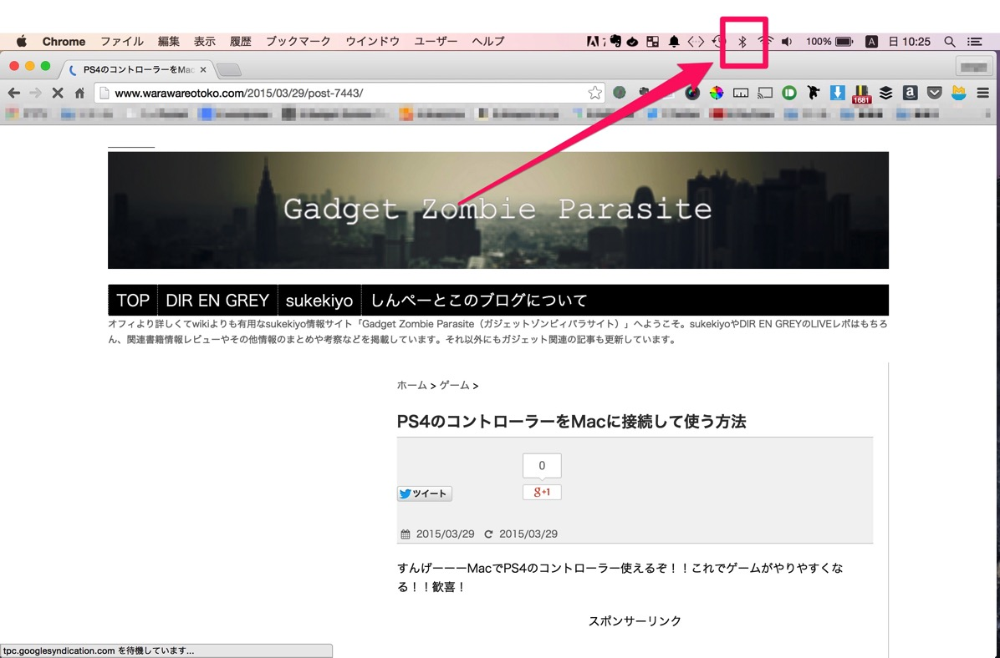
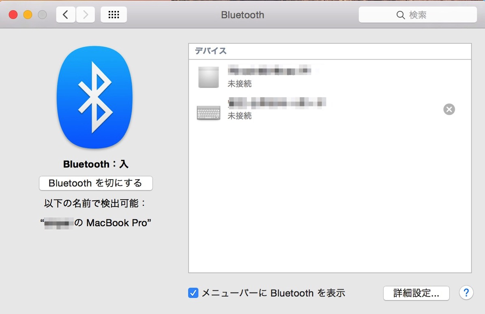
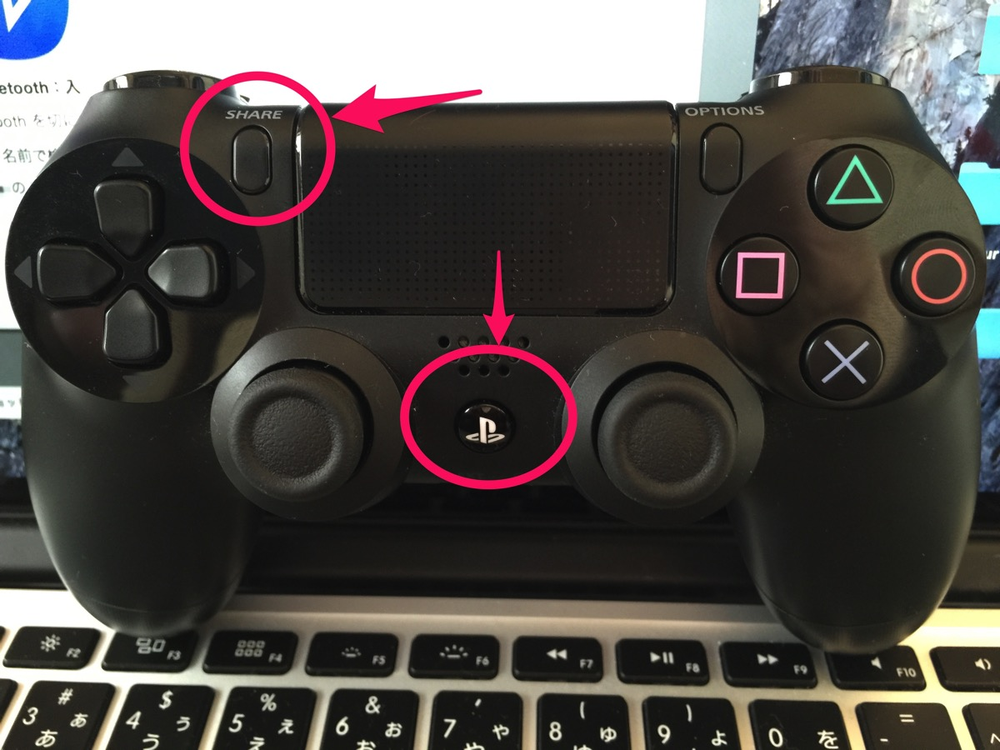
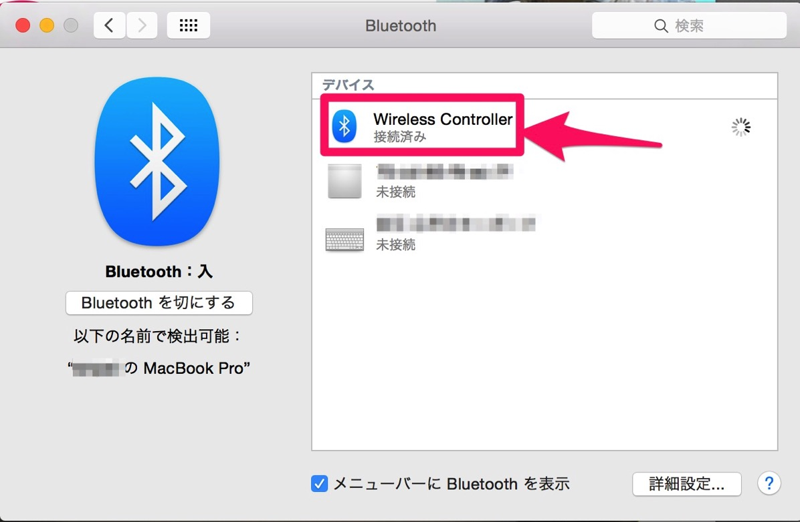
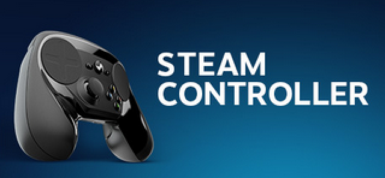

---
categories:
- ゲーム
date: Sat, 28 Mar 2015 16:00:26 +0000
slug: post-7443
tags:
- PS4
- ゲーム
title: PS4のコントローラーをMacに接続して使う方法
---

すんげーーーMacでPS4のコントローラー使えるぞ！！これでゲームがやりやすくなる！！歓喜！<!--more-->ソースは<a href="http://www.cultofmac.com/317387/how-to-use-a-ps4-controller-with-your-mac/">Cult of Mac</a>です。

※相性等で動作しない場合があります。家にPS4があってPCゲームもやりてーって人向けです。

<h2>PS4のコントローラーをMacに接続する方法</h2>

1、MacのBluetoothをオンにします。

2、Bluetoothの設定画面を確認する。

3、PS4のコントローラーのPSボタンとシェアボタンを同時押し。コントローラーが点滅するまで押し続けます。

4、接続端末の一覧に出てきたら接続完了

これで、SteamやMacAppStoreの対応しているゲームで使えるようになります。試しにSteamのMac版Bioshock infinitやってみたら使えました。
あんなに苦労したエイムも慣れ親しんだコントローラーなら簡単に合わすことができます。

<h2>Steam専用コントローラーが今年の秋に発売予定</h2>

ちなみにSteam専用のコントローラーがでるみたいです。とはいえ、今年の秋らしいのでそれまではこれでプレイしようかと思います。

ただ、WIN版でも使えるっぽいですが、どうもあまりいいレビューがありませんでした。

<h2><a href="https://twitter.com/s_s_p_y" target="_blank">しんぺー</a> はこう思った。</h2>

ゲームライフがこれでまた楽しくなる！！何千円もするゲーミングマウスをわざわざ買わなくて済む！！

ひゃっほいーい！

と言ったところで本日は以上になります。おやすみなさい。