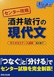

---
categories:
- ブログ
date: Sat, 04 Apr 2015 16:00:45 +0000
slug: post-7464
tags:
- アドバイス
title: 今年浪人が決まった君へ送る10個のアドバイス
---

ぼくは高校時に一つも大学受からなかったので、浪人しております。いや、受かってたかもしれないけど、忘れました。浪人生活は精神的にも肉体的にもつらい１年間です。今年浪人することが決まったあなたに向けてアドバイスを送りたいと思います。<!--more-->

<h2>出し惜しみは無しだ</h2>

浪人は、<strong>”いつ”から本気になったかで伸びがだいぶ違います。</strong>
「夏以降本気出す」とか「あまり頑張るの早すぎても・・・」とか、そういうの無いから。

エヴァで初めて使徒が現れた時にありったけのN2地雷を投入した軍の人を思い出してください。<strong>「出し惜しみは無しだ」</strong>と言っています。

<strong>常に本気で取り組みましょう。</strong>

<h2>睡眠はしっかりとる</h2>

寝ないで頑張るのも必要だと思いますが、規則正しい生活と十分な睡眠をとることをおすすめします。ぼくが現役時に失敗した要因の一つが睡眠時間を削ったことです。そのため、<strong>試験中寝たから。</strong>

あと適度な睡眠をとるとストレスも軽減されます。さらに集中力も増すし、自習室で寝落ちとか予備校の授業中に寝るとかもないから

ただ、どれくらい寝たらいいのかは個人差があります。一説によると必要な睡眠時間は遺伝子レベルで決まってるらしいので、長く寝る必要がある人もいれば、全然寝ないでも平気な人もいます。自分に適度な睡眠時間を早い段階で知ることが大切です。

でも、ま、どちらにしろ寝ることはいいことなので<strong>5,6時間は寝るようにしましょう。</strong>

ちなみに眠気をとるのは睡眠だけ。

痛みは睡眠の根本的解決にはならない。さらにカフェインも飲みすぎると耐性ができて、かえってよくない。

もし日中眠さを感じたら、それは脳みそが疲れている信号。
だからちゃんと睡眠はとるようにしましょう。

<h2>ゲームは禁止、漫画も禁止、スマホも禁止</h2>

娯楽は禁止した方がいい。ただし、一瞬で終わる系なら可
つまりゲームでいうとRPGとかストーリーで進んで行く系はやったらだめです。<strong>要はセーブできる系はだめ</strong>です。やり続けることになるから。

なので<strong>ネット対戦を1日何回とか決めてやるのがいいと思います。</strong>
ネットでの対戦なら１回20分以内で終わるでしょうから。

さらに連載中の漫画を新巻でたら読むのはいいのですが、<strong>完結している漫画を読みだすのはNG</strong>
なぜなら一気に全部読みたくなるから

スマホは電源を切るなりなんなりした方がいい。ぼくの頃は存在しなかったのでなんとも言えませんが、もしぼくが今浪人生なら集中できる自信がありません。スマホゲームやツイッター、youtubeもスマホでみることができます。

なので、スマホはなるべく電源を切るなりsimを砕くなりして使わないようにしましょう。なんならこの１年間ガラケーにするとかね。

<h2>恋愛、友達禁止</h2>

勉強のことだけ考えたいならグループ交際はやめた方がいいよ
夏になってみんなで花火行こうとかなるし、グループ内の人間関係こじれると面倒になるし
自習室じゃなくて外のカフェで勉強しようかとかなった時に、いく先々で会うと集中できないし

どうせ大学入ったらなくなる人間関係です。そんなものにすがって、みみっちい人間関係築くくらいなら、いっそ初めから繋がらない方がいいでしょう。

ノート取れなかったりとかそんな下手ないいわけもいりません。<strong>孤独に歩め、林の中の像のように</strong>

<h2>バイト禁止</h2>

親の金で浪人させてもらってるなら、バイトなんかしない方がいいでしょう。
本末転倒です。もし、バイトしたいなら予備校なんてやめてフリーターになればいいでしょう。はっきり言って、浪人生とはニートです。期間限定のニートです。

やることは寝る、食べる、勉強する。これ以外はありません。

一所懸命に勉強する以外にありません。

<h2>夜中勉強禁止</h2>

夜の方が集中できるというのは幻想です。絶対に昼夜逆転の生活をしてはいけません。夜中勉強して昼寝て、やがて予備校にいかなくなり、誰とも交流がなくなり、そして昼に起きられなくなり、廃人になっていく。

ぼくが浪人していた時、そういう人間が何人かいました。

そしてそういう奴は復活することなく、やがて消えていきました。

今、どこで何をしているのだろう？

だから絶対に夜は寝るように

<h2>きりのいい時間から勉強禁止</h2>

いま10:43だから11:00から勉強しよ

とか思ってると泥沼にはまります。今やれ、今から始めろ。
じゃないと気がつくと11:05になってて、11:10から勉強しようとか仕切りなおしてもきがつくろ11:29になってて、昼ごはん食べたら勉強しよ、とか思って、食べたら眠くなって寝て1日終わるとかになるからマジで、きりがいい時間からとか考えないで、今からはじめましょう。

<h2>やる気がない時こそやってみる</h2>

やる気がない日、そんな日もあります。
じゃあどうするか

とりあえず少し手をつけてみる。10分、20分我慢して手をつけてみる。

そうするといつのまにか集中できてるはず。

それでもやる気が起きなければ、思い切ってその日は休憩してしまうとかね。

メリハリをつけるのも大事です。

<h2>他人との比較禁止</h2>

受験は孤独な戦いです。他人と比べてみてもしょうがないです。
上には上がいますし、上の人は上の大学目指すのでライバルではありません。
さらにいうと大学受験は合格点を取ることが合否判定になります。合格点が取れていればいいのです。

無用な他人との比較は、自身の喪失につながり、自身の喪失はやる気の減退につながります。さらに不安と焦りは、不要なストレスを生みます。

人は関係ありません。比較するなら、以前の自分とです。

以前の自分より少しでも前に進めていれば、それは成長です。

予備校の壁に、先輩たちの声というコーナーでこんな一文がありました。

<blockquote>

失敗だとは思わない！成長のための坂道だった！

</blockquote>

<h2>最後は科学に頼らない</h2>

睡眠時間ややる気、点数

でも、最後は自分の一念にかかっています。

勉強したかどうか。もちろんそれが大前提です。
勉強したことが身についているかどうか。もちろん大前提です。

しかし、自分の気合がどれだけ入っているか。
自分がどうなりたいのか。それが一番大切です。

受かりたいか受かりたくないか

理由はいりません。

だいたい、このご時世いい大学に入ったからといって、いい人生が送れる保証なんてありません。

いいが大学はいって、いい企業に就職しても、精神壊れて会社辞めることになるかもしれません。

災害が起きて、全部壊れるかもしれません。

だから未来のことなんて考えなくていいです。

来年の4月に大学に入っていたいかどうか。それだけです。

もちろん、大学を自分の夢の実現のための通過点として、ちゃんと考えられている人ならいいでしょう。でも、ぼくが思うにそれって医者とかそういう人くらいしかいないんじゃね？と思います。
大部分の人は、なんとなくで学部選んで、なんとなくで大学選んで受けるわけです。

だからこそ直近の目標に対して誠実であるべきです。

最後は気合とど根性です。

<h2><a href="https://twitter.com/s_s_p_y" target="_blank">しんぺー</a> はこう思った。</h2>

頑張ってください。
この一年は大変だと思います。

また、それ以上にあなたを支える家族も大変です。

浪人生なんて非常にデリケートな存在です。爆弾です。

気を使われています。

だから、感謝しましょう。

と言ったところで本日は以上になります。おやすみなさい。

<table  border="0" cellpadding="5" style="border:none"><tr><td style="border:none;text-align:left"><a href="http://www.amazon.co.jp/exec/obidos/ASIN/4755532019/warawareotoko-22/ref=nosim/" rel="nofollow" target="_blank" target="_top">センター攻略酒井敏行の現代文 (達人講座 センター攻略)</a></td></tr><tr><td style="border:none"><table  border="0" cellpadding="0" style="border:none"><tr><td valign="top" style="border:none"></td><td valign="top" style="border:none;text-align:left">
酒井 敏行 あすとろ出版 2007-09

売り上げランキング : 118883
<table style="border:none;margin-top:10px"><tr><td style="border:none;text-align:left;">
<a href="http://www.amazon.co.jp/gp/search?keywords=%83Z%83%93%83%5E%81%5B%8DU%97%AA%8E%F0%88%E4%95q%8Ds%82%CC%8C%BB%91%E3%95%B6&__mk_ja_JP=%83J%83%5E%83J%83i&tag=warawareotoko-22" rel="nofollow" target="_blank">Amazon</a>

<a href="http://hb.afl.rakuten.co.jp/hgc/0f6e221b.2eb9748a.0f6e221c.35cc1e84/?pc=http%3A%2F%2Fsearch.rakuten.co.jp%2Fsearch%2Fmall%2F%25E3%2582%25BB%25E3%2583%25B3%25E3%2582%25BF%25E3%2583%25BC%25E6%2594%25BB%25E7%2595%25A5%25E9%2585%2592%25E4%25BA%2595%25E6%2595%258F%25E8%25A1%258C%25E3%2581%25AE%25E7%258F%25BE%25E4%25BB%25A3%25E6%2596%2587%2F-%2Ff.1-p.1-s.1-sf.0-st.A-v.2%3Fx%3D0%26scid%3Daf_ich_link_urltxt%26m%3Dhttp%3A%2F%2Fm.rakuten.co.jp%2F" rel="nofollow" target="_blank">楽天市場</a>

<a href="http://ck.jp.ap.valuecommerce.com/servlet/referral?sid=3041033&pid=882528283&vc_url=http%3A%2F%2Fsearch.shopping.yahoo.co.jp%2Fsearch%3Fp%3D%25E3%2582%25BB%25E3%2583%25B3%25E3%2582%25BF%25E3%2583%25BC%25E6%2594%25BB%25E7%2595%25A5%25E9%2585%2592%25E4%25BA%2595%25E6%2595%258F%25E8%25A1%258C%25E3%2581%25AE%25E7%258F%25BE%25E4%25BB%25A3%25E6%2596%2587" rel="nofollow"  target="_blank">Yahooショッピング</a>

<a href="http://ck.jp.ap.valuecommerce.com/servlet/referral?sid=3041033&pid=882660047&vc_url=http%3A%2F%2Fauctions.search.yahoo.co.jp%2Fsearch%3Fvo%3D%26ve%3D%26auccat%3D0%26aucminprice%3D%26aucmaxprice%3D%26aucmin_bidorbuy_price%3D%26aucmax_bidorbuy_price%3D%26loc_cd%3D0%26abatch%3D0%26istatus%3D0%26filtered%3D1%26ei%3DUTF-8%26tab_ex%3Dcommerce%26va%3D%25E3%2582%25BB%25E3%2583%25B3%25E3%2582%25BF%25E3%2583%25BC%25E6%2594%25BB%25E7%2595%25A5%25E9%2585%2592%25E4%25BA%2595%25E6%2595%258F%25E8%25A1%258C%25E3%2581%25AE%25E7%258F%25BE%25E4%25BB%25A3%25E6%2596%2587" rel="nofollow"  target="_blank">ヤフオク!</a>
</td><td style="vertical-align:bottom;padding-left:10px;font-size:x-small;border:none">by <a href="http://kaereba.com" rel="nofollow" target="_blank">カエレバ</a></td></tr></table></td></tr></table></td></tr></table>