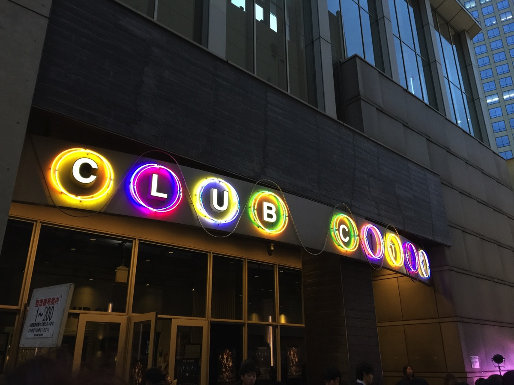
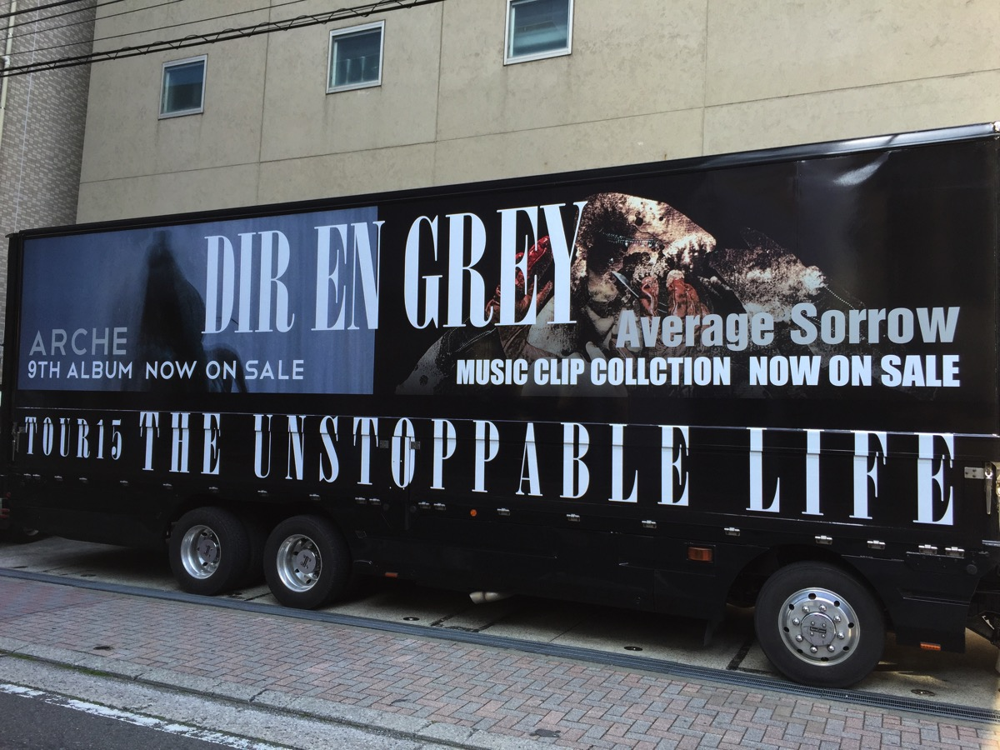
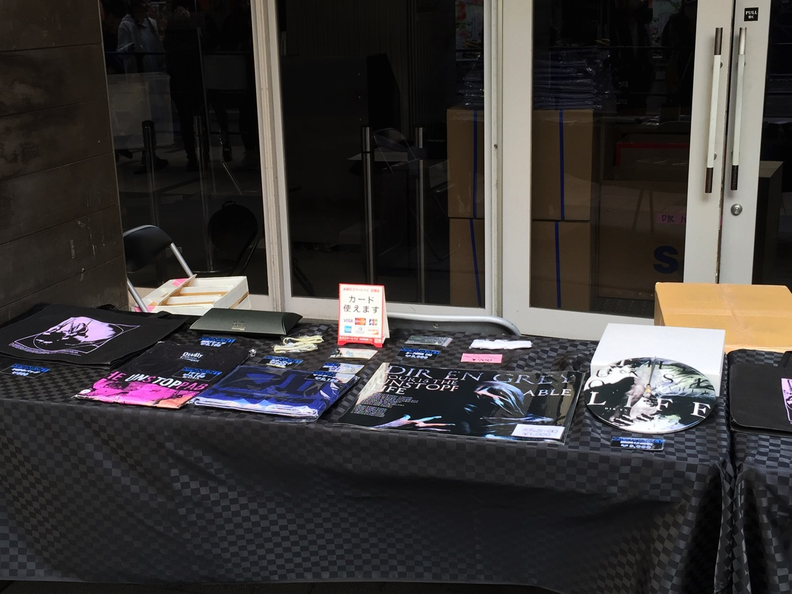
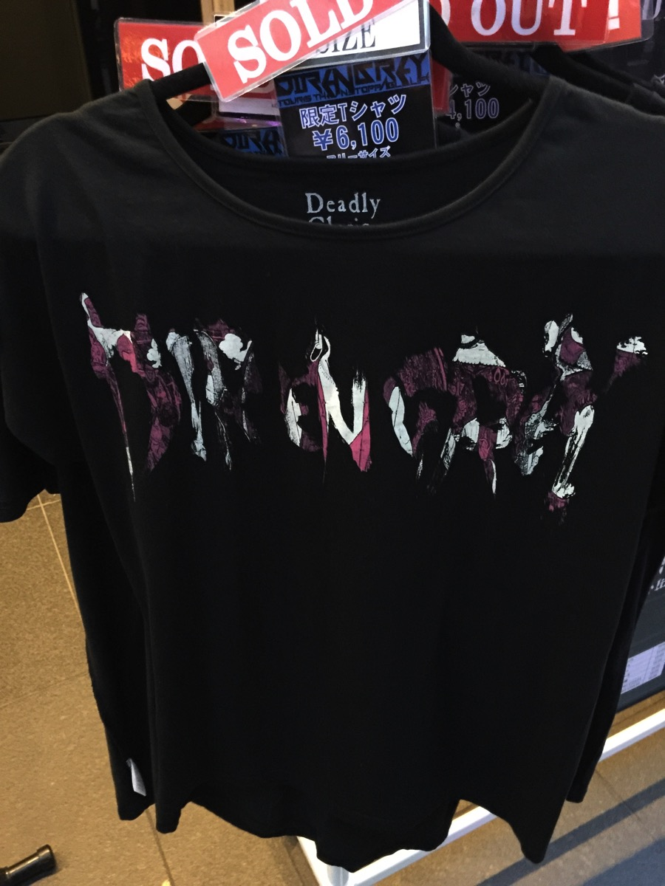
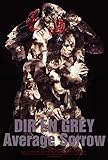

---
categories:
- DIR EN GREYのLIVEレポ
- TOUR15 THE UNSTOPPABLE LIFE
date: Thu, 02 Apr 2015 01:45:10 +0000
slug: post-7466
tags:
- DIR EN GREY
- LIVEレポ
title: 【ライブレポ】DIR EN GREY TOU2015 THE UNSTOPPABLE LIFE-a knot only-2015_4_2@CLUB CHITTA'
---

いよいよ本日スタートしましたDIR EN GREY TOU2015 THE UNSTOPPABLE LIFE
前回ツアーでは、昨年発売したARCHEの世界観の半分しか見ることができませんでしたが、今回のツアーではその全貌が少しでも見られそうです。

ということでLIVEレポです。<!--more--><!--more-->

ハロー。しんぺー(<a href="https://twitter.com/s_s_p_y" target="_blank" rel="noopener noreferrer">@s_s_p_y</a> )です。

オフィより詳しくて、wikiよりも有用なsukekiyo情報サイト「Gadget Zombie Parasite(ガジェットゾンビィパラサイト)」へようこそ。

ちなみにツアートラックは、チッタを通り過ぎて右折、右折で見えてきます。
ガン付けされてて、メンバー側がとれませんでした。

<h2>物販</h2>
まずは物販です。すでに10時前には待機列ができていたということで、いくら春の陽気とはいえ、今日は少し肌寒かったので皆さんの気合の入り具合が伺えますw

物販はこんな感じ

ステッカー大の大きさが半端ない。多分MacBook Proよりもでかい。おそらく、冷蔵庫の冷凍庫のドアに貼る用かな？くらいでかい。

限定Tシャツは、いつもの缶じゃなくて紙の箱に入っていました。どんな箱かというとマクドナルドのアップルパイが入ってるやつみたいな形状

時計が思ったよりも大きくなかったですね。
どうでもいいですが、数年前のツアーで販売してたリップをキーホルダーにできるやつ、また売ってください。あれ凄く役に立った。

<h2>セトリ</h2>
※誤字後ほど直します。

咀嚼
Chain repulsion
Sastain the untruth
Cause of fiklness
Phenomenon
濤声
懐春
輪郭
アンラベ
Behind a vacant image
Midwife
Revelation of mankind
the inferno
Differnt sense

audrey
Un deux
鱗
朔
激しさとこの胸の中で絡みついた灼熱の闇

<h2>セット</h2>

本日のセットはGAUZEtourを彷彿とさせる鉄製のフレームがくまれておりました。さらに随所に鏡の様なものが配置されてた。ただ、最後までこの鏡を使った演出はなく、何のために使われていたのかは不明。

昨日は下手側にいたんですが、Toshiyaが自分の顔をチェックするのに使っていたくらい。

照明は青色を基調とし、暗転するとステージは真っ暗なんだけどステージ外から仄かな白い明るさがさしてた。

また、ステージ背面のモニターは前半では上部に配置されており、途中から下部に降りてきて映像を写していた。

Unduexの時にはバイオハザードバージョンの映像が流れてたらしい（「welcome to...」前の方にいたので、映像自体はあまり目がいかなかったです。
割と後方にいると映像自体も楽しめるのではと思います。

<h2>メンバーの衣装</h2>

メンバー大体、アー写通り。京を除いては。。。

この日の京は

IIIのマークがついたチェゲバラ的なベレー帽（アーミーバスクベレー帽とか言うらしい）
）
幼稚園児よろしく真っ黒なふわーっとしたシャツ（しっかりとボタン閉めてたので、脱ぐのめっちゃ大変そうだった）
目元ぱっちりメイク、おそらくアイラインの上よりも下部分のラインの方が長かった。
さらにピンク色のチーク（よっぱらいみたいな感じに）

もう、裏腹に出没する美大生かと思いました。

さらに、帽子をとると割と単発な髪の毛はピンク色に

ピンクといってもそこまで真っピンクではなく、まさにさくら色という感じ

<h2>LIVEレポ</h2>

終始京さん歌詩があやふやで、ツアー初日！！という感じです。
ただ、ほとんどの曲がARCHEだったため、かなりアルバムの世界観を堪能できるようになっております。

また登場シーンもand zeroからではなく、割と通常仕様になっておりました。
複数回薫がはけるシーンがあったりしました。また右手の人差し指に湿布か、包帯と思われるものをつけていて、少し硬い感じでした。ただ、最後の方は外していて、傷跡などもなかったし、刺青みたいなものも確認できなかったので、骨折などの怪我なのではと勝手に心配になってしまいました。

ほぼToshiya、京しか見ていなかったため、こんな感じです。

<h3>こぼれ話</h3>

<blockquote class="twitter-tweet" lang="ja">
そういや開演前に会場に入りきれなかったみたいでセキュリティーの人が「もう一歩ずつ前に」みたいなこと言った結果、公式による押しが発生しましたとさ
&mdash; しんぺー@チッタノ限参戦 (@s_s_p_y) <a href="https://twitter.com/s_s_p_y/status/583616878922244097">2015, 4月 2</a></blockquote>

<h2>しんぺーはこう思った。</h2>

さて次回は最終日の新木場に参戦予定です。
夏も近づきかなり暑いLIVEになるのでは！！楽しみです！

本日以降参戦される方、怪我などなさらないように！楽しみましょう！

といったところで、本日は以上です。おやすみなさい。

<table  border="0" cellpadding="5" style="border:none"><tr><td style="border:none;text-align:left"><a href="http://www.amazon.co.jp/exec/obidos/ASIN/B00SRVC3QI/warawareotoko-22/ref=nosim/" rel="nofollow noopener noreferrer" target="_blank">Average Sorrow [Blu-ray]</a></td></tr><tr><td style="border:none"><table  border="0" cellpadding="0" style="border:none"><tr><td valign="top" style="border:none"></td><td valign="top" style="border:none;text-align:left">
DIR EN GREY SMD itaku (DVD) 2015-04-01

売り上げランキング : 68
<table style="border:none;margin-top:10px"><tr><td style="border:none;text-align:left;">
<a href="http://www.amazon.co.jp/gp/search?keywords=dir%20en%20grey&__mk_ja_JP=%83J%83%5E%83J%83i&tag=warawareotoko-22" rel="nofollow noopener noreferrer" target="_blank">Amazon</a>

<a href="http://hb.afl.rakuten.co.jp/hgc/0f6e221b.2eb9748a.0f6e221c.35cc1e84/?pc=http%3A%2F%2Fsearch.rakuten.co.jp%2Fsearch%2Fmall%2Fdir%2520en%2520grey%2F-%2Ff.1-p.1-s.1-sf.0-st.A-v.2%3Fx%3D0%26scid%3Daf_ich_link_urltxt%26m%3Dhttp%3A%2F%2Fm.rakuten.co.jp%2F" rel="nofollow noopener noreferrer" target="_blank">楽天市場</a>

<a href="http://ck.jp.ap.valuecommerce.com/servlet/referral?sid=3041033&pid=882528283&vc_url=http%3A%2F%2Fsearch.shopping.yahoo.co.jp%2Fsearch%3Fp%3Ddir%2520en%2520grey" rel="nofollow noopener noreferrer" target="_blank">Yahooショッピング</a>

<a href="http://ck.jp.ap.valuecommerce.com/servlet/referral?sid=3041033&pid=882660047&vc_url=http%3A%2F%2Fauctions.search.yahoo.co.jp%2Fsearch%3Fvo%3D%26ve%3D%26auccat%3D0%26aucminprice%3D%26aucmaxprice%3D%26aucmin_bidorbuy_price%3D%26aucmax_bidorbuy_price%3D%26loc_cd%3D0%26abatch%3D0%26istatus%3D0%26filtered%3D1%26ei%3DUTF-8%26tab_ex%3Dcommerce%26va%3Ddir%2520en%2520grey" rel="nofollow noopener noreferrer" target="_blank">ヤフオク!</a>
</td><td style="vertical-align:bottom;padding-left:10px;font-size:x-small;border:none">by <a href="http://kaereba.com" rel="nofollow noopener noreferrer" target="_blank">カエレバ</a></td></tr></table></td></tr></table></td></tr></table>

<table  border="0" cellpadding="5" style="border:none"><tr><td style="border:none;text-align:left"><a href="http://www.amazon.co.jp/exec/obidos/ASIN/B00N81CGM8/warawareotoko-22/ref=nosim/" rel="nofollow noopener noreferrer" target="_blank">ARCHE</a></td></tr><tr><td style="border:none"><table  border="0" cellpadding="0" style="border:none"><tr><td valign="top" style="border:none"></td><td valign="top" style="border:none;text-align:left">
DIR EN GREY SMD itaku (music) 2014-12-10

売り上げランキング : 1988
<table style="border:none;margin-top:10px"><tr><td style="border:none;text-align:left;">
<a href="http://www.amazon.co.jp/gp/search?keywords=arche&__mk_ja_JP=%83J%83%5E%83J%83i&tag=warawareotoko-22" rel="nofollow noopener noreferrer" target="_blank">Amazon</a>

<a href="http://hb.afl.rakuten.co.jp/hgc/0f6e221b.2eb9748a.0f6e221c.35cc1e84/?pc=http%3A%2F%2Fsearch.rakuten.co.jp%2Fsearch%2Fmall%2Farche%2F-%2Ff.1-p.1-s.1-sf.0-st.A-v.2%3Fx%3D0%26scid%3Daf_ich_link_urltxt%26m%3Dhttp%3A%2F%2Fm.rakuten.co.jp%2F" rel="nofollow noopener noreferrer" target="_blank">楽天市場</a>

<a href="http://ck.jp.ap.valuecommerce.com/servlet/referral?sid=3041033&pid=882528283&vc_url=http%3A%2F%2Fsearch.shopping.yahoo.co.jp%2Fsearch%3Fp%3Darche" rel="nofollow noopener noreferrer" target="_blank">Yahooショッピング</a>

<a href="http://ck.jp.ap.valuecommerce.com/servlet/referral?sid=3041033&pid=882660047&vc_url=http%3A%2F%2Fauctions.search.yahoo.co.jp%2Fsearch%3Fvo%3D%26ve%3D%26auccat%3D0%26aucminprice%3D%26aucmaxprice%3D%26aucmin_bidorbuy_price%3D%26aucmax_bidorbuy_price%3D%26loc_cd%3D0%26abatch%3D0%26istatus%3D0%26filtered%3D1%26ei%3DUTF-8%26tab_ex%3Dcommerce%26va%3Darche" rel="nofollow noopener noreferrer" target="_blank">ヤフオク!</a>
</td><td style="vertical-align:bottom;padding-left:10px;font-size:x-small;border:none">by <a href="http://kaereba.com" rel="nofollow noopener noreferrer" target="_blank">カエレバ</a></td></tr></table></td></tr></table></td></tr></table>