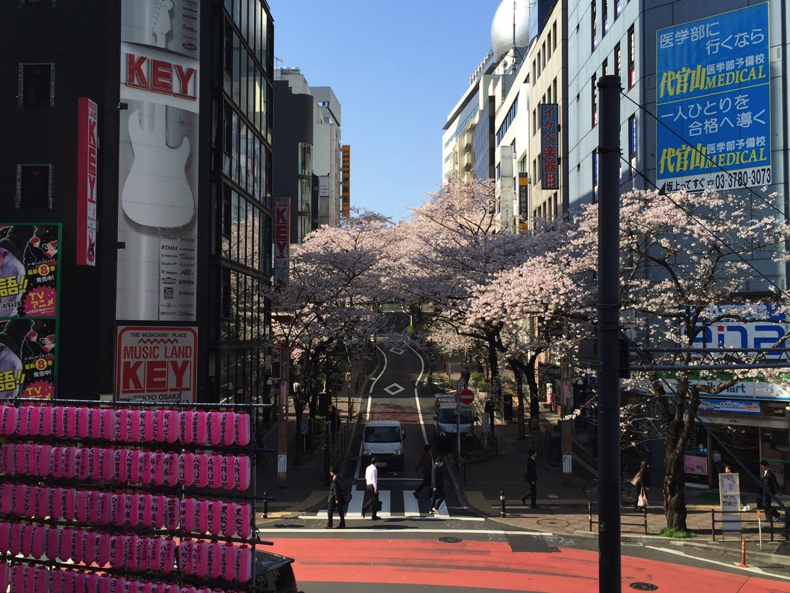
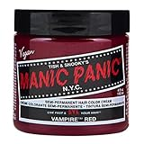

---
categories:
- DIR EN GREY
date: Sun, 05 Apr 2015 16:00:08 +0000
slug: post-7534
title: DIR EN GREY京のニューヘアースタイルのピンク色がどんな感じか
---

おそらくa knot only2daysに参戦されなかった方にとって、ピンク色という情報が流れてくるたびに「どんなだ？」って思われてるとおもいますので、こんな感じだったかなーという主旨の記事です。はい。<!--more-->ハローしんぺー(<a href="https://twitter.com/s_s_p_y" target="_blank">@s_s_p_y</a> )です。
オフィより詳しくて、wikiよりも有用なsukekiyo情報サイト「Gadget Zombie Parasite(ガジェットゾンビィパラサイト)」へようこそ。

ピンク色と一言にいいましても、いくつも種類がございます。
<h2>ピンク色とは？</h2>
<blockquote>ピンク（英語: pink）は赤と白を混ぜて出来る色の一つ。しばしば明るい赤と表現されるが、より正確には明度が高く彩度の低い赤である。ピンクは濃淡によってさまざまなバリエーションが存在する。
引用元:wikipedia</blockquote>
wikipediaに示されているPinkはこんな色でございます。おそらく一般的なピンク色かとおもいます。

◼︎◼︎◼︎
<h2>ピンク色の種類</h2>
◼︎◼︎◼︎シャモア

◼︎◼︎◼︎シェル・ピンク

◼︎◼︎◼︎パウダー・ピンク

◼︎◼︎◼︎ベビー・ピンク

◼︎◼︎◼︎ライト・オーキッド・ピンク

◼︎◼︎◼︎チェリー・ピンク

◼︎◼︎◼︎ハッピー・バースディ

◼︎◼︎◼︎フクシャ・ピンク

◼︎◼︎◼︎ポンパドール・ピンク

ぼくのいた場所から見えた感じだとこのあたりが近しい気がします。

Amazonで染めるの売ってましたけど、こんなビビッドなまっピンクではなかったです。
<table style="border: none;" border="0" cellpadding="5">
<tbody>
<tr>
<td style="border: none; text-align: left;"><a href="http://www.amazon.co.jp/exec/obidos/ASIN/B0047Z4DNY/warawareotoko-22/ref=nosim/" target="_top" rel="nofollow">manic panic(マニックパニック) マニックパニックヘアカラー ヴァンパイアレッド MC11032 118ml</a></td>
</tr>
<tr>
<td style="border: none;">
<table style="border: none;" border="0" cellpadding="0">
<tbody>
<tr>
<td style="border: none;" valign="top"></td>
<td style="border: none; text-align: left;" valign="top">

MANIC PANIC JP 2013-04-19

売り上げランキング : 2157

<table style="border: none; margin-top: 10px;">
<tbody>
<tr>
<td style="border: none; text-align: left;">

<a href="http://www.amazon.co.jp/gp/search?keywords=%83j%83b%83N%83p%83j%83b%83N%83w%83A%83J%83%89%81%5B&amp;__mk_ja_JP=%83J%83%5E%83J%83i&amp;tag=warawareotoko-22" target="_blank" rel="nofollow">Amazon</a>

<a href="http://hb.afl.rakuten.co.jp/hgc/0f6e221b.2eb9748a.0f6e221c.35cc1e84/?pc=http%3A%2F%2Fsearch.rakuten.co.jp%2Fsearch%2Fmall%2F%25E3%2583%258B%25E3%2583%2583%25E3%2582%25AF%25E3%2583%2591%25E3%2583%258B%25E3%2583%2583%25E3%2582%25AF%25E3%2583%2598%25E3%2582%25A2%25E3%2582%25AB%25E3%2583%25A9%25E3%2583%25BC%2F-%2Ff.1-p.1-s.1-sf.0-st.A-v.2%3Fx%3D0%26scid%3Daf_ich_link_urltxt%26m%3Dhttp%3A%2F%2Fm.rakuten.co.jp%2F" target="_blank" rel="nofollow">楽天市場</a>

<a href="http://ck.jp.ap.valuecommerce.com/servlet/referral?sid=3041033&amp;pid=882528283&amp;vc_url=http%3A%2F%2Fsearch.shopping.yahoo.co.jp%2Fsearch%3Fp%3D%25E3%2583%258B%25E3%2583%2583%25E3%2582%25AF%25E3%2583%2591%25E3%2583%258B%25E3%2583%2583%25E3%2582%25AF%25E3%2583%2598%25E3%2582%25A2%25E3%2582%25AB%25E3%2583%25A9%25E3%2583%25BC" target="_blank" rel="nofollow">Yahooショッピング</a>

<a href="http://ck.jp.ap.valuecommerce.com/servlet/referral?sid=3041033&amp;pid=882660047&amp;vc_url=http%3A%2F%2Fauctions.search.yahoo.co.jp%2Fsearch%3Fvo%3D%26ve%3D%26auccat%3D0%26aucminprice%3D%26aucmaxprice%3D%26aucmin_bidorbuy_price%3D%26aucmax_bidorbuy_price%3D%26loc_cd%3D0%26abatch%3D0%26istatus%3D0%26filtered%3D1%26ei%3DUTF-8%26tab_ex%3Dcommerce%26va%3D%25E3%2583%258B%25E3%2583%2583%25E3%2582%25AF%25E3%2583%2591%25E3%2583%258B%25E3%2583%2583%25E3%2582%25AF%25E3%2583%2598%25E3%2582%25A2%25E3%2582%25AB%25E3%2583%25A9%25E3%2583%25BC" target="_blank" rel="nofollow">ヤフオク!</a>
</td>
<td style="vertical-align: bottom; padding-left: 10px; font-size: x-small; border: none;">by <a href="http://kaereba.com" target="_blank" rel="nofollow">カエレバ</a></td>
</tr>
</tbody>
</table>
&nbsp;</td>
</tr>
</tbody>
</table>
</td>
</tr>
</tbody>
</table>
<h2><a href="https://twitter.com/s_s_p_y" target="_blank">しんぺー</a> はこう思った。</h2>
それと写真フォルダ漁ってて気がつきましたが、初日に京が着てたのっておそらくこれです。
<blockquote class="twitter-tweet" lang="ja">≪更新≫NACK日記(番組ブログ) に2/20放送後記をアップしました！ゲスト【sukekiyo】のブログでしか公開していない写真やリスナープレゼント、Q＆Aも公開中★ <a href="http://t.co/RJ0Gd8DMVI">http://t.co/RJ0Gd8DMVI</a> <a href="https://twitter.com/hashtag/bs795?src=hash">#bs795</a> <a href="http://t.co/M23E5LGwMi">pic.twitter.com/M23E5LGwMi</a>

— BEAT SHUFFLE (@beat_shuffle) <a href="https://twitter.com/beat_shuffle/status/569002134345109505">2015, 2月 21</a></blockquote>

と言ったところで本日は以上になります。おやすみなさい。