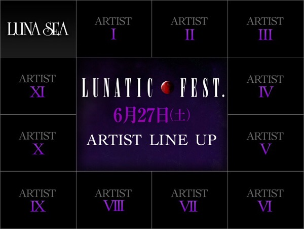
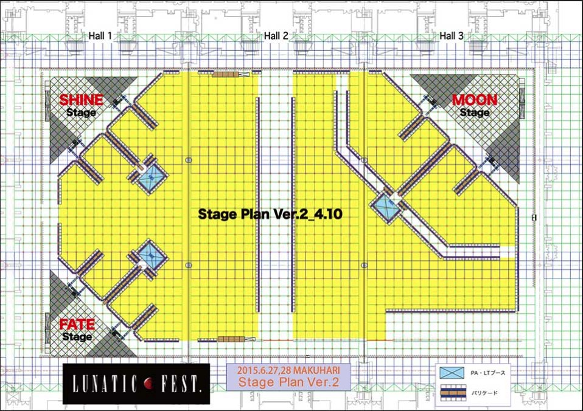
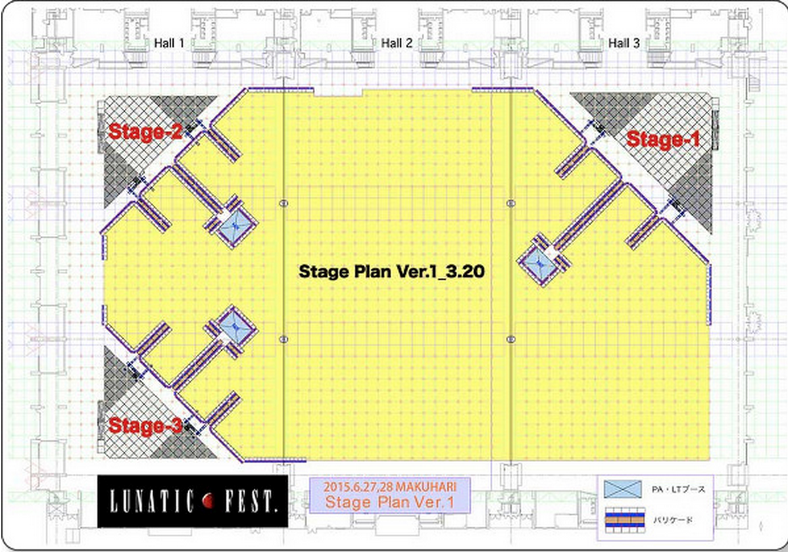

---
categories:
- LUNATIC FEST.
date: Fri, 10 Apr 2015 09:09:00 +0000
slug: post-7562
tags:
- LUNATIC FEST
title: 【LUNATIC FEST.】参戦アーティスト発表かと思ったらバンド『数』の発表だったでござる#ルナフェス
---

ついにアーティスト情報の解禁か！とか思ってたら、違いましたw焦らすなーw<!--more-->ハローしんぺー(<a href="https://twitter.com/s_s_p_y" target="_blank">@s_s_p_y</a> )です。
オフィより詳しくて、wikiよりも有用なsukekiyo情報サイト「Gadget Zombie Parasite(ガジェットゾンビィパラサイト)」へようこそ。

【LUNATIC FEST.関連記事一覧】
<a href="https://www.warawareotoko.com/2015/03/16/post-7393/">奇跡の狂演「LUNATIC FEST」に参戦希望バンドのスケジュール調べてみた #ルナフェス</a>

<a href="https://www.warawareotoko.com/2015/03/18/post-7396/">続LUNATIC FEST. 参戦希望バンド調べてみた「あの麺はいま」 #ルナフェス</a>

<a href="https://www.warawareotoko.com/2015/03/22/post-7421/">【LUNATIC FEST.】ステージ構成発表される！ #ルナフェス</a>

<h2>参戦アーティスト・・・発表！？</h2>

さて、4月10日の夕方に新しい情報が出ました。一時的にアクセスしずらい状態になっていたみたいです。

しかし、やっとこさアクセスして得られた情報が・・・

＿人人人人人人人人人人人＿
＞アーティスト 数 発表 ＜
￣Y^Y^Y^Y^Y^Y^Y^Y^Y^Y￣

 

両日LUNA SEA以外だと22バンドでるという感じみたいですね。

参考：<a href="https://www.warawareotoko.com/2015/03/16/post-7393/">奇跡の狂演「LUNATIC FEST」に参戦希望バンドのスケジュール調べてみた</a>

参考：<a href="https://www.warawareotoko.com/2015/03/18/post-7396/">続#LUNATICFEST 参戦希望バンド調べてみた「あの麺はいま」</a>

<h2>ルナフェス会場図面アップデートされる！</h2>

会場中央に花道？？それとも、区切られてるのかな？？おそらく通路かと思われます。前回の感じだと死人がでてもおかしくなかい感じでしたが、これなら安心か？？？

前回はこんな感じでした。

参考：【<a href="https://www.warawareotoko.com/2015/03/22/post-7421/">LUNATIC FEST.】ステージ構成発表される！ #ルナフェス
</a>

ルナティックフェスト公式は<a href="http://lunaticfest.com/">こちら</a>

<h2><a href="https://twitter.com/s_s_p_y" target="_blank">しんぺー</a> はこう思った。</h2>

ネクストアクションは4月30日！！どんだけ焦らすねん！！！
アーティストラインナップが発表されます！！

と言ったところで本日は以上になります。おやすみなさい。