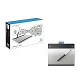
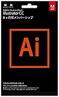
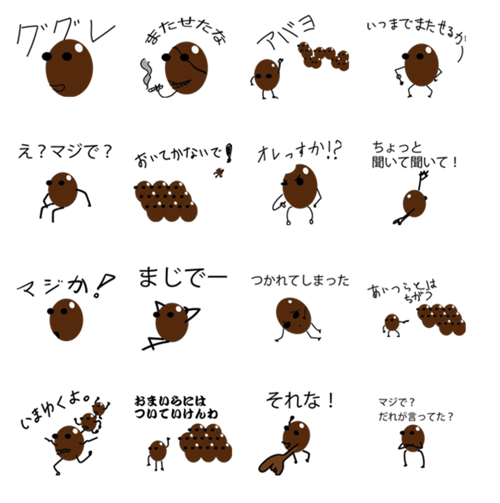
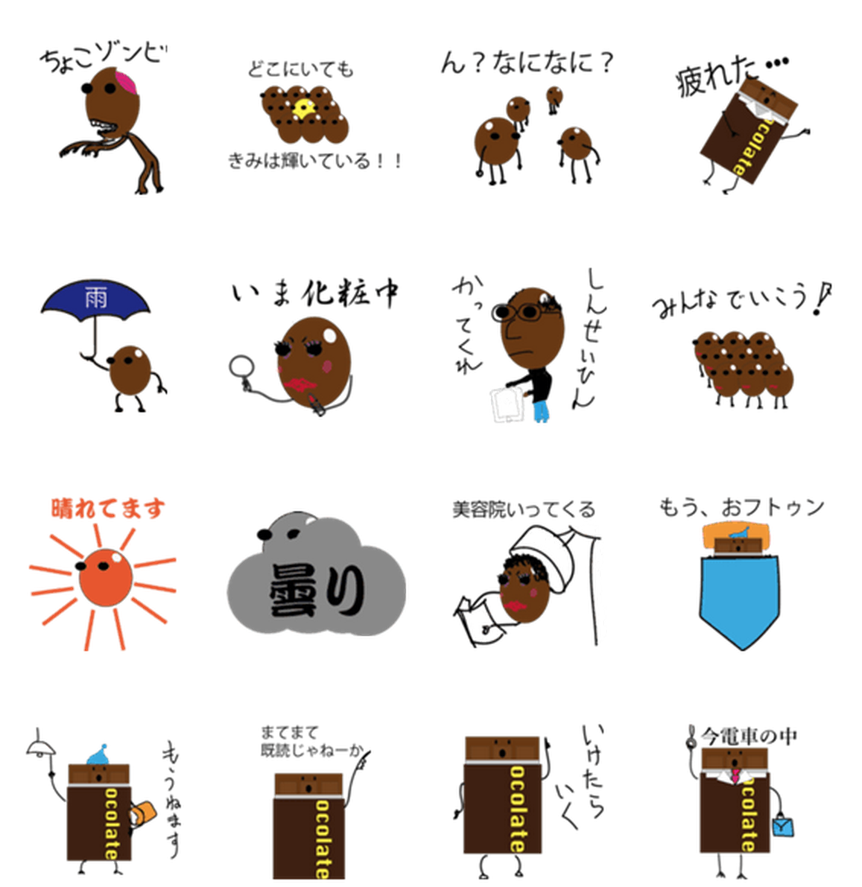
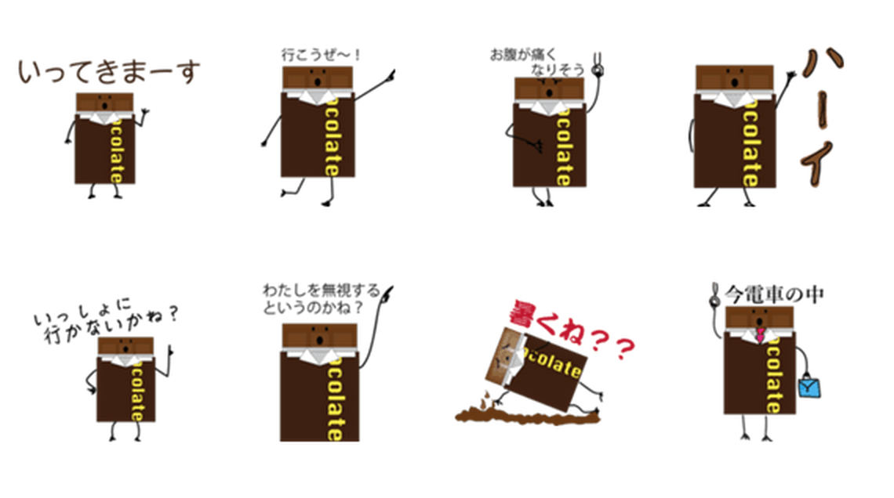
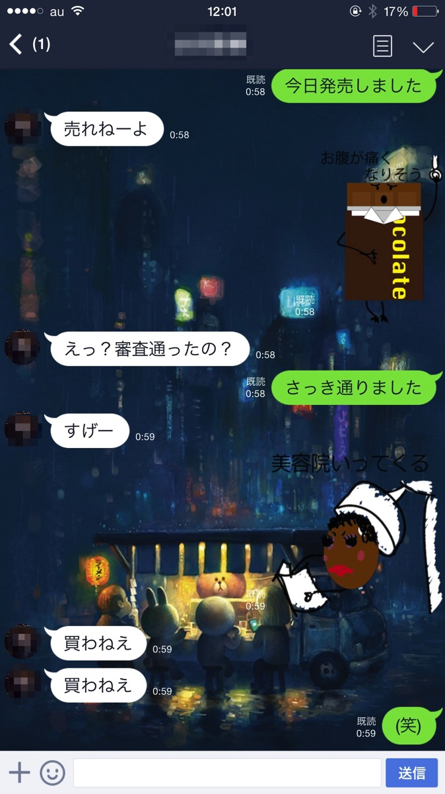

---
categories:
- LINE WOWの思い出
date: Sat, 11 Apr 2015 16:00:29 +0000
slug: post-7565
tags:
- LINEクリエーターズスタンプ
- LINEスタンプ
title: LINEクリエーターズスタンプ「チョコちゃん」リリースしました。
---

数ヶ月前に作成し、幾度となくリジェクトされて修正してを繰り返し、ようやくリリースいたしました。<!--more-->ハローしんぺー(<a href="https://twitter.com/s_s_p_y" target="_blank">@s_s_p_y</a> )です。
オフィより詳しくて、wikiよりも有用なsukekiyo情報サイト「Gadget Zombie Parasite(ガジェットゾンビィパラサイト)」へようこそ。

12月に思い立ち、準備して書き始め申請し、度重なる修正をしてきました。しかし、承認されることなく音沙汰がなくなって、ぼくも忘れかけ始めていた頃、そのメールは突然やってきました。

「承認されましたのでリリースボタンを押してください」

ドキっとしました。それからは、リリースがストアに反映されるまでひたすらリロード

そしてようやくリリース。本日はラインクリエーターズスタンプを作るのにぼくが用意した物や反省点などをご紹介したく思います。興味あるけど、迷ってる方の役に立ったら嬉しいです。

<h2>LINEクリエーターズスタンプとは</h2>

LINEのスタンプショップでコイン100枚で販売されている公式スタンプとは異なり、個人が作成・販売できるスタンプです。値段はコイン50枚です。

個人作成になりますので、オリジナルキャラクタや個性的なスタンプ、特定のシーンに特化したものなど、それぞれかなり工夫されたものが揃っています。

今現在で８万ほどのスタンプがショップに並んでおります。おそらく未だに数万個のスタンプが申請待ちとなっているでしょう。それくらい作る側にも人気なサービスになっているわけです。

<h3>販売することのメリット</h3>

2つあると思います。
<strong>・自分のオリジナルのスタンプが使えるようになる</strong>
<strong>・収益が入る</strong>

ただ、<strong>収益に関してはあまり期待はできそうになりません。</strong>サービス開始当初であれば、すぐに大量に購入されてそれこそ月収10万円ですとかあったらしいのですが、今や玉石混交でスマホからだと検索もできないし、オリジナリティも出しにくくなってきていることもありほとんどダウンロードされないらしいです。

ということで、苦労の割には見返りはあまりありません。

<h2>スタンプ制作のためにぼくが揃えたもの</h2>

ペンタブを買いました。おそらくこれが一番ランクが低いものだと思います。
これで十分です。使っていれば、すぐに慣れると思います。
<table  border="0" cellpadding="5" style="border:none"><tr><td style="border:none;text-align:left"><a href="http://www.amazon.co.jp/exec/obidos/ASIN/B00RZ6JEAO/warawareotoko-22/ref=nosim/" rel="nofollow" target="_blank" target="_top">ワコム Intuos Pen ペン入力専用モデル Sサイズ CTL-480/S1 【新型番】2015年1月モデル</a></td></tr><tr><td style="border:none"><table  border="0" cellpadding="0" style="border:none"><tr><td valign="top" style="border:none"></td><td valign="top" style="border:none;text-align:left">
 ワコム 2015-01-23

売り上げランキング : 142
<table style="border:none;margin-top:10px"><tr><td style="border:none;text-align:left;">
<a href="http://www.amazon.co.jp/gp/search?keywords=intuos&__mk_ja_JP=%83J%83%5E%83J%83i&tag=warawareotoko-22" rel="nofollow" target="_blank">Amazon</a>

<a href="http://hb.afl.rakuten.co.jp/hgc/0f6e221b.2eb9748a.0f6e221c.35cc1e84/?pc=http%3A%2F%2Fsearch.rakuten.co.jp%2Fsearch%2Fmall%2Fintuos%2F-%2Ff.1-p.1-s.1-sf.0-st.A-v.2%3Fx%3D0%26scid%3Daf_ich_link_urltxt%26m%3Dhttp%3A%2F%2Fm.rakuten.co.jp%2F" rel="nofollow" target="_blank">楽天市場</a>

<a href="http://ck.jp.ap.valuecommerce.com/servlet/referral?sid=3041033&pid=882528283&vc_url=http%3A%2F%2Fsearch.shopping.yahoo.co.jp%2Fsearch%3Fp%3Dintuos" rel="nofollow"  target="_blank">Yahooショッピング</a>

<a href="http://ck.jp.ap.valuecommerce.com/servlet/referral?sid=3041033&pid=882660047&vc_url=http%3A%2F%2Fauctions.search.yahoo.co.jp%2Fsearch%3Fvo%3D%26ve%3D%26auccat%3D0%26aucminprice%3D%26aucmaxprice%3D%26aucmin_bidorbuy_price%3D%26aucmax_bidorbuy_price%3D%26loc_cd%3D0%26abatch%3D0%26istatus%3D0%26filtered%3D1%26ei%3DUTF-8%26tab_ex%3Dcommerce%26va%3Dintuos" rel="nofollow"  target="_blank">ヤフオク!</a>
</td><td style="vertical-align:bottom;padding-left:10px;font-size:x-small;border:none">by <a href="http://kaereba.com" rel="nofollow" target="_blank">カエレバ</a></td></tr></table></td></tr></table></td></tr></table>

お絵描きはAdobeのIllustratorを使いました。

ちなみに今はこんな便利なものが売られているみたいです。
使いたい時に期間限定で使えるようになっているみたいなので、これで集中して描きあげるのもいいかもしれません。
<table  border="0" cellpadding="5" style="border:none"><tr><td style="border:none;text-align:left"><a href="http://www.amazon.co.jp/exec/obidos/ASIN/B00FONNR80/warawareotoko-22/ref=nosim/" rel="nofollow" target="_blank" target="_top">Adobe Illustrator CC 3か月版 [ダウンロードカード]</a></td></tr><tr><td style="border:none"><table  border="0" cellpadding="0" style="border:none"><tr><td valign="top" style="border:none"></td><td valign="top" style="border:none;text-align:left">
 アドビシステムズ 2013-10-18

売り上げランキング : 117
<table style="border:none;margin-top:10px"><tr><td style="border:none;text-align:left;">
<a href="http://www.amazon.co.jp/gp/search?keywords=Adobe%20Illustrator%20CC%203%82%A9%8C%8E%94%C5&__mk_ja_JP=%83J%83%5E%83J%83i&tag=warawareotoko-22" rel="nofollow" target="_blank">Amazon</a>

<a href="http://hb.afl.rakuten.co.jp/hgc/0f6e221b.2eb9748a.0f6e221c.35cc1e84/?pc=http%3A%2F%2Fsearch.rakuten.co.jp%2Fsearch%2Fmall%2FAdobe%2520Illustrator%2520CC%25203%25E3%2581%258B%25E6%259C%2588%25E7%2589%2588%2F-%2Ff.1-p.1-s.1-sf.0-st.A-v.2%3Fx%3D0%26scid%3Daf_ich_link_urltxt%26m%3Dhttp%3A%2F%2Fm.rakuten.co.jp%2F" rel="nofollow" target="_blank">楽天市場</a>

<a href="http://ck.jp.ap.valuecommerce.com/servlet/referral?sid=3041033&pid=882528283&vc_url=http%3A%2F%2Fsearch.shopping.yahoo.co.jp%2Fsearch%3Fp%3DAdobe%2520Illustrator%2520CC%25203%25E3%2581%258B%25E6%259C%2588%25E7%2589%2588" rel="nofollow"  target="_blank">Yahooショッピング</a>

<a href="http://ck.jp.ap.valuecommerce.com/servlet/referral?sid=3041033&pid=882660047&vc_url=http%3A%2F%2Fauctions.search.yahoo.co.jp%2Fsearch%3Fvo%3D%26ve%3D%26auccat%3D0%26aucminprice%3D%26aucmaxprice%3D%26aucmin_bidorbuy_price%3D%26aucmax_bidorbuy_price%3D%26loc_cd%3D0%26abatch%3D0%26istatus%3D0%26filtered%3D1%26ei%3DUTF-8%26tab_ex%3Dcommerce%26va%3DAdobe%2520Illustrator%2520CC%25203%25E3%2581%258B%25E6%259C%2588%25E7%2589%2588" rel="nofollow"  target="_blank">ヤフオク!</a>
</td><td style="vertical-align:bottom;padding-left:10px;font-size:x-small;border:none">by <a href="http://kaereba.com" rel="nofollow" target="_blank">カエレバ</a></td></tr></table></td></tr></table></td></tr></table>

ちなみに、iPadのお絵描きアプリと簡単なスタイラスペンなどを使っても描けるみたいですよ。
その場合、色々見ましたがスタイラスはやっぱりwacomがおすすめです。
<iframe frameborder="0" allowtransparency="true" height="120" width="120" marginheight="0" scrolling="no" src="http://ad.jp.ap.valuecommerce.com/servlet/htmlbanner?sid=3041033&pid=883413530" marginwidth="0"><noscript></noscript></iframe>

<h2>スタンプの描き方のルール</h2>

詳しくはこちら
<a href="https://creator.line.me/ja/guideline/">https://creator.line.me/ja/guideline/</a>

ぼくが主にリジェクトされた要因が<strong>「透過」</strong>

要はスタンプの後ろ側を透けるようにしておかないといけないのです。
例えばキャラクターの両足の間とか、背景が映るような所は、ちゃんと抜いて背景が見えるようにしておかなければならないのです。
Illustratorのこういう仕様についてあまり理解できておらず、白く見えればいいのだろうと思っておりました。

ただガイドラインに従って描いていれば問題はないはずです。

<h2>そして出来上がったスタンプがこちら</h2>

いやーお恥ずかしいw　絵描くのはわりと得意な方なんですがイラストとかオリジナルキャラを描くのとかむずいわーw　ということで何の考えもなしにチョコレートをモチーフにしたキャラクターを描きました。40個も描くのめっちゃ大変でした。購入はこちらからできます。
<a href="https://store.line.me/stickershop/product/1079934/ja">LINEクリエーターズスタンプ「チョコちゃん」</a>

<h2>反省点</h2>

えーっと、同じスタンプが2つあるwww　かぶっちゃってるわwww

えーっと、文字が黒いので背景が黒い人だと見えないwww

えーっと、面白くないし意味がわからないwww

<h2><a href="https://twitter.com/s_s_p_y" target="_blank">しんぺー</a> はこう思った。</h2>

一つ通るとモチベーションが一気にあがりますな！！これからもちょっとずつ描いていこうかな〜よかったらDLしてみてくださいw

今の所会社の知り合いと自分での購入、自分が人に送るためのギフト購入含めてで9DLされましたw

と言ったところで本日は以上になります。おやすみなさい。