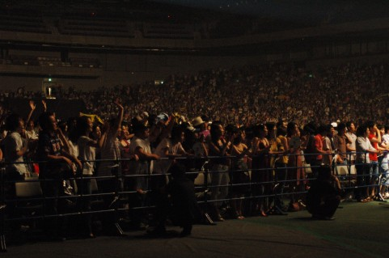
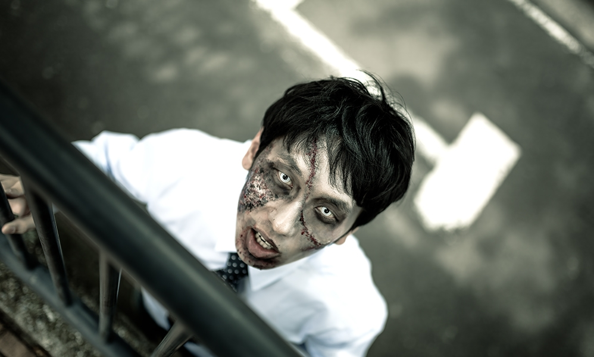

---
categories:
- music
date: Sun, 12 Apr 2015 16:00:43 +0000
slug: post-7587
tags:
- サイコパス
- ブログ
- 電車
title: 満員電車とLIVEの違い
---

近ごろ朝の通気時間帯の電車の乗客にイライラしている人が増えてきたと思う。混んでるからそりゃ以前からイラついてたんだと思うけど、最近は肌感覚で感じる程イライラしていると思う。今日はそんなお話です。

<!--more-->

ハローしんぺー(<a href="https://twitter.com/s_s_p_y" target="_blank">@s_s_p_y</a> )です。
オフィより詳しくて、wikiよりも有用なsukekiyo情報サイト「Gadget Zombie Parasite(ガジェットゾンビィパラサイト)」へようこそ。

<h2>LIVEと満員電車の違い</h2>

LIVEでも自分勝手な奴は迷惑がられるわけですけど、基本的にはみんな１つの対象を拝んでいるわけです。電車も昔はLIVEに近かったと思います。本を読む以外だと中吊り広告をみんな見ていたので。それが今や各々がスマホを見ているので、まとまりがなくなってきたのかなと思います。

参考:<a href="https://www.warawareotoko.com/2015/01/25/post-7062/">【LIVEあるある】LIVEの時の譲りあい。いいよね、バンギャのそういう武士</a>
<h2>地蔵が多すぎ</h2>

それと動かない人が多すぎ。「流れ」があるわけで、動かないことで出口付近だけが混んでしまったり、乗り降りの際の障害になってしまうわけです。

ではなぜ動かないのか？

スマホのせいだと思います。みんな下を向いて、周りが見えないために地蔵と化すのです。さらに、体が固定しているために、人の触れられたくない部分に触れてしまっていることに気がつきにくいのです。簡単に言うと手とかが他の人の頭とか髪の毛に触れてしまっていることに気がつきにくいのです。

で、自分が動かない時はいいんだけど、降りる駅とかになって降りようとすると周りが動かないから押したり、無理矢理通ろうとしたりするわけです。

この結果、全員がイラつくという感じになっているのだと思います。

参考:<a href="https://www.warawareotoko.com/2014/12/03/post-6656/">電車で新聞読む迷惑行為そろそろやめてもらっていっすか？</a>
<h2>今後このイライラが募ると大変なことになりそう</h2>

なので、鉄道会社各社は早急にシビュラシステムと強制鎮圧システムを導入検討するか、乗客のストレス緩和対策を講じるかした方がいいんじゃないでしょうか。もしくは乗客の視線を集められるような広告の仕組みとか。
成田空港では外国人観光客のスマホに広告出すらしいですよ

いや、そもそも混雑の緩和ができればそんなこともしなくて済むんですがね。

参考:<a href="https://www.warawareotoko.com/2014/11/05/post-6530/">電車内の広告なんか誰も見ないからiBeaconでスマホに広告配信してポイントバックしたらいい</a>
<h2><a href="https://twitter.com/s_s_p_y" target="_blank">しんぺー</a> はこう思った。</h2>

そんな、こんなしてたら劇場版サイコパスの予約が始まっておりました。映画館で見た映画って買わないんですけど、これは最高に楽しかったので買おうと思います。

と言ったところで本日は以上になります。おやすみなさい。