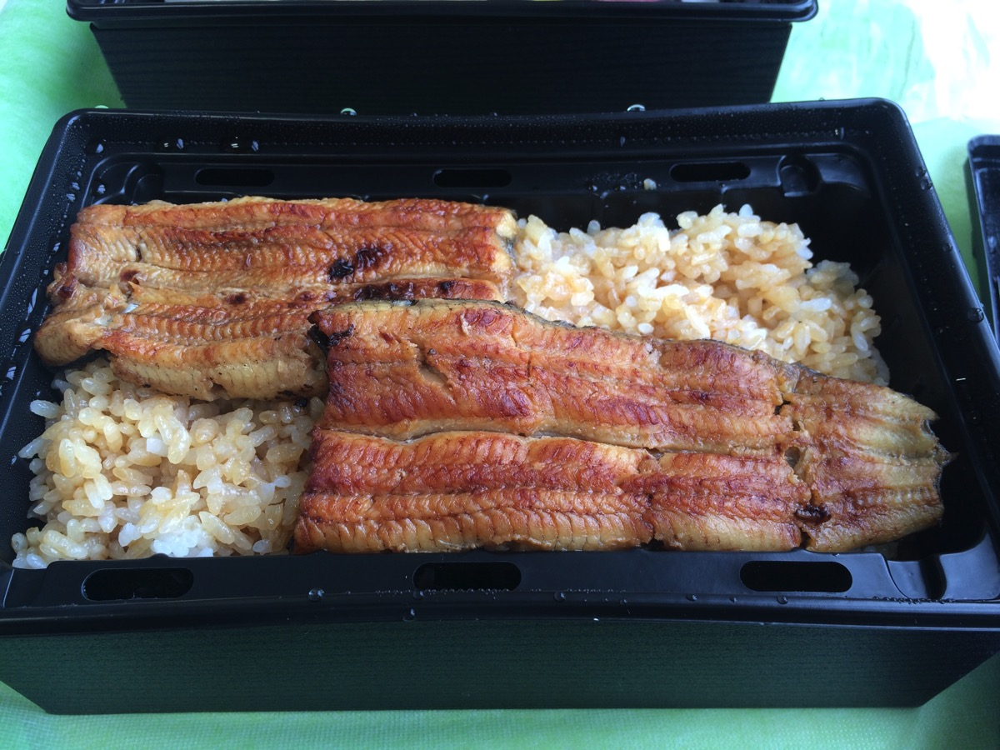
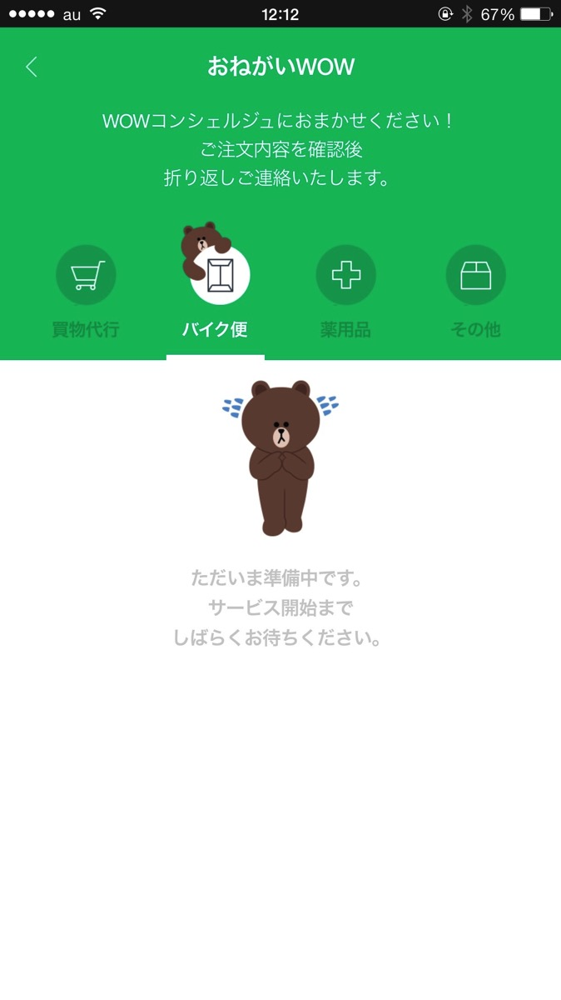
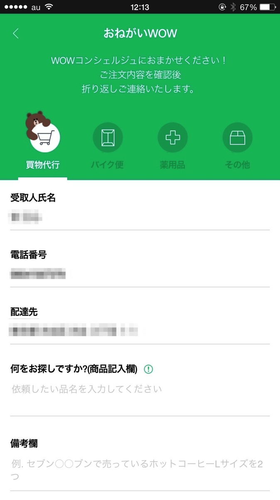
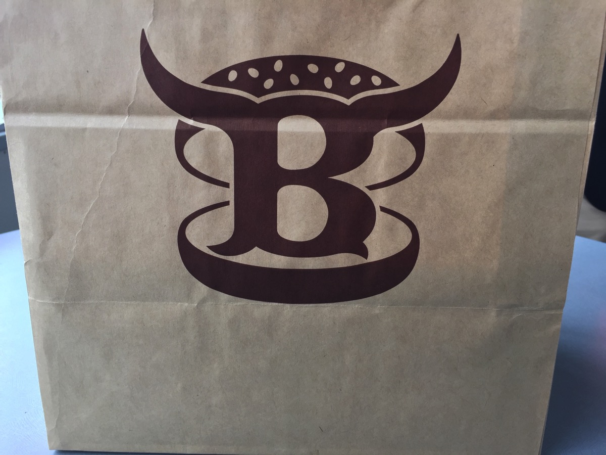
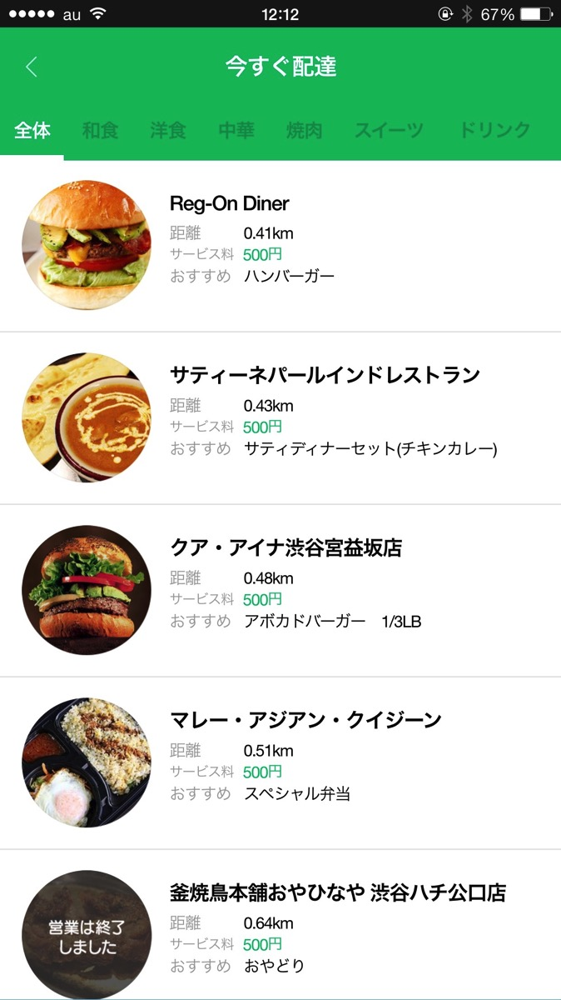
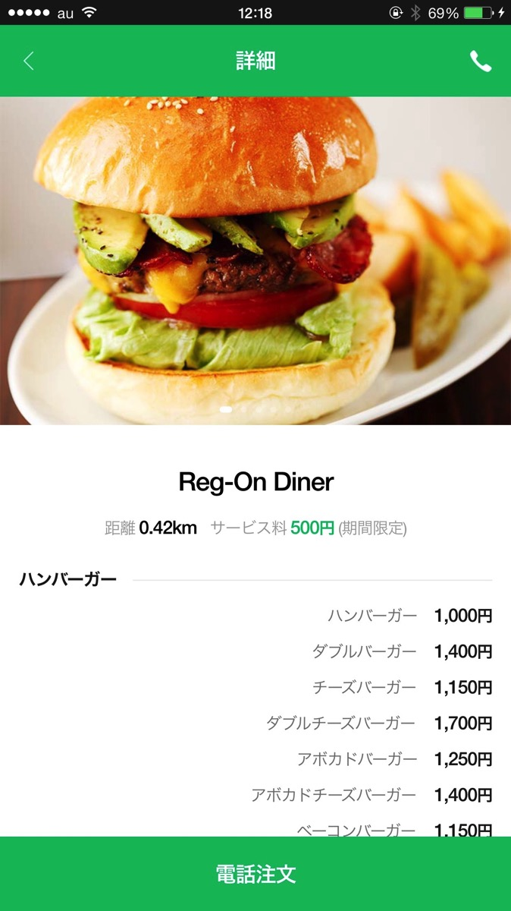

---
categories:
- LINE WOWの思い出
date: Tue, 14 Apr 2015 16:00:20 +0000
slug: post-7595
tags:
- LINE WOW
title: LINE WOWの新サービス「今すぐ配達」使ったらやっぱりランチがバラ色だった件
---

実はLINE WOWを使って毎週同僚と出前を取って食べています。そんな中LINE WOWがアップデートして新サービス「今すぐ配達」をスタートさせたみたいなので早速使ってみました。<!--more-->ハローしんぺー(<a href="https://twitter.com/s_s_p_y" target="_blank">@s_s_p_y</a> )です。
オフィより詳しくて、wikiよりも有用なsukekiyo情報サイト「Gadget Zombie Parasite(ガジェットゾンビィパラサイト)」へようこそ。

<h2>LINE WOWとは？</h2>

LINE WOWとは、LINEのグループ会社であるLINE Brosが運営している宅配弁当アプリです。普段はいけない高級レストランや料理屋のお食事を弁当にしてお届けしてくれます。

LINE側はユーザーとお店の間の配達を請け負っているみたいです。ラインナップも高級店ばかりで、たまに頼むのならいいんですけど、毎日毎日は役員とか社長じゃないと厳しい、、、というか無理なものばかりでした。普通に5,000円とか10,000円とかのラインナップなので。

たまたまリリース３ヶ月キャンペーンで半額だったので、同僚と注文したのがこちらのミシュランに載っているうなぎ屋さんの弁当。

いやー本当に美味しくて美味しくて、まさにWOWという体験でした。

参考：<a href="https://www.warawareotoko.com/2015/03/15/post-7377/">高級弁当宅配アプリ【LINE WOW】を使ったらランチタイムがバラ色だったからマジでオススメ</a>

<h2>コンシェルジュサービスへ進化したLINE WOW</h2>

ただの高級弁当宅配アプリだったLINE　WOWですが、どうやら<strong>コンシェルジュサービスへと進化を遂げたようです。</strong>

今までの高級弁当ラインナップは、新たに<strong>「WOWセレクション」</strong>となり、アプリのメイン機能はLINEと提携がないお店であっても届けてくれる<strong>「今すぐ配達」</strong>というものに変わりました。

<h3>「今すぐ配達」とは？</h3>

現在地と現在の時刻から配達可能な店舗を選択し、オペレーターに電話をかけて注文します。

すると、LINEの人が実際にそのお店に出向いて、普通にお客さんとしてテイクアウトをして、それを持ってきてくれるというサービスです。

そのため、<strong>出前をしていないお店でも届けてくれます。</strong>

素晴らしい！

<h3>さらに「お願いWOW」を準備中の模様</h3>

アプリに実装はされているものの、まだ準備中のようです。
<ul>
	<li>買物代行</li>
	<li>バイク便</li>
	<li>薬用品</li>
	<li>その他</li>
</ul>

買物代行のみやっているみたいです。今後が楽しみです。

<h2>LINE WOWの「今すぐ配達」を実際に使ってみた</h2>

ということで使ってみました。今回注文したお店は恵比寿のブラッカウズというハンバーガー屋さんです。

<strong><a href="http://tabelog.com/tokyo/A1303/A130302/13096437/" target="_blank">ブラッカウズ</a></strong>

<strong>関連ランキング：</strong><a href="http://tabelog.com/rstLst/hamburger/">ハンバーガー</a> | <a href="http://tabelog.com/tokyo/A1303/A130303/R5661/rstLst/">代官山駅</a>、<a href="http://tabelog.com/tokyo/A1303/A130302/R1528/rstLst/">恵比寿駅</a>、<a href="http://tabelog.com/tokyo/A1317/A131701/R7118/rstLst/">中目黒駅</a>

<h3>LINE WOW「今すぐ配達」の使い方</h3>

まずはラインナップからお目当てのお店を選択、電話をかけます。
ちなみにお店が開いていない時間やテイクアウト時間外だと注文できません。

オペレーターの方に必要事項を聞かれますので、回答しつつ注文をお願いします。

指定時刻に宅配の爽やかなお兄さんが持ってきてくれます。

<h3>「今すぐ配達」の料金</h3>

サービス料ということで500円かかります。えーでも十分安いでしょ！さらにいうと渋谷と港区周辺しかまだ対応しておりませんので、こちらも今後拡大していく可能性があります！

<h2><a href="https://twitter.com/s_s_p_y" target="_blank">しんぺー</a> はこう思った。</h2>

いやー本当に素晴らしいサービスです。何がいいって、スタッフの方が爽やかなのと、さらにテイクアウトしかしていない「食べられない」お店のものが食べられるというところ

さらに便利になったLINE WOWを今後もっと使っていこうと思います。

と言ったところで本日は以上になります。おやすみなさい。