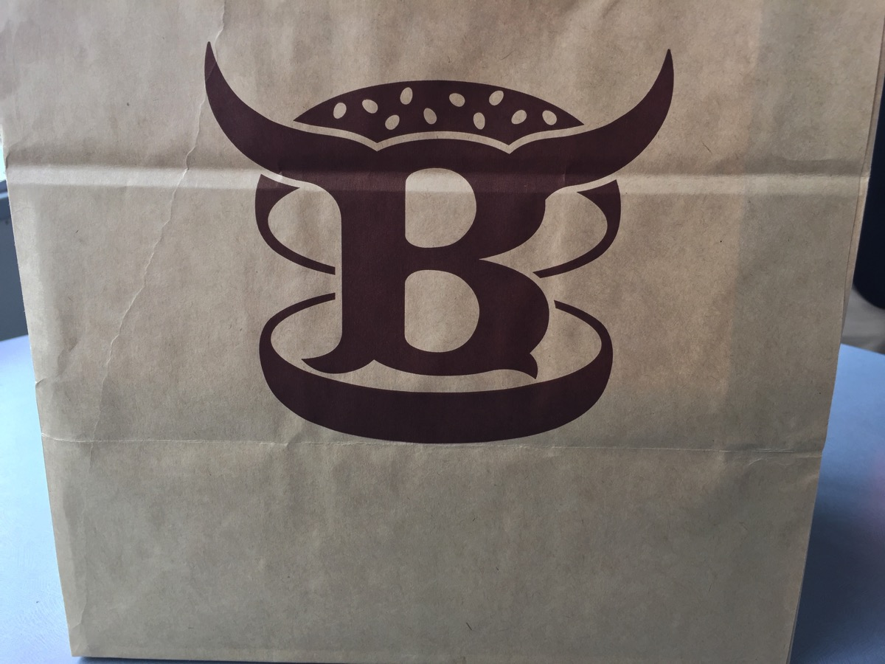

---
categories:
- LINE WOWの思い出
- グルメ
date: Sat, 18 Apr 2015 16:00:12 +0000
slug: post-7631
tags:
- LINE WOW
- ハンバーガー
title: LINE WOWでデリバリーしたハンバーガーたち
---

LINE WOWの素晴らしさをご紹介しているぼくですが、実はほぼ毎週注文しています。今回はそれで注文したハンバーガーをご紹介！<!--more-->ハローしんぺー(<a href="https://twitter.com/s_s_p_y" target="_blank">@s_s_p_y</a> )です。
オフィより詳しくて、wikiよりも有用なsukekiyo情報サイト「Gadget Zombie Parasite(ガジェットゾンビィパラサイト)」へようこそ。

<h2>LINE WOWとは</h2>

LINEのグループ会社であるLINE Brosが提供するコンシェルジュサービスです。

高級弁当からちょっとした買物代行までしてくれるスンバラシイサービスです。

LINE WOWでミシュラン掲載の有名うなぎ屋さんの弁当を注文した記事です。
参考：<a href="https://www.warawareotoko.com/2015/03/15/post-7377/">高級弁当宅配アプリ【LINE WOW】を使ったらランチタイムがバラ色だったからマジでオススメ</a>

LINE WOWが新しく始めたサービスのご紹介です。これ以来ハンバーガーを毎週注文しようと思ったのです！
参考：<a href="https://www.warawareotoko.com/2015/04/15/post-7595/">LINE WOWの新サービス「今すぐ配達」使ったらやっぱりランチがバラ色だった件</a>

<h2>LINE WOWで注文したハンバーガーたち</h2>

渋谷界隈ですとけっこう有名なハンバーガー屋さんがあります。会社からだと遠かったり、デリバリーしていなかったりして中々食べられる機会がありません。

しかし！このLINE WOWのコンシェルジュサービスを使えば、そんな我慢をしなくて済むのです！！！

すらばしい！！！ということで毎週注文しているのです。

<h3>レッグオンダイナー</h3>

<a href="http://www.regondiner.com/">レッグオンダイナー</a>

なんと写真を撮り損ねてたので、お店にいったときの写真を

ここはおそらく多くの人にとって、今まで食べたハンバーガーの中で一番美味しいと思えるのでは！！とぼくは思いますよ！

<strong><a href="http://tabelog.com/tokyo/A1303/A130301/13054359/" target="_blank">レッグオンダイナー</a></strong>

<strong>関連ランキング：</strong><a href="http://tabelog.com/rstLst/hamburger/">ハンバーガー</a> | <a href="http://tabelog.com/tokyo/A1303/A130301/R4698/rstLst/">渋谷駅</a>、<a href="http://tabelog.com/tokyo/A1303/A130302/R1528/rstLst/">恵比寿駅</a>、<a href="http://tabelog.com/tokyo/A1303/A130303/R5661/rstLst/">代官山駅</a>

<h3>バーガーマニア</h3>

<a href="http://www.burger-mania.com/">バーガーマニア</a>

ちょっちしょっぱいかな。素材の味というか、味付けしている感じでした。少し残念な感じです。

<strong><a href="http://tabelog.com/tokyo/A1316/A131602/13047335/" target="_blank">バーガーマニア</a></strong>

<strong>関連ランキング：</strong><a href="http://tabelog.com/rstLst/hamburger/">ハンバーガー</a> | <a href="http://tabelog.com/tokyo/A1316/A131602/R5030/rstLst/">白金台駅</a>、<a href="http://tabelog.com/tokyo/A1316/A131602/R5032/rstLst/">白金高輪駅</a>、<a href="http://tabelog.com/tokyo/A1307/A130703/R8603/rstLst/">広尾駅</a>

<h3>ブラッカウズ</h3>

<a href="http://www.kuroge-wagyu.com/bc/">ブラッカウズ</a>

五反田の有名ステーキ屋のミート矢澤のハンバーガーショップです。めちゃくちゃ美味しいです。
中身も肉が一番主張が激しく、それでいて無骨。肉に自身がなければできない芸当です。

<h3>ウーピーゴールドバーガー</h3>

無骨。本格アメリカンバーガーという感じです。とにかく重くて食べているだけで疲れますwポテトの塩も無骨で粗塩を使っています。

そういえば、外国からの観光の人にこの店への道を聞かれたことがありました。

ちなみに夜はお店はバーっぽい感じになります。かなり雰囲気のあるお店です。

<strong><a href="http://tabelog.com/tokyo/A1303/A130301/13121586/" target="_blank">ウーピーゴールドバーガー</a></strong>

<strong>関連ランキング：</strong><a href="http://tabelog.com/rstLst/hamburger/">ハンバーガー</a> | <a href="http://tabelog.com/tokyo/A1303/A130301/R4698/rstLst/">渋谷駅</a>、<a href="http://tabelog.com/tokyo/A1306/A130602/R2153/rstLst/">表参道駅</a>、<a href="http://tabelog.com/tokyo/A1306/A130601/R9951/rstLst/">明治神宮前駅</a>

<h2><a href="https://twitter.com/s_s_p_y" target="_blank">しんぺー</a> はこう思った。</h2>

いやーどれもこれも美味しいです！まだまだハンバーガーショップはありますので、どんどん試していきたい！

それと今現在LINE WOWはキャンペーン中で、持ってきてくれたスタッフの方とジャンケンで３回勝つと手数料が無料になります。

ぼくは負けましたがwww

それとやはり今のところ、レッグオンダイナーがチャンピオンでした。個人的な感想ですが。

と言ったところで本日は以上になります。おやすみなさい。