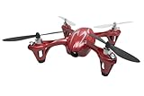

---
categories:
- アニメ
date: Sun, 19 Apr 2015 16:00:40 +0000
slug: post-7634
tags:
- サイコパス
- 攻殻機動隊
title: 攻殻機動隊とかサイコパスとかのアニメに出てくるドローンとかサイボーグ技術とかのテクノロジーが実現可能なのか調べてみた
---

攻殻機動隊のARISEがテレビで放送開始しましたね。そこで、ふと登場するテクノロジーが今現在の技術で実現可能なのか、はたまた将来的に実現する見込みがあるのか調べてみました。<!--more--><h2>攻殻機動隊</h2>

<table  border="0" cellpadding="5" style="border:none"><tr><td style="border:none;text-align:left"><a href="http://www.amazon.co.jp/exec/obidos/ASIN/B0041FITIA/warawareotoko-22/ref=nosim/" rel="nofollow" target="_blank" target="_top">攻殻機動隊 STAND ALONE COMPLEX Solid State Society [Blu-ray]</a></td></tr><tr><td style="border:none"><table  border="0" cellpadding="0" style="border:none"><tr><td valign="top" style="border:none"></td><td valign="top" style="border:none;text-align:left">
田中敦子 バンダイビジュアル 2010-12-22

売り上げランキング : 17861
<table style="border:none;margin-top:10px"><tr><td style="border:none;text-align:left;">
<a href="http://www.amazon.co.jp/gp/search?keywords=%8DU%8Ak%8B%40%93%AE%91%E0%20STAND%20ALONE%20COMPLEX%20Solid%20State%20Society%20&__mk_ja_JP=%83J%83%5E%83J%83i&tag=warawareotoko-22" rel="nofollow" target="_blank">Amazon</a>

<a href="http://hb.afl.rakuten.co.jp/hgc/0f6e221b.2eb9748a.0f6e221c.35cc1e84/?pc=http%3A%2F%2Fsearch.rakuten.co.jp%2Fsearch%2Fmall%2F%25E6%2594%25BB%25E6%25AE%25BB%25E6%25A9%259F%25E5%258B%2595%25E9%259A%258A%2520STAND%2520ALONE%2520COMPLEX%2520Solid%2520State%2520Society%2520%2F-%2Ff.1-p.1-s.1-sf.0-st.A-v.2%3Fx%3D0%26scid%3Daf_ich_link_urltxt%26m%3Dhttp%3A%2F%2Fm.rakuten.co.jp%2F" rel="nofollow" target="_blank">楽天市場</a>

<a href="http://ck.jp.ap.valuecommerce.com/servlet/referral?sid=3041033&pid=882528283&vc_url=http%3A%2F%2Fsearch.shopping.yahoo.co.jp%2Fsearch%3Fp%3D%25E6%2594%25BB%25E6%25AE%25BB%25E6%25A9%259F%25E5%258B%2595%25E9%259A%258A%2520STAND%2520ALONE%2520COMPLEX%2520Solid%2520State%2520Society%2520" rel="nofollow"  target="_blank">Yahooショッピング</a>

<a href="http://ck.jp.ap.valuecommerce.com/servlet/referral?sid=3041033&pid=882660047&vc_url=http%3A%2F%2Fauctions.search.yahoo.co.jp%2Fsearch%3Fvo%3D%26ve%3D%26auccat%3D0%26aucminprice%3D%26aucmaxprice%3D%26aucmin_bidorbuy_price%3D%26aucmax_bidorbuy_price%3D%26loc_cd%3D0%26abatch%3D0%26istatus%3D0%26filtered%3D1%26ei%3DUTF-8%26tab_ex%3Dcommerce%26va%3D%25E6%2594%25BB%25E6%25AE%25BB%25E6%25A9%259F%25E5%258B%2595%25E9%259A%258A%2520STAND%2520ALONE%2520COMPLEX%2520Solid%2520State%2520Society%2520" rel="nofollow"  target="_blank">ヤフオク!</a>
</td><td style="vertical-align:bottom;padding-left:10px;font-size:x-small;border:none">by <a href="http://kaereba.com" rel="nofollow" target="_blank">カエレバ</a></td></tr></table></td></tr></table></td></tr></table>

<h3>光学迷彩</h3>

すでに光学迷彩としての研究がされています。もっというと攻殻機動隊の光学迷彩から着想を得て、実証しようとしているみたいです。実験用の服装もわざわざ笑い男仕様にしているあたりにオタクさを伺えます。

参考:http://projects.tachilab.org/rpt/

以下は参考ですが、その他にも様々な方法ですでに実用化に向けて実験されているようです。

プリント技術による透明化のようです。
<iframe width="420" height="315" src="https://www.youtube.com/embed/3YO4TTpYg7g" frameborder="0" allowfullscreen></iframe>

映像を映すことで透明風に見せている技術です。
<iframe width="560" height="315" src="https://www.youtube.com/embed/vWtcz9PMFHo" frameborder="0" allowfullscreen></iframe>

またwikipediaによると光学迷彩のアイデアとしてフィクション内で使われているものは4つくらいに大別されるようです。

映像投影型（カメレオン型）
光の透過・回折型（迂回型）
空間歪曲型
電磁波吸収型

参考:<a href="http://ja.wikipedia.org/wiki/%E5%85%89%E5%AD%A6%E8%BF%B7%E5%BD%A9">光学迷彩のアイデア（wikipedia）</a>

<h3>義体化</h3>

<strong>筋電義手</strong>
脳からの電気信号を受け取って義手を動かす筋電義手というものらしいです。
<iframe width="560" height="315" src="https://www.youtube.com/embed/lsoIlbPk6aA" frameborder="0" allowfullscreen></iframe>

<strong>パワードスーツ</strong>
アメリカの航空機・宇宙船の開発製造会社であるロッキード・マーティン社が開発した「HULC」というパワードスーツです。HULC とはHuman Universal Load Carrierの略です。ハルクとでも読ませる気かな？燃料電池バックパック、モーターを搭載。本体重量約24kg。
<iframe width="560" height="315" src="https://www.youtube.com/embed/y1CeBOWm67A" frameborder="0" allowfullscreen></iframe>

新しい技術は戦場から発達する場合が多いです。そこで実用性が実証されたのちに医療分野で応用され、それを一般消費者向けに提供して初めてイノベーションとして日常的なものになります。

一般人が利用するには、まだまだ時間がかかりそうな気もしますがやがて義体化が一般化する時代もそう夢ではなさそうです。

<h3>電脳</h3>

単純に脳と脳をネットでつなぐという実験は成功しているようです。
参考:<a href="http://www.nicolelislab.net/?p=369">FIRST BRAIN-TO-BRAIN INTERFACE ALLOWS TRANSMISSION OF TACTILE AND MOTOR INFORMATION BETWEEN RATS</a>

<iframe width="560" height="315" src="https://www.youtube.com/embed/nNuntbrwXsM" frameborder="0" allowfullscreen></iframe>

また電脳化とは少し違うかもしれませんが、ブレインマシンインターフェース（BMI）という技術があります。簡単にいうと我々は、テレビのスイッチを切る・エアコンの電源を切るといった「動作」で電子機器に対して指示を出していますが、脳から直接電子機器などに指示を出すことができるというものです。

要は考えたことを動作に移さずにそのまま実行できるというものです。後述しますが、シビュライステムにおいても関係してくる実験が行われているようです。

この技術はそれこそ全身義体化した際に、身体中の機械を動かすために応用されるでしょう。

<h2>PSYCHO-PASS サイコパス</h2>

参考:<a href="https://www.warawareotoko.com/2015/01/11/post-6961/">【ネタバレあり】劇場版PSYCHO-PASS（サイコパス）あらすじと感想</a>

<table  border="0" cellpadding="5" style="border:none"><tr><td style="border:none;text-align:left"><a href="http://www.amazon.co.jp/exec/obidos/ASIN/B00UKQ2SZ4/warawareotoko-22/ref=nosim/" rel="nofollow" target="_blank" target="_top">劇場版 PSYCHO-PASS サイコパス Blu-ray Premium Edition</a></td></tr><tr><td style="border:none"><table  border="0" cellpadding="0" style="border:none"><tr><td valign="top" style="border:none"></td><td valign="top" style="border:none;text-align:left">
花澤香菜 東宝 2015-07-15

売り上げランキング : 63
<table style="border:none;margin-top:10px"><tr><td style="border:none;text-align:left;">
<a href="http://www.amazon.co.jp/gp/search?keywords=%83T%83C%83R%83p%83X&__mk_ja_JP=%83J%83%5E%83J%83i&tag=warawareotoko-22" rel="nofollow" target="_blank">Amazon</a>

<a href="http://hb.afl.rakuten.co.jp/hgc/0f6e221b.2eb9748a.0f6e221c.35cc1e84/?pc=http%3A%2F%2Fsearch.rakuten.co.jp%2Fsearch%2Fmall%2F%25E3%2582%25B5%25E3%2582%25A4%25E3%2582%25B3%25E3%2583%2591%25E3%2582%25B9%2F-%2Ff.1-p.1-s.1-sf.0-st.A-v.2%3Fx%3D0%26scid%3Daf_ich_link_urltxt%26m%3Dhttp%3A%2F%2Fm.rakuten.co.jp%2F" rel="nofollow" target="_blank">楽天市場</a>

<a href="http://ck.jp.ap.valuecommerce.com/servlet/referral?sid=3041033&pid=882528283&vc_url=http%3A%2F%2Fsearch.shopping.yahoo.co.jp%2Fsearch%3Fp%3D%25E3%2582%25B5%25E3%2582%25A4%25E3%2582%25B3%25E3%2583%2591%25E3%2582%25B9" rel="nofollow"  target="_blank">Yahooショッピング</a>

<a href="http://ck.jp.ap.valuecommerce.com/servlet/referral?sid=3041033&pid=882660047&vc_url=http%3A%2F%2Fauctions.search.yahoo.co.jp%2Fsearch%3Fvo%3D%26ve%3D%26auccat%3D0%26aucminprice%3D%26aucmaxprice%3D%26aucmin_bidorbuy_price%3D%26aucmax_bidorbuy_price%3D%26loc_cd%3D0%26abatch%3D0%26istatus%3D0%26filtered%3D1%26ei%3DUTF-8%26tab_ex%3Dcommerce%26va%3D%25E3%2582%25B5%25E3%2582%25A4%25E3%2582%25B3%25E3%2583%2591%25E3%2582%25B9" rel="nofollow"  target="_blank">ヤフオク!</a>
</td><td style="vertical-align:bottom;padding-left:10px;font-size:x-small;border:none">by <a href="http://kaereba.com" rel="nofollow" target="_blank">カエレバ</a></td></tr></table></td></tr></table></td></tr></table>

<h3>シビュラシステム（サイマティックスキャン）</h3>

<strong>赤外分光脳計測（near-infrared spectroscopy; NIRS）</strong>
脳みそに何らかの機械をつなげたりすることなく、皮膚の上から近赤外光を当てることで脳内血流などを計測する脳活動計測法です。

シビュラシステムも非接触・非侵入で人の心を読み取り、数値化する技術です。自分が気がつかないうちに、自分の心を読み取られるという点において近しいものがあります。

また、一般家庭にブレインマシンインターフェースを適用する研究もあり、脳内情報を読み取りそれに応じて温度の管理や電気の管理などを自由にできるようにするというものだそうです。こうなるとそれを小型化して該当スキャンやドミネーターの様な銃に実装することで大規模小規模な脳内情報読取装置を設置することも可能でしょう。

参考:<a href="http://www.ntt.co.jp/news2014/1412/141204a.html">日常生活の支援を可能とするネットワーク型ブレイン・マシン・インタフェース（BMI）の技術開発に成功～脳を見まもる生活環境支援の実現～</a>

<strong>指向性音声</strong>
ドミネーターの所持を許可された者にしか聞こえないガイド音声ですが、これに関しては現在の技術ですでに近しいものがあります。特定の範囲にのみ流せる音響システムがあります。特定のガイド音や、駅ホーム・エスカレーター・階段等で危険をお知らせするために利用されていたりするようです。

参考:<a href="http://www.mee.co.jp/sales/acoustics/kokodake/">http://www.mee.co.jp/sales/acoustics/kokodake/</a>

<h3>3Dホログラム</h3>

劇中では、服装をオフィス用と私服を一瞬で切り替えたり、部屋の内装を一瞬で変えたりしていますがこちらも現在少しづつ発展しています。
それがプロジェクションマッピングです。

<iframe width="560" height="315" src="https://www.youtube.com/embed/xHsbdq8GtKc" frameborder="0" allowfullscreen></iframe>

そしてこちらが人間の体に応用したものです。
<iframe src="https://player.vimeo.com/video/103425574?color=cfcaca&portrait=0&badge=0" width="500" height="281" frameborder="0" webkitallowfullscreen mozallowfullscreen allowfullscreen></iframe> 
<a href="https://vimeo.com/103425574">OMOTE / REAL-TIME FACE TRACKING &amp; PROJECTION MAPPING</a> from <a href="https://vimeo.com/nobumichiasai">nobumichi asai</a> on <a href="https://vimeo.com">Vimeo</a>.

動きがあるものに対してリアルタイムでホログラムを投影することができれば、サイコパスのように服装にも転用が可能かと思われます。

ただ現状立体構造のものに対して映像で3Dぽく映しているだけで、あくまで平面なのが現状の限界のようです。立体構造のものに3Dで映像を投影できるようになれば色々と応用はできそうです。

<h3>ドローン</h3>

これは正直すでに実用化されていますし、一般家庭においても利用できるものです。というかAmazonで売っています。

<table  border="0" cellpadding="5" style="border:none"><tr><td style="border:none;text-align:left"><a href="http://www.amazon.co.jp/exec/obidos/ASIN/B00I3SCHBQ/warawareotoko-22/ref=nosim/" rel="nofollow" target="_blank" target="_top">Hubsan X4 HD (ワインレッド) H107C-1</a></td></tr><tr><td style="border:none"><table  border="0" cellpadding="0" style="border:none"><tr><td valign="top" style="border:none"></td><td valign="top" style="border:none;text-align:left">
 ジーフォース 

売り上げランキング : 134
<table style="border:none;margin-top:10px"><tr><td style="border:none;text-align:left;">
<a href="http://www.amazon.co.jp/gp/search?keywords=Hubsan%20X4%20HD%20%28%83%8F%83C%83%93%83%8C%83b%83h%29%20H107C-1&__mk_ja_JP=%83J%83%5E%83J%83i&tag=warawareotoko-22" rel="nofollow" target="_blank">Amazon</a>

<a href="http://hb.afl.rakuten.co.jp/hgc/0f6e221b.2eb9748a.0f6e221c.35cc1e84/?pc=http%3A%2F%2Fsearch.rakuten.co.jp%2Fsearch%2Fmall%2FHubsan%2520X4%2520HD%2520%2528%25E3%2583%25AF%25E3%2582%25A4%25E3%2583%25B3%25E3%2583%25AC%25E3%2583%2583%25E3%2583%2589%2529%2520H107C-1%2F-%2Ff.1-p.1-s.1-sf.0-st.A-v.2%3Fx%3D0%26scid%3Daf_ich_link_urltxt%26m%3Dhttp%3A%2F%2Fm.rakuten.co.jp%2F" rel="nofollow" target="_blank">楽天市場</a>

<a href="http://ck.jp.ap.valuecommerce.com/servlet/referral?sid=3041033&pid=882528283&vc_url=http%3A%2F%2Fsearch.shopping.yahoo.co.jp%2Fsearch%3Fp%3DHubsan%2520X4%2520HD%2520%2528%25E3%2583%25AF%25E3%2582%25A4%25E3%2583%25B3%25E3%2583%25AC%25E3%2583%2583%25E3%2583%2589%2529%2520H107C-1" rel="nofollow"  target="_blank">Yahooショッピング</a>

<a href="http://ck.jp.ap.valuecommerce.com/servlet/referral?sid=3041033&pid=882660047&vc_url=http%3A%2F%2Fauctions.search.yahoo.co.jp%2Fsearch%3Fvo%3D%26ve%3D%26auccat%3D0%26aucminprice%3D%26aucmaxprice%3D%26aucmin_bidorbuy_price%3D%26aucmax_bidorbuy_price%3D%26loc_cd%3D0%26abatch%3D0%26istatus%3D0%26filtered%3D1%26ei%3DUTF-8%26tab_ex%3Dcommerce%26va%3DHubsan%2520X4%2520HD%2520%2528%25E3%2583%25AF%25E3%2582%25A4%25E3%2583%25B3%25E3%2583%25AC%25E3%2583%2583%25E3%2583%2589%2529%2520H107C-1" rel="nofollow"  target="_blank">ヤフオク!</a>
</td><td style="vertical-align:bottom;padding-left:10px;font-size:x-small;border:none">by <a href="http://kaereba.com" rel="nofollow" target="_blank">カエレバ</a></td></tr></table></td></tr></table></td></tr></table>

ドローンの定義ですが、本来は無人の航空機のことを指すようです。ただ、現在は無人機やラジコンに対しても用いられるようになっているみたいです。それだけ一般的になっているということでしょう。

それと同時に様々な問題も起きているようです。例えば、重要施設に対して、ドローンが接近したり、市街地で飛ばす人がいたりで墜落による事故などの危険やその他テロにも使用される恐れがあります。

あと、Amazonもドローンを用いた配送の実験を行ったりしているようです。

どちらにしろ、この分野は今後急速に発展すると同時に、法整備も迅速に行われるでしょう。

<h2><a href="https://twitter.com/s_s_p_y" target="_blank">しんぺー</a> はこう思った。</h2>

調べてみると、色々とすでに実用段階まできているものが多いみたいですね。

どちらにしろそれぞれの劇中では、技術がもたらした明るい進歩以外にも様々な問題に対しても描かれています。

おそらくその問題たちも技術の実現とともに具体化されてくるんでしょうね。それをどう回避していくのか！人類よ！

と言ったところで本日は以上になります。おやすみなさい。