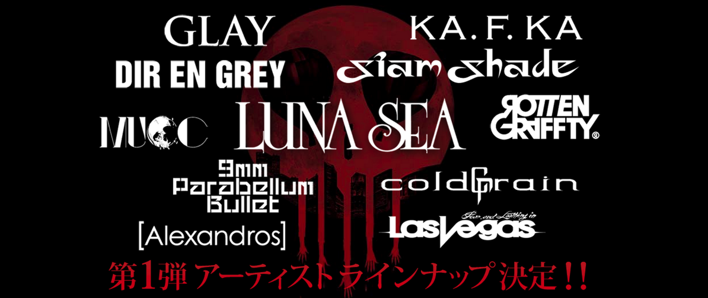

---
categories:
- LUNATIC FEST.
date: Sat, 02 May 2015 16:00:11 +0000
slug: post-7719
tags:
- LUNATIC FEST
title: '【LUNATIC FEST.】LUNA SEA主催の #ルナフェス とは？日程は？チケット代は？参加メンバーは？'
---

先日参戦バンドの第一弾が発表されました。予想通り、というかなんかそんなもん通り越してヤバそうでした。ということで改めてルナフェスって何なのよ？という人のためにまとめておきたいと思います。<!--more-->ハローしんぺー(<a href="https://twitter.com/s_s_p_y" target="_blank">@s_s_p_y</a> )です。
オフィより詳しくて、wikiよりも有用なsukekiyo情報サイト「Gadget Zombie Parasite(ガジェットゾンビィパラサイト)」へようこそ。

<h2>ルナフェスとは？</h2>

ルナフェスとはLUNA SEAが6月に幕張メッセにて主催するフェス「LUNATIC FEST.」のことを指します。（OPEN 9:30　START 11:00　END 20:00予定）

突然の開催告知から数回に分けて情報が解禁され、その度に大きな反響がありました。LUNA SEAといえばX JAPANの流れを組み、ビジュアル系を一般層や主婦層にまで広げた伝説的なバンドです。さらに、後世に置いても多くのバンドに影響を与えました。

そのLUNA SEAが主催するフェスとあっては、参戦バンドが豪華であるという予想は難しくありません。

参考：<a href="http://lunaticfest.com">LUNATIC FEST. official saite</a>

<h2>ルナフェス参戦バンド</h2>

現時点ではまだ第一弾のラインナップしか発表されていませんが、名だたる人気バンドが列挙されております。

<ul>
	<li>LUNA SEA</li>
	<li>[Alexandros]</li>
	<li>KA.F.KA</li>
	<li>9mm Parabellum Bullet</li>
	<li>GLAY</li>
	<li>coldrain</li>
	<li>SIAM SHADE</li>
	<li>DIR EN GREY</li>
	<li>Fear, and Loathing in Las Vegas</li>
	<li>MUCC</li>
	<li>ROTTENGRAFFTY</li>
</ul>

参戦枠としてはLUNA SEAの2枠以外では22枠あります。今回の発表がLUNA SEAを入れて11バンドでしたので、残り11バンドが参戦する予定です。

大御所でいいますとXやラルク、黒夢などがまだ可能性として考えられます。

参考：<a href="https://www.warawareotoko.com/2015/03/16/post-7393/">奇跡の狂演「LUNATIC FEST」に参戦希望バンドのスケジュール調べてみた #ルナフェス</a>

<h2>ルナフェスのチケット代は？</h2>

一般的なフェスと同等の価格の15,500円です。

少し高いか？と思われるかもしれませんが、これだけのメンツを一気に見られるチャンスだとすると決して高いとは言えないでしょう。ステージングにもよりますが、一番度づつ順番に演奏するのであればかなりお得な値段設定と言っても過言ではありません。

一般販売は以下より

<a href="http://click.linksynergy.com/fs-bin/click?id=x1UgY2pYB6o&offerid=292260.10000001&type=3&subid=0" >チケットぴあ</a>

ローチケ.com

<a href="http://eplus.jp/sys/main.jsp">e+（イープラス）</a>

<a href="http://www.cnplayguide.com/">CNプレイガイド</a>

<h2><a href="https://twitter.com/s_s_p_y" target="_blank">しんぺー</a> はこう思った。</h2>

参戦バンドの予想に関してはDIR EN GREYを抜かせばシャムシェイドがあたりました。やはりLUNA SEAの直下の後輩ですので、出ないわけにはいかないでしょう。各バンドがそれぞれカバーなんかする展開も期待できるかもしれません。

その場合、DIR EN GREYはどの曲をカバーするのか。。

と言ったところで本日は以上になります。おやすみなさい。