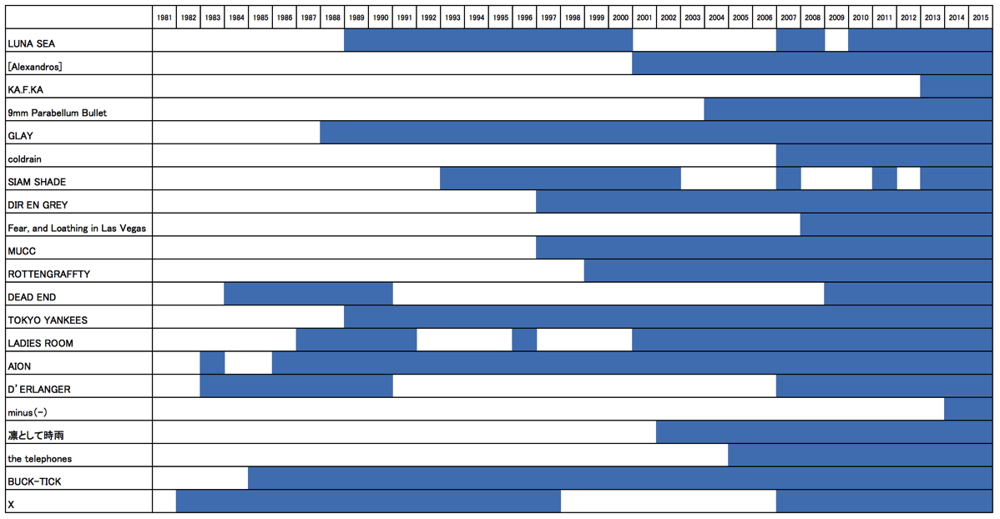

---
categories:
- LUNATIC FEST.
date: Sat, 09 May 2015 16:00:00 +0000
slug: post-7767
tags:
- LUNATIC FEST
- ルナフェス
title: '【LUNATIC FEST.】参戦バンドの活動歴の長さを比較してみた #ルナフェス'
---

さて、来週には第３弾アーティストの発表があります。参戦バンド数は23で、今のところ17発表されていますので、残り6バンドですね。参戦バンドを一通り調べてみて、気になったのでちょっと経歴を並べてみました。<!--more--><h2>ルナフェス参戦バンドの経歴表から予想するオーディエンスの年代</h2>

だいたい音楽を聞き出すのって小学校高学年から中学生くらいだと思います。

とすると…
2015　ー　デビュー年　+ 12  ＝　ざっくりファン年代

DEAD END、デランジェ、AIONファン層　40代〜
LUNA SEA、GLAYファン層　30代〜40代
DIR EN GREY、ムック、ロットンファン層　20代後半〜30代中盤
9mm、coldrain、ラスベガスファン層　20代

これ、だいたいあってると思います。どうですか？？自分の年代とだいたいあってるんじゃないですか？？

<h2><a href="https://twitter.com/s_s_p_y" target="_blank">しんぺー</a> はこう思った。</h2>

これ、なんでこんなこと思いついたかというと第２弾発表時にこんな印象をもったからです。

<blockquote>
第２弾発表されまして、完全にわかりました。これは往年の武闘派バンギャと、2000年前後からバンギャになった人たち、そしてキッズたちという全くの異質なファンが交錯する「オナジヨウナイロ」をした完全なるカオスを起こそうとしてるんだと思います。
Vと非Vかと思ってましたが、そんな生易しいものではありませんでした。
</blockquote>

勝手な印象ですが、LUNA SEAあたりのバンギャって、特攻服に竹刀・木刀のイメージがあるんですよね。あとマスク。要は暴力と音楽の境界が曖昧な時代というと言い過ぎだけど、なんか反抗の象徴としての音楽が確立されていた時代ってのがあったと思うんですが、それが80年代90年代中盤までだったんじゃないのかなと思うんですよね。

でLIVEやら音楽から「牙」がなくなっていったのが90年代後半だと思います。その要因の一つにはPIERROTとDIRのファン同士の幻想的思想抗争があったと思うんです。ファン同士の自重やPIERROT側からのマナーに関してのアナウンスとか、hideの死とか、あとはビジュアル系バンドがオリコンから消えてきた時代。そのあたりから急速に「牙」がなくなったと思います。もちろん、音楽面での変遷が一番の原因だとは思います。より人間の内面に重きを置いた歌詞やバンドが多くなり、自虐的自称的内罰的な風潮が高まっていったのではないかと思います。

そして、21世紀。ネットの普及（昔はネットってなかったんだからな）、スマホの普及、SNSの普及などなど
多様化する価値観の中で様々な音楽が生まれ、そして復活しています。

だから「ナニ」という結論は現時点ではないんですけど、とにかく、ルナフェスではそんな「ナニ」かが起こる気がします。

と言ったところで本日は以上になります。おやすみなさい。