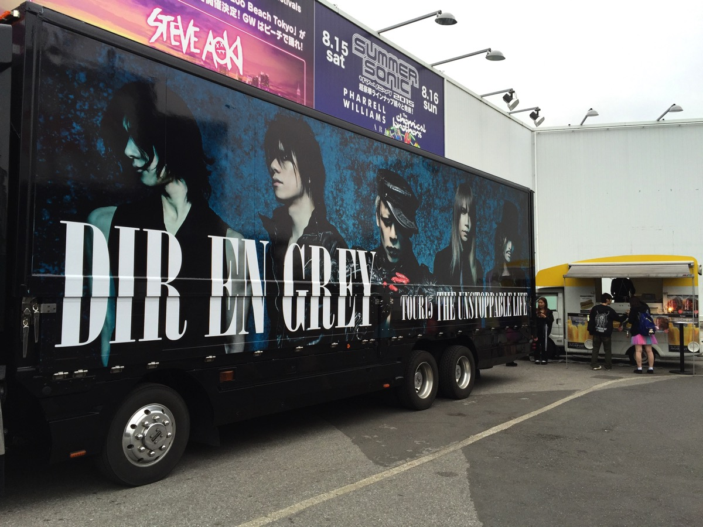
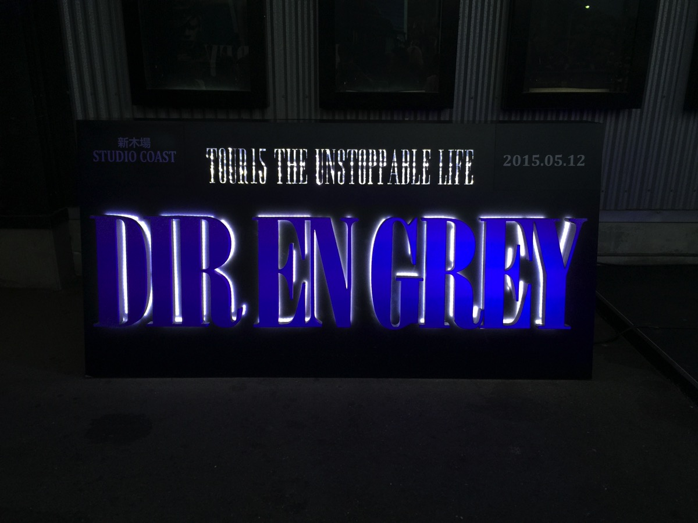

---
categories:
- DIR EN GREYのLIVEレポ
- TOUR15 THE UNSTOPPABLE LIFE
date: Tue, 12 May 2015 06:00:22 +0000
slug: post-7784
tags:
- DIR EN GREY
- LIVEレポ
title: 【ライブレポ】DIR EN GREY TOUR2015 THE UNSTOPPABLE LIFE 2015_5_12@新木場スタジオコースト
---

ついに終わりました「THE UNSTOPPABLE LIFE」
これで、上半期の国内ツアーは終了。と同時に昨年冬から始まったARCHEのツアーも前半戦終了。これからメンバーは海外ツアーへと向かい、6月はLUNATIC FESTへの参戦が発表されています。さらに京はsukekiyoのLIVEもあります。
少しだけ体調が心配です。<!--more-->ハローしんぺー(<a href="https://twitter.com/s_s_p_y" target="_blank" rel="noopener noreferrer">@s_s_p_y</a> )です。
オフィより詳しくて、wikiよりも有用なsukekiyo情報サイト「Gadget Zombie Parasite(ガジェットゾンビィパラサイト)」へようこそ。

<h2>物販の列と台風</h2>

なんと開始数分で限定Tシャツ売り切れ

その後、S、L、Mと全てのTシャツが売り切れ。。買おうと思ったのに。

https://twitter.com/s_s_p_y/status/598026061096493056

ちなみにLIVE始まるまで雨降らず。
LIVE終わったらザーザー

<h2>セトリ</h2>

咀嚼
Chain repulsion
the inferno
Sustain the untruth
朦朧
懐春
禍夜想
濤声
Phenomenon
輪郭
Behind a vacant imege
Cause of fickleness
鱗
激しさとこの胸の中で絡みついた灼熱の闇

EN.
腐海
REDSOIL
Revelation of mankind
Un deux
羅刹国

<h2>LIVEの様子</h2>

ぼくは上手の住人なんですが、個人的にど上手が久しぶりでしたので、主にDieを見ておりました。すると自動的に薫が全く見えなくなるわけですが、今日は3回ほど見かけましたよ←

本日はDieのDJプレイはありませんでした。また前半で衣装が一度プレイの邪魔をしたのを鬱陶しそうに振り払ってました。確か、この手の長めの衣装は毎回鬱陶しそうですが、さすがにツアーファイナルということもあってか、衣装を完全に支配してました。（どんな感想）終始笑顔でとても楽しそうでした。

Toshiyaは目の周り真っ黒で、白いノースリーブに蝶ネクタイのようなタイをつけていました。薫も目の周りが黒く、たれ目に見えるようなメイクをしていました。
ということで全員メイクをしていたと思われます。

<h2>京のMC</h2>

餌まきの時に京がどこにいたのか見えませんでした。もしかしたらずっとドラム脇に座ってたのか、倒れていたのか。全員が捌けるとすっと現れて言いました。少し聞き取れなかったけどなんとなく要約すると

「このツアー全会場で120%でやろうとしてたけど、今日くらいしかできなくて、、、

次のツアーはできるようにしたい

だから、お前らもそのつもりで来てください。

それまでお前らも生きているように！」

<strong>そうか、そういうことか、これこそアンストッパブルライフ！！</strong>

そして、復活後の渋谷公会堂から、昨年の武道館でのDUM SPIRO SPEROをピークにDIR EN GREYの表現は最高を極めたかに思っていました。だから、sukekiyoを結成し、別の方向性を模索している・・・そんな風に思っていました。しかしながら、全然全くそんなことがないということがわかりました。

バンドと虜が一次元押し上げられた様な感覚

自らあげたレベルとハードルを、血みどろになりながら超え続ける、それがDIR EN GREYというバンドでした。秋のツアーでもきっと見たことのない景色へと連れてってくれる、そう確信しました。

<h2><a href="https://twitter.com/s_s_p_y" target="_blank" rel="noopener noreferrer">しんぺー</a> はこう思った。</h2>

腐海激闇輪廓で泣きました。そして終わってみると全開放全放心

最初、新木場なのに柵が設けられていて少し不満に思っていました。柵がないオープンかつ怒涛の押しおそが新木場の真骨頂。でも違っていました。柵は危険回避のためなのか、より密度をあげるための仕掛けだったのかわかりません。運ばれてった人も数名いたみたいですし。それくらい激しいLIVEになりました。

下半身への疲労がハンパない。明日以降襲う首への痛みがもうわかる。

そんな素晴らしいLIVEでした。

と言ったところで本日は以上になります。おやすみなさい。