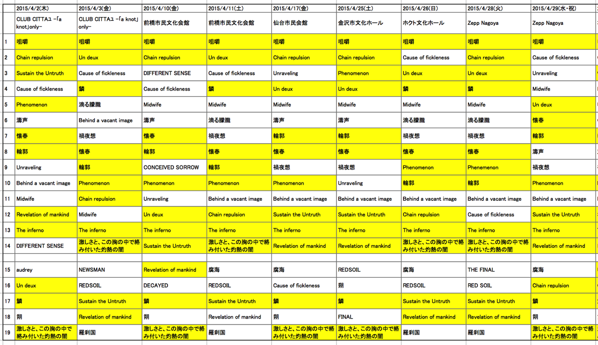
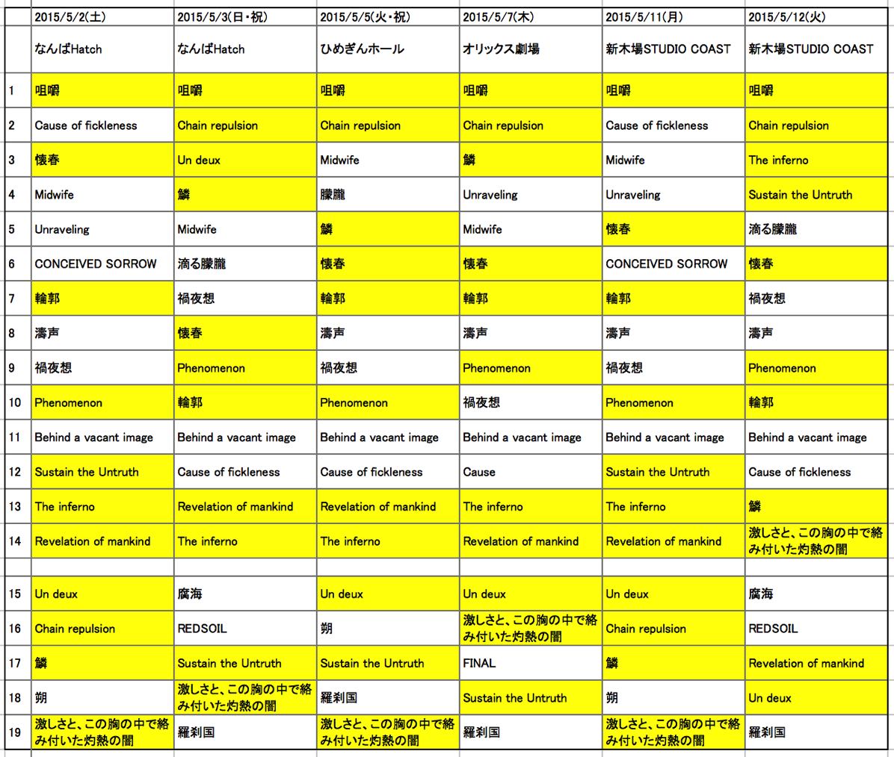

---
categories:
- DIR EN GREY
date: Sun, 17 May 2015 16:00:34 +0000
slug: post-7814
tags:
- DIR EN GREY
title: 【DIR EN GREY】「THE UNSTOPPABLE LIFE」全セトリ
---

ツアー終了して数日が経ちます。メンバーはすでに今ツアー海外公演最初の地であるBELARUS MINSKにおります。そんな中今回のツアーのセトリから各曲の演奏回数を見直してみました。<!--more-->ハローしんぺー(<a href="https://twitter.com/s_s_p_y" target="_blank">@s_s_p_y</a> )です。
オフィより詳しくて、wikiよりも有用なsukekiyo情報サイト「Gadget Zombie Parasite(ガジェットゾンビィパラサイト)」へようこそ。

<h2>THE UNSTOPPABLE LIFE全セットリスト</h2>

今回の国内ツアーは全部で15箇所でした。
各会場のセトリはこちら。（※間違ってたらご指摘ください。）

色がついている曲は全日程で演奏したものです。

これを見る限り咀嚼始まりで、Un duexかChain repulsionパターンのようですね。後半になると少しずつバリエーションが増えていきました。

またアルバム収録曲以外ですと激しさと、この胸の中で絡み付いた灼熱の闇は必ず演奏しているようですね。そろそろ、これに変わる暴れ曲があってもいい気がします。とはいえ、DIR EN GREYのLIVEと言えばこの曲というくらい定番化していますよね。

それと今回、アンコール１曲目で腐海が入ってきている日が多かったみたいですね。個人的には歌詩変えバージョンの方が好きです。
あれで歌われてたらボロ泣きでしたでしょう。とは言え、最終日で泣いてましたけどw

それと今回全日程で19曲ぴったりで収めてきております。また他のアルバムからの曲がほぼなしというのも興味深いかなと個人的に思います。DUMの世界観はやはり終焉し、新しいところへ向かっているのかなという感じです。
さらに薫も言っていましたが、これからが予想不能になるようなツアーだったと思います。今回、2日連続で参戦することがなかったので、続けてみた場合の見え方の違いがどんなだったのか気になります。

とくにファイナルとその前日とでどんな感じだったかが気になります。京曰く、120%を目指して毎日やってきたけど、ファイナルくらいしかそれができなかったとのことですが、どんな感じだったのでしょう。

また、今回のツアーは京の調子も最高というわけにはいかない時が多かったみたいです。そして、そんな中で間髪入れずに海外ツアーということなので、体調がかなり気になります。

また、かなり前から心配されていた薫の右手の具合も気になるところです。

参考：<a href="https://www.warawareotoko.com/2015/04/02/post-7466/">【LIVEレポ】DIR EN GREY TOU2015 THE UNSTOPPABLE LIFE@CLUB CHITTA-a knot only-</a>

海外でも、ほぼ毎日LIVEです。というか日本よりも過密スケジュールです。さらにツアーが終わってもフェスがあり、帰国したらしたでsukekiyoだったりLUNATIC FEST.だったりするのでちょっと休む暇が全くなさそうです。

 2015/5/17(日) BELARUS MINSK RE:PUBLIC
 2015/5/18(月) POLAND WARSAW PROGRESJA MUSIC ZONE
 2015/5/20(水) GERMANY BERLIN Astra Kulturhaus
 2015/5/21(木) GERMANY DORTMUND FZW
 2015/5/23(土) ENGLAND LONDON O2 Academy Islington
 2015/5/24(日) ENGLAND LONDON O2 Academy Islington
 2015/5/26(火) FRANCE PARIS Le Bataclan
 2015/5/27(水) HOLLAND EINDHOVEN Effenaar

参考：<a href="https://www.warawareotoko.com/2015/02/23/post-7217/#DER_RING">「TOUR15 THE UNSTOPPABLE LIFE」各会場まとめ</a>

そうえいば、先日地上波で放送されておりましたBREAK OUTにて薫が２､３年先のスケジュールまでほぼ決まっていると言っておりました。本当にUNSTOPPABLE DIR EN GREYです。

それと気になる情報が...

<blockquote class="twitter-tweet" lang="ja">
そしてもう一方電話ゲストで出演して頂きました。&#10;高校の先輩DIR EN GREYのDieさん&#10;私の兄を介してお友達になって頂き同郷という事で今回是非番組に出演して頂きたかったので直談判❗️&#10;日本ツアーが終了してレコーディングの忙しい合間に出演して頂きました。ありがとうございました
&mdash; MICHIYO (@officialmichiyo) <a href="https://twitter.com/officialmichiyo/status/598717087754780672">2015, 5月 14</a></blockquote>

先日何の告知なしにいきなりラジオでてたらしいDieですが、何やらレコーディング中らしいwww
次期シングル？？ってかDIRがシングルとかいつぶりですか？？

↓↓↓↓↓↓↓↓

2014年1月のSUSTAIN THE UNTRUTHぶりでしたwww

<h2><a href="https://twitter.com/s_s_p_y" target="_blank">しんぺー</a> はこう思った。</h2>

もうシングルいちいち出さずにミニアルバム→フルアルバムくらいのスパンがいいですな〜

その方がメンバーの体調的にもいいんではないかとも思う。ただ、そうなるとsukekiyoの活動が活発化してきて、休むことを知らないくなっちゃいそうだし、Dieソロも活発化しそうだし

ん〜やっぱりどう転んでもUNSTOPPABLE DIR EN GREYですねw

と言ったところで本日は以上になります。おやすみなさい。