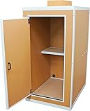

---
categories:
- レビュー
date: Sat, 23 May 2015 16:00:01 +0000
slug: post-7842
tags:
- 調べてみた
- 防音室
title: 防音室というものが気になったので調べてみた
---

ぼくの好きなゲーム実況者の「<a href="https://www.youtube.com/user/ketsugeketsuge">けつ毛中級兵</a>」氏が最近「防音室を借りた」という発言を動画内で繰り返している。これってどういうことだろうって思ってたんだけど、偶然とあるV系バンドの麺（メンバー）が防音室を自作（爆）したというTweetみてこれか！と思って調べましたので、えーっとご紹介します。<!--more-->ハローしんぺー(<a href="https://twitter.com/s_s_p_y" target="_blank" rel="noopener">@s_s_p_y</a> )です。
オフィより詳しくて、wikiよりも有用なsukekiyo情報サイト「Gadget Zombie Parasite(ガジェットゾンビィパラサイト)」へようこそ。
<h2>防音室とは？</h2>
オーディオ鑑賞や楽器の演奏をしても外部に音が漏れない構造になった謝恩設備のある部屋。

しかも、音が内部で綺麗に聞こえる構造になってたりして、音楽を楽しむための工夫がいろいろされているらしいです。
<h2>防音室をいちから自作する驚愕V系バンドメンバーAzlinaのしぐば氏</h2>
おお、インディーズなのに自宅でそんなことできるのかーしかもボーカルだから声ださなきゃいけないのに、そういう部屋に住んでるのかなーとか思ったら。
<blockquote class="twitter-tweet" lang="ja">

今朝まで自宅でレコーディングしてた、、、 おれんち家にスタジオあるから(笑) <a href="http://t.co/2Dy53dGbwE">pic.twitter.com/2Dy53dGbwE</a>

— Azlinaしぐば (@Azlina_sigva) <a href="https://twitter.com/Azlina_sigva/status/601236581794484225">2015, 5月 21</a></blockquote>

ん？CADだと・・・？？
<blockquote class="twitter-tweet" lang="ja">いや、これ手作りだから！！ <a href="https://t.co/AZsKWNOJIX">https://t.co/AZsKWNOJIX</a> まずは、図面(CAD)ひいて、、、、 <a href="http://t.co/qkXpFynaoD">pic.twitter.com/qkXpFynaoD</a>

— Azlinaしぐば (@Azlina_sigva) <a href="https://twitter.com/Azlina_sigva/status/601237865926758401">2015, 5月 21</a></blockquote>

こいつ・・・ガチだwww
<blockquote class="twitter-tweet" lang="ja">

<a href="https://t.co/AZsKWNOJIX">https://t.co/AZsKWNOJIX</a> そして床材組んで、、、 <a href="http://t.co/ZcvlnpvjSw">pic.twitter.com/ZcvlnpvjSw</a>

— Azlinaしぐば (@Azlina_sigva) <a href="https://twitter.com/Azlina_sigva/status/601238604334039041">2015, 5月 21</a></blockquote>

<blockquote class="twitter-tweet" lang="ja"><a href="https://t.co/AZsKWNOJIX">https://t.co/AZsKWNOJIX</a> 目地をコーキングして床完成！ これを部屋に運んで、、、、 pic.twitter.com/jqUpAPPxiE

— Azlinaしぐば (@Azlina_sigva) <a href="https://twitter.com/Azlina_sigva/status/601239255545819136">2015, 5月 21</a></blockquote>

<blockquote class="twitter-tweet" lang="ja">

<a href="https://t.co/AZsKWNOJIX">https://t.co/AZsKWNOJIX</a> そして骨組み、外壁に防音材貼って、、、、 <a href="http://t.co/Q3fHdzubHU">pic.twitter.com/Q3fHdzubHU</a>

— Azlinaしぐば (@Azlina_sigva) <a href="https://twitter.com/Azlina_sigva/status/601239877556961280">2015, 5月 21</a></blockquote>

枠の組み方がプロっぽい
<blockquote class="twitter-tweet" lang="ja"><a href="https://t.co/AZsKWNOJIX">https://t.co/AZsKWNOJIX</a> 外は遮音材 中は吸音材 こうすることで、防音材が成り立つ！ そしてそろそろ仕上げ、、、！ <a href="http://t.co/wDaccCWnQ9">pic.twitter.com/wDaccCWnQ9</a>

— Azlinaしぐば (@Azlina_sigva) <a href="https://twitter.com/Azlina_sigva/status/601240812635049984">2015, 5月 21</a></blockquote>

扉じさく・・・
<blockquote class="twitter-tweet" lang="ja">

<a href="https://t.co/AZsKWNOJIX">https://t.co/AZsKWNOJIX</a> んで、防音扉作って、内張貼って完成！！ pic.twitter.com/zhuwbA2B2f

— Azlinaしぐば (@Azlina_sigva) 2015, 5月 21</blockquote>

<blockquote class="twitter-tweet" lang="ja"><a href="https://t.co/AZsKWNOJIX">https://t.co/AZsKWNOJIX</a> するとこうなります 動画だと分かりづらいけど、爆音もこんだけ遮断されて、夜中叫んでも大丈夫(笑) みなさんぜひ真似して作ってみてね＼(^o^)／ pic.twitter.com/NWgtlFsduH

— Azlinaしぐば (@Azlina_sigva) 2015, 5月 21</blockquote>

Azlina
2014年結成のバンドみたいです。4人組、しぐば(V)、優希（G）、ゆの（G）、智（B）
今の所ドラムいないっぽいです。
<iframe src="https://www.youtube.com/embed/86X1guJVlJg" width="560" height="315" frameborder="0" allowfullscreen="allowfullscreen"></iframe>

ってか今のインディーズのバンドってこんなしっかりしてるんだ。MVもクオリティたけーな。

オフィシャルサイト：http://band.livoon.com/Azlina1/
<h2>防音室の値段</h2>
部屋の構造からしっかりとしたものを「工事」しようとすると100万円以上かかります。しかもドラムとかだともう見積もり額はお問い合わせください状態で、そもそも遮音が難しいみたいなので、床を浮かせる構造にするとか、地下室でやってくださいレベルのようです。あと当たり前ですが広さによって施工費用が変わります。

参考：<a href="http://www.budscene.co.jp/html/price.html">http://www.budscene.co.jp/html/price.html</a>

ただ、最近の「歌ってみた」とかの需要もあるみたいで、簡易的なものですと5万円〜10万程度で買えるみたいです。
<table style="border: none;" border="0" cellpadding="5">
<tbody>
<tr>
<td style="border: none; text-align: left;"><a href="http://www.amazon.co.jp/exec/obidos/ASIN/B00OTI6PZ8/warawareotoko-22/ref=nosim/" target="_top" rel="nofollow">組立式 簡易防音室 だんぼっち</a></td>
</tr>
<tr>
<td style="border: none;">
<table style="border: none;" border="0" cellpadding="0">
<tbody>
<tr>
<td style="border: none;" valign="top"></td>
<td style="border: none; text-align: left;" valign="top">

株式会社VIBE

売り上げランキング : 3083

<table style="border: none; margin-top: 10px;">
<tbody>
<tr>
<td style="border: none; text-align: left;">

<a href="http://www.amazon.co.jp/gp/search?keywords=%82%BE%82%F1%82%DA%82%C1%82%BF&amp;__mk_ja_JP=%83J%83%5E%83J%83i&amp;tag=warawareotoko-22" target="_blank" rel="nofollow noopener">Amazon</a>

<a href="http://hb.afl.rakuten.co.jp/hgc/0f6e221b.2eb9748a.0f6e221c.35cc1e84/?pc=http%3A%2F%2Fsearch.rakuten.co.jp%2Fsearch%2Fmall%2F%25E3%2581%25A0%25E3%2582%2593%25E3%2581%25BC%25E3%2581%25A3%25E3%2581%25A1%2F-%2Ff.1-p.1-s.1-sf.0-st.A-v.2%3Fx%3D0%26scid%3Daf_ich_link_urltxt%26m%3Dhttp%3A%2F%2Fm.rakuten.co.jp%2F" target="_blank" rel="nofollow noopener">楽天市場</a>

<a href="http://ck.jp.ap.valuecommerce.com/servlet/referral?sid=3041033&amp;pid=882528283&amp;vc_url=http%3A%2F%2Fsearch.shopping.yahoo.co.jp%2Fsearch%3Fp%3D%25E3%2581%25A0%25E3%2582%2593%25E3%2581%25BC%25E3%2581%25A3%25E3%2581%25A1" target="_blank" rel="nofollow noopener">Yahooショッピング</a>

<a href="http://ck.jp.ap.valuecommerce.com/servlet/referral?sid=3041033&amp;pid=882660047&amp;vc_url=http%3A%2F%2Fauctions.search.yahoo.co.jp%2Fsearch%3Fvo%3D%26ve%3D%26auccat%3D0%26aucminprice%3D%26aucmaxprice%3D%26aucmin_bidorbuy_price%3D%26aucmax_bidorbuy_price%3D%26loc_cd%3D0%26abatch%3D0%26istatus%3D0%26filtered%3D1%26ei%3DUTF-8%26tab_ex%3Dcommerce%26va%3D%25E3%2581%25A0%25E3%2582%2593%25E3%2581%25BC%25E3%2581%25A3%25E3%2581%25A1" target="_blank" rel="nofollow noopener">ヤフオク!</a>
</td>
<td style="vertical-align: bottom; padding-left: 10px; font-size: x-small; border: none;">by <a href="http://kaereba.com" target="_blank" rel="nofollow noopener">カエレバ</a></td>
</tr>
</tbody>
</table>
&nbsp;</td>
</tr>
</tbody>
</table>
</td>
</tr>
</tbody>
</table>
一人で組み立てること前提になってる！すごい！
<iframe src="https://www.youtube.com/embed/sUhu_QWYvzQ" width="560" height="315" frameborder="0" allowfullscreen="allowfullscreen"></iframe>

参考：<a href="http://www.danbocchi.com/">だんぼっち</a>
<h2>防音室はレンタルもできる</h2>
工事からやってる<a href="http://jp.yamaha.com/products/soundproofing/">YAMAHA</a>さんですが簡易版のレンタルもしているみたいです。
音楽を環境面からサポートしてるんですね。すげー

月額で2万円前後から借りられるみたいです。ただし、先ほどのだんぼっちよりかは少し本格的なので設置するのに業者の手がかかり、なおかつ解体にも費用がかかるみたいです。
<iframe src="https://www.youtube.com/embed/BRy1sKInXBA" width="560" height="315" frameborder="0" allowfullscreen="allowfullscreen"></iframe>

参考：<a href="http://rental.yamahamusicjapan.co.jp/rental/c/c30/">http://rental.yamahamusicjapan.co.jp/rental/c/c30/</a>
<h2>防音室を使うとこうなる</h2>
管理人に怯えながら声を抑えるけつ毛中級兵氏
<iframe src="https://www.youtube.com/embed/V_IkTMxCYlk" width="560" height="315" frameborder="0" allowfullscreen="allowfullscreen"></iframe>

そして防音室を借りた結果wwww
<iframe src="https://www.youtube.com/embed/CpkQnCYs-gI" width="560" height="315" frameborder="0" allowfullscreen="allowfullscreen"></iframe>

うるせーーーwww
<h2><a href="https://twitter.com/s_s_p_y" target="_blank" rel="noopener">しんぺー</a> はこう思った。</h2>
いやーすごいですねw
これを使うことで近所迷惑にもならずに色々と大きな音がだせるようになるんですね。しかも割と高くはない。。さらに賃貸物件でも導入できそう。

いろんなものがあるんですね〜

と言ったところで本日は以上になります。おやすみなさい。