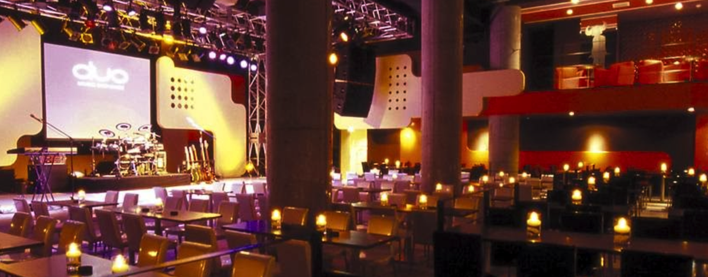

---
categories:
- sukekiyo
date: Tue, 26 May 2015 16:00:40 +0000
slug: post-7858
tags:
- sukekiyo
title: sukekiyo公演で使われる京都MUSEと渋谷duo MUSIC EXCHANGEがどんな感じか調べてみた。行けないけど。。。
---

５月いっぱいは海外公演で大忙しのDIR EN GREYですが、sukekiyoの６月公演も迫ってきています。6/16は京都MUSEにて鳳凰の間、6/19は渋谷duo MUSIC EXCHANGEにて盲目の獣が行われます。ぼくはどちらも行けません。苦渋の決断ですが。。。行きたい。<!--more-->ハローしんぺー(<a href="https://twitter.com/s_s_p_y" target="_blank">@s_s_p_y</a> )です。
オフィより詳しくて、wikiよりも有用なsukekiyo情報サイト「Gadget Zombie Parasite(ガジェットゾンビィパラサイト)」へようこそ。

ということで行けないので会場について調べてみることにします。DIRとかだとあまり使わない会場だと思いますので、名前だけ聞くとどこのことかよくわkりませんでした。

<h2>京都MUSE</h2>

〒600-8006 京都市下京区四条通柳馬場西入 ミューズ389京都
阪急京都線烏丸駅13番出口より、左手3件目すぐ
<a href="http://www.arm-live.com/muse/kyoto/">http://www.arm-live.com/muse/kyoto/</a>
<iframe src="https://www.google.com/maps/embed?pb=!1m19!1m8!1m3!1d3268.1079006550412!2d135.763688!3d35.004004!3m2!1i1024!2i768!4f13.1!4m8!3e6!4m0!4m5!1s0x60010897266d869b%3A0x2a2f837d98779bb0!2z5pel5pysLCDjgJI2MDAtODAwNiDkuqzpg73lupzkuqzpg73luILkuIvkuqzljLrlm5vmnaHpgJrmn7PppqzloLTopb_lhaXnq4vlo7LkuK3kuYvnlLrvvJHvvJDvvJLiiJLvvJMgS1lPVE8gTVVTRQ!3m2!1d35.004004!2d135.763688!5e0!3m2!1sja!2sjp!4v1432651525148" width="600" height="450" frameborder="0" style="border:0"></iframe>

キャパシティは350人とのことです。個人利用できるくらいの広さです。おそらくですが下北沢ガーデンよりも狭いと思われます。鹿鳴館より少し広いくらいかな？？

参考：<a href="https://www.warawareotoko.com/2014/05/21/post-5380/">sukekiyo2014ツアーファイナル「別れを惜しむフリは貴方の為-漆黒の儀-」@下北沢GARDEN</a>

内装はこんな感じです。
<iframe src="https://www.google.com/maps/embed?pb=!1m0!3m2!1sja!2sjp!4v1432651431457!6m8!1m7!1spl8vzHB3ZkxEJRBIA3rttQ!2m2!1d35.003969!2d135.763668!3f262.8324633431085!4f3.6730205278592223!5f0.4000000000000002" width="600" height="450" frameborder="0" style="border:0"></iframe>

<h2>渋谷duo MUSIC EXCHANGE</h2>

〒150-0043　東京都渋谷区道玄坂2-14-8 O-EASTビル 1F
<a href="http://www.duomusicexchange.com/">http://www.duomusicexchange.com/</a>

<iframe src="https://www.google.com/maps/embed?pb=!1m14!1m8!1m3!1d3241.7417840263984!2d139.69558759999998!3d35.658733!3m2!1i1024!2i768!4f13.1!3m3!1m2!1s0x60188caa1779185b%3A0xd1a7fb9327ed7f8b!2z44CSMTUwLTAwNDMg5p2x5Lqs6YO95riL6LC35Yy66YGT546E5Z2C77yS5LiB55uu77yR77yU4oiS77yY!5e0!3m2!1sja!2sjp!4v1432651745568" width="600" height="450" frameborder="0" style="border:0"></iframe>

キャパシティは700人とのこと。<a href="http://ja.wikipedia.org/wiki/Shibuya_O-EAST#DUO_MUSIC_EXCHANGE">ジャミロクワイがプロデュースした</a>ライブハウスらしい。

<h2><a href="https://twitter.com/s_s_p_y" target="_blank">しんぺー</a> はこう思った。</h2>

何気に鳳凰の間系は皆勤賞だったんですが、今回は苦渋の決断！

チャンスあればいきたいけど。。。
それと・・

<blockquote class="twitter-tweet" lang="ja">
上映会あたったー(￣O￣;)
&mdash; しんぺー@ルナフェス初日参戦 (@s_s_p_y) <a href="https://twitter.com/s_s_p_y/status/603131511072686080">2015, 5月 26</a></blockquote>

と言ったところで本日は以上になります。おやすみなさい。