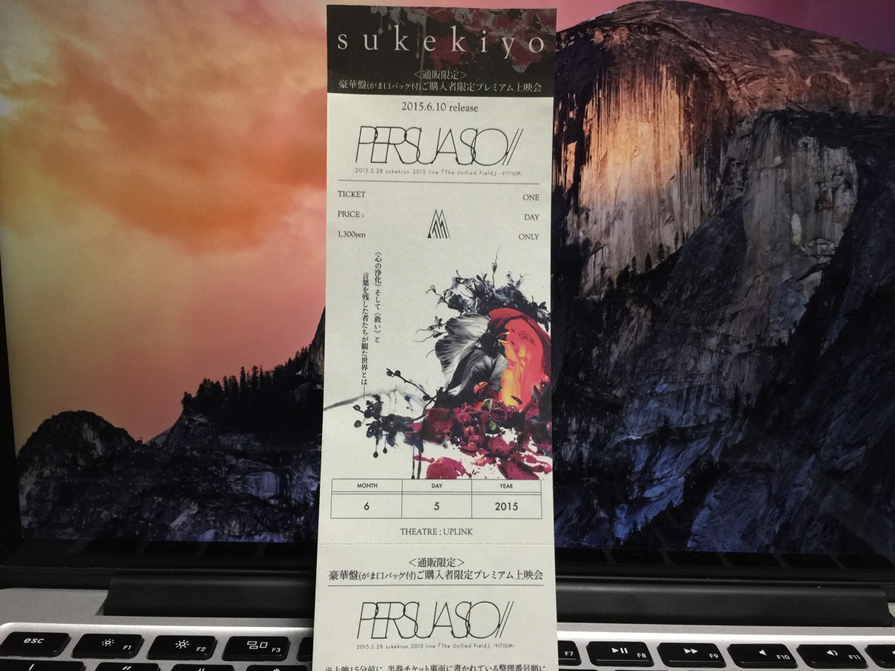
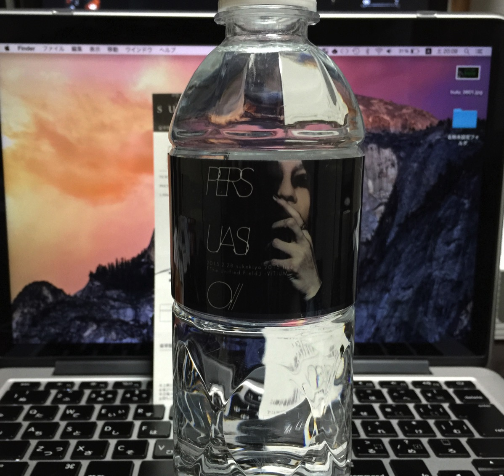

---
categories:
- sukekiyo
date: Sat, 06 Jun 2015 12:16:06 +0000
slug: post-7897
tags:
- sukekiyo
title: 【sukekiyo】豪華版購入者限定上映会行ってきた【PERSUASIO】
---

行ってきました。PERSUASIO豪華版限定の上映会2部に行ってきました！会場は50名入るかどうかくらいの小さなシアターで、メンバーとの距離も近くマイクを使わずとも声が聞こえるくらいの狭さでした。その模様をご紹介します。<!--more-->ハローしんぺー(<a href="https://twitter.com/s_s_p_y" target="_blank">@s_s_p_y</a> )です。
オフィより詳しくて、wikiよりも有用なsukekiyo情報サイト「Gadget Zombie Parasite(ガジェットゾンビィパラサイト)」へようこそ。

<h2>上映会会場の様子</h2>

多分、もうオープンにしてもいいはずですが明言しないでおきますが、sukekiyoにゆかりのある渋谷のミニシアターでした。

チケットを購入すると整理番号が渡されて順番通りに入場。その後は好きな席へ座るという流れでした。

ちなみに1300円の代金を支払って受け取ったチケットはこちら

さらに特典としてペットボトルを手渡されました。

なおペットボトルは2種類のラインナップがあります。

<map id="map_wsuf5az8" name="map_wsuf5az8"><area coords="0,522,398,530" href="http://ameblo.jp/takumixofficial/image-12035378300-13328338226.html" alt="" shape="rect" /></map>
<a href="http://ameblo.jp/takumixofficial/">匠オフィシャルブログ「Takumi's blog」by Ameba</a> via <a href="http://kwout.com/quote/wsuf5az8">kwout</a>

みなさん席につき定刻になるとメンバーがおもむろに入場。ぼくは携帯の電源を切っていて下を向いていたのですが顔を上げると目の前に京さん。。。

息が止まりました。

そしてなんというかお小さ（ry

1部の方は映像→メンバー挨拶だったみたいですが、2部は終わりが遅く京さんが寝る時間遅くなっちゃうからなのかメンバー挨拶→映像の流れでした。

<h2>メンバーの様子</h2>

服装は下記の写真の通り
<blockquote class="twitter-tweet" lang="ja">
今日のアップリンクその１&#10;&#10;sukekiyo:PERSUASIO(6.10release)プレミアム上映会。&#10;&#10;<a href="https://t.co/wHAnPBZBih">https://t.co/wHAnPBZBih</a> <a href="http://t.co/8BBhvbJzor">pic.twitter.com/8BBhvbJzor</a>
&mdash; 浅井隆 ASAI Takashi (@asaitakashi) <a href="https://twitter.com/asaitakashi/status/606823833719341056">2015, 6月 5</a></blockquote>

上手から匠、未架、Yuchi、UTA、京の順番でした。

服装は匠はチェスターコートにカーボーイハット。

未架さんはパーカーかジャケットだったと思います。それとボトムスは多分ジーンズ。

ゆち氏は半袖の上にノースリーブのチョッキ？かな。それにチョーカーをつけてました。

UTAさんは前回の京さんの工場長のような色をしたゆったりしたパーカーにいつものメガネ。髪の毛は少し短く切っていました。

京はツーブロック部分は剃りあげて肌色。白髪に近い金でサラサラヘアー。それと変わった形の高そうなサングラス。ジャケットにふわっとしたスカートみたいなパンツにブーツでした。

<h2>挨拶</h2>

映像前のメンバーのトークは10〜15分程度。3つの質問を司会の匠がメンバー全員に聞いていくというスタイル。ノートの切れ端みたいなカンペをガサゴソとする匠はいつも通りでした。2部なので少し慣れてたのか途中からは見ないでの司会進行。

以下、印象に残ったもの

<blockquote class="twitter-tweet" lang="ja">
本作のディレクター未架さんからの見所の解説。プロモの様に一曲一曲マスクをかけたり、さらに映画の様に上下に帯を入れたりしている。その帯にも仕掛けがある。出来た映像をプロデューサーの京にメールするとリアルタイムで指摘が入り作り上げていった。
&mdash; しんぺー@ルナフェス初日参戦 (@s_s_p_y) <a href="https://twitter.com/s_s_p_y/status/606821918696599552">2015, 6月 5</a></blockquote>

これに対して京がいろいろわがままいって申し訳ないとのことを言っておられました。
後述しますが、この未架さんのいう通り映像の作りがかなり面白い感じになっていました。LIVE映像というよりも映像作品というものにカテゴライズされる仕上がりになっていると思いました。

最後が「今後のsukekiyoは？」という質問だったのですが、なぜか京さんから匠の禁煙の話になり、禁煙できなければ匠はsukekiyoクビという流れに

どうやら1部で京さんは相当いいことを言っていたとのことですが、思い出せないとのことで禁煙の話になったとのことでした。

それ以外にも京さんは終始にこやかで、会場の人一人一人の顔を見てる感じでした。恥ずかしいのか、チラ見でしたけど。

ということで映像がスタート

<h2><a href="https://twitter.com/s_s_p_y" target="_blank">しんぺー</a> はこう思った。</h2>

<blockquote class="twitter-tweet" lang="ja">
感想。LIVE映像というよりも映像作品。LIVE中にバックに流れる映像とLIVEが融合している。
&mdash; しんぺー@ルナフェス初日参戦 (@s_s_p_y) <a href="https://twitter.com/s_s_p_y/status/606822422235381760">2015, 6月 5</a></blockquote>

そういえばすっかり忘れてたけど、調布グリーンホールで芳名帳に記帳したんでした！これは嬉しいサプライズでした〜
<blockquote class="twitter-tweet" lang="ja">
芳名帳に書いたの忘れてた。名前見つけられなかった。
&mdash; しんぺー@ルナフェス初日参戦 (@s_s_p_y) <a href="https://twitter.com/s_s_p_y/status/606810447212244993">2015, 6月 5</a></blockquote>

参考：Yuchiのブログ「<a href="http://ameblo.jp/yuchi-bassist/entry-12035706119.html">プレミアム上映会、ありがとうございました！</a>」

今後のsukekiyoの活動に期待です！

と言ったところで本日は以上になります。おやすみなさい。