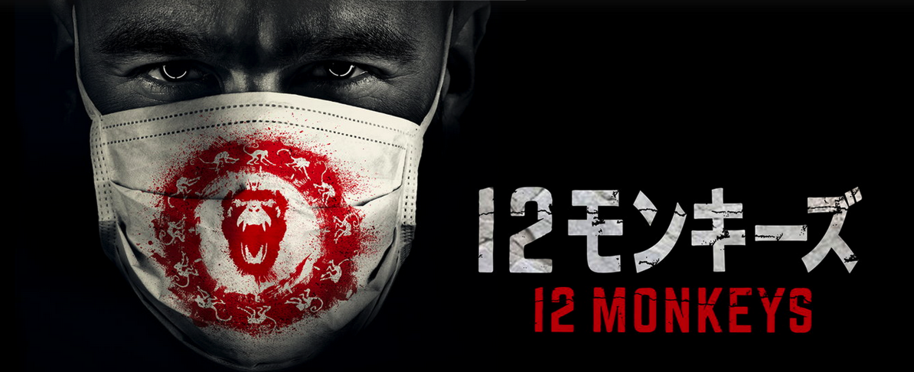
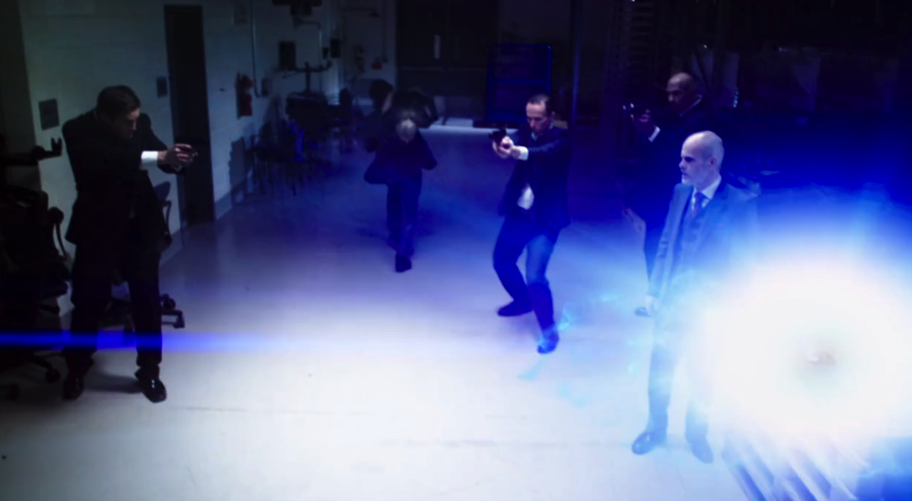
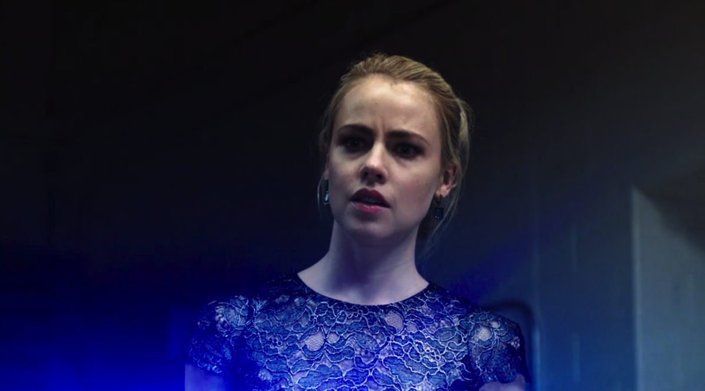

---
categories:
- 海外ドラマ
date: Sun, 07 Jun 2015 14:00:01 +0000
slug: post-7904
tags:
- Hulu
title: 【hulu】「12モンキーズ」面白いかどうかわかんないけど見てみた
---

ちょっと前にhuluのコマーシャルがテレビで流れていました。そこでやたらと押されていたのが「12モンキーズ」という海外ドラマ。少し気になっていたのでhuluで見て見ました。<!--more-->ハローしんぺー(<a href="https://twitter.com/s_s_p_y" target="_blank">@s_s_p_y</a> )です。
オフィより詳しくて、wikiよりも有用なsukekiyo情報サイト「Gadget Zombie Parasite(ガジェットゾンビィパラサイト)」へようこそ。

 <h2>12モンキーズあらすじ</h2> 

どうやら昔ハゲ・・・じゃなくてブルース・ウィルス主演でやってた映画のドラマ版というものらしいです。多いですね〜映画から連ドラになるパターン。それで面白かったドラマを見たことがないですが。。。

監督はテリーギリアム。突如発生した謎のウィルスが原因で人類の99%が死滅し、絶滅寸前の状況に陥ります。その状況を打破しようと生き残った人類が、ウィルスの原因となった12モンキーズと呼ばれる謎の組織を追うという設定から物語はスタートします。

かろうじて生き残った人類は、飢えや病気、争いを恐れ地下へと生活の場を移します。そんな中、ある科学者たちが資源調査のために地上のある施設を訪れ、偶然タイムマシーン「スプリンター」を発見。さらに病気の原因となった手がかりを発見。

 科学者たちは、タイムマシーンを使い病気の原因となったある人物を探しだし、抹殺することを画策します。そして、過去に送り込まれた男が、この物語の主人公コール。 コールは手がかりを残した科学者であるライリー博士を探し出し、一緒に未来の人類を救うべく調査を開始します。

んー・・・

<h2>12モンキーズのおもしいところ</h2>

この設定を聞いた瞬間、シャットアウトする人と少し見てみようかなと思う人で別れると思います。

正直タイムマシーンかよという感じですが、ドラマの雰囲気自体はフリンジみたいな少し不思議、少し現実という感じで進んでいきます。

１話を見た感じだとそこまでつまらなくはないかなという感じでした。
継続して見ていかないと面白くないパターンのドラマってありますし、もう数話は我慢して見てみようと思います。

あとヒロイン美人

<h2>こんな人におすすめ</h2>

フリンジ、Xファイルが好きな人。
要はSFが大丈夫な人かな

まだ見始めたばかりで面白さがよくわかりませんが、おそらくタイムトラベルもので、未来やら過去やらをいったりきたいりしながら色んな事件を解決していくという超時空サスペンスでしょう。。。（テキトー）

<h2><a href="https://twitter.com/s_s_p_y" target="_blank">しんぺー</a> はこう思った。</h2>

設定はいい、ヒロインも美人だ。しかし主人公の男がロン毛に無精髭でかっこ悪い。

そこがあたし心配

と言ったところで本日は以上になります。おやすみなさい。