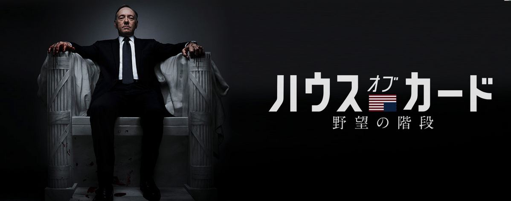
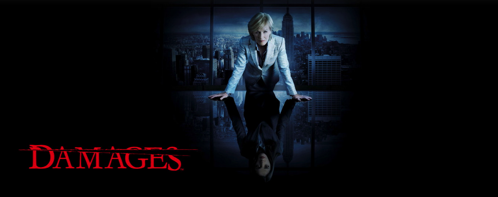

---
categories:
- 海外ドラマ
date: Sun, 14 Jun 2015 14:00:56 +0000
slug: post-7940
tags:
- Hulu
title: 【hulu】どハマり注意。おすすめシリアスドラマ3選
---

huluも最近国内外問わずコンテンツが充実してきましたな〜
ということでぼくが大好きなドラマをご紹介。
<!--more-->

<h2>ホームランド</h2>

イラクでテロリストに拉致され監禁されていたアメリカ軍兵士が帰国したら…という設定

CIAに所属する主人公の女性は、帰還兵として英雄に祭り上げられたこの兵士を洗脳されてスパイに転向しているのではと疑います。
そして、彼の自宅に対し無許可の盗聴監視をしかけ、真実へとたどり着きます。

なんていうか、とにかく冒頭から言い知れぬ怪しさが漂っているドラマです。その怪しさと不安感がどんどん増していき、ずっとドキドキ感が続きます。

面白いです。

<h2>ハウスオブカード</h2>

大統領の側近として暗躍する男の話です。野望に満ち溢れ、自らの目的のためならどんなに汚い手段も辞さない男の一人称視点の話です。

変わっているのは、主人公が時々視聴者に語りかける解説シーンがあるんです。古畑任三郎の事件解決前みたいな…ちょっと違うかw

でも、さむい設定ではなく殺伐としたストーリーを多少カジュアルにしてくれています。全編通して次から次へとトラブルが起きて、それを華麗かつ残忍に解決していく様は、ある種の後味悪さがあります。しかし、それがクセになってどんどん続きを見たくなります。

面白いです。

<h2>ダメージ</h2>

サスペンスとはこういうドラマのことを言うんでしょう。

あらすじが表現しずらい…

現在、未来、過去とシーン展開が進んでいき最終的にすべての話がつながるというものです。主人公は弁護士を目指す優秀な若い女性、それがひょんなことから業界大手の事務所で働くことに。しかし、それはすべて仕組まれていたことでした。

そして事件はおきます。主人公はある日血まみれで錯乱しているところを保護されるのでした。

いやー主人公が頑張る話と思ったら全然違いましたわw　主人公の上司というかもう一人の主人公のエレンがばったばったと訴訟を解決に導く姿は、爽快感があります。しかし、それと同時に裏で進む陰謀には鳥肌が立ちます。

そして、主要人物であろうとばったばったと死んでいくストーリーは、常に緊迫感がありこれまたクセになることうけあい。

面白いです。

<h2><a href="https://twitter.com/s_s_p_y" target="_blank">しんぺー</a> はこう思った。</h2>

それも連続するサスペンスものです。みているとどんどん引き込まれます。
もし止めることができない性格だったら寝不足必至です。責任は負いかねますぜ！

<a href="http://ck.jp.ap.valuecommerce.com/servlet/referral?sid=3041033&pid=883551022" target="_blank" >海外の映画・ドラマが月額933円（税抜）で今すぐ見放題！今すぐ無料視聴！</a>

と言ったところで本日は以上になります。おやすみなさい。