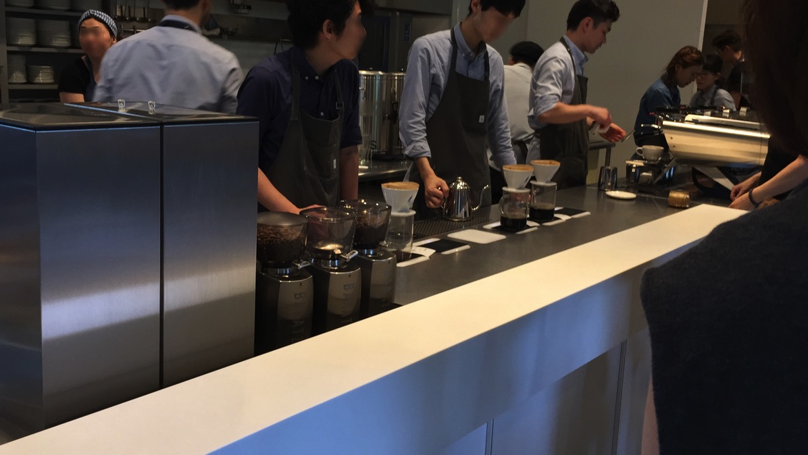
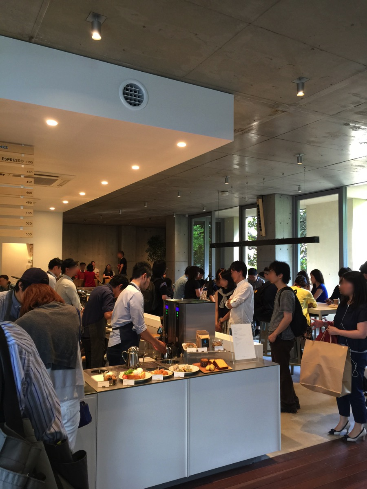
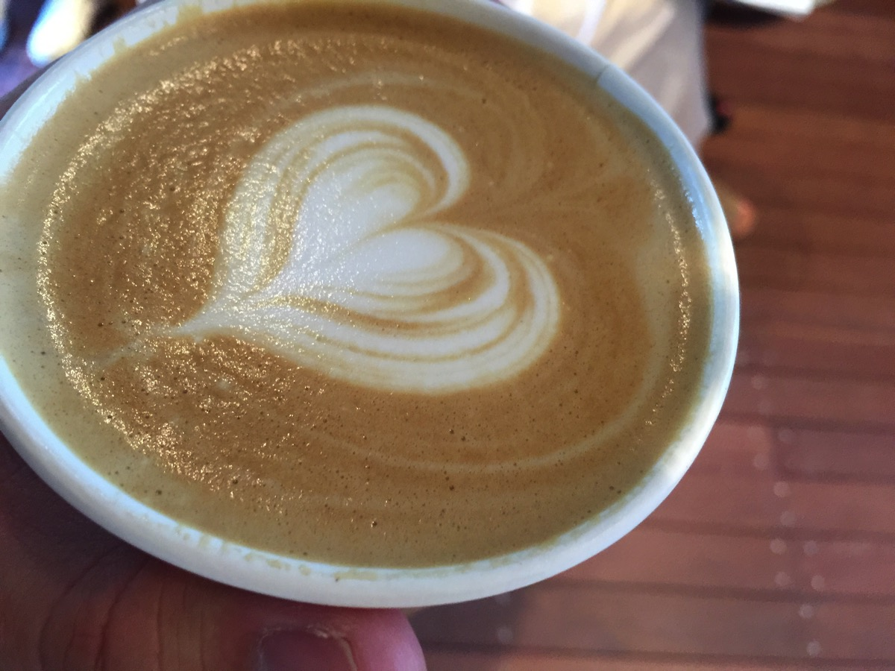
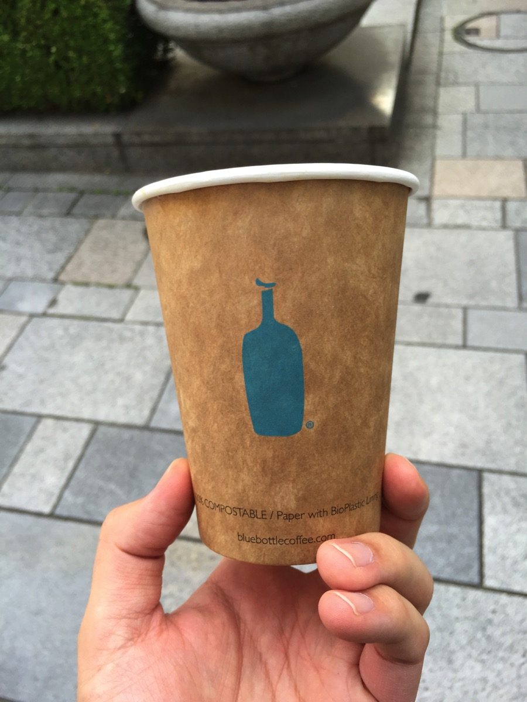

---
categories:
- グルメ
date: Sun, 21 Jun 2015 14:00:13 +0000
slug: post-7966
tags:
- ブログ
title: 【意識高い】コーヒー界のAppleと言われるブルーボトルコーヒーに行ってきたった【別にフツーでしたよ】
---

タイトルで言いたいこと全部終わってます！我ながら素晴らしいタイトルです！そう、何を隠そう、コーヒー界のAppleと騒がれ数ヶ月前に上陸したばっかりのブルーボトルコーヒーにやっと行ってきたのです！そして、別に普通でした！という感想を持ちましたのでご紹介します。<!--more--><h2>ブルーボトルコーヒーとは？</h2>

<map id="map_byzbgyjb" name="map_byzbgyjb"><area coords="266,230,297,256" href="https://www.twitter.com/bluebottlejapan" alt="" shape="rect" /><area coords="298,230,322,256" href="https://www.facebook.com/bluebottlecoffee" alt="" shape="rect" /><area coords="323,230,353,256" href="http://instagram.com/bluebottlejapan" alt="" shape="rect" /></map>
<a href="https://bluebottlecoffee.jp/">ブルーボトルコーヒー</a> via <a href="http://kwout.com/quote/byzbgyjb">kwout</a>

マイクロブリューコーヒーとか呼ばれてアメリカでテクノロジー系企業の出資を受けて大流行り<strong>らしい</strong>。

で、特徴はいっぱいいっぱいコーヒーを丁寧に淹れることだそうです。

ほほう。確かにいっぱいづつ丁寧に淹れておりました。これは時間かかるだろうなぁ

初めて日本でオープンしたお店は清澄白河店でしたが、開店当初は数時間待ちとかザラだったみたいです。（鳥取にできたスタバみたい）

（店内は涼しげな感じ）

急がずにゆっくりというのがスタイルみたいです。スターバックスなんかは、シアトル系といって、忙しいビジネスマンが朝立ち寄ってパッと買ってそのままオフィスに出勤！みたいな感じで、スピード重視ですが、こちらは<strong>エンジニアとかクリエイティブな仕事をする人たちがふと休憩するために立ち寄る</strong>みたいな感じなのかなと思いました。

<h2>コーヒーはぶっちゃけうまいの？</h2>

驚いたのはカップにフタがありません。この辺もスタバと違っているところです。スタバや既存のコーヒーショップは歩きながらすぐに飲めるようにフタがついています。

しかしブルーボトルコーヒーにはついていません。これまた予想ですが、<strong>しっかりゆっくり飲みなされということ</strong>なのかもしれません。

ちなみに味は、「うまい！」と思うほどではありませんでした。スタバの普通のバリスタが作るのに比べれば少し美味しいかなと雰囲気で思っちゃう程度でした。

<strong>まぁ。別に。普通です。</strong>

その他のメニューはだいたい500円以上でスタバよりかは割高かなという感じ

<h2><a href="https://twitter.com/s_s_p_y" target="_blank">しんぺー</a> はこう思った。</h2>

いやーやっと行けました！今回ぼくが行ったのは青山店なんですが。。。
実はその真隣りに小さなコーヒー屋さんがありまして・・・

前回は間違えてそっち入っちゃったんですよねwwwまじでwwwばかじゃねーのwww

いやーwww「あれ？こんな小さいんだ〜へ〜」とか言って会計して店出て、あのカップ持ってる人たちが隣りの建物から出てくるのみてwwwワロタwww
昔Appleの株を買ったと思ったら、中古車販売のアップルインターナショナルの株買ってたのを思い出しました。

と言ったところで本日は以上になります。おやすみなさい。