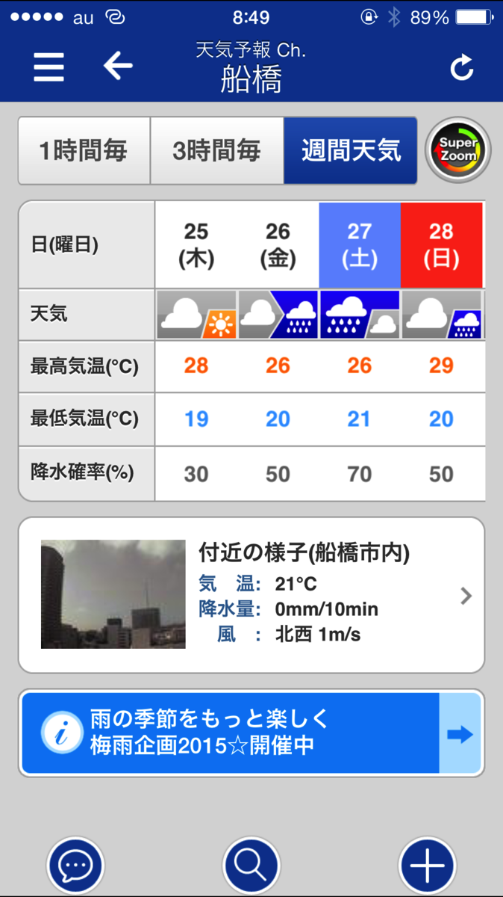
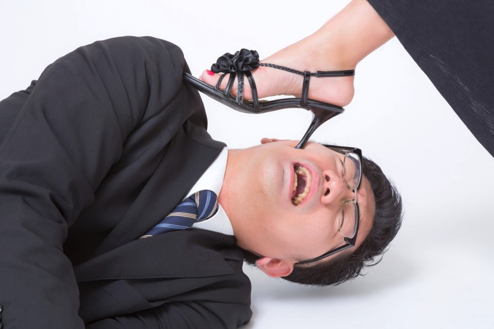
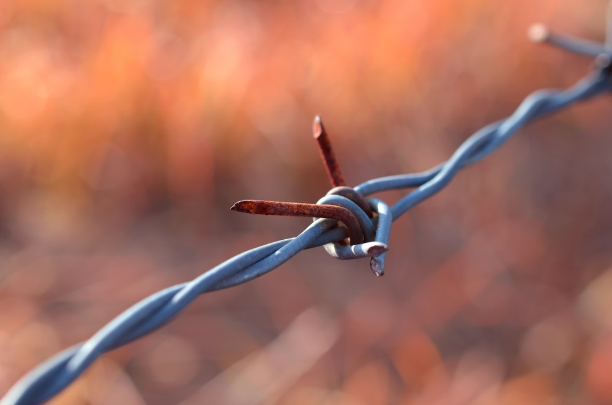
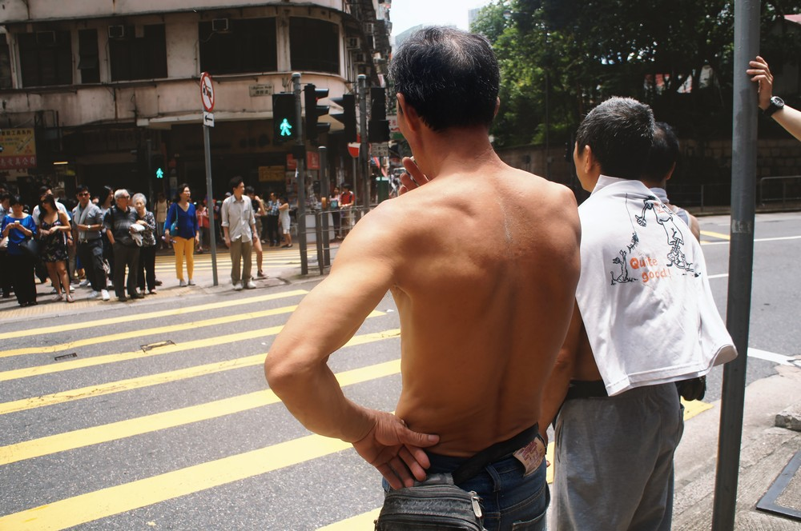

---
categories:
- LUNATIC FEST.
date: Wed, 24 Jun 2015 14:00:00 +0000
slug: post-7974
tags:
- LUNATIC FEST
- ルナフェス
title: ルナフェス当日の天気と服装
---

さてルナフェスまでもうあとわずかですね。屋内フェスとはいえ、梅雨のど真ん中です。タダでさえ湿気が多いのに、海沿い、当日の天気によっては大変なことになりそうです。<!--more-->ハローしんぺー(<a href="https://twitter.com/s_s_p_y" target="_blank">@s_s_p_y</a> )です。
オフィより詳しくて、wikiよりも有用なsukekiyo情報サイト「Gadget Zombie Parasite(ガジェットゾンビィパラサイト)」へようこそ。
ということで調べてみました

<h2>ルナフェス当日の天気</h2>

はい、当日は雨時々曇りてきな天気予報となっております。（6月24日時点）

おそらくですが、当日は朝から雨なんじゃないでしょうか。傘が必要なくらいなのかはわかりませんが、もし必要ならば会場までの経路を少し考えなければなりません。
さらに傘なんか持ち込めませんから、場合によっては濡れるの覚悟でいく必要があるかも。

ということでタオル必須ですね。

それと室内だからといって、水分補給をちゃんとしないと熱中症になりかねないので気をつけましょう。

そういえば、その昔PIERROTの西武ドームで（あれは7月だったけど）ばったばったと人が倒れていくのをみて恐怖を感じた当時を思い出しました。

参考：<a href="https://www.otsuka.co.jp/health_illness/heatdisorder/care_09/">室内でおこる熱中症（大塚製薬）</a>

<h2>ルナフェス参戦の際の服装</h2>

あと、最近当ブログに「ルナフェス　服装」で検索してきてくれる方が増えてますが、当然スタンディングのフェスなので動きやすい格好と走りやすい（←）靴が基本になります。
それと同時に重要なのが他人に迷惑がかからない格好が重要です。とくに危険を及ぼすような服装、

たとえば

<h3>ピンヒール</h3>

踏まれるとリアルに足に穴が開きます。まじで履いてこないでください。

<h3>とがったアクセサリー</h3>

意外と多い。密着したり人に接触すると怪我をさせるような装飾品はつけない方がいいでしょう。マッドマックスみたいなのとか

<h3>はだか</h3>

いるかな？男でフェスとかで上半身裸のやつとかいるけど、同じ男からしても接触すると気持ちわるのでやめてください。シャツを着ろシャツを
マッドマックスじゃねーんだから

※画像はモッシュ待ちの夢烏ではありません。

<h2><a href="https://twitter.com/s_s_p_y" target="_blank">しんぺー</a> はこう思った。</h2>

怪我なく人に迷惑をかけない、バンギャは礼儀を重んずるもの。
いいライブは思いやりなくして成立するものではありません。

あと少し。体調管理を万全にしてのぞみましょう。

と言ったところで本日は以上になります。おやすみなさい。