---
categories:
- DIR EN GREYのLIVEレポ
- LUNATIC FEST.
date: Sat, 27 Jun 2015 00:00:00 +0000
slug: post-7977
tags:
- LIVEレポ
- LUNATIC FEST
title: 【ライブレポ】DIR EN GREY LUNATIC FEST 2015_6_27@幕張メッセ
---

いってきました。こちらの記事は当日は現地レポとして更新しておりましたが、落ち着きましたのでLIVEレポとして書き直しました。

それではぼくの主観的なものになりますが、よかったらどうぞ！！<!--more--><h2>いいか幕張メッセは幕張駅にはないからな！もう一度言う。幕張メッセは海浜幕張駅だからな！！</h2>

自宅出発。

嵐を呼ぶバンド『LUNA SEA』
その昔、野外LIVE会場が崩壊したことは有名な話。この2日間も今年一番の大雨がくるとかいう予報もでておりました。しかし、当日は予想しているよりも雨は弱めでした。とはいえ、早朝組のツイートによると傘なしではん少し厳しそうだったので傘を持参。

クロークがあるとはいえ、動員人数3万人規模のフェスです。持ち物は最低限かつ動きやすい軽装に。タオルは持っていきましたが、着替えのシャツは現地調達しました。

ちなみに通販で買ったルナフェスのロゴTシャツはダサすぎて着て行きませんでした。かわりに勝負服のDIR EN GREY「TABULA RASA -揚羽ノ羽ノ夢ハ蛹-」限定Tシャツで気合十分。

乗り換えの電車で座れたので1時間程寝て体力温存。この電車に乗っていけば幕張まで着くのです。

目をさますと、違和感に気がつきました。溢れかえってるはずだったのに目の前にはバンギャが一人もいない。

あれ？？

ん？

<blockquote class="twitter-tweet" lang="ja">
聞いてくれ。初歩的なミスをしたんだ。海浜幕張じゃなくて幕張に向かってたぜwwwでも空いてるからかえってよかったかもしれん。タクシーで海浜幕張向かえばすぐぽいし
&mdash; しんぺー@夏終了のお知らせ (@s_s_p_y) <a href="https://twitter.com/s_s_p_y/status/614596239347200000">2015, 6月 27</a></blockquote>

まだこの時はこんな余裕をかましておりました。

<blockquote class="twitter-tweet" lang="ja">
うわーすげー電車の中で薫が来てたhideTシャツ着てる人乗ってきた！！！すげーーー！！！！なんか興奮してきたぞ！！！
&mdash; しんぺー@夏終了のお知らせ (@s_s_p_y) <a href="https://twitter.com/s_s_p_y/status/614597109392650240">2015, 6月 27</a></blockquote>

きっと歴戦のバンギャ（&#x2642;）の方だな！この人がこっち乗ってるんならきっとすごいルートに違いない！！

<blockquote class="twitter-tweet" lang="ja">
おれはかつてゼップなのに間違えて新木場に行った男だぜ？まだまだ焦る時間じゃない
&mdash; しんぺー@夏終了のお知らせ (@s_s_p_y) <a href="https://twitter.com/s_s_p_y/status/614598279049777152">2015, 6月 27</a></blockquote>

幕張駅到着　10時

そして驚愕。ここは本当に何もない・・・

一緒に乗ってたhideTシャツのパイセンが慌てて駅員に聞いてました。「すいません。幕張メッ（ry」

まぁ、ぼくはと言いますと、幕張駅に幕張メッセはないということはですね、もう20分前から知っていましたからね。焦ってないんですね〜これが。もう落ちつきはらってタクシー乗り場へと行ったわけですよ。そしてタクシー乗り場を見てわーびっくり

タクシー乗り場とは名ばかりで、タクシーの看板が立ってるだけでタクシー1台も止まってねーのよ。

<blockquote class="twitter-tweet" lang="ja">
知ってた？幕張て何もないんだぜ <a href="http://t.co/uW4Yk3X5mz">pic.twitter.com/uW4Yk3X5mz</a>
&mdash; しんぺー@夏終了のお知らせ (@s_s_p_y) <a href="https://twitter.com/s_s_p_y/status/614604439521918976">2015, 6月 27</a></blockquote>

そこでぼくはようやく焦りだしました。

（人をイラつかせるバス停）
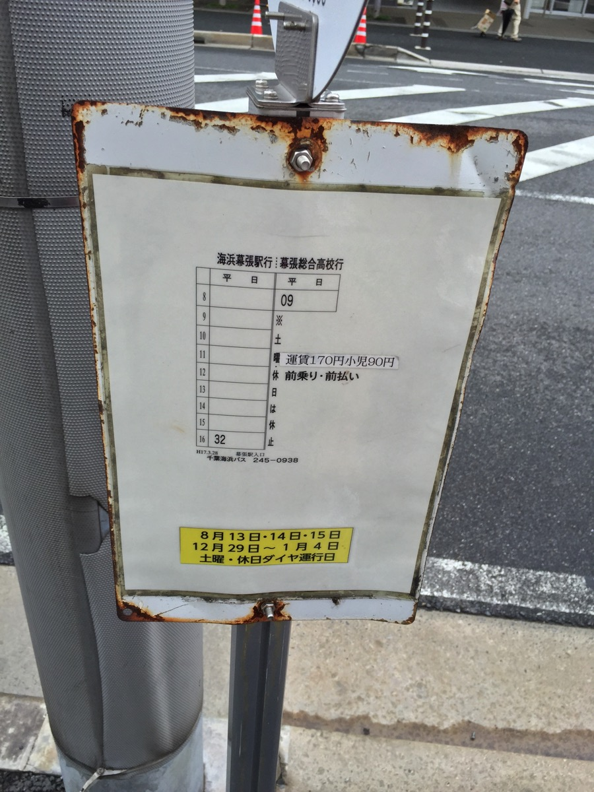

と、とにかく大きな道へ出なければ。ここは完全なる商店街。こんなところにしかも朝にタクシーがくるわけがない。急がねば

（コンセプチュアルなステーキやさん）
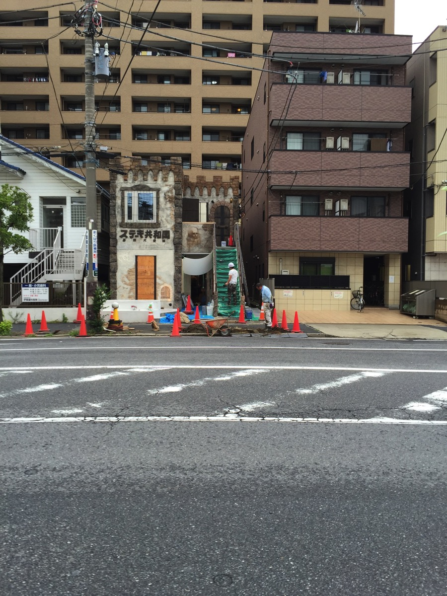

そしてひたすら大きな道を目指し早足で歩き、もうこうなったら走っていってやろうかと思った矢先にタクシーを捕まえ乗ることができました。

急ぎ現地へ向かい。お釣りはいりませんと言って颯爽とタクシーをあとにしました。そのあとに長蛇の列が待っているとも知らずに

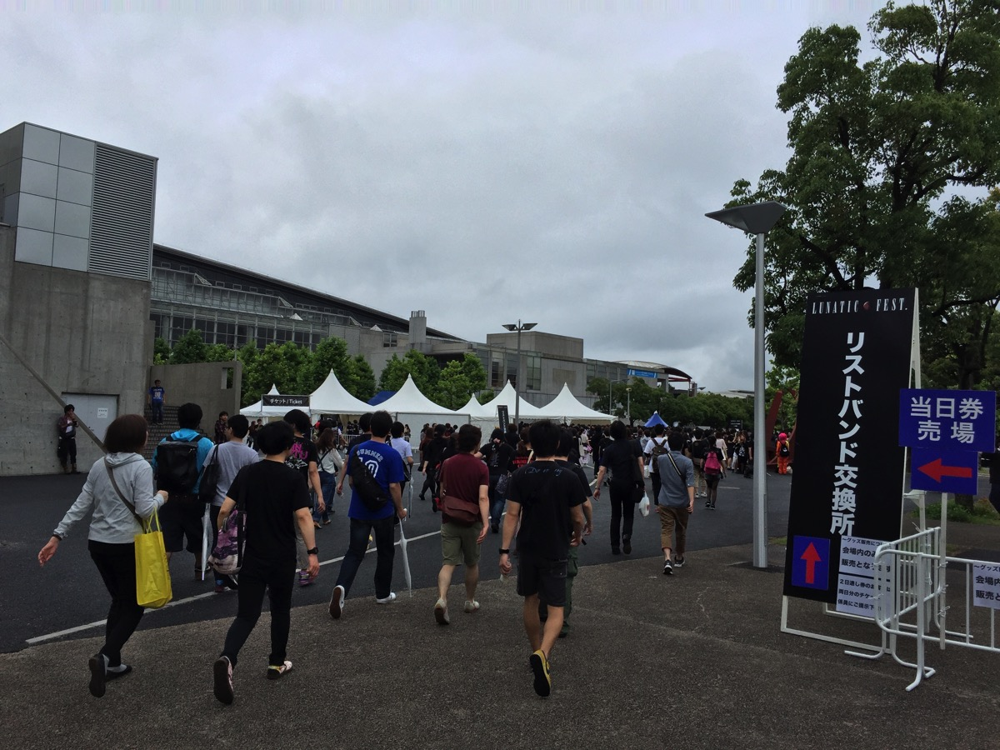

<h2>ルナフェスとは入るのにも並び、飲食ブースでも並び、物販でも並び、ステージエリアに行くのにも並ぶ。これはもはやディズニーランドです。</h2>

いやー少しは予想してたし、Twitterで画像見てたからわかってたけどさ。まさかここまでとはwww尋常じゃない列w

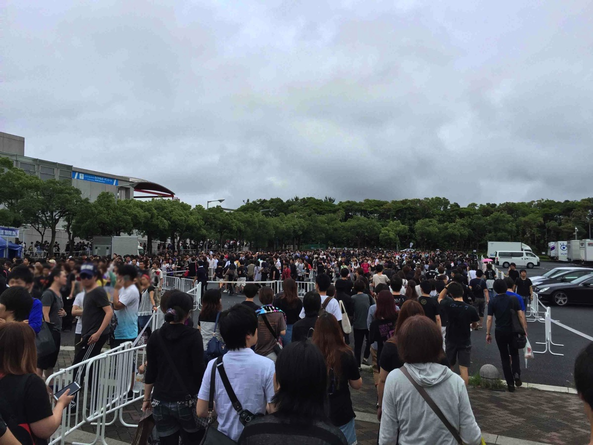

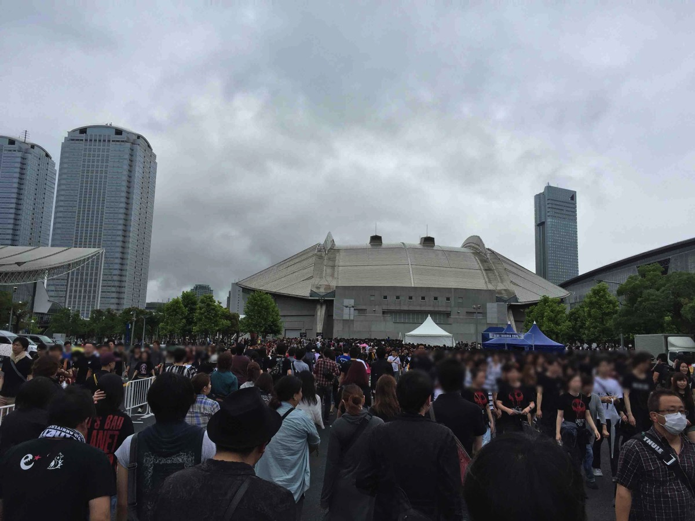

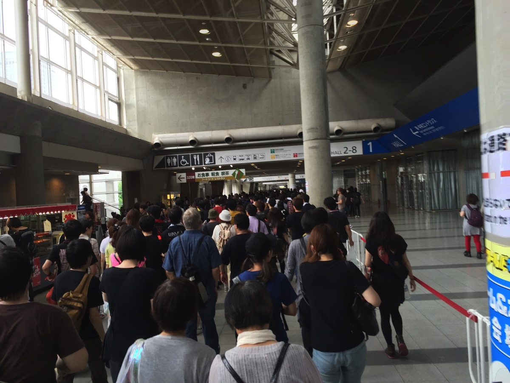

なんか見えてきたなーとか思ってたらwww
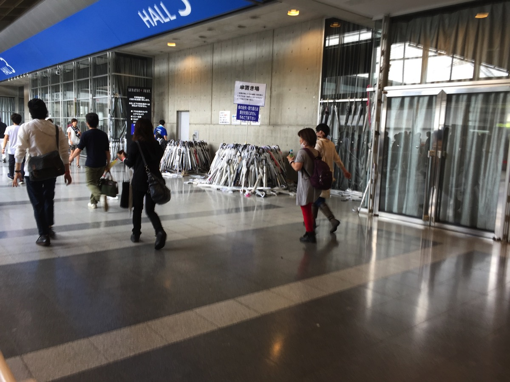

傘置き場www
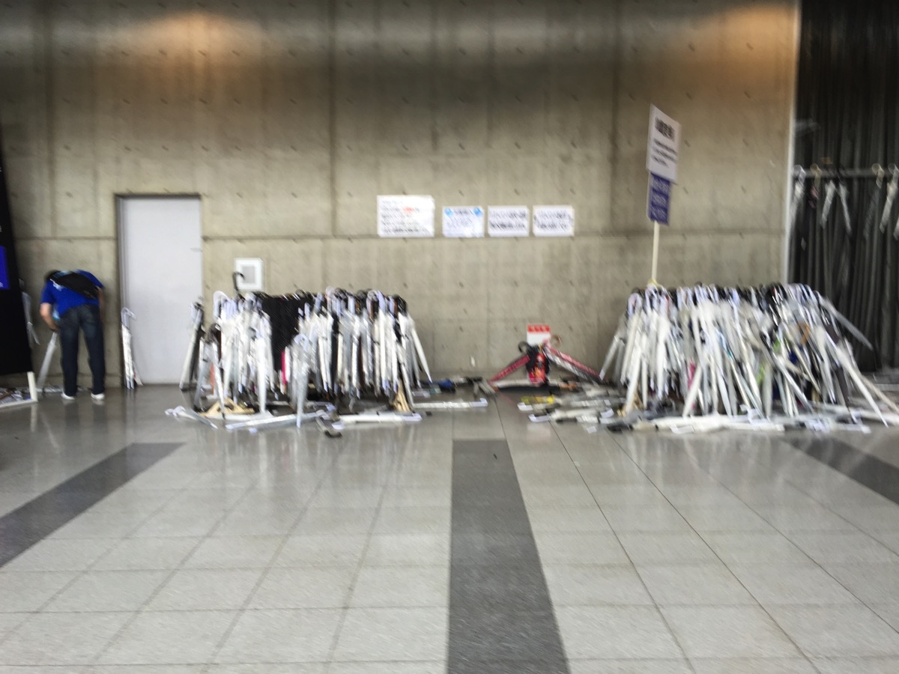

リストバンドチェックに、ONE PIECEのアラバスタ編ばりに腕をあげる
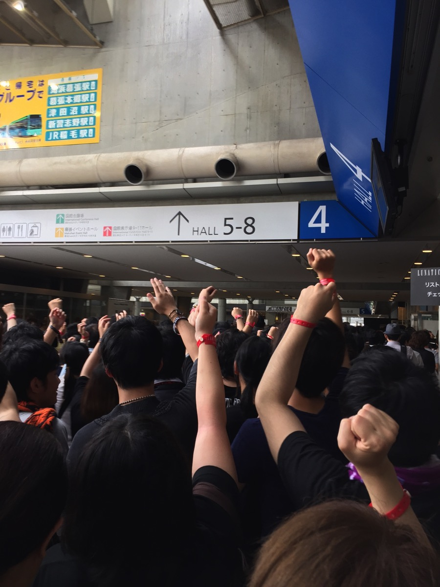

ここがエデン。エデンとは名ばかりで、後に真矢プロデュースの天雷軒なんか２時間まちになったりして正に地獄と化す。
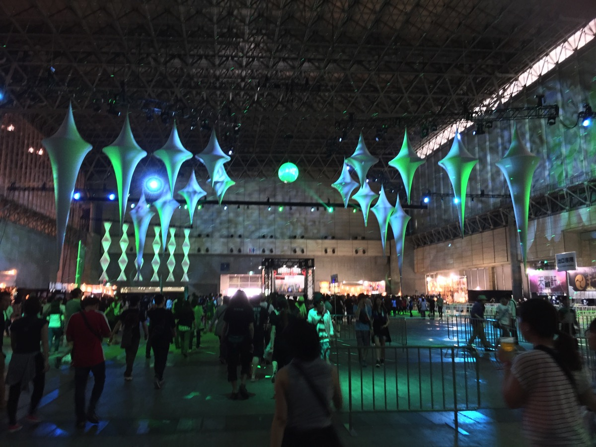

フェスなのにドリンク代とった本フェスですけど、そのドリンク券はここで使うことになります。普通にご飯食べる店でドリンクも買うので、このシステムいらないです。
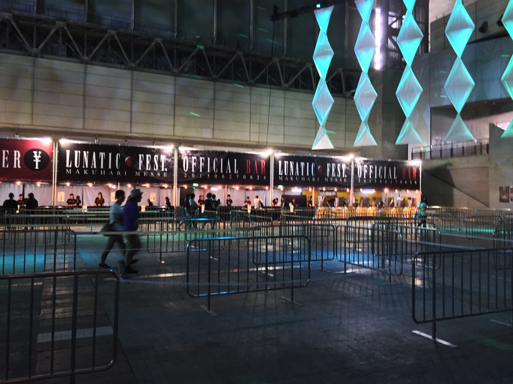

とりま朝飯。まーね、LUNA SEAさんは時間通りに始まらないバンドという事前情報を得ておりましたので、列がない今の時間に腹ごしらえ

朝ごはん前にビール飲むとか生まれて初めてでした。
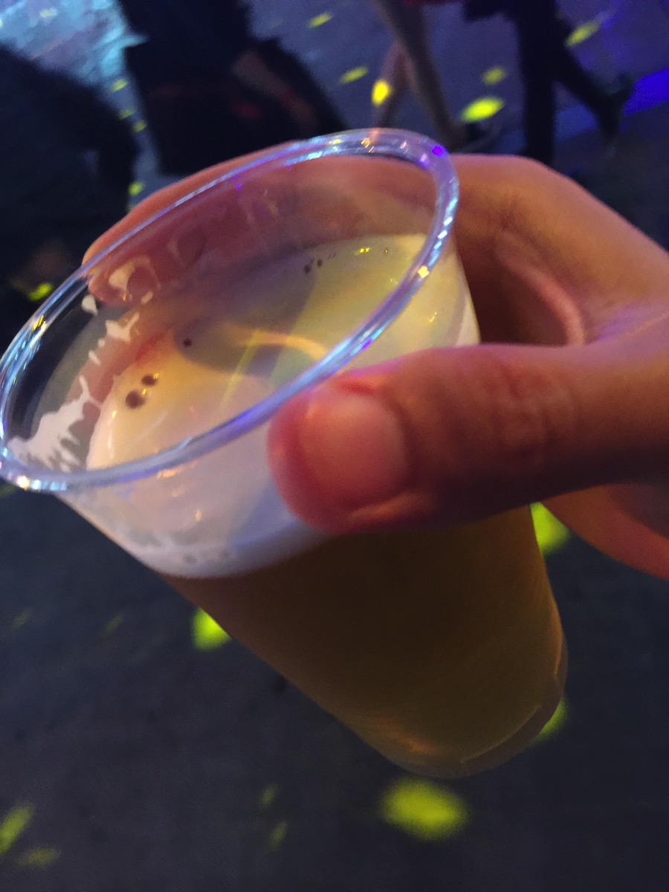

うまし。ケバブ初めて食べた。
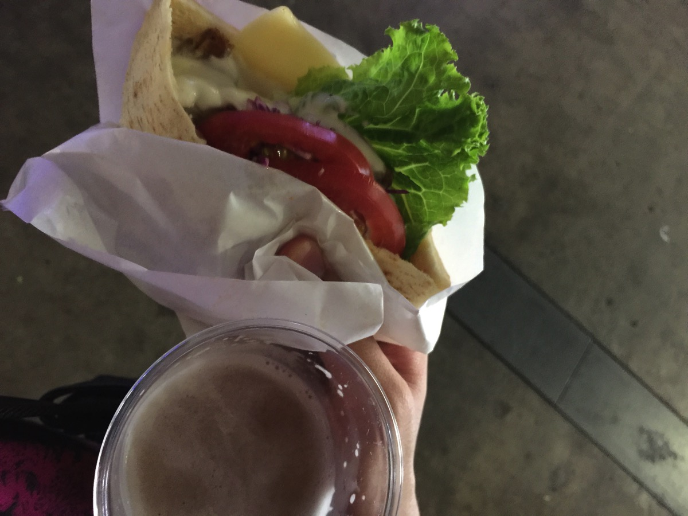

あ、ルナシー(cy)始まったでござる。時間通りでござった。

<h2>各バンドの感想とセトリだあああ！！</h2>
セトリは拾い物

<h3>LUNACY</h3>
CHESS
メカニカルダンス
SHADE

途中から見ておりました！うん！正直ようわからん！LUNA SEAって聞いたことないんですよねぼく。

というかかっこいいとかそういう感情も正直ない。なんでかなーってこの日1日考えてたんですけど、小学校の時の同級生のイイヅカのせいだと思い至りました。こいつがすげーナルシストキャラだったんですけど、ねっとりした声で（歌はうまい）LUNA SEAを休み時間に歌ってくるんですよ。たぶん、それで精神的にシャットダウンしてしまってる所がぼくの中にあるんだと思います。

<h3>9mm</h3>
Discommunication
ハートに火をつけて
Cold Edge    →Jの飛び入り
Black Market Blues
生命のワルツ
Punishment

ごめんなさい。エデンエリアで物販みたりなんやかんやしておりました。

<h3>テレフォンズ</h3>
#Monkey Discooooooo
HABANERO
Baby,Baby,Baby
I Hate DISCOOOOOOO!!!
Love & DISCO

解散が発表さているテレフォンズ。正直好きじゃないかなーという感じです。
9mmからの流れでパンピーの方々が熱い時間だったと思われます。ビール飲み終わってたので途中出て外のビールを求めにいっておりました。

<h3>ヤンキース</h3>
セトリ不明
PATA乱入

いやーhideサミの時に見て以来！こういう時でしか見ることができないバンドです！

なのに、なのに！間に合わず見れませんでしたーーーーー！！！

<h3>コールドレイン</h3>
THE REVELATION
NO ESCAPE
Six Feet Under
Die tomorrow
THE WAR IS ON

最初から見ておりました。いやーいい感じのLIVEでした！この辺からぼくのエンジンもかかり始めました。

<h3>レディースルーム</h3>
Anarchy in THE UK
酒と泪と男と女←隆一乱入

(他も歌った？わからん)

えーーっと、RYUICHIうたうめーーーなーーーーおいおいおいおいお！しかもこのバンドのボーカルもめちゃくちゃうたうめーーーと思いました。

それと後で認識することですが、この２日間のMVPであるジョージ氏がベースを務めるバンドでもありましたね。最後ケツだしてました。

<h3>シャムシェイド</h3>
RAIN
D.Z.I.
1/3の純情な感情→真矢乱入
Still We Go
Dreams
BLACK
GET A LIFE
Don't Tell Lies

泣いたわーいやーレインでないたわー
浪人中ずっと聞いてたシャムシェイド
かっこいいわー

あと今時の若者はDREAMS知らないのね？いい曲よ！スポーツニュースかなんかのタイアップだった希ガスる。

<h3>Fear, and Loathing in Las Vegas</h3>
Rave-up
Jump Around
Starburst
Flutter
Let Me Hear
Virtue
Just Awake

このバンド大好きだったんだけどね。正直拍子抜け。がっかりしました。
まず、そのフェスの時必ずリハやるのなんなん？しかも一回はけて、出てきてからはじめまして〜ぼくたちフィアーアンド（ryみたいな

いやいやいやいや、はじめましてじゃないし、さっき出てきて１曲リハやってたやん？？もうこの時点で興ざめ

で、ぼくが知らない曲、たぶんわりと新し目の曲で、なんかメンバーのノリもだっさくちょっとがっかりしました。もう次のDIR EN GREYに備えて移動しました。

大好きなバンドだっただけにがっかり。しばらく見ていない間になんかちょっと違う方向に行っちゃった感じがしました。。。初めて聞いた時の衝撃と衝動はもはやない

<h3>DIR EN GREY</h3>

and zero
SUSTAIN THE UNTRUTH
激しさとこの胸の中で絡みついた灼熱の闇
朔
THE FINAL
空谷の跫音(with SUGIZO)
Un Deux
Revelation of Mankind
羅刹国

この日は隣で子供用のおもちゃ展かなんかをやっていたみたいです。フロアを出たメッセの廊下にも来場した子供たちがたくさんいました。
そんな中朔からのレベレーションという凶悪MVを無修正で流したというわけです。それ以外にも、このメンツの中ですら異色さを放つDIRならではの表現だったんだと思います。

昔のHIDE memorial summitを思い出しました。

鼓動・朔・Revelation of MankindのMVは一連の流れになっており、一貫したストーリーを描いています。

Music Videoの内容は以下の通り。

なんの変哲もない団地に住まう平均的な家族に生まれた少年が主人公。彼には姉がいましたが、男たちに拉致され乱暴されます。解放されるも苦悩に耐えきれずに自殺をします。

そこからこの少年の精神は壊れ、自分の両親を殺害、数日間死体とともに生活したのちに逮捕され、少年院へと送られます。

ここまでが鼓動と朔で描かれています。流れとしては鼓動→朔→鼓動とコマ切れで描かれているので2つ通しでみないとつながりません。

次に数年後、出所した少年の今が描かれます。それがRevelation of Mankind

<iframe width="560" height="315" src="https://www.youtube.com/embed/RbQrfGBSaPY" frameborder="0" allowfullscreen></iframe>

これに出てくる金髪の男性こそが、朔鼓動で両親を殺害した少年の成長した姿

壊れた彼の精神はやはり壊れたままで、自分と同じような境遇の家族を見つけ、虐待されている子供を救う、また彼らに復讐をさせるためにその両親を拘束し子供に殺害させるのでした。。。

というのは実は彼の妄想で、全部が夢オチという内容です。

DIRのMVはどれもやばいものが多いのですが、ぼくはみていてこれが一番倫理的に過激かなと思いました。だからこそ最後「はいはい夢オチです。そんなことないけどな！」みたいにしたのかなと少し思います。

この表現は世の中に出すにはあまりにも過激でした。それでもDIRが描く痛みのリアルが描かれた映像作品だと思います。
そんなわけでDIR EN GREYのリアルを描いた映像作品は、修正がかけられて販売されることが多いのですが最新のクリップ集はなんと無修正で販売されるそうです！

[itemlink post_id="12004"]

<h4>SUGIZO乱入</h4>

DIR EN GREYのLIVEはMCがありません。その代わりに京がお経のような声や獣のようなうめきをあげ、独特の世界観のさらに深いところにオーディエンスをいざなうのです。

ちょうどその時、ぼくからは直接ステージが見えなくなってしまったのですが、衣擦れのような音がしマイクをお立ち代に擦り付けるような音がしたので、いつものかと思っていました。

ステージが見えるようになって把握、SUGIZOがヴァイオリンを持って京の隣にたたずんでいました。
そして空谷の跫音のイントロが流れはじめ、そこにSUGIZOが絶妙な調和をたもった不協和音を載せ始めました。

普段の重厚さに、さらに重みが添えられた空谷の跫音はきっと後にも先にもこの日だけの特別なものでした。

<h4>DIR EN GREY終わりで倒れる人多数。救急車も出動</h4>

その後のXとLUNA SEA目当てで場所取りで入ってた方々（特に覚悟なくいらっしゃった方）、さらに興味本位の方々が死地と知らず迷い込んだ方々がソッコー離脱していったのが散見されました。

そしてそれまで安全で楽しげだったフェス会場について救急車出動

終わったあとに車椅子で運ばれる方を何人か見かけました。。。

<h4>中継とニコ生</h4>
ニコ生の方やその他でも実況やらなんやらがあったようです。

ニコ生のToshiチャンネルでは京が生出演して天使だと話題に
さらにインタビューでナイトメアの黄泉氏が個人できてたのをキャッチアップされて？話題に

DIAURAのメンバーも会場きてたっぽいし
<blockquote class="twitter-tweet" lang="ja">
絶対達也来るべきだった！ <a href="https://t.co/oXqOmktFk2">https://t.co/oXqOmktFk2</a>
&mdash; DIAURA yo-ka (@DIAURA_yo_ka) <a href="https://twitter.com/DIAURA_yo_ka/status/614769186091352065">2015, 6月 27</a></blockquote>

<h3>dead end</h3>
I Want Your Love
Psychomania
serafine（with:RYUICHI & SUGIZO）
Dress Burning
Devil 

またしても、休憩に行ってしまっており見れず。

<h3>X</h3>
1.JADE
2.RUSTY NAIL
-MC-
3.紅
-『kiss the sky』公開客声レコーディング？-
4.ENDLESS RAIN
5.BONE TO BE FREE
6.X

いやーーーーなげーーーwwww
いちいち全部なげーーーー

じゃぱーんじゃぱーんじゃぱーんじゃぱーんじゃぱーんじゃぱーんじゃぱーんじゃぱーんじゃぱーんじゃぱーんじゃぱーんじゃぱーんじゃぱーん

絶え間なく続くじゃぱーんを永遠と呼ぶことができたなら!!!!!
ってくらいなげーーーー

でも、それが許される。この空気感が許される。それこそがXなんだと思いました。

近くで見てたパンピーのお兄さん方もバンギャ属性ゼロっぽかったけどXに関してはみたい！という感じで残ってたみたいです。

もうこれこそがXというバンドがもはや古典のような存在になってるんだなという証左です。

おじいさんは山へ芝刈りにおばあさんは川に洗濯に
くらいに当たり前で誰も疑う余地のない物語、それがXなんだと思いました。

<h3>LUNA SEA</h3>
LOVELESS
Dejavu
Rouge
JESUS
TONIGHT
gravity
Sweetest Coma Again
I for you
ピンクスパイダー
STORM
TIME IS DEAD
ROSIER

すんません。もうこのころは帰路についておりました。

<h3>無敵バンド？</h3>

DIRのToshibaとDieも参加してたらしいなああ見ればよかった

<h2>その他の写真</h2>

<a href="images/wpid-20150627094139.jpg">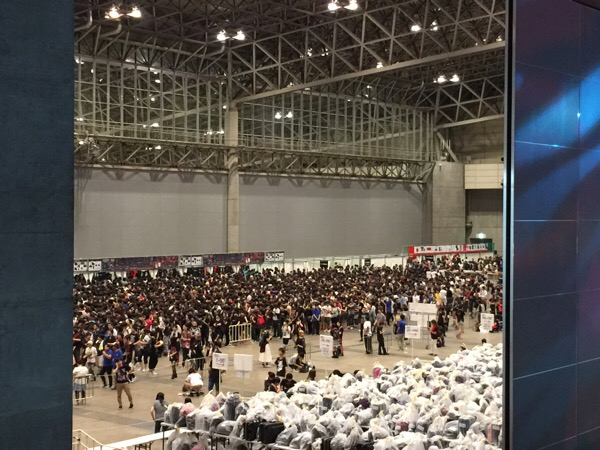</a>

おわかりいただけただろうか？人がゴミのようだ

ここがLIVEするスペース
<a href="images/wpid-20150627094143.jpg">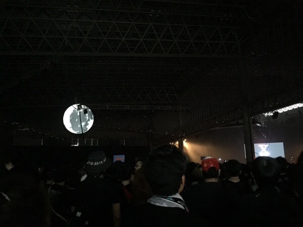</a>

真矢プロデュースのつけ麺
<a href="images/wpid-20150627094150.jpg">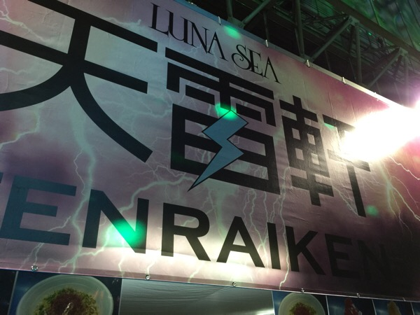</a>

<a href="images/wpid-20150627094152.jpg">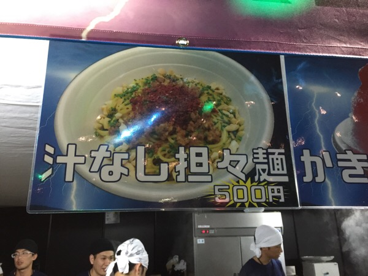</a>

奇跡的に本日の最後の一杯をいただきました！食べやすくて美味しかった〜
<a href="images/wpid-20150627094158.jpg">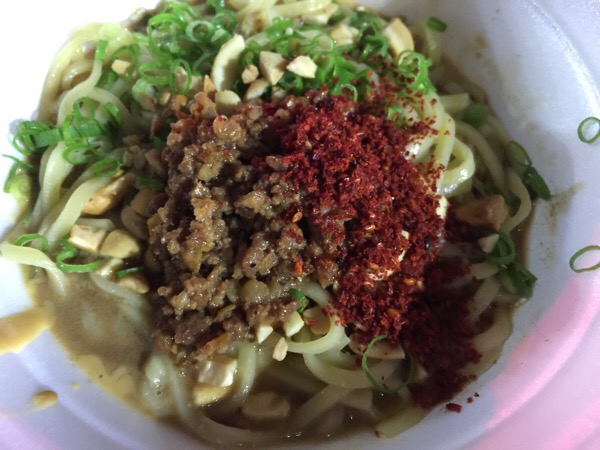</a>

<h2><a href="https://twitter.com/s_s_p_y" target="_blank">しんぺー</a> はこう思った。</h2>

いやーマジで疲れた。それでもすごくいいLIVEでした。

ありがとうルナフェス！！

<a href="images/wpid-20150627094201.jpg">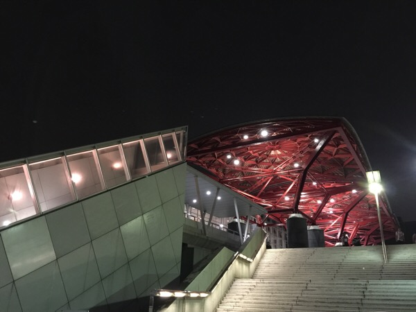</a>

来年はXフェスということで。今回よりも規模がでかくなるんじゃないでしょうか！！

と言ったところで本日は以上になります。おやすみなさい。