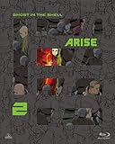

---
categories:
- アニメ
date: Sun, 05 Jul 2015 16:00:00 +0000
slug: post-8033
tags:
- 攻殻機動隊
title: 【やっぱりウィルス】人間の記憶がデジタルデータに置き換えられた未来の黎明期の混乱「攻殻機動隊 新劇場版」観てきた。
---

見てきました。攻殻機動隊25周年「攻殻機動隊 新劇場版」を。どうせ今回もウィルス絡みだろうという不満と、どうせ一見じゃよくわからないストーリーなんだろうという不安を抱えながら見てきましたよ。<!--more--><h2>やっぱり期待を裏切らない！今回もウィルスでてきたよ！</h2>

いやー<a href="https://www.warawareotoko.com/2014/07/13/post-5872/">前回</a>も<a href="https://www.warawareotoko.com/2013/12/21/%E6%94%BB%E6%AE%BB%E6%A9%9F%E5%8B%95%E9%9A%8Aarise%E3%80%8Cghost-whispers%E3%80%8D%E8%A6%8B%E3%81%A6%E3%81%8D%E3%81%A6%E5%BE%AE%E5%A6%99%E3%81%A0%E3%81%A3%E3%81%9F%E3%82%88%E3%81%A3%E3%81%A6%E8%A9%B1/">前々回</a>も<a href="https://www.warawareotoko.com/2013/06/30/post-2471/">前々回</a>もウィルス絡みでしたよね！

ということで今回もウィルス絡みでした！しかし、どういう理由でこのウィルスが使われているのかってことに自分なりに考えがまとまりました！

今回のARISE全体に流れるテーマとして義体と電脳化によって生じたゴーストに対する疑義ではなく、<strong>記憶が改ざん可能なデジタルデータに置き換えられた場合人はそれをどう「感じるのか」という大きなものがあった思います。</strong>

そして記憶こそが人間の証と言わんばかりに強調されてきました。おそらくゴーストという概念自体が生まれて間もないからだと解釈しました。そして<strong>それを脅かす存在が記号的にファイアスターターというウィルスで描かれています。</strong>

<h3>あらすじ（よくわからなかったけど）</h3>

それではあらすじ

軍人による大使館立てこもりがおきる。それを解決するために首相直下部隊として編入された素子の部隊が現れ、迅速に事件を解決へと導く。しかし、その途中で少佐と瓜二つの義体を発見する。これの反撃にあい、逃がしてしまう。

のちにこの義体こそがこの一連の事件の黒幕であることが判明するわけだが、少佐・義体・軍、情報部、政府と様々な思惑のもと事件は複雑化していく。一人の義体と権力者が仕組んだことだとも知らずに。

この時代の義体や電脳は人間の成長を基本的に見込んでいない設計らしい。そのためソフト側のアップデートにハード側が対応できず、古い義体や電脳で体が不具合を抱えながら死ぬのをまつしかできないという弊害が起こっていた。

どういうことか、わかりやすく脳内で変換すると要はこんな感じ

iPhone3Gを使ってたら、いつのまにかOS8.4がでてて、じゃあいざアップデートしようとしたら対応してません無理ですと言われて「えーじゃあどうすればいいの」ってなって、買い換えてくださいと言われた状態です。

ただ、どうも電脳自体の積み替えもできないっぽくて、この場合iPhoneみたいに買い換えとか機種変できないっぽいです。

一生3G回線で、アップデートできずに起動できなくなったアプリを抱えて使わなくちゃいけないとか地獄でしょ

でこんな社会背景がありつつ、軍部も変革や粛清を余儀なくされていた。
このころは核戦争が集結したりして軍はその役割を終え初めて、どんどん民間に鞍替えしたり裏切りにあって粛清しあったりして醜いポスト争いをしていたわけ
素子の古巣である501機関も例外ではなく、責任者のクルツはなんとか生き残りの道を探っていた。

そして、そんな中首相と秘密会談を行っていたわけだが、爆破テロに首相共々あい死亡してしまう。

で・・・・
ここからよくわからんわけなんですが、実はクルツは死んでなくて、ファイアスターターをつくったのものクルツで、さらに軍部で私欲を貪る高官と結託して501機関が生き延びるように画策していた。。。という・・・・

よくわからない・・・

<h2>ネタバレ→旧作と元祖へとつながる伏線</h2>

お！と思ったのは最後、ゴーストインザシェルの冒頭の「あーらそう、じゃ死になさい」の再現とテレビ版の桜の24時間監視の再現がありました。

<h2><a href="https://twitter.com/s_s_p_y" target="_blank">しんぺー</a> はこう思った。</h2>

正直つまらん！というかよくわからん！と感じました。今回は少佐がウィルスにかかることなかったけど、変わりばえしない戦闘シーンに全然びっくりしないどんでん返し

解剖すればすぐにわかるだろうことを見逃す設定。なんなのそれ

ということでBlu-rayを待ってもっかい見たいと思います。

と言ったところで本日は以上になります。おやすみなさい。
  

<table  border="0" cellpadding="5" style="border:none"><tr><td style="border:none;text-align:left"><a href="http://www.amazon.co.jp/exec/obidos/ASIN/B00BB1MALO/warawareotoko-22/ref=nosim/" target="_blank" >攻殻機動隊ARISE (GHOST IN THE SHELL ARISE) 1 [Blu-ray]</a></td></tr><tr><td style="border:none"><table  border="0" cellpadding="0" style="border:none"><tr><td valign="top" style="border:none"></td><td valign="top" style="border:none;text-align:left">
坂本真綾 バンダイビジュアル 2013-07-26

売り上げランキング : 2729
<table style="border:none;margin-top:10px"><tr><td style="border:none;text-align:left;">
<a href="http://www.amazon.co.jp/gp/search?keywords=%8DU%8Ak%8B%40%93%AE%91%E0%20ARISE&__mk_ja_JP=%83J%83%5E%83J%83i&tag=warawareotoko-22" target="_blank" >Amazon</a>

<a href="http://hb.afl.rakuten.co.jp/hgc/0f6e221b.2eb9748a.0f6e221c.35cc1e84/?pc=http%3A%2F%2Fsearch.rakuten.co.jp%2Fsearch%2Fmall%2F%25E6%2594%25BB%25E6%25AE%25BB%25E6%25A9%259F%25E5%258B%2595%25E9%259A%258A%2520ARISE%2F-%2Ff.1-p.1-s.1-sf.0-st.A-v.2%3Fx%3D0%26scid%3Daf_ich_link_urltxt%26m%3Dhttp%3A%2F%2Fm.rakuten.co.jp%2F" target="_blank" >楽天市場</a>

<a href="http://ck.jp.ap.valuecommerce.com/servlet/referral?sid=3041033&pid=882528283&vc_url=http%3A%2F%2Fsearch.shopping.yahoo.co.jp%2Fsearch%3Fp%3D%25E6%2594%25BB%25E6%25AE%25BB%25E6%25A9%259F%25E5%258B%2595%25E9%259A%258A%2520ARISE" target="_blank" >Yahooショッピング</a>

<a href="http://ck.jp.ap.valuecommerce.com/servlet/referral?sid=3041033&pid=882660047&vc_url=http%3A%2F%2Fauctions.search.yahoo.co.jp%2Fsearch%3Fvo%3D%26ve%3D%26auccat%3D0%26aucminprice%3D%26aucmaxprice%3D%26aucmin_bidorbuy_price%3D%26aucmax_bidorbuy_price%3D%26loc_cd%3D0%26abatch%3D0%26istatus%3D0%26filtered%3D1%26ei%3DUTF-8%26tab_ex%3Dcommerce%26va%3D%25E6%2594%25BB%25E6%25AE%25BB%25E6%25A9%259F%25E5%258B%2595%25E9%259A%258A%2520ARISE" target="_blank" >ヤフオク!</a>
</td><td style="vertical-align:bottom;padding-left:10px;font-size:x-small;border:none">by <a href="http://kaereba.com" rel="nofollow" target="_blank">カエレバ</a></td></tr></table></td></tr></table></td></tr></table>

<table  border="0" cellpadding="5" style="border:none"><tr><td style="border:none;text-align:left"><a href="http://www.amazon.co.jp/exec/obidos/ASIN/B00DIOB46O/warawareotoko-22/ref=nosim/" target="_blank" >攻殻機動隊ARISE (GHOST IN THE SHELL ARISE) 2 [Blu-ray]</a></td></tr><tr><td style="border:none"><table  border="0" cellpadding="0" style="border:none"><tr><td valign="top" style="border:none"></td><td valign="top" style="border:none;text-align:left">
坂本真綾 バンダイビジュアル 2013-12-25

売り上げランキング : 2456
<table style="border:none;margin-top:10px"><tr><td style="border:none;text-align:left;">
<a href="http://www.amazon.co.jp/gp/search?keywords=%8DU%8Ak%8B%40%93%AE%91%E0%20ARISE&__mk_ja_JP=%83J%83%5E%83J%83i&tag=warawareotoko-22" target="_blank" >Amazon</a>

<a href="http://hb.afl.rakuten.co.jp/hgc/0f6e221b.2eb9748a.0f6e221c.35cc1e84/?pc=http%3A%2F%2Fsearch.rakuten.co.jp%2Fsearch%2Fmall%2F%25E6%2594%25BB%25E6%25AE%25BB%25E6%25A9%259F%25E5%258B%2595%25E9%259A%258A%2520ARISE%2F-%2Ff.1-p.1-s.1-sf.0-st.A-v.2%3Fx%3D0%26scid%3Daf_ich_link_urltxt%26m%3Dhttp%3A%2F%2Fm.rakuten.co.jp%2F" target="_blank" >楽天市場</a>

<a href="http://ck.jp.ap.valuecommerce.com/servlet/referral?sid=3041033&pid=882528283&vc_url=http%3A%2F%2Fsearch.shopping.yahoo.co.jp%2Fsearch%3Fp%3D%25E6%2594%25BB%25E6%25AE%25BB%25E6%25A9%259F%25E5%258B%2595%25E9%259A%258A%2520ARISE" target="_blank" >Yahooショッピング</a>

<a href="http://ck.jp.ap.valuecommerce.com/servlet/referral?sid=3041033&pid=882660047&vc_url=http%3A%2F%2Fauctions.search.yahoo.co.jp%2Fsearch%3Fvo%3D%26ve%3D%26auccat%3D0%26aucminprice%3D%26aucmaxprice%3D%26aucmin_bidorbuy_price%3D%26aucmax_bidorbuy_price%3D%26loc_cd%3D0%26abatch%3D0%26istatus%3D0%26filtered%3D1%26ei%3DUTF-8%26tab_ex%3Dcommerce%26va%3D%25E6%2594%25BB%25E6%25AE%25BB%25E6%25A9%259F%25E5%258B%2595%25E9%259A%258A%2520ARISE" target="_blank" >ヤフオク!</a>
</td><td style="vertical-align:bottom;padding-left:10px;font-size:x-small;border:none">by <a href="http://kaereba.com" rel="nofollow" target="_blank">カエレバ</a></td></tr></table></td></tr></table></td></tr></table>

<table  border="0" cellpadding="5" style="border:none"><tr><td style="border:none;text-align:left"><a href="http://www.amazon.co.jp/exec/obidos/ASIN/B00GU51IYG/warawareotoko-22/ref=nosim/" target="_blank" >攻殻機動隊ARISE (GHOST IN THE SHELL ARISE) 3 [Blu-ray]</a></td></tr><tr><td style="border:none"><table  border="0" cellpadding="0" style="border:none"><tr><td valign="top" style="border:none"></td><td valign="top" style="border:none;text-align:left">
坂本真綾 バンダイビジュアル 2014-07-25

売り上げランキング : 2550
<table style="border:none;margin-top:10px"><tr><td style="border:none;text-align:left;">
<a href="http://www.amazon.co.jp/gp/search?keywords=%8DU%8Ak%8B%40%93%AE%91%E0ARISE%20%28GHOST%20&__mk_ja_JP=%83J%83%5E%83J%83i&tag=warawareotoko-22" target="_blank" >Amazon</a>

<a href="http://hb.afl.rakuten.co.jp/hgc/0f6e221b.2eb9748a.0f6e221c.35cc1e84/?pc=http%3A%2F%2Fsearch.rakuten.co.jp%2Fsearch%2Fmall%2F%25E6%2594%25BB%25E6%25AE%25BB%25E6%25A9%259F%25E5%258B%2595%25E9%259A%258AARISE%2520%2528GHOST%2520%2F-%2Ff.1-p.1-s.1-sf.0-st.A-v.2%3Fx%3D0%26scid%3Daf_ich_link_urltxt%26m%3Dhttp%3A%2F%2Fm.rakuten.co.jp%2F" target="_blank" >楽天市場</a>

<a href="http://ck.jp.ap.valuecommerce.com/servlet/referral?sid=3041033&pid=882528283&vc_url=http%3A%2F%2Fsearch.shopping.yahoo.co.jp%2Fsearch%3Fp%3D%25E6%2594%25BB%25E6%25AE%25BB%25E6%25A9%259F%25E5%258B%2595%25E9%259A%258AARISE%2520%2528GHOST%2520" target="_blank" >Yahooショッピング</a>

<a href="http://ck.jp.ap.valuecommerce.com/servlet/referral?sid=3041033&pid=882660047&vc_url=http%3A%2F%2Fauctions.search.yahoo.co.jp%2Fsearch%3Fvo%3D%26ve%3D%26auccat%3D0%26aucminprice%3D%26aucmaxprice%3D%26aucmin_bidorbuy_price%3D%26aucmax_bidorbuy_price%3D%26loc_cd%3D0%26abatch%3D0%26istatus%3D0%26filtered%3D1%26ei%3DUTF-8%26tab_ex%3Dcommerce%26va%3D%25E6%2594%25BB%25E6%25AE%25BB%25E6%25A9%259F%25E5%258B%2595%25E9%259A%258AARISE%2520%2528GHOST%2520" target="_blank" >ヤフオク!</a>
</td><td style="vertical-align:bottom;padding-left:10px;font-size:x-small;border:none">by <a href="http://kaereba.com" rel="nofollow" target="_blank">カエレバ</a></td></tr></table></td></tr></table></td></tr></table>