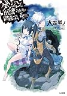

---
categories:
- アニメ
date: Sat, 11 Jul 2015 14:00:00 +0000
slug: post-8041
tags:
- Hulu
title: 【hulu】「ダンジョンに出会いを求めるのは間違っているだろうか」典型的な少年アニメだった
---

huluで見続けていた「ダンジョンに出会いを求めるのは間違っているだろうか」がついに最終回を迎えました。いやーほんとうに面白いアニメでした！見ていて思ったんですが、これって典型的な少年アニメだな〜ということ！今日はただの萌アニメだろと思ってる方に向けて「いや、そんなことないんだ！これは厨ニアニメだ！」ということをお伝えしたく、そんな内容になっております。<!--more--><h2>「ダンジョンに出会いを求めるのは間違っているだろうか」とは？</h2>

いわゆるラノベが原作のアニメです。世界観はRPGゲームのそれを模していてレベルやステータス、アビリティ、ジョブといったものが存在します。
冒険者と呼ばれるダンジョンに潜ることを生業とする人たちがおり、彼らは強大なモンスターに立ち向かうため、神による恩恵を受けています。
そして恩恵を受けるためには、所属の神を決めその組織に所属することが求められます。

要は就職先みたいなものです。ここで大手の神に就職できればいいのですが、弱小の神には冒険者が集まりもせず、さらには享受できるメリットも少なくなります。

主人公のベルは、冒険者に憧れる軟弱な少年。そんな彼を受け入れる組織はおらず、あらゆる神から門前払いを受けておりました。そんな中、拾ってくれたのが神ヘスティア。
この物語は、弱小の二人が組織を大きくするために無茶な冒険をしながらも、一つずつ野望に近づいていく冒険譚なのです！

参考：【hulu】「ダンジョンに出会いを求めるのは間違っているだろうか」が見れるんですね

<h3>評判は？</h3>

Googleトレンドによると放送開始時こそ話題になりましたが、その後は多少失速。

放送第３話目くらいまでは毎週Twitterで見かけましたが、回を追うごとに目にしなくなっていきました。

<h2>これは正当な少年アニメだ！そもそも少年アニメとは・・・ぼくの私見ですが</h2>

少年アニメ、少年漫画といえばジャンプにでてくりょうな、ドラゴンボールだったりNARUTOだったりスラムダンク、ワンピースだったりすると思うんですが、共通してるのって多分「修行」や「試練」「強敵」だと思うんですよね。

<strong>試練や倒せないような強敵にあい、そして一度敗北する。その後、修行を積みレベルアップして倒す。</strong>

これこそが少年アニメなんだと思うんですよ。それと、<strong>その途上で力を貸してくれる仲間の存在。</strong>

そして、ダンジョンに出会いを求めるのは間違っているだろうかに関してもこの要素がばっちり入っています。

主人公ベルは最初はたった一人、そこへ同じく一人の神ヘスティアがあらわれ、力を合わせることになります。
ベルの人柄により支援してくれる人がどんどん増え、敵にやられそうになっても、助けてくれる人も現れます。

そして目標ができ、ひたすら強くなるために修行をする。

そしてやっとレベルアップしたと思ったら、またやられて。

仲間がまたできて、強くなって。。。

そんな繰り返しです。

そしてそれを成すための主人公自体が折れない信念をもち、仲間のために戦い続けます。

これを少年アニメと呼ばずになんと呼びましょう。

そして、少年アニメってなんで魅力的なんだろうって思った時、そこに現実との乖離があって少年アニメへの憧れがあるからだろうなと思いました。

少年アニメは修行すれば強くなり敵を倒せます。仲間もできます。

しかし、現実はどうでしょう。修行とかねーし、そんなぽんぽんレベルアップできねーしw仲間もできねーしwww
まーアニメの中でほんとうにいちいち修行シーンを端折らずに描いてたらそれだけで終わっちゃうんでしょうけどw

でも、まーそんな感じかなと思います。

<strong>努力が報われる世界がそこに広がってる</strong>から
そして助けてくれる仲間がいる。

そんな感じだと思うんですよ。ぼくは。

<a href="http://ck.jp.ap.valuecommerce.com/servlet/referral?sid=3041033&pid=883551022" target="_blank" >海外の映画・ドラマが月額933円（税抜）で今すぐ見放題！今すぐ無料視聴！</a>

<h2><a href="https://twitter.com/s_s_p_y" target="_blank">しんぺー</a> はこう思った。</h2>

ということで、アニメ終わって悲しいので2期きたい。
それと原作ポチりました。

<table  border="0" cellpadding="5" style="border:none"><tr><td style="border:none;text-align:left"><a href="http://www.amazon.co.jp/exec/obidos/ASIN/B00BLCQI70/warawareotoko-22/ref=nosim/" target="_blank" >ダンジョンに出会いを求めるのは間違っているだろうか (GA文庫)</a></td></tr><tr><td style="border:none"><table  border="0" cellpadding="0" style="border:none"><tr><td valign="top" style="border:none"></td><td valign="top" style="border:none;text-align:left">
大森 藤ノ SBクリエイティブ 2013-03-14

売り上げランキング : 86
<table style="border:none;margin-top:10px"><tr><td style="border:none;text-align:left;">
<a href="http://www.amazon.co.jp/gp/search?keywords=%83_%83%93%83W%83%87%83%93%82%C9%8Fo%89%EF%82%A2%82%F0&__mk_ja_JP=%83J%83%5E%83J%83i&tag=warawareotoko-22" target="_blank" >Amazon</a>

<a href="http://hb.afl.rakuten.co.jp/hgc/0f6e221b.2eb9748a.0f6e221c.35cc1e84/?pc=http%3A%2F%2Fsearch.rakuten.co.jp%2Fsearch%2Fmall%2F%25E3%2583%2580%25E3%2583%25B3%25E3%2582%25B8%25E3%2583%25A7%25E3%2583%25B3%25E3%2581%25AB%25E5%2587%25BA%25E4%25BC%259A%25E3%2581%2584%25E3%2582%2592%2F-%2Ff.1-p.1-s.1-sf.0-st.A-v.2%3Fx%3D0%26scid%3Daf_ich_link_urltxt%26m%3Dhttp%3A%2F%2Fm.rakuten.co.jp%2F" target="_blank" >楽天市場</a>

<a href="http://ck.jp.ap.valuecommerce.com/servlet/referral?sid=3041033&pid=882528283&vc_url=http%3A%2F%2Fsearch.shopping.yahoo.co.jp%2Fsearch%3Fp%3D%25E3%2583%2580%25E3%2583%25B3%25E3%2582%25B8%25E3%2583%25A7%25E3%2583%25B3%25E3%2581%25AB%25E5%2587%25BA%25E4%25BC%259A%25E3%2581%2584%25E3%2582%2592" target="_blank" >Yahooショッピング</a>

<a href="http://ck.jp.ap.valuecommerce.com/servlet/referral?sid=3041033&pid=882660047&vc_url=http%3A%2F%2Fauctions.search.yahoo.co.jp%2Fsearch%3Fvo%3D%26ve%3D%26auccat%3D0%26aucminprice%3D%26aucmaxprice%3D%26aucmin_bidorbuy_price%3D%26aucmax_bidorbuy_price%3D%26loc_cd%3D0%26abatch%3D0%26istatus%3D0%26filtered%3D1%26ei%3DUTF-8%26tab_ex%3Dcommerce%26va%3D%25E3%2583%2580%25E3%2583%25B3%25E3%2582%25B8%25E3%2583%25A7%25E3%2583%25B3%25E3%2581%25AB%25E5%2587%25BA%25E4%25BC%259A%25E3%2581%2584%25E3%2582%2592" target="_blank" >ヤフオク!</a>
</td><td style="vertical-align:bottom;padding-left:10px;font-size:x-small;border:none">by <a href="http://kaereba.com" rel="nofollow" target="_blank">カエレバ</a></td></tr></table></td></tr></table></td></tr></table>

と言ったところで本日は以上になります。おやすみなさい。