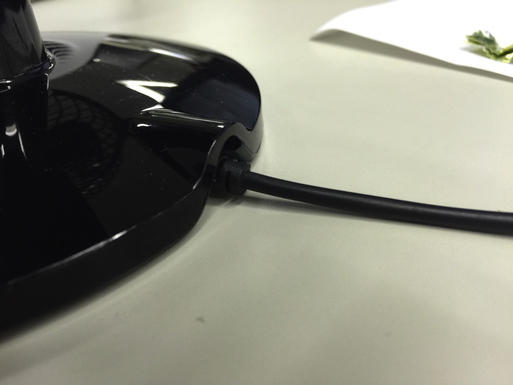
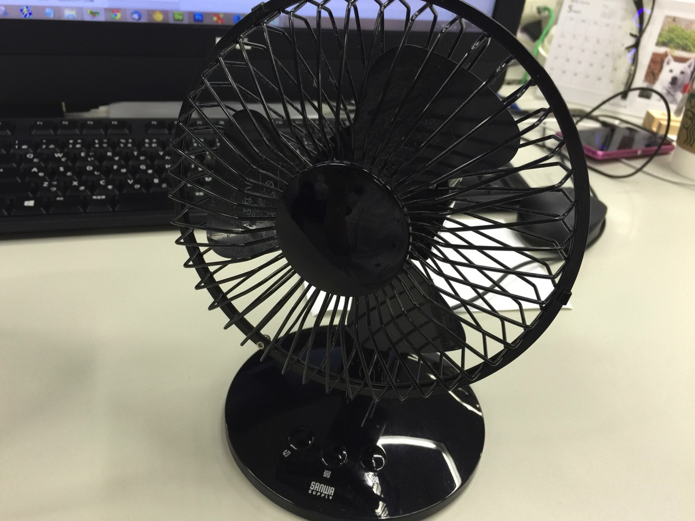
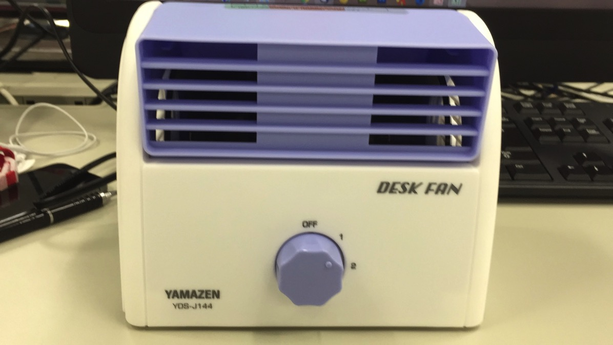
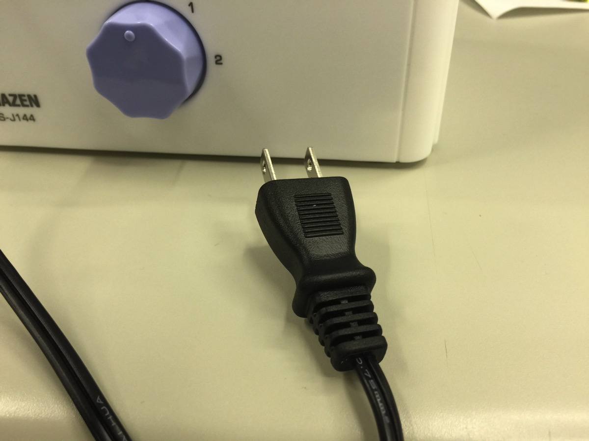
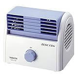

---
categories:
- レビュー
date: Sun, 19 Jul 2015 14:00:08 +0000
slug: post-8101
tags:
- 仕事
title: 今まで数々の卓上扇風機を試してきたwebディレクターの私が選んだ本当に良い扇風機
---

台風が過ぎ、本格的な梅雨明けです。外の気温も30度を越すことが多くなってきました。さてそんな中、最近ではエコや節電といった具合に会社の不要な電気もどんどん削られていっていることでしょう。ぼくの勤める会社も28度固定とかわけのわからないことを言って、温度調節ができなくなっています。だいたい場所によって<strong>人口密度やおっさん密度も違うわけですから、その辺適宜調節できるようにしていただきたい。</strong>

ただ、そうも言ってられませんので最近じゃ卓上扇風機やUSBの小型扇風機なんかを使って工夫する人も多いかと思います。

しかし、中には騒音だけうるさくて、ぜんっぜん風が来ないものとか、値段の割にはつけてもつけなくても一緒みたいなものが多くあると思います。暑がりのぼくはいままで、色々な扇風機を使ってきましたがこれはいいぜ！というのがありましたのでご紹介したいと思います。<!--more-->
<h2>卓上扇風機の選び方</h2>
卓上扇風機でAmazonで検索すると色々な扇風機がでてきます。
ただし、選ぶ際は次の３点を見極めてから注文するようにしましょう。
<ul>
 	<li>風力の強さ</li>
 	<li>音のうるささ</li>
 	<li>耐久度</li>
 	<li>スイッチのオンオフのしやすさ</li>
</ul>
<h3>風力の強さ</h3>
これは当たり前ですが、弱すぎると最悪うちわで扇いだ方が涼しい場合がありますので、<strong>しっかりとした風がくるかを見極める必要があります。</strong>

ただし、風力の強さなんていう数値はありませんのでレビューを見るか写真から判断するくらいしかありません。

それと強すぎるのも微妙です。女性は、男性が暑いと思う室温でもクーラーの影響で寒いと感じていたりする場合があります。
もし席の近くにそういった人がいるのなら、風がそちらまでいってしまうと迷惑をかけてしまうかもしれませんので、大型の扇風機のようなものは控えた方がいいと思います。
<h3>音のうるささ</h3>
これはかなり重要です。職場で使うわけですから人の迷惑になってはいけません。
特に<strong>小型の扇風機は高い異音が聞こえる</strong>印象があります。卓上だからといって小型の扇風機を選ぶとスイッチをつけることすらできなくなるかもしれません。

ここもしっかりとレビューや口コミを見る必要があります。
<h3>耐久度</h3>
卓上におくということは、基本的に狭い範囲におくことになります。さらに机の上で頻繁にポジションを変えることも予想されます。そのため、<strong>電源ケーブルの断線が予想されます。</strong>

（断線して電源が入らないUSB型卓上扇風機）

接触が悪くなると運が悪いと数日で故障したりということもあります。もちろん工業製品ですので当たり外れがありますので、その辺は運とも言えますが。

ただし、なるべくケーブルがしっかりとしているものを買うに越したことはありません。

また、扇風機の羽部分をおおっているところが外れてしまうということもよくあります。特に羽部分は高速回転していますので、例えば書類などを巻き込んでしまうと破いてしまう恐れもあります。この部分もケーブルに続いて壊れやすい部分なので、この辺の構造も見極める必要があります。

（羽のガード部分によくものが巻き込まれました。）

<h3>スイッチのオンオフのしやすさ</h3>
USB型ですとPCの電源と連動しているため、PCのオンオフで電源がきれます。
ただし、web従事者や管理者の場合は職務上電源が切れない場合などあると思います。

ぼくは何かトラブルがあった場合すぐに対応するために電源を切っていません。

またもし、電源を切れる方でも忘れてそのまま帰ってしまうなどはよくあります。さらに作りが安い扇風機ですと長時間の連続使用によりパワーが弱まったり故障の原因になったりもします。最悪モーターの過熱により煙が出たりなんてこともあるかもしれません。

ということで<strong>スイッチがわかりやすい位置にあって、オンオフがし易い</strong>ということを考慮に入れてもいいかもしれません。
<h2>これがぼくが使ってきた中で一番いい卓上扇風機です。</h2>
さて、そんな条件に見合った扇風機がこちらです。

あれ？扇風機じゃないと思いましたか？
いいえこれもれっきとした扇風機です。

側面から空気を吸って、縦回転の羽で前方に風を送る構造になっています。

さらに電源がUSBではなく、普通のコンセントからの供給になります。そのためUSBとは比べものにならないくらいのパワーが確保できます。さらに細い　USBケーブルと異なり、断線の心配もそれほどありません。

見てわかる通り、堅牢な作りになっています。またキーボードと自分の胸の間においても高さがそんなにないので、邪魔になることもありません。

スイッチも全面についているため、切り忘れもありません。

なお、音に関しては不具合のような高い異音はしません。ただパワーゆえの扇風機の音はします。少し静かすぎる場合はきになるかもしれません。

かなりおすすめです。
<table style="border: none;" border="0" cellpadding="5">
<tbody>
<tr>
<td style="border: none; text-align: left;"><a href="http://www.amazon.co.jp/exec/obidos/ASIN/B00TZ9V9T8/warawareotoko-22/ref=nosim/" target="_blank" rel="noopener">山善(YAMAZEN) デスクファン ホワイトブルー YDS-J144(WA)</a></td>
</tr>
<tr>
<td style="border: none;">
<table style="border: none;" border="0" cellpadding="0">
<tbody>
<tr>
<td style="border: none;" valign="top"></td>
<td style="border: none; text-align: left;" valign="top">

山善(YAMAZEN)

売り上げランキング : 926

<table style="border: none; margin-top: 10px;">
<tbody>
<tr>
<td style="border: none; text-align: left;">

<a href="http://www.amazon.co.jp/gp/search?keywords=%8ER%91P%28YAMAZEN%29%20%83f%83X%83N%83t%83%40%83%93%20%83z%83%8F%83C%83g%83u%83%8B%81%5B%20YDS-J144%28WA%29&amp;__mk_ja_JP=%83J%83%5E%83J%83i&amp;tag=warawareotoko-22" target="_blank" rel="noopener">Amazon</a>

<a href="http://hb.afl.rakuten.co.jp/hgc/0f6e221b.2eb9748a.0f6e221c.35cc1e84/?pc=http%3A%2F%2Fsearch.rakuten.co.jp%2Fsearch%2Fmall%2F%25E5%25B1%25B1%25E5%2596%2584%2528YAMAZEN%2529%2520%25E3%2583%2587%25E3%2582%25B9%25E3%2582%25AF%25E3%2583%2595%25E3%2582%25A1%25E3%2583%25B3%2520%25E3%2583%259B%25E3%2583%25AF%25E3%2582%25A4%25E3%2583%2588%25E3%2583%2596%25E3%2583%25AB%25E3%2583%25BC%2520YDS-J144%2528WA%2529%2F-%2Ff.1-p.1-s.1-sf.0-st.A-v.2%3Fx%3D0%26scid%3Daf_ich_link_urltxt%26m%3Dhttp%3A%2F%2Fm.rakuten.co.jp%2F" target="_blank" rel="noopener">楽天市場</a>

<a href="http://ck.jp.ap.valuecommerce.com/servlet/referral?sid=3041033&amp;pid=882528283&amp;vc_url=http%3A%2F%2Fsearch.shopping.yahoo.co.jp%2Fsearch%3Fp%3D%25E5%25B1%25B1%25E5%2596%2584%2528YAMAZEN%2529%2520%25E3%2583%2587%25E3%2582%25B9%25E3%2582%25AF%25E3%2583%2595%25E3%2582%25A1%25E3%2583%25B3%2520%25E3%2583%259B%25E3%2583%25AF%25E3%2582%25A4%25E3%2583%2588%25E3%2583%2596%25E3%2583%25AB%25E3%2583%25BC%2520YDS-J144%2528WA%2529" target="_blank" rel="noopener">Yahooショッピング</a>

<a href="http://ck.jp.ap.valuecommerce.com/servlet/referral?sid=3041033&amp;pid=882660047&amp;vc_url=http%3A%2F%2Fauctions.search.yahoo.co.jp%2Fsearch%3Fvo%3D%26ve%3D%26auccat%3D0%26aucminprice%3D%26aucmaxprice%3D%26aucmin_bidorbuy_price%3D%26aucmax_bidorbuy_price%3D%26loc_cd%3D0%26abatch%3D0%26istatus%3D0%26filtered%3D1%26ei%3DUTF-8%26tab_ex%3Dcommerce%26va%3D%25E5%25B1%25B1%25E5%2596%2584%2528YAMAZEN%2529%2520%25E3%2583%2587%25E3%2582%25B9%25E3%2582%25AF%25E3%2583%2595%25E3%2582%25A1%25E3%2583%25B3%2520%25E3%2583%259B%25E3%2583%25AF%25E3%2582%25A4%25E3%2583%2588%25E3%2583%2596%25E3%2583%25AB%25E3%2583%25BC%2520YDS-J144%2528WA%2529" target="_blank" rel="noopener">ヤフオク!</a>
</td>
<td style="vertical-align: bottom; padding-left: 10px; font-size: x-small; border: none;">by <a href="http://kaereba.com" target="_blank" rel="nofollow noopener">カエレバ</a></td>
</tr>
</tbody>
</table>
&nbsp;</td>
</tr>
</tbody>
</table>
</td>
</tr>
</tbody>
</table>
<h2>扇風機のあたり過ぎは危険</h2>
よく扇風機にあたりながら寝ると死ぬとか、突然死しるとかという都市伝説を聞きます。そんなことはないにしても、扇風機の使用にはいくつか注意点があります。それは、やはり<strong>あたり過ぎ</strong>です。とくに卓上扇風機は直て自分にあてることが多いので、影響をモロにうけます。こまめにスイッチを切ったりして調節することをおすすめします。ちなみに扇風機にあたりすぎることで出る悪影響としてはこんなものがあげられます。ソースは【ぼく】です。
<h3>ドライアイ</h3>
風が至近距離から顔付近にあたりますので、目が乾きます。その結果、ドライアイ気味になることがシバシバあります。

そのため目薬を使うなり、顔には直接風があたらないようにするなりの使い方が必要です。
<h3>肌が荒れる</h3>
扇風機の風が肌にあたりますと、その部分の水分が蒸発しその時に熱を奪うため温度が下がります。しかし、水分がなくなっている分カサついたり、荒れたりすることがたまにある気がします。

といっても、これも顔に限ってのことですので、やはり顔に直接あてるのは避けたほうがいいでしょう。
<h3>自律神経への影響</h3>
体温を調節を自分で行っているわけではなく、扇風機によって強制的に下げているわけですので体の調子は多少狂っていると思います。

そのため長時間の使用は、長い目で見ると体のリズムを崩しているのかなと思います。やはりこまめにつけたり消したりして調節するのがいいかと思います。
<h3>体が疲れる</h3>
ずっと風にあたっていると自分では意識しないほど、疲れていることがあります。
ただし、卓上扇風機を使っているとクセでついつい付けっぱなしになりがちですが、慢性的な疲れをためないためにも気をつけるべきです。
<h2><a href="https://twitter.com/s_s_p_y" target="_blank" rel="noopener">しんぺー</a> はこう思った。</h2>
さていかがだったでしょう。正直ここまで読んでみてもUSB型の扇風機を選択される方がいると思います。その理由は値段が安いというものが最も多いと思います。

夏の暑さを乗り切るためならそれもいいかもしれません。ただ、暑がりという方は間違いなく、少しいいものを買うべきです。性能に関してもあきらかに異なります。寒いのは対策がとれますが、暑いという現象への対策は中々とりずらいものです。

なので、少し奮発して対策してみてもいいのではないしょうか！
<table style="border: none;" border="0" cellpadding="5">
<tbody>
<tr>
<td style="border: none; text-align: left;"><a href="http://www.amazon.co.jp/exec/obidos/ASIN/B00TZ9V9T8/warawareotoko-22/ref=nosim/" target="_blank" rel="noopener">山善(YAMAZEN) デスクファン ホワイトブルー YDS-J144(WA)</a></td>
</tr>
<tr>
<td style="border: none;">
<table style="border: none;" border="0" cellpadding="0">
<tbody>
<tr>
<td style="border: none;" valign="top"></td>
<td style="border: none; text-align: left;" valign="top">

山善(YAMAZEN)

売り上げランキング : 926

<table style="border: none; margin-top: 10px;">
<tbody>
<tr>
<td style="border: none; text-align: left;">

<a href="http://www.amazon.co.jp/gp/search?keywords=%8ER%91P%28YAMAZEN%29%20%83f%83X%83N%83t%83%40%83%93%20%83z%83%8F%83C%83g%83u%83%8B%81%5B%20YDS-J144%28WA%29&amp;__mk_ja_JP=%83J%83%5E%83J%83i&amp;tag=warawareotoko-22" target="_blank" rel="noopener">Amazon</a>

<a href="http://hb.afl.rakuten.co.jp/hgc/0f6e221b.2eb9748a.0f6e221c.35cc1e84/?pc=http%3A%2F%2Fsearch.rakuten.co.jp%2Fsearch%2Fmall%2F%25E5%25B1%25B1%25E5%2596%2584%2528YAMAZEN%2529%2520%25E3%2583%2587%25E3%2582%25B9%25E3%2582%25AF%25E3%2583%2595%25E3%2582%25A1%25E3%2583%25B3%2520%25E3%2583%259B%25E3%2583%25AF%25E3%2582%25A4%25E3%2583%2588%25E3%2583%2596%25E3%2583%25AB%25E3%2583%25BC%2520YDS-J144%2528WA%2529%2F-%2Ff.1-p.1-s.1-sf.0-st.A-v.2%3Fx%3D0%26scid%3Daf_ich_link_urltxt%26m%3Dhttp%3A%2F%2Fm.rakuten.co.jp%2F" target="_blank" rel="noopener">楽天市場</a>

<a href="http://ck.jp.ap.valuecommerce.com/servlet/referral?sid=3041033&amp;pid=882528283&amp;vc_url=http%3A%2F%2Fsearch.shopping.yahoo.co.jp%2Fsearch%3Fp%3D%25E5%25B1%25B1%25E5%2596%2584%2528YAMAZEN%2529%2520%25E3%2583%2587%25E3%2582%25B9%25E3%2582%25AF%25E3%2583%2595%25E3%2582%25A1%25E3%2583%25B3%2520%25E3%2583%259B%25E3%2583%25AF%25E3%2582%25A4%25E3%2583%2588%25E3%2583%2596%25E3%2583%25AB%25E3%2583%25BC%2520YDS-J144%2528WA%2529" target="_blank" rel="noopener">Yahooショッピング</a>

<a href="http://ck.jp.ap.valuecommerce.com/servlet/referral?sid=3041033&amp;pid=882660047&amp;vc_url=http%3A%2F%2Fauctions.search.yahoo.co.jp%2Fsearch%3Fvo%3D%26ve%3D%26auccat%3D0%26aucminprice%3D%26aucmaxprice%3D%26aucmin_bidorbuy_price%3D%26aucmax_bidorbuy_price%3D%26loc_cd%3D0%26abatch%3D0%26istatus%3D0%26filtered%3D1%26ei%3DUTF-8%26tab_ex%3Dcommerce%26va%3D%25E5%25B1%25B1%25E5%2596%2584%2528YAMAZEN%2529%2520%25E3%2583%2587%25E3%2582%25B9%25E3%2582%25AF%25E3%2583%2595%25E3%2582%25A1%25E3%2583%25B3%2520%25E3%2583%259B%25E3%2583%25AF%25E3%2582%25A4%25E3%2583%2588%25E3%2583%2596%25E3%2583%25AB%25E3%2583%25BC%2520YDS-J144%2528WA%2529" target="_blank" rel="noopener">ヤフオク!</a>
</td>
<td style="vertical-align: bottom; padding-left: 10px; font-size: x-small; border: none;">by <a href="http://kaereba.com" target="_blank" rel="nofollow noopener">カエレバ</a></td>
</tr>
</tbody>
</table>
&nbsp;</td>
</tr>
</tbody>
</table>
</td>
</tr>
</tbody>
</table>
と言ったところで本日は以上になります。おやすみなさい。