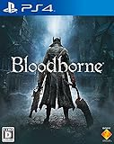

---
categories:
- ゲーム
date: Sat, 25 Jul 2015 14:00:00 +0000
slug: post-8126
tags:
- ゲーム
title: 夏休みは超絶マゾゲー「ブラッドボーン」をやろう！自分の成長を実感できるぞ！
---

PS4ソフトのブラッドボーンをようやくクリアしましたー！！！超絶鬼畜ゲーで、何度も何度も死にました。それでも工夫を凝らしレベルを上げて強敵に挑み撃破した次第です！ 終わった今振り返ってみるとめちゃくちゃ面白いゲームだったなーと思い、本日はご紹介したい次第でございます！<!--more--><h2>ブラッドボーンとは</h2>

プレイステーション4用ソフトのサードパーソンアクションRPGです。

<table  border="0" cellpadding="5" style="border:none"><tr><td style="border:none;text-align:left"><a href="http://www.amazon.co.jp/exec/obidos/ASIN/B00UX0DUCW/warawareotoko-22/ref=nosim/" target="_blank" >Bloodborne（通常版）</a></td></tr><tr><td style="border:none"><table  border="0" cellpadding="0" style="border:none"><tr><td valign="top" style="border:none"></td><td valign="top" style="border:none;text-align:left">
 ソニー・コンピュータエンタテインメント 2015-03-26

売り上げランキング : 364
<table style="border:none;margin-top:10px"><tr><td style="border:none;text-align:left;">
<a href="http://www.amazon.co.jp/gp/search?keywords=%83u%83%89%83b%83h%83%7B%81%5B%83%93&__mk_ja_JP=%83J%83%5E%83J%83i&tag=warawareotoko-22" target="_blank" >Amazon</a>

<a href="http://hb.afl.rakuten.co.jp/hgc/0f6e221b.2eb9748a.0f6e221c.35cc1e84/?pc=http%3A%2F%2Fsearch.rakuten.co.jp%2Fsearch%2Fmall%2F%25E3%2583%2596%25E3%2583%25A9%25E3%2583%2583%25E3%2583%2589%25E3%2583%259C%25E3%2583%25BC%25E3%2583%25B3%2F-%2Ff.1-p.1-s.1-sf.0-st.A-v.2%3Fx%3D0%26scid%3Daf_ich_link_urltxt%26m%3Dhttp%3A%2F%2Fm.rakuten.co.jp%2F" target="_blank" >楽天市場</a>

<a href="http://ck.jp.ap.valuecommerce.com/servlet/referral?sid=3041033&pid=882528283&vc_url=http%3A%2F%2Fsearch.shopping.yahoo.co.jp%2Fsearch%3Fp%3D%25E3%2583%2596%25E3%2583%25A9%25E3%2583%2583%25E3%2583%2589%25E3%2583%259C%25E3%2583%25BC%25E3%2583%25B3" target="_blank" >Yahooショッピング</a>

<a href="http://ck.jp.ap.valuecommerce.com/servlet/referral?sid=3041033&pid=882660047&vc_url=http%3A%2F%2Fauctions.search.yahoo.co.jp%2Fsearch%3Fvo%3D%26ve%3D%26auccat%3D0%26aucminprice%3D%26aucmaxprice%3D%26aucmin_bidorbuy_price%3D%26aucmax_bidorbuy_price%3D%26loc_cd%3D0%26abatch%3D0%26istatus%3D0%26filtered%3D1%26ei%3DUTF-8%26tab_ex%3Dcommerce%26va%3D%25E3%2583%2596%25E3%2583%25A9%25E3%2583%2583%25E3%2583%2589%25E3%2583%259C%25E3%2583%25BC%25E3%2583%25B3" target="_blank" >ヤフオク!</a>
</td><td style="vertical-align:bottom;padding-left:10px;font-size:x-small;border:none">by <a href="http://kaereba.com" rel="nofollow" target="_blank">カエレバ</a></td></tr></table></td></tr></table></td></tr></table>

ダークソウルシリーズの血脈を受け継ぎ、それをさらに進化させた超絶マゾゲーです。基本的に防御という概念がなく、さらに雑魚敵ですら攻撃力がかなり高く、その上大量にでてきたりして、容易にゲームを進行させることができません。 

何度もゲームオーバーになりながら、少しでもレベルアップしていき、工夫を凝らして進めていくゲームです。 

プレイヤーは、ヤーナムという町を訪れた異邦人。そこでは人間を獣にしてしまう病が流行し、それにかかった患者はやがて獣の姿となり、理性を失ってしまいます。プレイヤーは、それを退治する狩人となり物語を進めていきます。

ゲーム自体は中世ヨーロッパのゴシック調で、建築物や服装などもリアルに描かれています。

<h2>ブラッドボーンのここが面白い</h2> 

<ul>
<li>世界のどこかのプレイヤーにメッセージを残せる</li>
<li>世界のどこかのプレイヤーが死んだ場所に墓標が立つ</li> 
<li>マルチプレイ</li>
</ul>

<h3>世界のどこかのプライヤーにメッセージを残せる</h3>

先に言いましたとおり、このゲームかなり難しいです。また理不尽な待ち伏せやトラップなんかも日常茶飯事 

そのためオンライン機能として、警告文とした置き手紙をマップに配置することが可能です。この手紙は、世界のどこかのプライヤーが見ることができるようになっています。 

また、自分が置いた手紙が他のプレイヤーに評価された場合、報酬を受け取ることができるのです。

<h3>世界のどこかのプレイヤーが死んだ場所に墓標が立つ</h3>

次に墓標システムです。

これも他プレイヤーをサポートする機能です。 ゲームオーバーになると、死んだその場所に墓標が立ちます。そして他のプレイヤーがその墓標に触れると、その墓標の持ち主が死ぬまでの陰影が再現されます。

すなわち、墓標が乱立するステージは強敵が多いということを暗示しており、その死因を見ることで同じ轍を踏まないように対策がとれるわけです。

<h3>マルチプレイ</h3>

うえの二つはオンライン機能ですが、マルチプレイ（同時にプレイする機能）ではありません。あくまで一人でプレイするのをサポートするために機能です。

しかし、マルチプレイでは他のプレイヤーを自分の世界に呼び出して同時にプレイすることが可能です。ただ、マルチプレイは3タイプ存在し、自分でマルチプレイを発動することもできますが、敵キャラの能力により強制的にマルチプレイ状態にさせられる場合もあります。

そのマルチプレイの3タイプとは次の通り、「他人に協力する」「他人に協力を仰ぐ」「他人と敵対する」

最後の「他人と敵対する」というものが結構やっかいです。敵キャラの能力で去勢的に他のプレイヤーが呼び出される場合もあり、いつの間にかやってきた他のプレイヤーと戦わなければならなくなったりします。

ここでも鬼畜っぷりを発揮しているゲームです。

<h2>それでもブラッドボーンは面白い！！</h2>

いつ以来だろう。。。こんなに工夫して、やられてもやられても立ち向かったゲームって。

純粋に敵撃破のために頑張り、そして誰も見ていないのに倒してガッツポーズして

とにかく純粋に向き合えるゲームです。

ただし・・・<strong>時間がかかるんだなーーーーこれが！</strong>

一日同じセーブポイントから全く進めないとかザラにあります。
やられまくって。。。

それでも、できなかったことができるようになる瞬間。
ぼくは過去の自分を超えた気になれる。

多分それが成長なんだろうなって

みたいな、そんな気分を味わえるゲームです！！！！

だから夏休みとかでがっつり時間とれる時にやるべし！！

<h2><a href="https://twitter.com/s_s_p_y" target="_blank">しんぺー</a> はこう思った。</h2>

いやー本当に楽しいゲームでした！

実はこのゲーム、一回買って序盤でやめて売ってるんですよぼくwwwというのも、やっぱり無理ゲーと思って諦めたんですね〜一回はw

でも、やっぱりどうしても気になってもう一度購入しました。

それくらい中毒性があるゲームです。

普段スマホゲームでカジュアルにゲームやってる人は、たまにはこういうがっつりゲームをやってみてもいいのではないでしょうか。

と言ったところで本日は以上になります。おやすみなさい。

<table  border="0" cellpadding="5" style="border:none"><tr><td style="border:none;text-align:left"><a href="http://www.amazon.co.jp/exec/obidos/ASIN/B00UX0DUCW/warawareotoko-22/ref=nosim/" target="_blank" >Bloodborne（通常版）</a></td></tr><tr><td style="border:none"><table  border="0" cellpadding="0" style="border:none"><tr><td valign="top" style="border:none"></td><td valign="top" style="border:none;text-align:left">
 ソニー・コンピュータエンタテインメント 2015-03-26

売り上げランキング : 364
<table style="border:none;margin-top:10px"><tr><td style="border:none;text-align:left;">
<a href="http://www.amazon.co.jp/gp/search?keywords=%83u%83%89%83b%83h%83%7B%81%5B%83%93&__mk_ja_JP=%83J%83%5E%83J%83i&tag=warawareotoko-22" target="_blank" >Amazon</a>

<a href="http://hb.afl.rakuten.co.jp/hgc/0f6e221b.2eb9748a.0f6e221c.35cc1e84/?pc=http%3A%2F%2Fsearch.rakuten.co.jp%2Fsearch%2Fmall%2F%25E3%2583%2596%25E3%2583%25A9%25E3%2583%2583%25E3%2583%2589%25E3%2583%259C%25E3%2583%25BC%25E3%2583%25B3%2F-%2Ff.1-p.1-s.1-sf.0-st.A-v.2%3Fx%3D0%26scid%3Daf_ich_link_urltxt%26m%3Dhttp%3A%2F%2Fm.rakuten.co.jp%2F" target="_blank" >楽天市場</a>

<a href="http://ck.jp.ap.valuecommerce.com/servlet/referral?sid=3041033&pid=882528283&vc_url=http%3A%2F%2Fsearch.shopping.yahoo.co.jp%2Fsearch%3Fp%3D%25E3%2583%2596%25E3%2583%25A9%25E3%2583%2583%25E3%2583%2589%25E3%2583%259C%25E3%2583%25BC%25E3%2583%25B3" target="_blank" >Yahooショッピング</a>

<a href="http://ck.jp.ap.valuecommerce.com/servlet/referral?sid=3041033&pid=882660047&vc_url=http%3A%2F%2Fauctions.search.yahoo.co.jp%2Fsearch%3Fvo%3D%26ve%3D%26auccat%3D0%26aucminprice%3D%26aucmaxprice%3D%26aucmin_bidorbuy_price%3D%26aucmax_bidorbuy_price%3D%26loc_cd%3D0%26abatch%3D0%26istatus%3D0%26filtered%3D1%26ei%3DUTF-8%26tab_ex%3Dcommerce%26va%3D%25E3%2583%2596%25E3%2583%25A9%25E3%2583%2583%25E3%2583%2589%25E3%2583%259C%25E3%2583%25BC%25E3%2583%25B3" target="_blank" >ヤフオク!</a>
</td><td style="vertical-align:bottom;padding-left:10px;font-size:x-small;border:none">by <a href="http://kaereba.com" rel="nofollow" target="_blank">カエレバ</a></td></tr></table></td></tr></table></td></tr></table>