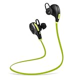
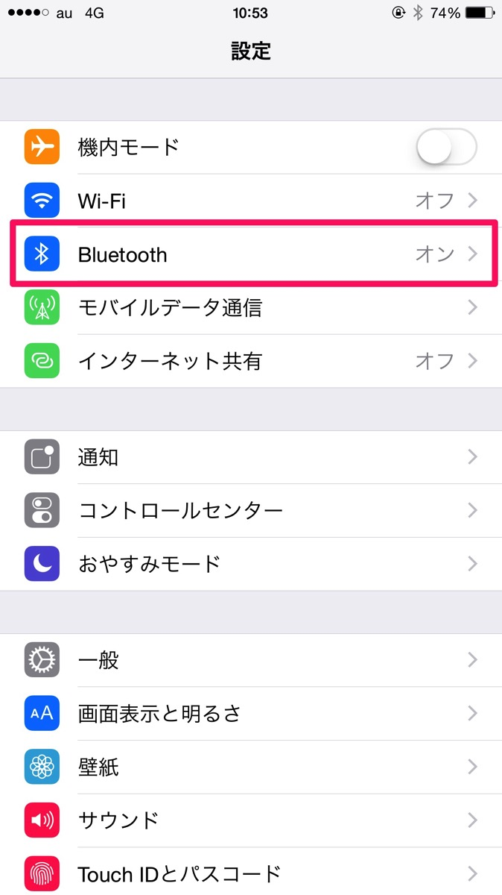
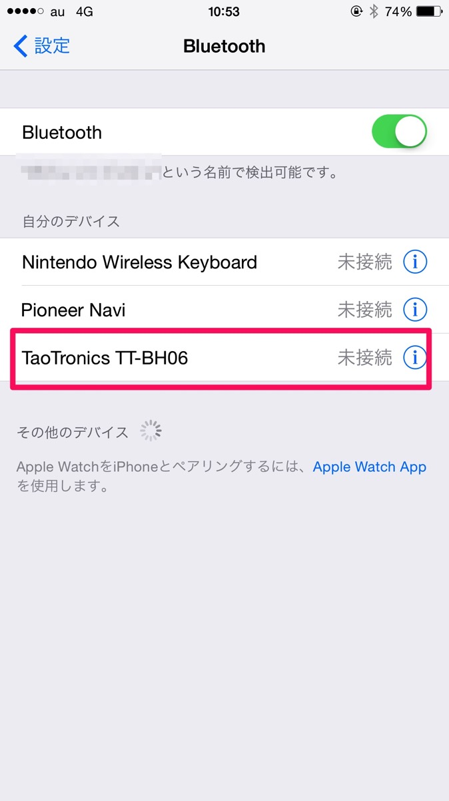

---
categories:
- レビュー
date: Sat, 08 Aug 2015 14:00:00 +0000
slug: post-8191
tags:
- ガジェット
title: Bluetoothイヤホン買ったんだけどマジでおすすめ！
---

通勤時に満員電車で近くの人にイヤホンのケーブルがひかかっちゃったことありませんか？しかも、その人降りようとしてそのままケーブルが持ってかれそうになったり。。。そんなわずらわしさから解放されたいがためにBluetoothイヤホンを買いました。<!--more-->
<h2>Bluetoothイヤホンはマジでおすすめ！</h2>
<table style="border: none;" border="0" cellpadding="5">
<tbody>
<tr>
<td style="border: none; text-align: left;"><a href="http://www.amazon.co.jp/exec/obidos/ASIN/B00YR06VAC/warawareotoko-22/ref=nosim/" target="_blank" rel="noopener">TaoTronics Bluetooth イヤホン 4.0　超小型ワイヤレスステレオヘッドセット【1年間の安心保証】イヤーフック付き　マイク内臓/通話可能　CVC6.0ノイズキャンセルの仕組み　TT-BH06 (グリーン/ブラック)</a></td>
</tr>
<tr>
<td style="border: none;">
<table style="border: none;" border="0" cellpadding="0">
<tbody>
<tr>
<td style="border: none;" valign="top"></td>
<td style="border: none; text-align: left;" valign="top">

TaoTronics

売り上げランキング : 21

<table style="border: none; margin-top: 10px;">
<tbody>
<tr>
<td style="border: none; text-align: left;">

<a href="http://www.amazon.co.jp/gp/search?keywords=TaoTronics%20Bluetooth%20%83C%83%84%83z%83%93%204.0%81%40%92%B4%8F%AC%8C%5E%83%8F%83C%83%84%83%8C%83X%83X%83e%83%8C%83I%83w%83b%83h%83Z%83b%83g%81y1%94N%8A%D4%82%CC%88%C0%90S%95%DB%8F%D8%81z%83C%83%84%81%5B%83t%83b%83N%95t%82%AB&amp;__mk_ja_JP=%83J%83%5E%83J%83i&amp;tag=warawareotoko-22" target="_blank" rel="noopener">Amazon</a>

<a href="http://hb.afl.rakuten.co.jp/hgc/0f6e221b.2eb9748a.0f6e221c.35cc1e84/?pc=http%3A%2F%2Fsearch.rakuten.co.jp%2Fsearch%2Fmall%2FTaoTronics%2520Bluetooth%2520%25E3%2582%25A4%25E3%2583%25A4%25E3%2583%259B%25E3%2583%25B3%25204.0%25E3%2580%2580%25E8%25B6%2585%25E5%25B0%258F%25E5%259E%258B%25E3%2583%25AF%25E3%2582%25A4%25E3%2583%25A4%25E3%2583%25AC%25E3%2582%25B9%25E3%2582%25B9%25E3%2583%2586%25E3%2583%25AC%25E3%2582%25AA%25E3%2583%2598%25E3%2583%2583%25E3%2583%2589%25E3%2582%25BB%25E3%2583%2583%25E3%2583%2588%25E3%2580%25901%25E5%25B9%25B4%25E9%2596%2593%25E3%2581%25AE%25E5%25AE%2589%25E5%25BF%2583%25E4%25BF%259D%25E8%25A8%25BC%25E3%2580%2591%25E3%2582%25A4%25E3%2583%25A4%25E3%2583%25BC%25E3%2583%2595%25E3%2583%2583%25E3%2582%25AF%25E4%25BB%2598%25E3%2581%258D%2F-%2Ff.1-p.1-s.1-sf.0-st.A-v.2%3Fx%3D0%26scid%3Daf_ich_link_urltxt%26m%3Dhttp%3A%2F%2Fm.rakuten.co.jp%2F" target="_blank" rel="noopener">楽天市場</a>

<a href="http://ck.jp.ap.valuecommerce.com/servlet/referral?sid=3041033&amp;pid=882528283&amp;vc_url=http%3A%2F%2Fsearch.shopping.yahoo.co.jp%2Fsearch%3Fp%3DTaoTronics%2520Bluetooth%2520%25E3%2582%25A4%25E3%2583%25A4%25E3%2583%259B%25E3%2583%25B3%25204.0%25E3%2580%2580%25E8%25B6%2585%25E5%25B0%258F%25E5%259E%258B%25E3%2583%25AF%25E3%2582%25A4%25E3%2583%25A4%25E3%2583%25AC%25E3%2582%25B9%25E3%2582%25B9%25E3%2583%2586%25E3%2583%25AC%25E3%2582%25AA%25E3%2583%2598%25E3%2583%2583%25E3%2583%2589%25E3%2582%25BB%25E3%2583%2583%25E3%2583%2588%25E3%2580%25901%25E5%25B9%25B4%25E9%2596%2593%25E3%2581%25AE%25E5%25AE%2589%25E5%25BF%2583%25E4%25BF%259D%25E8%25A8%25BC%25E3%2580%2591%25E3%2582%25A4%25E3%2583%25A4%25E3%2583%25BC%25E3%2583%2595%25E3%2583%2583%25E3%2582%25AF%25E4%25BB%2598%25E3%2581%258D" target="_blank" rel="noopener">Yahooショッピング</a>

<a href="http://ck.jp.ap.valuecommerce.com/servlet/referral?sid=3041033&amp;pid=882660047&amp;vc_url=http%3A%2F%2Fauctions.search.yahoo.co.jp%2Fsearch%3Fvo%3D%26ve%3D%26auccat%3D0%26aucminprice%3D%26aucmaxprice%3D%26aucmin_bidorbuy_price%3D%26aucmax_bidorbuy_price%3D%26loc_cd%3D0%26abatch%3D0%26istatus%3D0%26filtered%3D1%26ei%3DUTF-8%26tab_ex%3Dcommerce%26va%3DTaoTronics%2520Bluetooth%2520%25E3%2582%25A4%25E3%2583%25A4%25E3%2583%259B%25E3%2583%25B3%25204.0%25E3%2580%2580%25E8%25B6%2585%25E5%25B0%258F%25E5%259E%258B%25E3%2583%25AF%25E3%2582%25A4%25E3%2583%25A4%25E3%2583%25AC%25E3%2582%25B9%25E3%2582%25B9%25E3%2583%2586%25E3%2583%25AC%25E3%2582%25AA%25E3%2583%2598%25E3%2583%2583%25E3%2583%2589%25E3%2582%25BB%25E3%2583%2583%25E3%2583%2588%25E3%2580%25901%25E5%25B9%25B4%25E9%2596%2593%25E3%2581%25AE%25E5%25AE%2589%25E5%25BF%2583%25E4%25BF%259D%25E8%25A8%25BC%25E3%2580%2591%25E3%2582%25A4%25E3%2583%25A4%25E3%2583%25BC%25E3%2583%2595%25E3%2583%2583%25E3%2582%25AF%25E4%25BB%2598%25E3%2581%258D" target="_blank" rel="noopener">ヤフオク!</a>
</td>
<td style="vertical-align: bottom; padding-left: 10px; font-size: x-small; border: none;">by <a href="http://kaereba.com" target="_blank" rel="nofollow noopener">カエレバ</a></td>
</tr>
</tbody>
</table>
&nbsp;</td>
</tr>
</tbody>
</table>
</td>
</tr>
</tbody>
</table>
購入時点で2000円程度というかなりのお買い得でした。

設定は簡単、電源入れてペアリングするだけ。

数日使ってみましたが、本当に楽チンです。ケーブルから解放されて、電車や通勤時もからまったりすることないし、音質も悪くないし、バッテリーも長持ちだしいうことなしです。

<strong>Bluetoothイヤホンのメリット</strong>
<ul>
 	<li>コードレスなのでケーブルにわずらわされることがない！</li>
 	<li>バッテリーが長持ちなので、充電も頻繁にしなくていい！</li>
 	<li>よほどじゃないと音質は気にならないくらいにはいいよ！</li>
</ul>
<h2><a href="https://twitter.com/s_s_p_y" target="_blank" rel="noopener">しんぺー</a> はこう思った。</h2>
トイレに行くくらいの距離なら全然音声も途切れないのでイヤホンつけたままでも問題なし！

かなり便利です！

と言ったところで本日は以上になります。おやすみなさい。