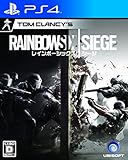
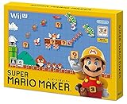
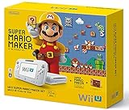
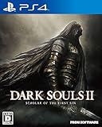

---
categories:
- ゲーム
date: Sun, 09 Aug 2015 14:00:00 +0000
slug: post-8200
tags:
- おすすめ
title: 今気になってるゲーム「レインボーシックス シージ」「マリオメーカー」
---

本日、「<a href="http://www.amazon.co.jp/gp/product/B00NM7ED06/ref=as_li_ss_tl?ie=UTF8&camp=247&creative=7399&creativeASIN=B00NM7ED06&linkCode=as2&tag=warawareotoko-22">バットマン:アーカム・ナイト</a>
」のクリアを諦めて、売りに出すことにしましたしんぺー(<a href="https://twitter.com/s_s_p_y" target="_blank">@s_s_p_y</a> )です。
だって、メンドクセーんだもん。いろいろ。<!--more--><blockquote class="twitter-tweet" lang="ja">
ブラッドボーンやってたからかバットマンぬるすぎ。ボタン押してりゃ敵倒せるけど、ストーリー進めんのに色々とやらされすぎてイラつく。いちいち車に、切り替えさせられるのめんどい。
&mdash; しんぺー@夏終了のお知らせ (@s_s_p_y) <a href="https://twitter.com/s_s_p_y/status/630337948307722240">2015, 8月 9</a></blockquote>

ということで、なんか戦闘もボタン押すだけだし、動き鈍いし。アクションかっこよくて、グラフィックきれいなのはわかる。正直、バットマンファンしか楽しめんわなあれは。

ということで売りに出しました。購入した時が新品で6,308円で4000円分をポイントで買って4,500円（手数料抜くと3,800円くらい）で売れました。

しばらくはゲームを控えて他のことに時間を充てたと思うんですけど、そんな中どうしても気になるゲームがいくつかありますのでご紹介します。

<h2>レインボーシックス シージ</h2>

<table  border="0" cellpadding="5" style="border:none"><tr><td style="border:none;text-align:left"><a href="http://www.amazon.co.jp/exec/obidos/ASIN/B00ZG3FMO0/warawareotoko-22/ref=nosim/" target="_blank" >レインボーシックス シージ 【初回生産限定特典】ゴールドウェポンスキンパック　ダウンロードコード 同梱</a></td></tr><tr><td style="border:none"><table  border="0" cellpadding="0" style="border:none"><tr><td valign="top" style="border:none"></td><td valign="top" style="border:none;text-align:left">
 ユービーアイ ソフト 2015-10-15

売り上げランキング : 358
<table style="border:none;margin-top:10px"><tr><td style="border:none;text-align:left;">
<a href="http://www.amazon.co.jp/gp/search?keywords=%83%8C%83C%83%93%83%7B%81%5B%83V%83b%83N%83X%20%83V%81%5B%83W%20&__mk_ja_JP=%83J%83%5E%83J%83i&tag=warawareotoko-22" target="_blank" >Amazon</a>

<a href="http://hb.afl.rakuten.co.jp/hgc/0f6e221b.2eb9748a.0f6e221c.35cc1e84/?pc=http%3A%2F%2Fsearch.rakuten.co.jp%2Fsearch%2Fmall%2F%25E3%2583%25AC%25E3%2582%25A4%25E3%2583%25B3%25E3%2583%259C%25E3%2583%25BC%25E3%2582%25B7%25E3%2583%2583%25E3%2582%25AF%25E3%2582%25B9%2520%25E3%2582%25B7%25E3%2583%25BC%25E3%2582%25B8%2520%2F-%2Ff.1-p.1-s.1-sf.0-st.A-v.2%3Fx%3D0%26scid%3Daf_ich_link_urltxt%26m%3Dhttp%3A%2F%2Fm.rakuten.co.jp%2F" target="_blank" >楽天市場</a>

<a href="http://ck.jp.ap.valuecommerce.com/servlet/referral?sid=3041033&pid=882528283&vc_url=http%3A%2F%2Fsearch.shopping.yahoo.co.jp%2Fsearch%3Fp%3D%25E3%2583%25AC%25E3%2582%25A4%25E3%2583%25B3%25E3%2583%259C%25E3%2583%25BC%25E3%2582%25B7%25E3%2583%2583%25E3%2582%25AF%25E3%2582%25B9%2520%25E3%2582%25B7%25E3%2583%25BC%25E3%2582%25B8%2520" target="_blank" >Yahooショッピング</a>

<a href="http://ck.jp.ap.valuecommerce.com/servlet/referral?sid=3041033&pid=882660047&vc_url=http%3A%2F%2Fauctions.search.yahoo.co.jp%2Fsearch%3Fvo%3D%26ve%3D%26auccat%3D0%26aucminprice%3D%26aucmaxprice%3D%26aucmin_bidorbuy_price%3D%26aucmax_bidorbuy_price%3D%26loc_cd%3D0%26abatch%3D0%26istatus%3D0%26filtered%3D1%26ei%3DUTF-8%26tab_ex%3Dcommerce%26va%3D%25E3%2583%25AC%25E3%2582%25A4%25E3%2583%25B3%25E3%2583%259C%25E3%2583%25BC%25E3%2582%25B7%25E3%2583%2583%25E3%2582%25AF%25E3%2582%25B9%2520%25E3%2582%25B7%25E3%2583%25BC%25E3%2582%25B8%2520" target="_blank" >ヤフオク!</a>
</td><td style="vertical-align:bottom;padding-left:10px;font-size:x-small;border:none">by <a href="http://kaereba.com" rel="nofollow" target="_blank">カエレバ</a></td></tr></table></td></tr></table></td></tr></table>

テロリスト対特殊部隊のFPSゲームです。

設定を聞いた瞬間にほしいい！と思いました。しかもかなり設定もリアルみたいです。プレイ動画は2broの2人が日本最速実況しているのでこちらを参照ください。

<iframe width="560" height="315" src="https://www.youtube.com/embed/dyOpmjvRaYA" frameborder="0" allowfullscreen></iframe>

ぼくはすでにAmazonで予約していますので発売日に送付されてくるでしょう！

<h2>スーパーマリオメーカー</h2>

<table  border="0" cellpadding="5" style="border:none"><tr><td style="border:none;text-align:left"><a href="http://www.amazon.co.jp/exec/obidos/ASIN/B012RDUHD2/warawareotoko-22/ref=nosim/" target="_blank" >スーパーマリオメーカー (【数量限定特典】限定仕様（ハードカバー）ブックレット 同梱) 【Amazon.co.jp限定】スーパーマリオ30周年オリジナルアクリルカラビナ 付</a></td></tr><tr><td style="border:none"><table  border="0" cellpadding="0" style="border:none"><tr><td valign="top" style="border:none"></td><td valign="top" style="border:none;text-align:left">
 任天堂 2015-09-10

売り上げランキング : 23
<table style="border:none;margin-top:10px"><tr><td style="border:none;text-align:left;">
<a href="http://www.amazon.co.jp/gp/search?keywords=%83X%81%5B%83p%81%5B%83%7D%83%8A%83I%83%81%81%5B%83J%81%5B&__mk_ja_JP=%83J%83%5E%83J%83i&tag=warawareotoko-22" target="_blank" >Amazon</a>

<a href="http://hb.afl.rakuten.co.jp/hgc/0f6e221b.2eb9748a.0f6e221c.35cc1e84/?pc=http%3A%2F%2Fsearch.rakuten.co.jp%2Fsearch%2Fmall%2F%25E3%2582%25B9%25E3%2583%25BC%25E3%2583%2591%25E3%2583%25BC%25E3%2583%259E%25E3%2583%25AA%25E3%2582%25AA%25E3%2583%25A1%25E3%2583%25BC%25E3%2582%25AB%25E3%2583%25BC%2F-%2Ff.1-p.1-s.1-sf.0-st.A-v.2%3Fx%3D0%26scid%3Daf_ich_link_urltxt%26m%3Dhttp%3A%2F%2Fm.rakuten.co.jp%2F" target="_blank" >楽天市場</a>

<a href="http://ck.jp.ap.valuecommerce.com/servlet/referral?sid=3041033&pid=882528283&vc_url=http%3A%2F%2Fsearch.shopping.yahoo.co.jp%2Fsearch%3Fp%3D%25E3%2582%25B9%25E3%2583%25BC%25E3%2583%2591%25E3%2583%25BC%25E3%2583%259E%25E3%2583%25AA%25E3%2582%25AA%25E3%2583%25A1%25E3%2583%25BC%25E3%2582%25AB%25E3%2583%25BC" target="_blank" >Yahooショッピング</a>

<a href="http://ck.jp.ap.valuecommerce.com/servlet/referral?sid=3041033&pid=882660047&vc_url=http%3A%2F%2Fauctions.search.yahoo.co.jp%2Fsearch%3Fvo%3D%26ve%3D%26auccat%3D0%26aucminprice%3D%26aucmaxprice%3D%26aucmin_bidorbuy_price%3D%26aucmax_bidorbuy_price%3D%26loc_cd%3D0%26abatch%3D0%26istatus%3D0%26filtered%3D1%26ei%3DUTF-8%26tab_ex%3Dcommerce%26va%3D%25E3%2582%25B9%25E3%2583%25BC%25E3%2583%2591%25E3%2583%25BC%25E3%2583%259E%25E3%2583%25AA%25E3%2582%25AA%25E3%2583%25A1%25E3%2583%25BC%25E3%2582%25AB%25E3%2583%25BC" target="_blank" >ヤフオク!</a>
</td><td style="vertical-align:bottom;padding-left:10px;font-size:x-small;border:none">by <a href="http://kaereba.com" rel="nofollow" target="_blank">カエレバ</a></td></tr></table></td></tr></table></td></tr></table>

これ、スンゲー楽しそう！！マリオのステージを自分で作れるゲームで、さらにファミコン版、64版みたいな感じでプレイもできるという全世代たのしめるソフトになっているみたいです！

<iframe width="560" height="315" src="https://www.youtube.com/embed/sAZ9Mn7UoHc" frameborder="0" allowfullscreen></iframe>

しかし、ここで問題があります。任天堂ソフトということで当然、Wii Uでしか遊べませんw　このためにWii U買うか？と聞かれると絶対かいません。最近話題の<a href="http://www.amazon.co.jp/gp/product/B00VDVY1C8/ref=as_li_ss_tl?ie=UTF8&camp=247&creative=7399&creativeASIN=B00VDVY1C8&linkCode=as2&tag=warawareotoko-22">Splatoon(スプラトゥーン)</a>もかなり面白そうですが、これもハードの購入の決定打にはなりません。

でも最近Wii Uを買う言い訳を発見しました。それは<a href="http://www.amazon.co.jp/gp/product/B000065V6Q/ref=as_li_ss_tl?ie=UTF8&camp=247&creative=7399&creativeASIN=B000065V6Q&linkCode=as2&tag=warawareotoko-22">MOTHER2 ギーグの逆襲</a>
がやりたいんです！あの伝説のRPG！知らない人もいるかと思いますが既存のRPGの概念を覆したすごい面白いゲームでした。Wii Uならそれをダウンロードしてプレイすることもできます！

<table  border="0" cellpadding="5" style="border:none"><tr><td style="border:none;text-align:left"><a href="http://www.amazon.co.jp/exec/obidos/ASIN/B012RDUK16/warawareotoko-22/ref=nosim/" target="_blank" >Wii U スーパーマリオメーカー セット</a></td></tr><tr><td style="border:none"><table  border="0" cellpadding="0" style="border:none"><tr><td valign="top" style="border:none"></td><td valign="top" style="border:none;text-align:left">
 任天堂 2015-09-10

売り上げランキング : 1279
<table style="border:none;margin-top:10px"><tr><td style="border:none;text-align:left;">
<a href="http://www.amazon.co.jp/gp/search?keywords=%83X%81%5B%83p%81%5B%83%7D%83%8A%83I%83%81%81%5B%83J%81%5B&__mk_ja_JP=%83J%83%5E%83J%83i&tag=warawareotoko-22" target="_blank" >Amazon</a>

<a href="http://hb.afl.rakuten.co.jp/hgc/0f6e221b.2eb9748a.0f6e221c.35cc1e84/?pc=http%3A%2F%2Fsearch.rakuten.co.jp%2Fsearch%2Fmall%2F%25E3%2582%25B9%25E3%2583%25BC%25E3%2583%2591%25E3%2583%25BC%25E3%2583%259E%25E3%2583%25AA%25E3%2582%25AA%25E3%2583%25A1%25E3%2583%25BC%25E3%2582%25AB%25E3%2583%25BC%2F-%2Ff.1-p.1-s.1-sf.0-st.A-v.2%3Fx%3D0%26scid%3Daf_ich_link_urltxt%26m%3Dhttp%3A%2F%2Fm.rakuten.co.jp%2F" target="_blank" >楽天市場</a>

<a href="http://ck.jp.ap.valuecommerce.com/servlet/referral?sid=3041033&pid=882528283&vc_url=http%3A%2F%2Fsearch.shopping.yahoo.co.jp%2Fsearch%3Fp%3D%25E3%2582%25B9%25E3%2583%25BC%25E3%2583%2591%25E3%2583%25BC%25E3%2583%259E%25E3%2583%25AA%25E3%2582%25AA%25E3%2583%25A1%25E3%2583%25BC%25E3%2582%25AB%25E3%2583%25BC" target="_blank" >Yahooショッピング</a>

<a href="http://ck.jp.ap.valuecommerce.com/servlet/referral?sid=3041033&pid=882660047&vc_url=http%3A%2F%2Fauctions.search.yahoo.co.jp%2Fsearch%3Fvo%3D%26ve%3D%26auccat%3D0%26aucminprice%3D%26aucmaxprice%3D%26aucmin_bidorbuy_price%3D%26aucmax_bidorbuy_price%3D%26loc_cd%3D0%26abatch%3D0%26istatus%3D0%26filtered%3D1%26ei%3DUTF-8%26tab_ex%3Dcommerce%26va%3D%25E3%2582%25B9%25E3%2583%25BC%25E3%2583%2591%25E3%2583%25BC%25E3%2583%259E%25E3%2583%25AA%25E3%2582%25AA%25E3%2583%25A1%25E3%2583%25BC%25E3%2582%25AB%25E3%2583%25BC" target="_blank" >ヤフオク!</a>
</td><td style="vertical-align:bottom;padding-left:10px;font-size:x-small;border:none">by <a href="http://kaereba.com" rel="nofollow" target="_blank">カエレバ</a></td></tr></table></td></tr></table></td></tr></table>

そして、スーパーマリオメーカーと抱き合わせで販売もするみたいなので、ちょっと迷い中。。。

<h2>ダークソウル2</h2>

<table  border="0" cellpadding="5" style="border:none"><tr><td style="border:none;text-align:left"><a href="http://www.amazon.co.jp/exec/obidos/ASIN/B00Q88RUMY/warawareotoko-22/ref=nosim/" target="_blank" >DARK SOULS II SCHOLAR OF THE FIRST SIN</a></td></tr><tr><td style="border:none"><table  border="0" cellpadding="0" style="border:none"><tr><td valign="top" style="border:none"></td><td valign="top" style="border:none;text-align:left">
 フロム・ソフトウェア 2015-04-09

売り上げランキング : 248
<table style="border:none;margin-top:10px"><tr><td style="border:none;text-align:left;">
<a href="http://www.amazon.co.jp/gp/search?keywords=%83_%81%5B%83N%83%5C%83E%83%8B2&__mk_ja_JP=%83J%83%5E%83J%83i&tag=warawareotoko-22" target="_blank" >Amazon</a>

<a href="http://hb.afl.rakuten.co.jp/hgc/0f6e221b.2eb9748a.0f6e221c.35cc1e84/?pc=http%3A%2F%2Fsearch.rakuten.co.jp%2Fsearch%2Fmall%2F%25E3%2583%2580%25E3%2583%25BC%25E3%2582%25AF%25E3%2582%25BD%25E3%2582%25A6%25E3%2583%25AB2%2F-%2Ff.1-p.1-s.1-sf.0-st.A-v.2%3Fx%3D0%26scid%3Daf_ich_link_urltxt%26m%3Dhttp%3A%2F%2Fm.rakuten.co.jp%2F" target="_blank" >楽天市場</a>

<a href="http://ck.jp.ap.valuecommerce.com/servlet/referral?sid=3041033&pid=882528283&vc_url=http%3A%2F%2Fsearch.shopping.yahoo.co.jp%2Fsearch%3Fp%3D%25E3%2583%2580%25E3%2583%25BC%25E3%2582%25AF%25E3%2582%25BD%25E3%2582%25A6%25E3%2583%25AB2" target="_blank" >Yahooショッピング</a>

<a href="http://ck.jp.ap.valuecommerce.com/servlet/referral?sid=3041033&pid=882660047&vc_url=http%3A%2F%2Fauctions.search.yahoo.co.jp%2Fsearch%3Fvo%3D%26ve%3D%26auccat%3D0%26aucminprice%3D%26aucmaxprice%3D%26aucmin_bidorbuy_price%3D%26aucmax_bidorbuy_price%3D%26loc_cd%3D0%26abatch%3D0%26istatus%3D0%26filtered%3D1%26ei%3DUTF-8%26tab_ex%3Dcommerce%26va%3D%25E3%2583%2580%25E3%2583%25BC%25E3%2582%25AF%25E3%2582%25BD%25E3%2582%25A6%25E3%2583%25AB2" target="_blank" >ヤフオク!</a>
</td><td style="vertical-align:bottom;padding-left:10px;font-size:x-small;border:none">by <a href="http://kaereba.com" rel="nofollow" target="_blank">カエレバ</a></td></tr></table></td></tr></table></td></tr></table>

ブラッドボーンという超絶マゾゲーのシリーズで、一応前作的な位置づけみたいです。しかも、ブラッドボーンよりも鬼畜度は上という話なので、これはもうかなりやりたいです。多分一ヶ月以内に我慢できなくて買うと思います。

参考：<a href="https://www.warawareotoko.com/2015/07/25/post-8126/">夏休みは超絶マゾゲー「ブラッドボーン」をやろう！自分の成長を実感できるぞ！</a>

これも弟者さんがプレイしてました。

<iframe width="560" height="315" src="https://www.youtube.com/embed/xu3I0dT1Eww" frameborder="0" allowfullscreen></iframe>

<h2><a href="https://twitter.com/s_s_p_y" target="_blank">しんぺー</a> はこう思った。</h2>

ということで今年発売、もしくは発売中のぼくが気になるゲームでした。

今のところ次のゲーム買うまではひたすらラストオブアスのマルチプレイをやっておりますw飽きずにwおもしろいからwやっと調子いい時にキル数２桁いくくらいになったwダメな時はダメダメですがwww

と言ったところで本日は以上になります。おやすみなさい。