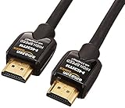
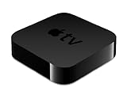
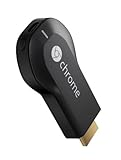

---
categories:
- 海外ドラマ
date: Sun, 16 Aug 2015 14:00:00 +0000
slug: post-8216
tags:
- Hulu
title: huluをテレビで視聴する方法
---

huluの利点としてマルチデバイスで視聴できるというのがあります。PCやスマホ、タブレットで視聴している人が多いかと思います。しかし、どうしても普段つかっているテレビとりは小さい画面になってしまっていると思います。それをどうにかしてテレビで見たいという人も多いと思いますので、その方法をご紹介します。<!--more--><h2>huluをテレビに移す方法：hulu内蔵テレビ</h2>

huluのサイトによると対応機種は次の通り
<ul>
	<li><a href="http://www.sharp.co.jp/support/aquos/doc/internet.html">シャープ テレビ「AQUOS」</a></li>
	<li><a href="http://panasonic.jp/viera/apps/list.html">パナソニック テレビ「VIERA」/ ブルーレイディスクレコーダー「DIGA」</a></li>
	<li><a href="http://qa.support.sony.jp/solution/S1203129003608/">ソニー　テレビ「ブラビア」／ブルーレイディスクプレーヤー</a></li>
	<li><a href="http://www.hulu.jp/support/ja">LG Smart TV シリーズ</a></li>
</ul>

参照：<a href="http://www.hulu.jp/device">http://www.hulu.jp/device</a>

それぞれリモコンでテレビのメニュー画面などから登録、視聴などできるようです。

<h2>huluをテレビに移す方法：ゲーム機</h2>

<ul>
	<li>プレイステーション4</li>
	<li>プレイステーション3</li>
	<li>Xbox360</li>
	<li>Wii</li>
	<li>Wii U</li>
</ul>

参照：<a href="http://www.hulu.jp/device">http://www.hulu.jp/device</a>

ぼくは、プレイステーション4を持っていますがプレイステーションの場合Play Station Networkでストアからhuluの申し込みができるようになっています。

すでに登録してあれば、ログインしてアカウントにアクセスして視聴することができます。

<h2>huluをテレビに移す方法：PCやスマホをミラーリング</h2>

これが実はもっとも手っ取り早い方法なのかなと思います。スマホの画面をテレビにそのまま出力する方法です。

必要なものは次の2つ
・HDMIケーブル：テレビとスマホを接続するため

Amazon純正ケーブルは丈夫かつサイズも選べて、さらに安価なのでおすすめです。ぼくは余分に複数もってます。

<a href="http://www.amazon.co.jp/exec/obidos/ASIN/B003L1ZYYM/warawareotoko-22/ref=nosim/" target="_blank" >Amazonベーシック ハイスピードHDMIケーブル 2.0m (タイプAオス - タイプAオス、イーサネット、3D、4K、オーディオリターン、PS3、PS4、Xbox360対応)</a>
posted with <a href="http://kaereba.com" rel="nofollow" target="_blank">カエレバ</a>

 AmazonBasics 2012-07-03    

・変換コネクタ：スマホとHDMIケーブルを接続するため

Appleの場合はこれを使います。iPhone側から出力するのに必要です。
<table  border="0" cellpadding="5" style="border:none"><tr><td valign="top" style="border:none"></td><td valign="top" style="border:none;text-align:left">
<a href="http://www.amazon.co.jp/exec/obidos/ASIN/B00XP5KLLK/warawareotoko-22/ref=nosim/" target="_blank" >Apple Lightning - Digital AVアダプタ MD826AM/A</a>

 Apple Computer 

売り上げランキング : 64
<table style="border:none;margin-top:10px"><tr><td style="border:none;text-align:left;">
<a href="http://www.amazon.co.jp/gp/search?keywords=Apple%20Lightning%20-%20Digital%20AV%83A%83_%83v%83%5E%20&__mk_ja_JP=%83J%83%5E%83J%83i&tag=warawareotoko-22" target="_blank" >Amazon</a>

<a href="http://hb.afl.rakuten.co.jp/hgc/0f6e221b.2eb9748a.0f6e221c.35cc1e84/?pc=http%3A%2F%2Fsearch.rakuten.co.jp%2Fsearch%2Fmall%2FApple%2520Lightning%2520-%2520Digital%2520AV%25E3%2582%25A2%25E3%2583%2580%25E3%2583%2597%25E3%2582%25BF%2520%2F-%2Ff.1-p.1-s.1-sf.0-st.A-v.2%3Fx%3D0%26scid%3Daf_ich_link_urltxt%26m%3Dhttp%3A%2F%2Fm.rakuten.co.jp%2F" target="_blank" >楽天市場</a>

<a href="http://ck.jp.ap.valuecommerce.com/servlet/referral?sid=3041033&pid=882528283&vc_url=http%3A%2F%2Fsearch.shopping.yahoo.co.jp%2Fsearch%3Fp%3DApple%2520Lightning%2520-%2520Digital%2520AV%25E3%2582%25A2%25E3%2583%2580%25E3%2583%2597%25E3%2582%25BF%2520" target="_blank" >Yahooショッピング</a>

<a href="http://ck.jp.ap.valuecommerce.com/servlet/referral?sid=3041033&pid=882660047&vc_url=http%3A%2F%2Fauctions.search.yahoo.co.jp%2Fsearch%3Fvo%3D%26ve%3D%26auccat%3D0%26aucminprice%3D%26aucmaxprice%3D%26aucmin_bidorbuy_price%3D%26aucmax_bidorbuy_price%3D%26loc_cd%3D0%26abatch%3D0%26istatus%3D0%26filtered%3D1%26ei%3DUTF-8%26tab_ex%3Dcommerce%26va%3DApple%2520Lightning%2520-%2520Digital%2520AV%25E3%2582%25A2%25E3%2583%2580%25E3%2583%2597%25E3%2582%25BF%2520" target="_blank" >ヤフオク!</a>
</td><td style="vertical-align:bottom;padding-left:10px;font-size:x-small;border:none">by <a href="http://kaereba.com" rel="nofollow" target="_blank">カエレバ</a></td></tr></table></td></tr></table>

<h2>huluをテレビに移す方法：AppleTV</h2>

AppleTVを使えばiPhoneの画面をテレビに飛ばすこともできますし、単体でhuluを見ることもできます。

<table  border="0" cellpadding="5" style="border:none"><tr><td valign="top" style="border:none"></td><td valign="top" style="border:none;text-align:left">
<a href="http://www.amazon.co.jp/exec/obidos/ASIN/B007JQGUW0/warawareotoko-22/ref=nosim/" target="_blank" >Apple ハイビジョン対応 Apple TV MD199J/A</a>

 Apple Computer 2012-03-16

売り上げランキング : 174
<table style="border:none;margin-top:10px"><tr><td style="border:none;text-align:left;">
<a href="http://www.amazon.co.jp/gp/search?keywords=appletv&__mk_ja_JP=%83J%83%5E%83J%83i&tag=warawareotoko-22" target="_blank" >Amazon</a>

<a href="http://hb.afl.rakuten.co.jp/hgc/0f6e221b.2eb9748a.0f6e221c.35cc1e84/?pc=http%3A%2F%2Fsearch.rakuten.co.jp%2Fsearch%2Fmall%2Fappletv%2F-%2Ff.1-p.1-s.1-sf.0-st.A-v.2%3Fx%3D0%26scid%3Daf_ich_link_urltxt%26m%3Dhttp%3A%2F%2Fm.rakuten.co.jp%2F" target="_blank" >楽天市場</a>

<a href="http://ck.jp.ap.valuecommerce.com/servlet/referral?sid=3041033&pid=882528283&vc_url=http%3A%2F%2Fsearch.shopping.yahoo.co.jp%2Fsearch%3Fp%3Dappletv" target="_blank" >Yahooショッピング</a>

<a href="http://ck.jp.ap.valuecommerce.com/servlet/referral?sid=3041033&pid=882660047&vc_url=http%3A%2F%2Fauctions.search.yahoo.co.jp%2Fsearch%3Fvo%3D%26ve%3D%26auccat%3D0%26aucminprice%3D%26aucmaxprice%3D%26aucmin_bidorbuy_price%3D%26aucmax_bidorbuy_price%3D%26loc_cd%3D0%26abatch%3D0%26istatus%3D0%26filtered%3D1%26ei%3DUTF-8%26tab_ex%3Dcommerce%26va%3Dappletv" target="_blank" >ヤフオク!</a>
</td><td style="vertical-align:bottom;padding-left:10px;font-size:x-small;border:none">by <a href="http://kaereba.com" rel="nofollow" target="_blank">カエレバ</a></td></tr></table></td></tr></table>

ちなみにAppleTVの設定画面からhuluへの登録などもできます。その場合請求はitunesに登録してあるアカウントになります。

また、純正のリモコンが使いづらいため、テレビリモコンでAppleTVを操作できるように設定すると便利です。

もしくは、remoteというアプリを使えば文字入力もかなりiphoneからすることができます。

<a href="https://itunes.apple.com/jp/app/remote/id284417350?mt=8&uo=4&at=11ld5P" target="_blank" >Remote</a>

無料

(2015.08.16時点)

<a href="https://itunes.apple.com/jp/artist/apple/id284417353?mt=12&uo=4&at=11ld5P" target="_blank" >Apple</a>

posted with <a href="http://pochireba.com" rel="nofollow" target="_blank">ポチレバ</a>

ちなみに、9月のアップルの新製品発表会で新しいタイプが発表される噂がありますので、最新のものを購入した方がいいかもしれません。

<h2>huluをテレビに移す方法：クロームキャスト</h2>

クロームキャストの設定はかんたん。テレビに接続して設定するだけ。ただし一つネックなのが本体への電力供給です。テレビにUSBがついていればいいのですが、もしない場合は電源を考えなければいけません。

一応違いを説明しておきますと、

クロームキャストの利点はAppleTVよりも安いとことです。
それでいてAppleTVとできることとそう違いがありません。

クロームキャストはスマホやPCのクロームで開いているページをテレビに写すミラーリング専用みたいなものです。

いっぽう、AppleTVはもう少し高機能でミラーリングもできますし単体でhuluやyoutubeに接続することができます。その分クロームキャストよりも高額です。

<table  border="0" cellpadding="5" style="border:none"><tr><td valign="top" style="border:none"></td><td valign="top" style="border:none;text-align:left">
Google Chromecast ( Wi-Fi経由 テレビ接続 ストリーミング / HDMI / 802.11b/g/n / 1080p ) GA3A00035A16

 Google 

売り上げランキング : 10
<table style="border:none;margin-top:10px"><tr><td style="border:none;text-align:left;">
<a href="http://www.amazon.co.jp/gp/search?keywords=appletv&__mk_ja_JP=%83J%83%5E%83J%83i&tag=warawareotoko-22" target="_blank" >Amazon</a>

<a href="http://hb.afl.rakuten.co.jp/hgc/0f6e221b.2eb9748a.0f6e221c.35cc1e84/?pc=http%3A%2F%2Fsearch.rakuten.co.jp%2Fsearch%2Fmall%2Fappletv%2F-%2Ff.1-p.1-s.1-sf.0-st.A-v.2%3Fx%3D0%26scid%3Daf_ich_link_urltxt%26m%3Dhttp%3A%2F%2Fm.rakuten.co.jp%2F" target="_blank" >楽天市場</a>

<a href="http://ck.jp.ap.valuecommerce.com/servlet/referral?sid=3041033&pid=882528283&vc_url=http%3A%2F%2Fsearch.shopping.yahoo.co.jp%2Fsearch%3Fp%3Dappletv" target="_blank" >Yahooショッピング</a>

<a href="http://ck.jp.ap.valuecommerce.com/servlet/referral?sid=3041033&pid=882660047&vc_url=http%3A%2F%2Fauctions.search.yahoo.co.jp%2Fsearch%3Fvo%3D%26ve%3D%26auccat%3D0%26aucminprice%3D%26aucmaxprice%3D%26aucmin_bidorbuy_price%3D%26aucmax_bidorbuy_price%3D%26loc_cd%3D0%26abatch%3D0%26istatus%3D0%26filtered%3D1%26ei%3DUTF-8%26tab_ex%3Dcommerce%26va%3Dappletv" target="_blank" >ヤフオク!</a>
</td><td style="vertical-align:bottom;padding-left:10px;font-size:x-small;border:none">by <a href="http://kaereba.com" rel="nofollow" target="_blank">カエレバ</a></td></tr></table></td></tr></table>

<h2><a href="https://twitter.com/s_s_p_y" target="_blank">しんぺー</a> はこう思った。</h2>

秋にはnetflixも日本に上陸しますので、ますますストリーミングサービスが充実することになるでしょう。それと同時に視聴環境もそれにあわせて進化していくことを期待しております。さらに期待しているのは料金がさがったらいいよね〜みたな

と言ったところで本日は以上になります。おやすみなさい。