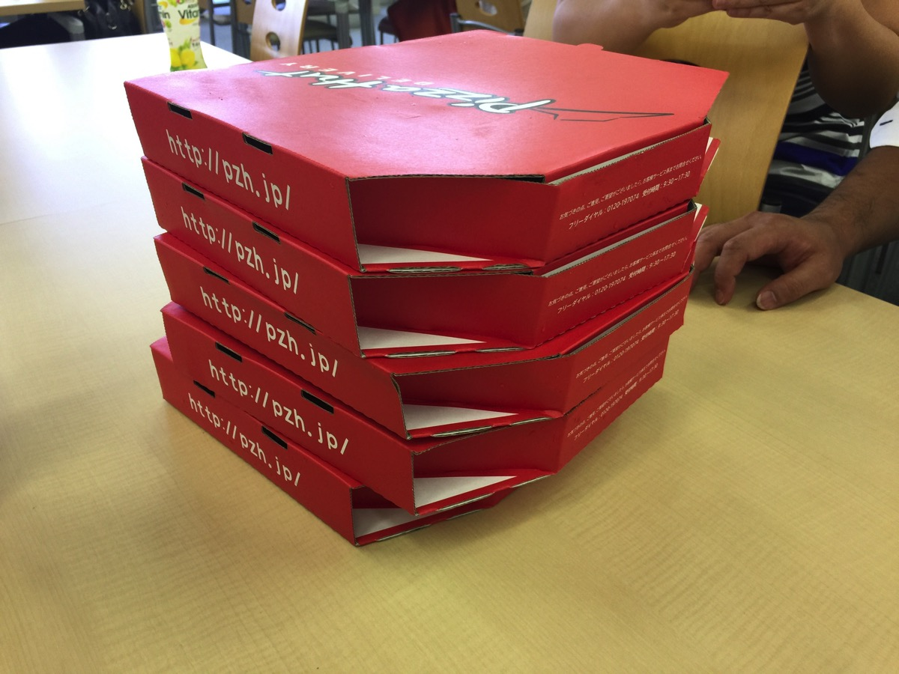
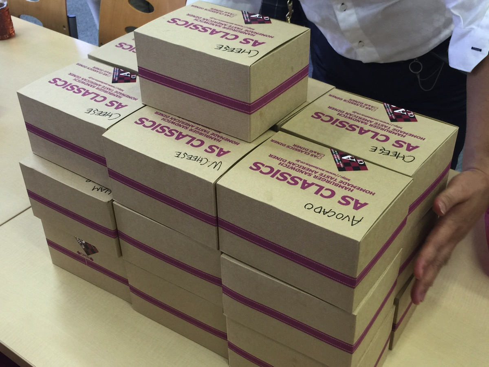
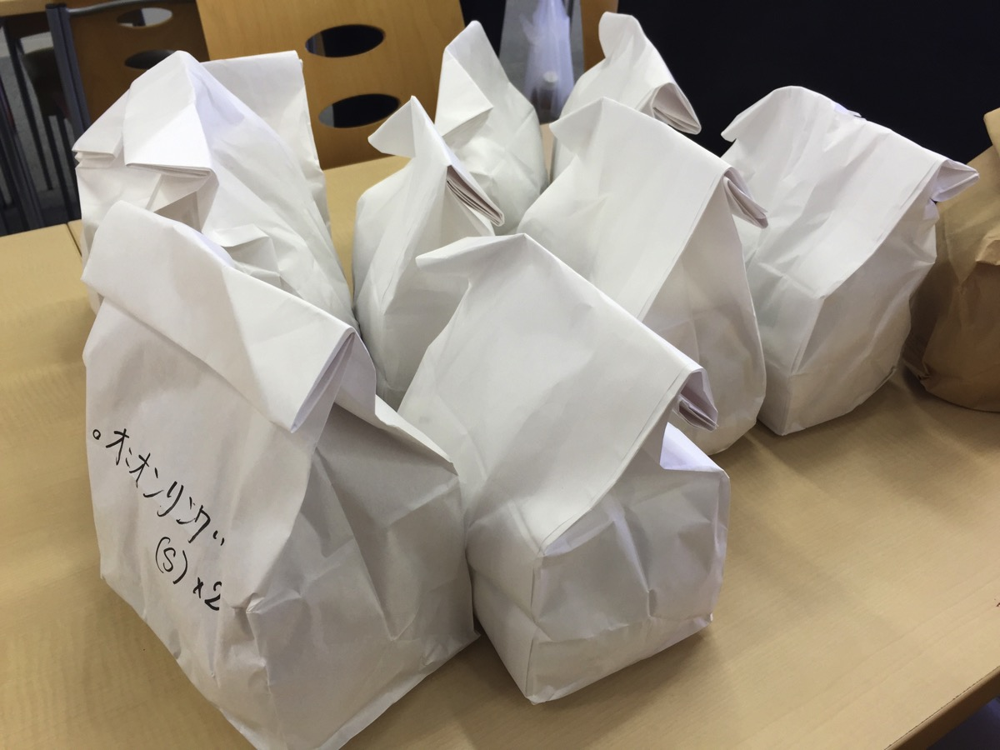
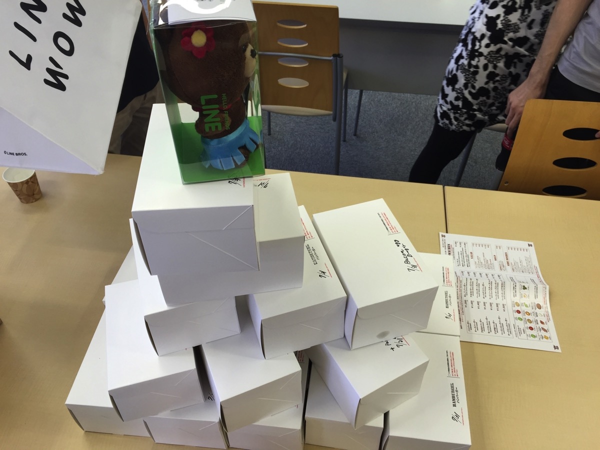
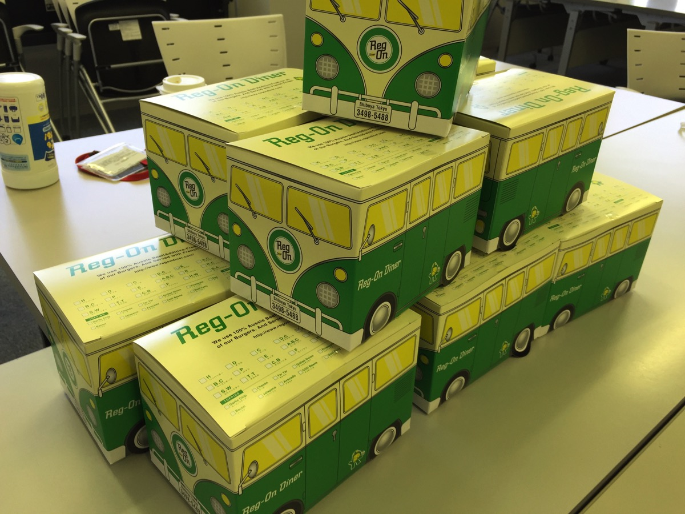

---
categories:
- LINE WOWの思い出
date: Wed, 19 Aug 2015 13:37:00 +0000
slug: post-8229
tags:
- LINE WOW
title: 【LINE WOW】ピザハットでデリバリーしてもらいつつ半額で食べる方法
---

ピザハットの会社がかなり不便な場所に移転しました。 それまでは隣のビルにスタバがあったり、まわりに食べログ高得点のお店がいっぱいあったりしてランチで退屈することなんてありませんでした。 しかし、今はすべての最寄駅から等しく遠く、ロクな店が周囲に一軒もありません。仕方なく、ほぼ毎日出前をとってます。<!--more-->で、いつもはLINE WOWやCoCo壱番屋のテイクアウトなんかを注文してるんですが、ふと思いつきました。ピザハットはデリバリーしてもらうと定価での料金になりますが、テイクアウトだと半額になります。それをLINE WOWに持ってきてもらったら半額のままデリバリーしてもらったことになるんじゃね？

ってことで、本日のランチは同僚と<strong>デリバリーしてもらったのにピザを半額で食べました。</strong>

どーん！！

6人で頼んで定価10,000円以上するところを1人1,000円で済んで、もーいらねーよー！ってくらい腹一杯ピザを喰らったぜ！ 

いやーまじでLINE WOWは便利。これで手数料は500円しかかかりません。

一緒にランチする人を多く募って頼めば頼むほど、バリューがでます。
ぼくは毎週都心のグルメバーガーを20人ほどで注文して、食しております。まじでしあわせ。

<h2>LINE WOWでいつもどれくらい注文してるかというと・・・</h2>

どーん！！食べログ東京ハンバーガーランキング上位のASクラシックダイナー うまい！パンが懐かしい味

どーん！！食べログ東京ハンバーガーランキング上位のハラカラ。しょっぱくない控えめな塩っぽいおしゃれな味が特徴

どーん！！食べログ東京ハンバーガーランキング上位のブラッカウズ。五反田の最上級人気ハンバーガーステーキショップのミート矢澤が手がけるハンバーガー屋。バンズへのこだわりは伊達じゃない

どーん！！今まで食べたハンバーガーで1番美味しい。最強最高グルメハンバーガーのレッグオンダイナー

ごらんのように常に20個以上をまとめて注文しています。

それでも手数料500円！！！

まだこの感動をあじわったことがない人はぜひ利用をおすすめします。

<h2>おまけ:CoCo壱番屋のテイクアウト</h2>

ちなみにハンバーガーじゃない時は、普通にデリバリーしてる店に直接注文したりもします。

だいたいCoCo壱番屋は30分くらいで届けてくれるので、助かります。LINEと違って2,500円以上の注文であれば手数料は無料。<strong>会社に届けてもらう時は自分の名前のあとに内線番号を入れるとスムーズですよ！</strong>

出前館で頼むとポイントが貯まるみたいです。→<a href="">出前館</a>
ただ、楽天経由でも注文できるのでぼくはいつもそちらを利用していますが。

 <h2>しんぺーはこう思った。</h2>

とにかくLINE WOWは便利

今までいちいち電話注文してましたが、アプリ内からメッセージでの注文にも対応してます。実はそっちの方がオペレーターの方にも伝達しやすかったりでスムーズでした。 ということで、いつも弁当や近所のコンビニでランチを済ませてるなら、週一くらいで贅沢をしてみてはいかがでしょうか？ 心弾みテンションもあがります！！ といったところで本日は以上になります。 おやすみなさい。