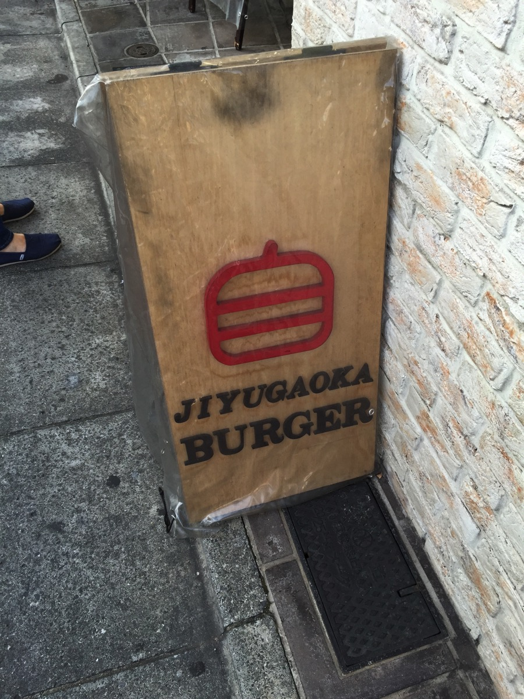
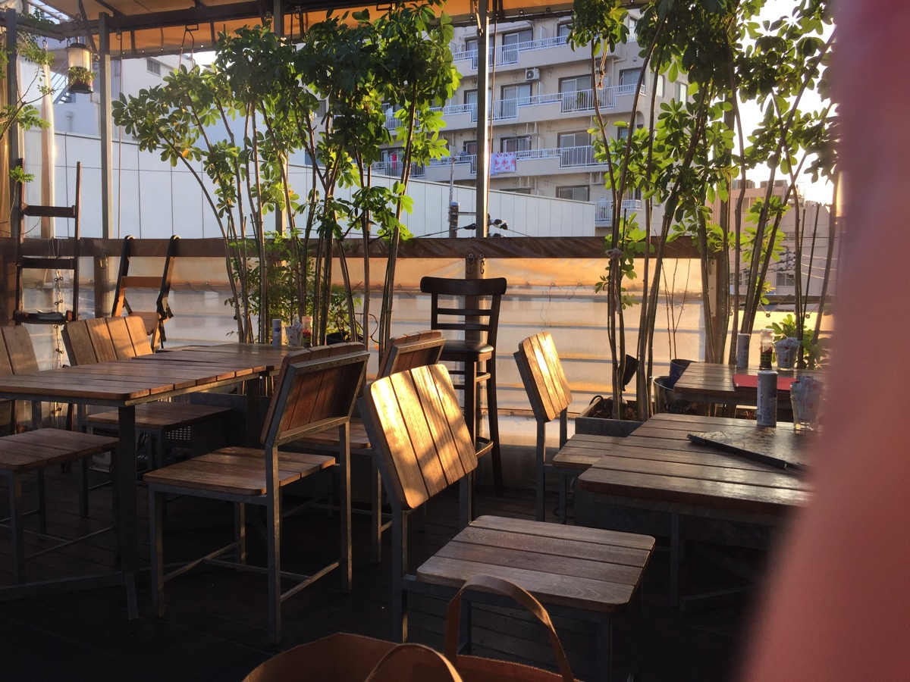
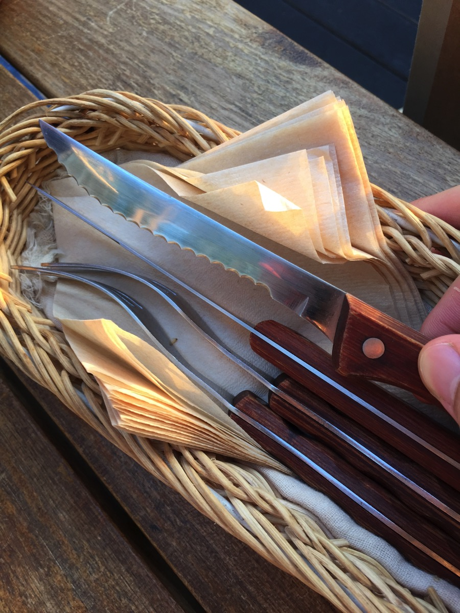
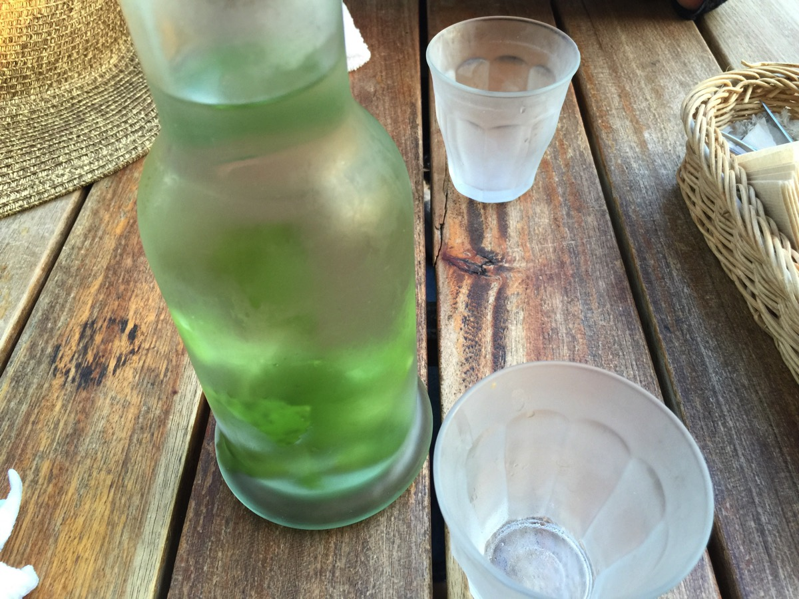
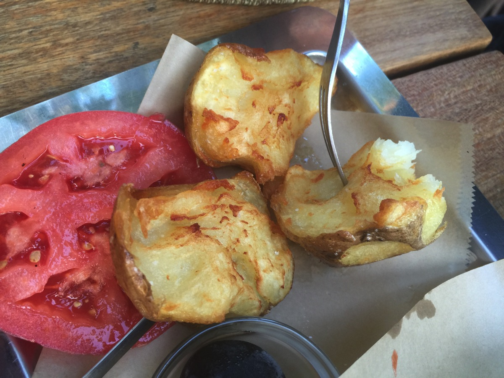
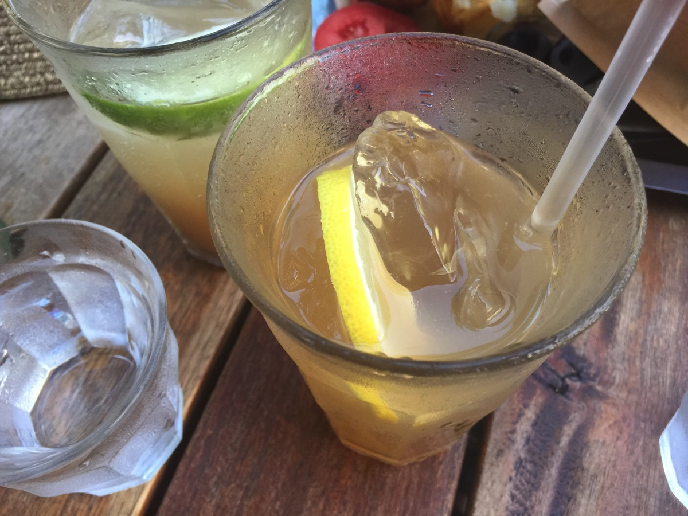
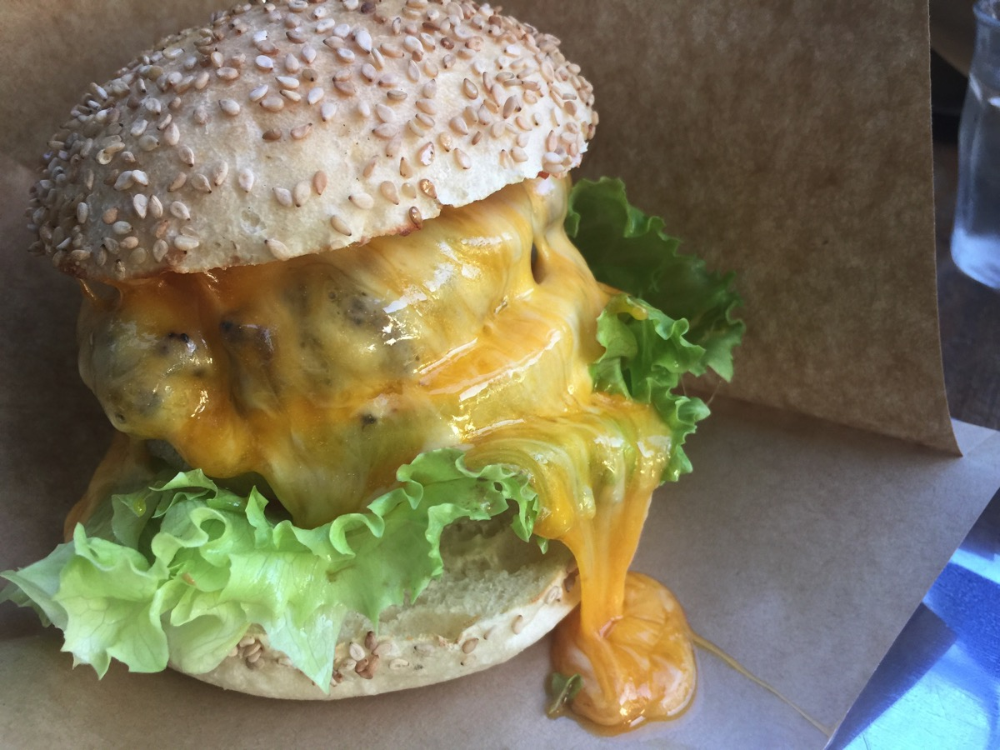
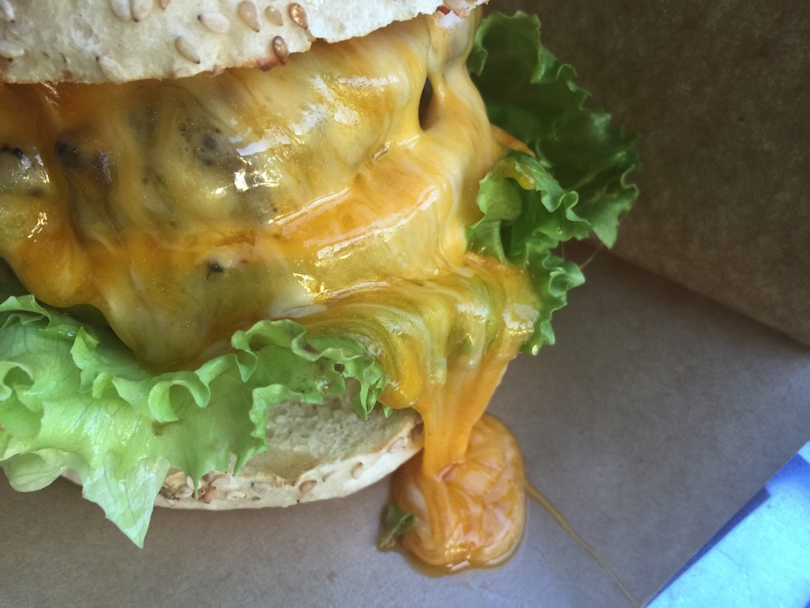
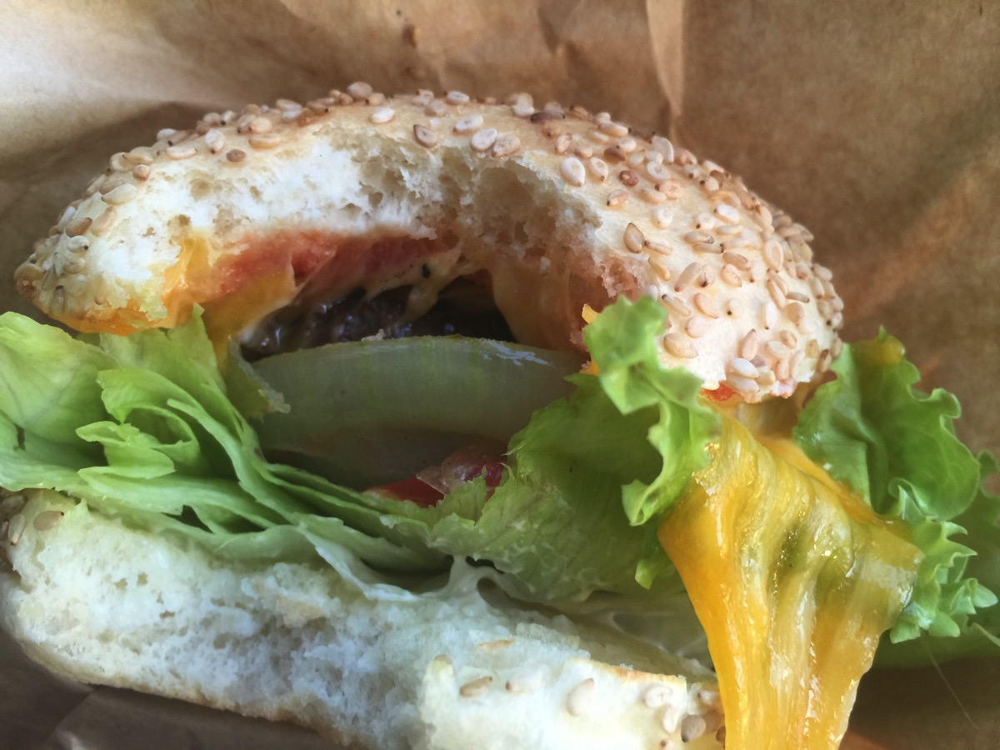

---
categories:
- グルメ
date: Sat, 22 Aug 2015 14:00:00 +0000
slug: post-8250
tags:
- グルメ
title: こんなチーズバーガーもポテトも食べたことない！自由が丘バーガーがオシャレで美味しかった
---

昨日、自由が丘にいく用事があったのでせっかくなので近場のハンバーガー屋を検索してたまたま目に止まったお店で昼を食べることにしました。そしたら美味しかったのでご紹介いたします。<!--more--><h2>自由が丘バーガー</h2>

いってきたのはこちら自由が丘にありますハンバーガー屋さん「自由が丘バーガー」です。

到着した時は微妙な時間でランチの時間が終わって休憩中でした。夜は17:30からオープンということで5分ほどまつことに。そしたら次から次へとぼくの後ろに列ができて、オープンすると同時に満席となりました。

さらに、ちょうど二子玉川の花火大会が開催される日だったので、夜19時以降は予約満席とのことでした。ここから見えるかは微妙そうですが。。。

店内はテラス席となっております。

この形状のナイフがでてくるということは、バンズに自信があるということです。

水にミントが入っておりました。オシャン

で、でてきたポテトがこちら。こんな丸ごとなのにもかかわらず、疲れることなくパクパク食べられました。しかも、甘いというかなんかパンケーキを食べてるくらいのほんのりした甘さと絶妙なやわらかさ。

レモネードもうまし

で、でてきたチーズバーガーがこちら
こんなにチーズがとろけてるハンバーガーは初めてです。

溶岩のように溢れ出てます。ドロドロ

で、このハンバーガー随分と背が高いなと思ったら、中はしっかりしたバンズと野菜ぎっしりでした。

味が若干薄い気がしましたが、テーブルの上にある塩をまぶして食べたらびっくり！！！めっちゃうまかったです！！テーブルの上にはケチャップ、こしょう、塩と置いてありましたが、ケチャップよりも塩をだんぜんおすすめします！！

<strong><a href="http://tabelog.com/tokyo/A1317/A131703/13054778/" target="_blank">自由が丘バーガー</a></strong>

<strong>関連ランキング：</strong><a href="http://tabelog.com/rstLst/hamburger/">ハンバーガー</a> | <a href="http://tabelog.com/tokyo/A1317/A131703/R4885/rstLst/">自由が丘駅</a>、<a href="http://tabelog.com/tokyo/A1317/A131711/R1991/rstLst/">奥沢駅</a>、<a href="http://tabelog.com/tokyo/A1317/A131711/R9533/rstLst/">緑が丘駅</a>

<h2>おまけ：パティスリー・パリ セヴェイユ （patisserie Paris S'eveille）</h2>

実は自由が丘に行った理由が、このお店のケーキを買うことでした〜

ここで売ってるフォンダンショコラがめっちゃくちゃうまいのです。
ぼくが今まで食べたケーキの中で一番おいしいと思います！！1日100個限定！
でも1個がやすい！値段忘れましたがサイズが割と小さめなので1コインいないで買えるはずです。

<strong><a href="http://tabelog.com/tokyo/A1317/A131703/13005198/" target="_blank">パティスリー・パリ セヴェイユ</a></strong>

<strong>関連ランキング：</strong><a href="http://tabelog.com/rstLst/cake/">ケーキ</a> | <a href="http://tabelog.com/tokyo/A1317/A131703/R4885/rstLst/">自由が丘駅</a>、<a href="http://tabelog.com/tokyo/A1317/A131715/R3507/rstLst/">九品仏駅</a>、<a href="http://tabelog.com/tokyo/A1317/A131711/R1991/rstLst/">奥沢駅</a>

<h2><a href="https://twitter.com/s_s_p_y" target="_blank">しんぺー</a> はこう思った。</h2>

自由が丘って、オシャレな感じと古い感じが同居してて、いきかう人々みな鼻に付くw
そして、高低差があって道が狭いからちょっと危険だなーと思う。

よってあんまり好きじゃないんですけど←

でもフォンダンショコラはおいしいのでおすすめです。あとハンバーガー屋も

本日は意外な収穫の自由が丘バーガーのご紹介でした。

と言ったところで本日は以上になります。おやすみなさい。