---
categories:
- 各メンバーの個人イベントレポなど
date: Sun, 23 Aug 2015 14:00:00 +0000
slug: post-8263
tags:
- イベントレポ
- 京
- 個展
title: 【イベントレポ】京個展2015「我葬」＠GALLERY LE DECO
---

本日参列してまいりました。京の個展「我葬」

開催期間終了しましたので感想をここに残します。<!--more-->
<h2>個展会場の様子</h2>
<h3>場所はここ</h3>
GALLERY LE DECO

オノマトペ
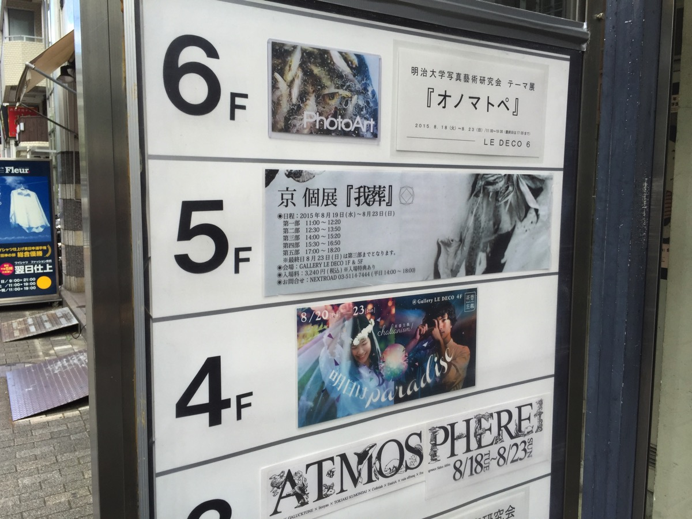

<iframe style="border: 0;" src="https://www.google.com/maps/embed?pb=!1m18!1m12!1m3!1d1616.1098736313052!2d139.70515199999844!3d35.65615299763449!2m3!1f0!2f0!3f0!3m2!1i1024!2i768!4f13.1!3m3!1m2!1s0x60188b5bc20cc5af%3A0x25eb06262ee7942a!2z44Ku44Oj44Op44Oq44O844O744Or44OH44Kz!5e0!3m2!1sja!2sjp!4v1440342922477" width="600" height="450" frameborder="0" allowfullscreen="allowfullscreen"></iframe>
<h3>入場から物販までの流れ</h3>
チケットの下2桁がそれぞれの回の入場番号でした。
整理番号順に呼ばれ、整列して1階にて受付を済ませました。その後物販列に並んで購入後に個展会場である5階にエレベーターであがりました。

とその前に唯一撮影がOKだった物販ブースに飾ってあった作品がこちら。
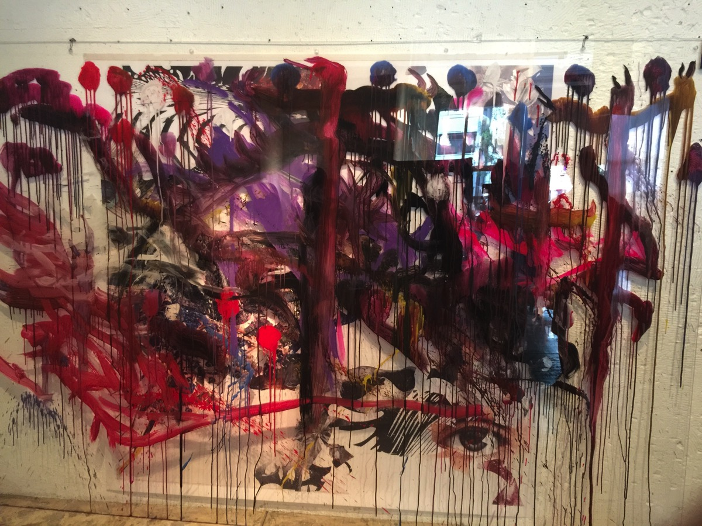

こちらの動画で京が描いているもののようです。

<iframe src="https://www.youtube.com/embed/UdPrf_qno6E" width="560" height="315" frameborder="0" allowfullscreen="allowfullscreen"></iframe>

なお、こちらのツイートの内容がなぞだったんですが、展示している作品を各3万円で購入できる予約のことだったみたいです。
<blockquote class="twitter-tweet" lang="ja">

本日は「我葬」にご来場頂き、誠にありがとうございました。設営不備につき、展示品の予約受付を行えず、申し訳ございませんでした。初日ご来場者様でご予約を希望の方は会期中に再度ご来場、もしくはご連絡頂きますようお願い申し上げます。kyo_info@kyo-official.jp (S)

— 京 (@kyo_official) <a href="https://twitter.com/kyo_official/status/633965187029037056">2015, 8月 19</a></blockquote>

それとマネキンが2体展示され、さらに香水？もありました。匂いわからんかったが・・・いずれブランド化して発売されるのでしょう。

一階はこんな感じの配置

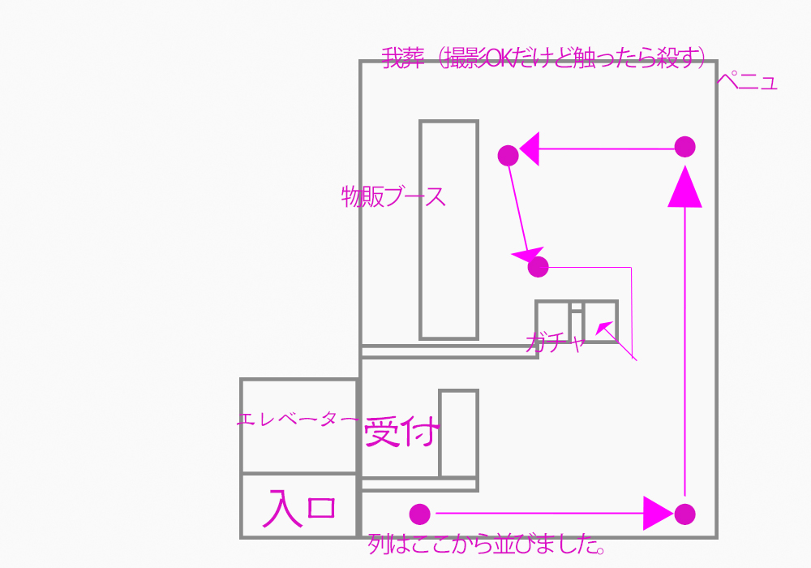
<h3>無情に鳴り響くDVD付き版完売のお知らせ</h3>
おそらくですが各時間30名くらいまでがサイン会入場券を入手できたみたいです。
5日の日程で5時間帯ずつ（最終日3時間帯）なので、サイン会合計人数はおそらく700名前後という計算になりますが・・・
いや、そんなわけないよな・・・多すぎだろそれじゃ

んーでもツイート見てると30番前後で切られてるっぽいしな

一応サイン会待ちの虜たち
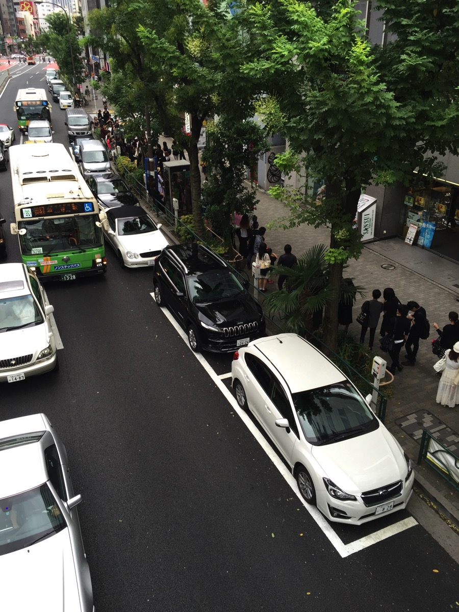

でもサイン会は数時間に及んだみたいだし、相当数入れたかも。。。にしても会場でDVD付き買えると思ってたので、それだけが残念。ヤフオク探すかとか色々考えてますが、どうも詩集自体の仕様に違いはなくDVDがついてるかどうかのみのようです。DVDのインタビューみたい・・・
<h3>個展会場内の様子</h3>
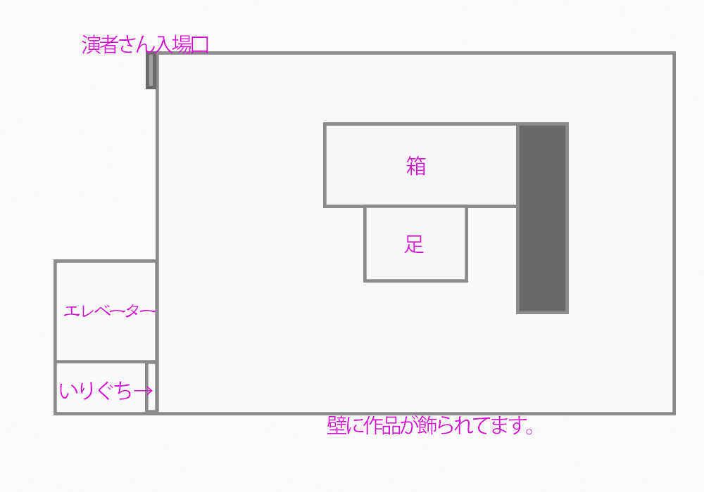

壁に作品が展示され、全部で50作品くらいありました。
また、映像が放映されており終始音楽というか音声が流れていました。会場内の照明は明るすぎず暗い感じでした。

また箱についてですが、茶屋のにじり口のごとき狭い入り口から内部に侵入し音声を聞くというものでした。

参考：にじり口

"<a href="https://commons.wikimedia.org/wiki/File:Meimeian08n4592.jpg#/media/File:Meimeian08n4592.jpg">Meimeian08n4592</a>" by <a class="extiw" title="ja:user:663highland" href="//ja.wikipedia.org/wiki/user:663highland">663highland</a> - <a class="extiw" title="ja:user:663highland" href="//ja.wikipedia.org/wiki/user:663highland">663highland</a>. Licensed under <a title="Creative Commons Attribution 2.5" href="http://creativecommons.org/licenses/by/2.5">CC 表示 2.5</a> via <a href="https://commons.wikimedia.org/wiki/">ウィキメディア・コモンズ</a>.

中には腕のオブジェと人間の頭部のオブジェが配置されており、ヘッドホンが用意されていました。腕の部分にボタンがあり、そのスイッチを押すとヘッドホンから京の声で朗読が始まります。頭部にその朗読されている詩が映し出されるというものでした。

また、途中照明がいきなり赤くなり、万有引力よろしく怪しげな動きの女性が現れパフォーマンスを行ったのちに去っていきました。

入場口のちょうど前にいたので、井上さんに「気持ち壁側に」って言って動かされましたw　なんだろう？って思ってたからびびったw

あと展示は日替わりとの情報がありました。毎日変わってたのかな？
ちなみに中央の映像流れてるところの前に足のオブジェがあったんだけど、多分京さんのあんよだね。ってか箱の中の手もきっとそうだろう。
<h2>本日入手したグッズたち</h2>
リーフレット。みんな受け取ってから開こうとして「？」ってなってた。
なぜなら圧着されていて、袋綴じ状になっていたのでした。
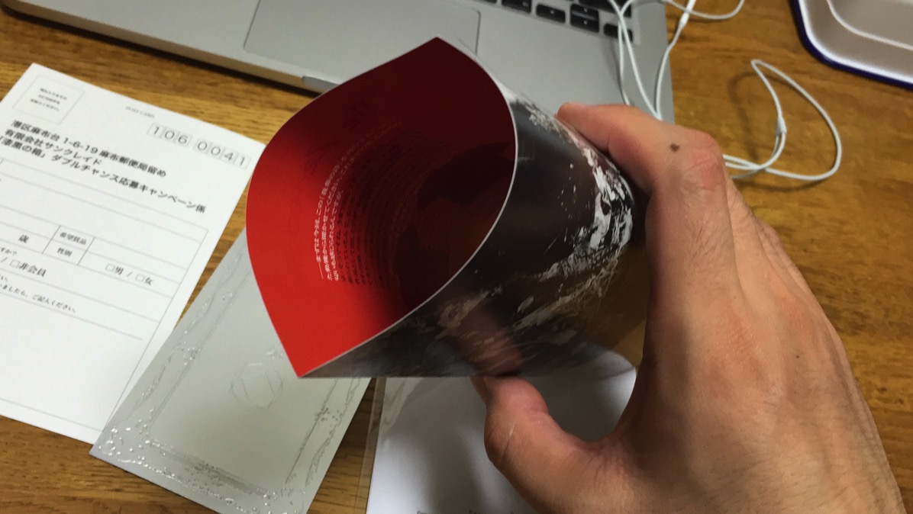

袋綴じを開けると中からこんなものが
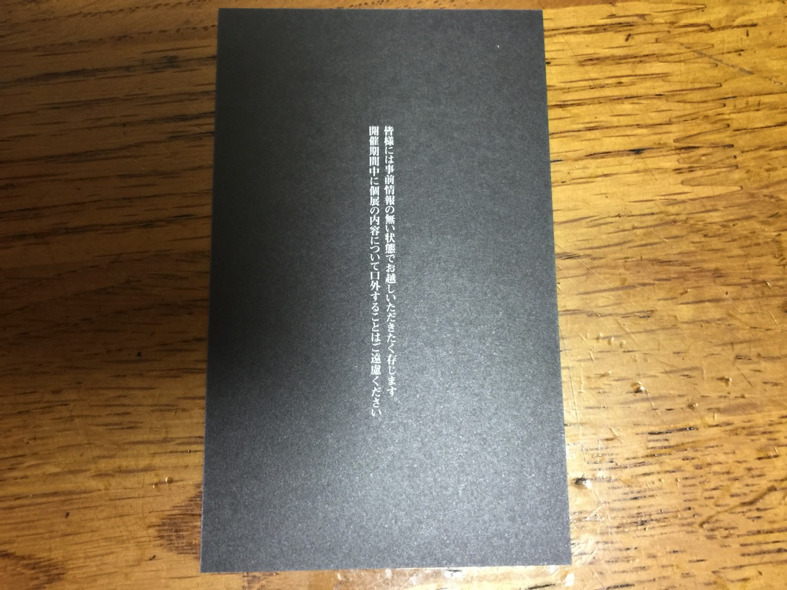

それと全員にしおり？が配られました。また、ガチャを3回引くとダブル特典で抽選で私物などがあたるたしいです。
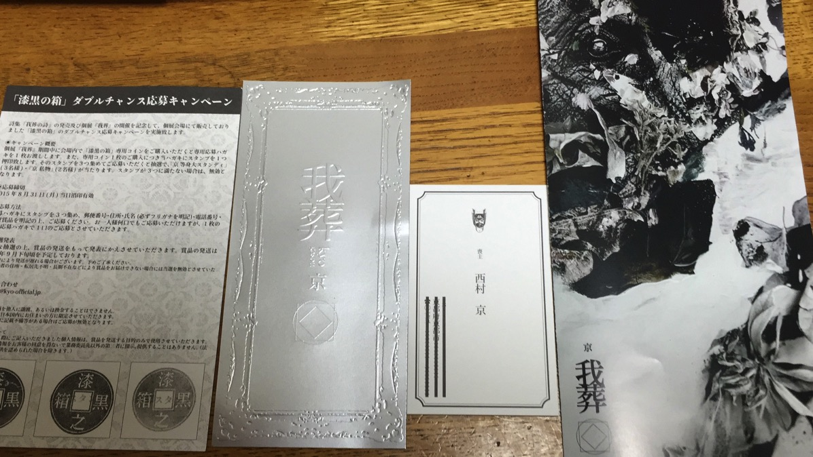

ガチャの景品。ステッカー
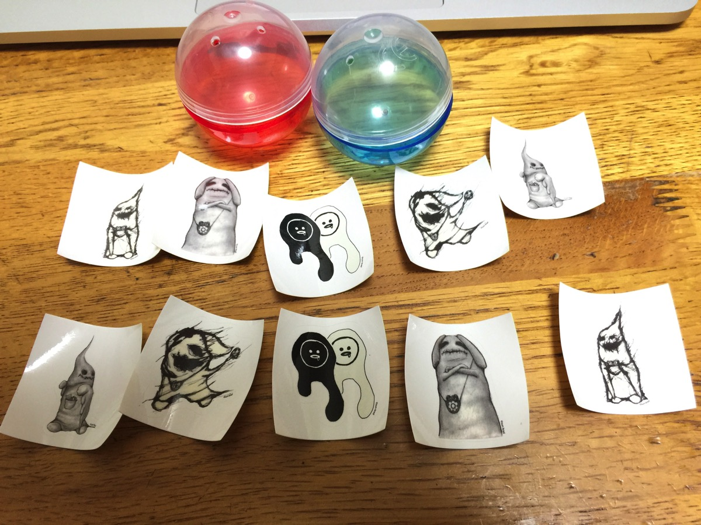

D賞のポストカード
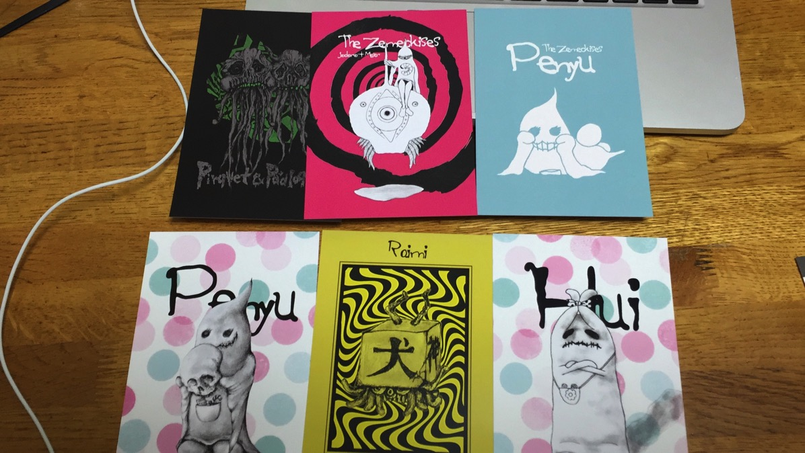

それと一番いい賞品は京との撮影みたいです。あたった方が錯乱されてました。リアルに人間が「ファーーーー」っていうの初めてみました。すっげー！

そんでもってこれが詩集「我葬」すげー読み応えありそう。

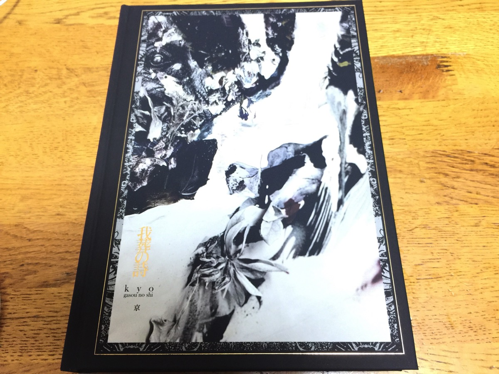
<h2><a href="https://twitter.com/s_s_p_y" target="_blank" rel="noopener">しんぺー</a> はこう思った。</h2>
いやーサイン会に参加できなかったことはいいとしよう。

しかしDVD付きが購入できなかったことが本当に悔しい！

ということで、悔やまれるのでタイムラインを流れるサイン会参列組みの「ホ」を眺めながら、いつもは大盛り食べないけど無理してやけ食い

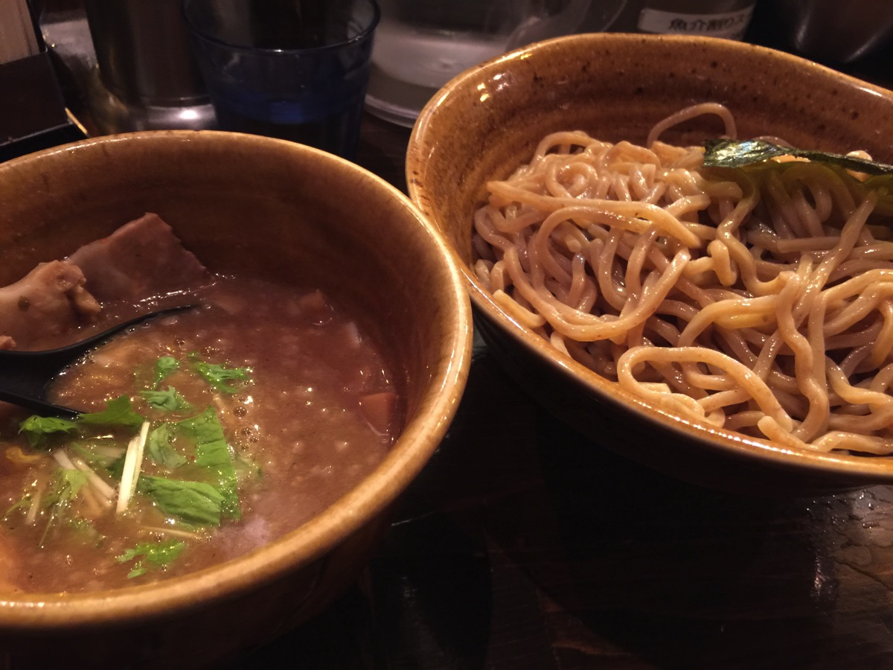

うまし！！！

と言ったところで本日は以上になります。おやすみなさい。