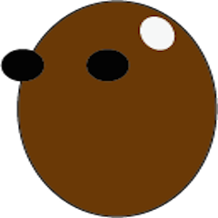
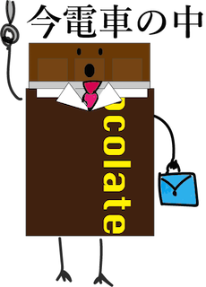
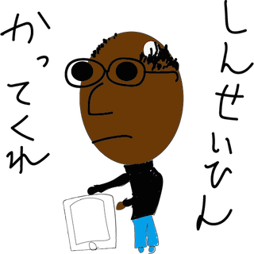
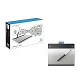
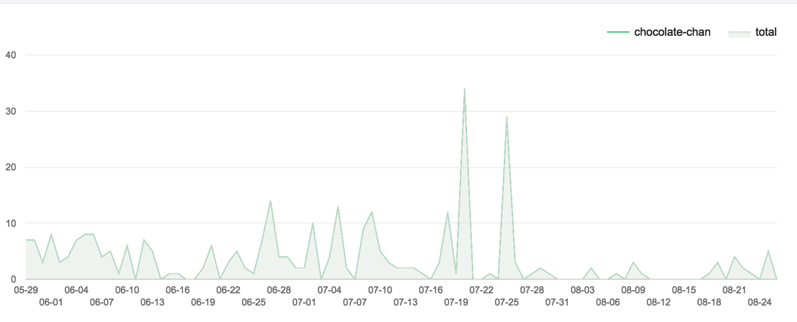

---
categories:
- LINE WOWの思い出
date: Wed, 26 Aug 2015 14:00:00 +0000
slug: post-8276
tags:
- LINEスタンプ
title: 素人がLINEスタンプ作って販売してどれくらい売れたのか
---

4月にLINEクリエーターズスタンプをリリースいたしました。ちなみに作ってLINEに提出したのが昨年の12月。そこから何度も規定に沿っていなかったためやり直しをして、ようやく販売開始となりました。

で、ぶっちゃけいくら売れたの？とか儲かるの？ってところをご紹介したいと思います。<!--more--><h2>ぼくの処女作「チョコちゃん」</h2>

チョコレートをモチーフにしたその名もチョコちゃんです。

猫や犬などのスタンプが溢れるクリエーターずマーケットの中で、チョコレートはそこまで多くなかったのと、ぼく自身がチョコレート大好きだったのでこんな感じにしました。

意識したところとしては、普段使える表現と他のスタンプにはない表現を揃えることでした。ただ40個も描かなければならないので、途中でキャラ変したり追加したりして大変でした。

<h3>LINEクリエーターズスタンプ作成に使用したツール</h3>

<table  border="0" cellpadding="5" style="border:none"><tr><td valign="top" style="border:none"></td><td valign="top" style="border:none;text-align:left">
<a href="http://www.amazon.co.jp/exec/obidos/ASIN/B00RZ6JEAO/warawareotoko-22/ref=nosim/" target="_blank" >ワコム Intuos Pen ペン入力専用モデル Sサイズ 【新型番】2015年1月モデル CTL-480/S1</a>

 ワコム 2015-01-23

売り上げランキング : 57
<table style="border:none;margin-top:10px"><tr><td style="border:none;text-align:left;">
<a href="http://www.amazon.co.jp/gp/search?keywords=wacom&__mk_ja_JP=%83J%83%5E%83J%83i&tag=warawareotoko-22" target="_blank" >Amazon</a>

<a href="http://hb.afl.rakuten.co.jp/hgc/0f6e221b.2eb9748a.0f6e221c.35cc1e84/?pc=http%3A%2F%2Fsearch.rakuten.co.jp%2Fsearch%2Fmall%2Fwacom%2F-%2Ff.1-p.1-s.1-sf.0-st.A-v.2%3Fx%3D0%26scid%3Daf_ich_link_urltxt%26m%3Dhttp%3A%2F%2Fm.rakuten.co.jp%2F" target="_blank" >楽天市場</a>

<a href="http://ck.jp.ap.valuecommerce.com/servlet/referral?sid=3041033&pid=882528283&vc_url=http%3A%2F%2Fsearch.shopping.yahoo.co.jp%2Fsearch%3Fp%3Dwacom" target="_blank" >Yahooショッピング</a>

<a href="http://ck.jp.ap.valuecommerce.com/servlet/referral?sid=3041033&pid=882660047&vc_url=http%3A%2F%2Fauctions.search.yahoo.co.jp%2Fsearch%3Fvo%3D%26ve%3D%26auccat%3D0%26aucminprice%3D%26aucmaxprice%3D%26aucmin_bidorbuy_price%3D%26aucmax_bidorbuy_price%3D%26loc_cd%3D0%26abatch%3D0%26istatus%3D0%26filtered%3D1%26ei%3DUTF-8%26tab_ex%3Dcommerce%26va%3Dwacom" target="_blank" >ヤフオク!</a>
</td><td style="vertical-align:bottom;padding-left:10px;font-size:x-small;border:none">by <a href="http://kaereba.com" rel="nofollow" target="_blank">カエレバ</a></td></tr></table></td></tr></table>

ペンタブの中でも最もランクが低いものを購入しました。ソフトはイラストレーターを使用。初めて使ったので、諸々調整が必要でした。

当時の詳細はこちらに
<a class="embedly-card" href="https://www.warawareotoko.com/2015/04/12/post-7565/">LINEクリエーターズスタンプ「チョコちゃん」リリースしました。</a>

<h2>素人がLINEスタンプ作って販売してどれくらい売れたのか</h2>

こちらです。どん！

924円

４ヶ月合計の金額です。一個売れると40円くらいが分配されるっぽいので、割ってみると21個くらいは売れたみたいです。

ほとんど知り合いです。

ただ、複数名全く知らない方にも購入いただいたみたいで、その点は大変嬉しく思っております。

<h3>利用率</h3>

えーっと最近はほぼ使われてません。

自分でも使ってませんし。。。

絵が下手すぎて相手に送るのも微妙です。

そら誰も使わなくなるわ。

<h2><a href="https://twitter.com/s_s_p_y" target="_blank">しんぺー</a> はこう思った。</h2>

スタンプで高額を稼げるのは、絵が上手くてセンスがちゃんとある一握りの人たちでしょう。

スタンプを出すだけで億万長者になる！そんな風に考えていた時期がぼくにもありました。

ただ現実は最低入金の金額である1000円にも達していません。弟にはチョコを白く塗ってたまごちゃんとして販売するからデータちょうだいとかバカにされる始末。

でも、ぼくは諦めないぞ！

アイデアだってあるんだ！

ということでしんぺーのスタンプ第２弾をお楽しみにwww

と言ったところで本日は以上になります。おやすみなさい。