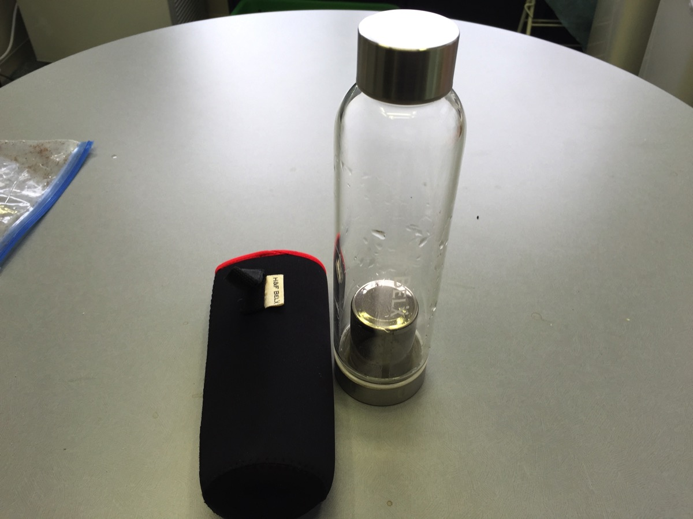
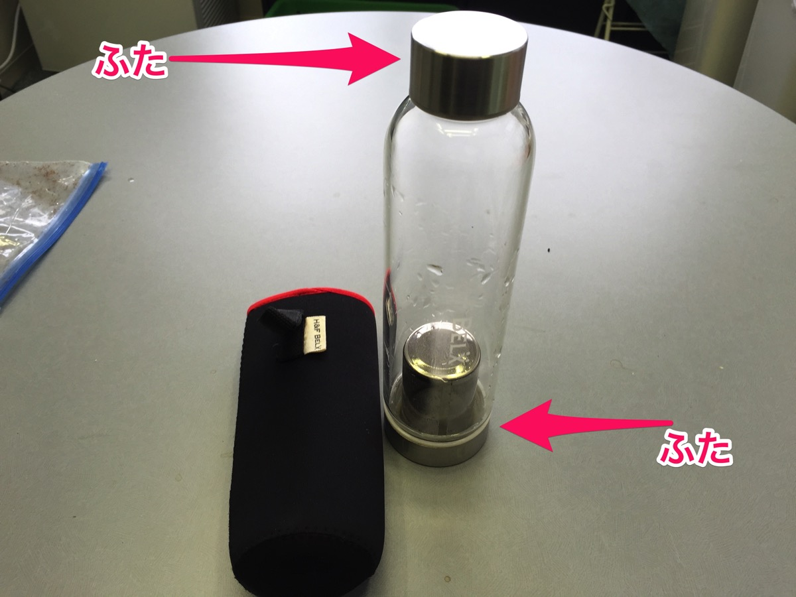
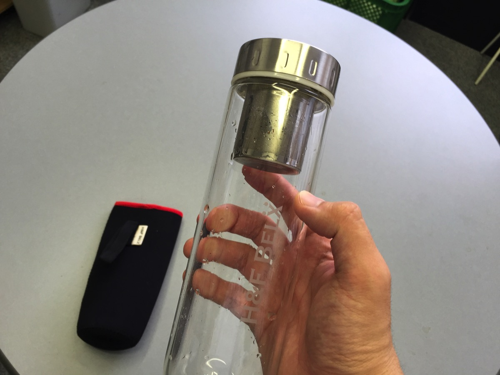
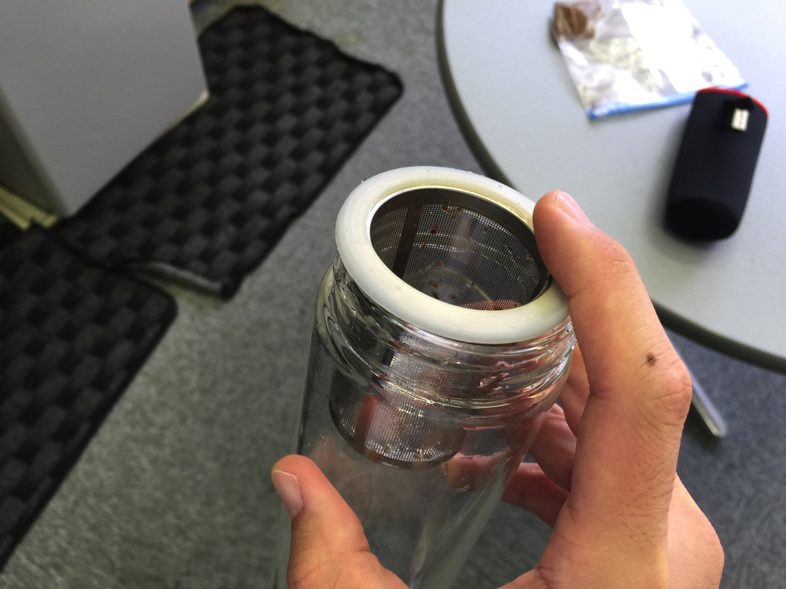
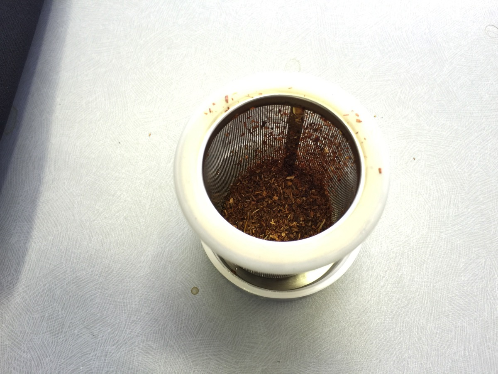
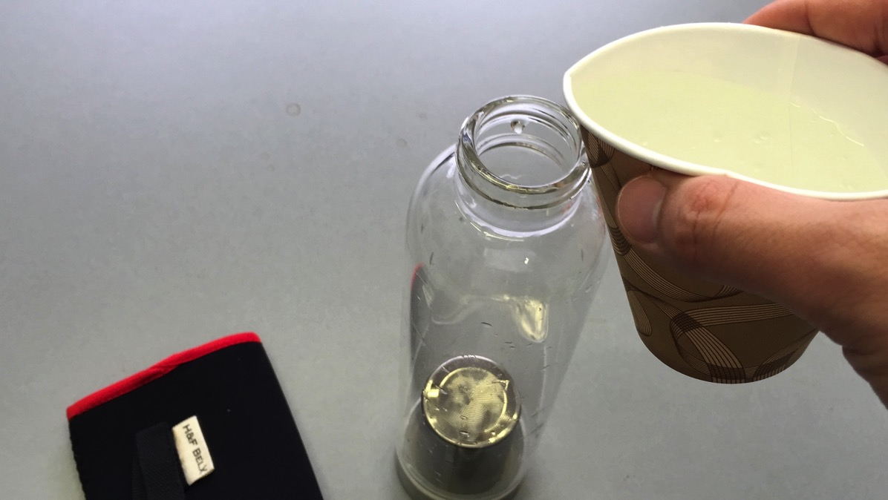
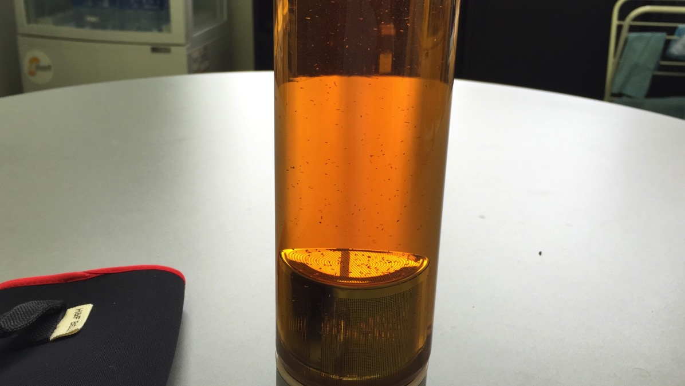
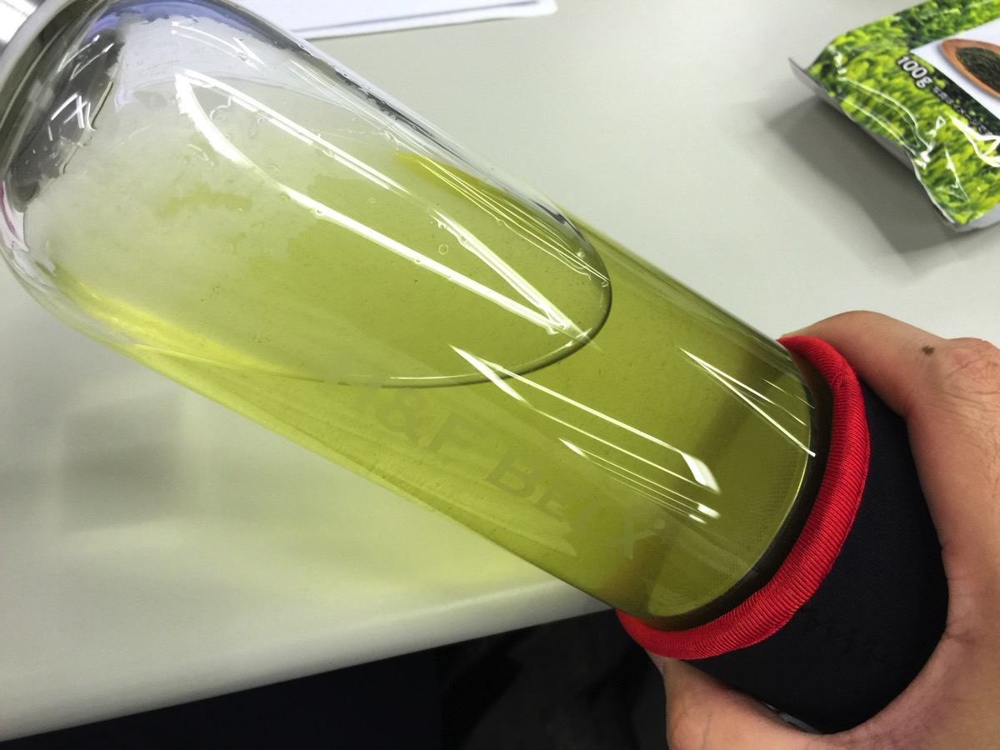
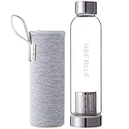
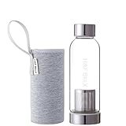

---
categories:
- レビュー
date: Sun, 30 Aug 2015 14:00:00 +0000
slug: post-8295
tags:
- おすすめガジェット
title: 会社でコーヒー代節約のためにオシャレなガラスタンブラーでお茶を飲むようにした（H&F BELX）
---

毎日コーヒーを飲んでるひとってそうは多くないと思うんですが、ぼくは今までほぼ毎日飲んでました。会社の近くにスタバがあったので、1日2回は行ってました。目がさめるのはいいんだけど、その分コーヒー代がかさむかさむ。でも、会社が移転して周りにスタバがなくなってしまったので、色々と工夫して結果会社でお茶を飲むようにしました。そしたら諸々良かったので、それについてご紹介します。<!--more-->
<h2>会社で毎日コーヒーを飲んだ場合、年間9万円かかる</h2>
毎月コーヒーがどれくらいかかっていたかってーと、

スタバでトールサイズのコーヒーが約400円。１日１回までお代わり100円なので合計500円で2杯飲むとします。

それを月平均15日飲むとすると合計7,500円かかることになります。

<strong>ライブに1回いける値段ですね。</strong>

ということで、毎日、スタバでコーヒーを飲むと<strong>月7,500円。年間90,000円かかることになります。</strong>
<h3>セブンイレブンのコーヒーが安くてソコソコうまい</h3>
で、なんとか節約できないかな〜と思ってたんですが、最近だとコンビニでもスタバの４分の１くらいの値段でそれなりの味のコーヒーが飲めます。

色々飲み比べましたが、中でも<strong>セブンイレブンが一番美味しいです。</strong>

<strong>nanacoで支払えばポイントもつく！</strong>

しかしながら、やはり味はスタバには叶うわけもなく、なんとなくしょうがない感が拭えませんでした。
<h2>コーヒーの代わりにお茶を飲むようにした</h2>
そこでぼく考えました。この財布の寂しさとだます心の虚しさを埋めるにはどうしたらいいんだろう。

<strong>必要なのはカフェイン</strong>

そして、それを<strong>美味しく摂取できる手段</strong>

たどり着いたのはお茶でした。紅茶に切り替えようと考えました。

なんせ一説によると紅茶にはコーヒーよりも多くのカフェインが含まれているそうです。しかし、ここで大きな問題が二つあります。

それは、コンビニで売ってるようなティーバッグだと、これまたあんまり美味しくない。だからといって茶葉を買ってきて淹れようにも急須を会社に持って行くのも面倒臭いし、<strong>なんか嫌だ。</strong>
<h2>「H&amp;F BELX」のガラスタンブラー</h2>
しかし、そんなぼくにぴったりのタンブラーがありました。それがこちら

茶漉し付きのガラス製のタンブラーです。
<h3>使い方</h3>
こちらなんと上下がふたになっています。

くちが広い方が底です。

あけるとこんな感じ。ここが茶漉しになっています。ここにティーバッグなり、茶葉なりをいれます。

茶葉を入れた状態がこちら

しっかりとくちを閉めたら、裏返して狭いくちの方からお湯を注ぎます。

茶葉を入れている方が底になりますので、そこからお茶が滲み出てくるわけです。ハーブティーを淹れました。

日本茶だとこんな感じ

飲むときは専用のカバーをして飲みます。そうじゃないとガラス製なので、熱いです。注意です。

ちなみに、フレンチプレス用に粗めに挽いたコーヒー豆で淹れてみましたが、細かな豆が広がっちゃうのと、やっぱりコーヒーは蒸らしながらちゃんと淹れないので、美味しくありませんでした。

ちなみにこのタンブラーは食洗機OKなので手入れも簡単です。
<h3>ちょっと心配な点</h3>
耐久度が心配。なんせガラス製なので。
保温性がない。なんせガラス製なので。
飲むとき、淹れるときカバーつけないと熱い。なんせガラス製なので。
両方のくちをしっかり閉めないと大変。

あと、分厚いガラスなのでちょっと重いかも。

今後、耐熱性のものが出ればいいなあと思います。

ということで、こいつを使って脱コーヒーをしてガンガン節約していきたと思います！
<table style="border: none;" border="0" cellpadding="5">
<tbody>
<tr>
<td style="border: none;" valign="top"></td>
<td style="border: none; text-align: left;" valign="top">

<a href="http://www.amazon.co.jp/exec/obidos/ASIN/B00TCDD7SI/warawareotoko-22/ref=nosim/" target="_blank" rel="noopener">H&amp;F BELX ガラスタンブラー（大）グレー550ml</a>

H&amp;F BELX

売り上げランキング : 140708

<table style="border: none; margin-top: 10px;">
<tbody>
<tr>
<td style="border: none; text-align: left;">

<a href="http://www.amazon.co.jp/gp/search?keywords=%83K%83%89%83X%83%5E%83%93%83u%83%89%81%5B&amp;__mk_ja_JP=%83J%83%5E%83J%83i&amp;tag=warawareotoko-22" target="_blank" rel="noopener">Amazon</a>

<a href="http://hb.afl.rakuten.co.jp/hgc/0f6e221b.2eb9748a.0f6e221c.35cc1e84/?pc=http%3A%2F%2Fsearch.rakuten.co.jp%2Fsearch%2Fmall%2F%25E3%2582%25AC%25E3%2583%25A9%25E3%2582%25B9%25E3%2582%25BF%25E3%2583%25B3%25E3%2583%2596%25E3%2583%25A9%25E3%2583%25BC%2F-%2Ff.1-p.1-s.1-sf.0-st.A-v.2%3Fx%3D0%26scid%3Daf_ich_link_urltxt%26m%3Dhttp%3A%2F%2Fm.rakuten.co.jp%2F" target="_blank" rel="noopener">楽天市場</a>

<a href="http://ck.jp.ap.valuecommerce.com/servlet/referral?sid=3041033&amp;pid=882528283&amp;vc_url=http%3A%2F%2Fsearch.shopping.yahoo.co.jp%2Fsearch%3Fp%3D%25E3%2582%25AC%25E3%2583%25A9%25E3%2582%25B9%25E3%2582%25BF%25E3%2583%25B3%25E3%2583%2596%25E3%2583%25A9%25E3%2583%25BC" target="_blank" rel="noopener">Yahooショッピング</a>

<a href="http://ck.jp.ap.valuecommerce.com/servlet/referral?sid=3041033&amp;pid=882660047&amp;vc_url=http%3A%2F%2Fauctions.search.yahoo.co.jp%2Fsearch%3Fvo%3D%26ve%3D%26auccat%3D0%26aucminprice%3D%26aucmaxprice%3D%26aucmin_bidorbuy_price%3D%26aucmax_bidorbuy_price%3D%26loc_cd%3D0%26abatch%3D0%26istatus%3D0%26filtered%3D1%26ei%3DUTF-8%26tab_ex%3Dcommerce%26va%3D%25E3%2582%25AC%25E3%2583%25A9%25E3%2582%25B9%25E3%2582%25BF%25E3%2583%25B3%25E3%2583%2596%25E3%2583%25A9%25E3%2583%25BC" target="_blank" rel="noopener">ヤフオク!</a>
</td>
<td style="vertical-align: bottom; padding-left: 10px; font-size: x-small; border: none;">by <a href="http://kaereba.com" target="_blank" rel="nofollow noopener">カエレバ</a></td>
</tr>
</tbody>
</table>
&nbsp;</td>
</tr>
</tbody>
</table>
<table style="border: none;" border="0" cellpadding="5">
<tbody>
<tr>
<td style="border: none;" valign="top"></td>
<td style="border: none; text-align: left;" valign="top">

<a href="http://www.amazon.co.jp/exec/obidos/ASIN/B00TCG5H0Q/warawareotoko-22/ref=nosim/" target="_blank" rel="noopener">H&amp;F BELX ガラスタンブラー（小）グレー　380m</a>

H&amp;F BELX

売り上げランキング : 155478

<table style="border: none; margin-top: 10px;">
<tbody>
<tr>
<td style="border: none; text-align: left;">

<a href="http://www.amazon.co.jp/gp/search?keywords=%83K%83%89%83X%83%5E%83%93%83u%83%89%81%5B&amp;__mk_ja_JP=%83J%83%5E%83J%83i&amp;tag=warawareotoko-22" target="_blank" rel="noopener">Amazon</a>

<a href="http://hb.afl.rakuten.co.jp/hgc/0f6e221b.2eb9748a.0f6e221c.35cc1e84/?pc=http%3A%2F%2Fsearch.rakuten.co.jp%2Fsearch%2Fmall%2F%25E3%2582%25AC%25E3%2583%25A9%25E3%2582%25B9%25E3%2582%25BF%25E3%2583%25B3%25E3%2583%2596%25E3%2583%25A9%25E3%2583%25BC%2F-%2Ff.1-p.1-s.1-sf.0-st.A-v.2%3Fx%3D0%26scid%3Daf_ich_link_urltxt%26m%3Dhttp%3A%2F%2Fm.rakuten.co.jp%2F" target="_blank" rel="noopener">楽天市場</a>

<a href="http://ck.jp.ap.valuecommerce.com/servlet/referral?sid=3041033&amp;pid=882528283&amp;vc_url=http%3A%2F%2Fsearch.shopping.yahoo.co.jp%2Fsearch%3Fp%3D%25E3%2582%25AC%25E3%2583%25A9%25E3%2582%25B9%25E3%2582%25BF%25E3%2583%25B3%25E3%2583%2596%25E3%2583%25A9%25E3%2583%25BC" target="_blank" rel="noopener">Yahooショッピング</a>

<a href="http://ck.jp.ap.valuecommerce.com/servlet/referral?sid=3041033&amp;pid=882660047&amp;vc_url=http%3A%2F%2Fauctions.search.yahoo.co.jp%2Fsearch%3Fvo%3D%26ve%3D%26auccat%3D0%26aucminprice%3D%26aucmaxprice%3D%26aucmin_bidorbuy_price%3D%26aucmax_bidorbuy_price%3D%26loc_cd%3D0%26abatch%3D0%26istatus%3D0%26filtered%3D1%26ei%3DUTF-8%26tab_ex%3Dcommerce%26va%3D%25E3%2582%25AC%25E3%2583%25A9%25E3%2582%25B9%25E3%2582%25BF%25E3%2583%25B3%25E3%2583%2596%25E3%2583%25A9%25E3%2583%25BC" target="_blank" rel="noopener">ヤフオク!</a>
</td>
<td style="vertical-align: bottom; padding-left: 10px; font-size: x-small; border: none;">by <a href="http://kaereba.com" target="_blank" rel="nofollow noopener">カエレバ</a></td>
</tr>
</tbody>
</table>
&nbsp;</td>
</tr>
</tbody>
</table>
<h2><a href="https://twitter.com/s_s_p_y" target="_blank" rel="noopener">しんぺー</a> はこう思った。</h2>
割と家では緑茶を飲みまくるので、こういうのを探してました。これで節約になるのかはわかりませんが・・・帰ってお茶代がかさむんじゃないかという説もありますが

まあ、でもコーヒー飲むと胃があれるし、変な汗でるし、あんまりいいことないんだよな。健康にいいという説もありますが。。。ただ健康にいいのはお茶もいいはずなので、継続してみたいと思います！

と言ったところで本日は以上になります。おやすみなさい。