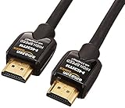
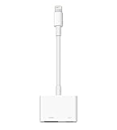

---
categories:
- Netflix
date: Tue, 01 Sep 2015 16:17:14 +0000
slug: post-8336
tags:
- Netflix
title: Netflixをテレビで見る方法
---

9月より日本でも動画配信サービス最大手のNetflixが利用できるようになりました。早速登録をして使ってみています。本日は色んなことを省いていきなりNetflixをテレビで見る方法をご紹介します。<!--more--><h2>クロームキャスト</h2>

自宅にあるクロームキャストで検証済み

PCのクロームを使ってNetflixに接続。TVにキャストするだけ。
スマホアプリの場合は、クロームキャストが利用できる状態になっていればアプリ内の画面に表示されますので、それをタップすれば表示されます。

クロームキャスト自体の設定はとても簡単。一つだけ難点があるとするとクロームキャスへの給電についてです。

クロームキャストはUSBで給電するため、TVにUSBがついていればいいのですがついていない場合はコンセントから引くことになります。

 <table border="0" cellpadding="5" style="border:none"><tr><td valign="top" style="border:none"></td><td valign="top" style="border:none;text-align:left">
Google Chromecast ( Wi-Fi経由 テレビ接続 ストリーミング / HDMI / 802.11b/g/n / 1080p ) GA3A00035A16

 Google 

売り上げランキング : 10
<table style="border:none;margin-top:10px"><tr><td style="border:none;text-align:left;">
<a href="http://www.amazon.co.jp/gp/search?keywords=appletv&__mk_ja_JP=%83J%83%5E%83J%83i&tag=warawareotoko-22" target="_blank" >Amazon</a>

<a href="http://hb.afl.rakuten.co.jp/hgc/0f6e221b.2eb9748a.0f6e221c.35cc1e84/?pc=http%3A%2F%2Fsearch.rakuten.co.jp%2Fsearch%2Fmall%2Fappletv%2F-%2Ff.1-p.1-s.1-sf.0-st.A-v.2%3Fx%3D0%26scid%3Daf_ich_link_urltxt%26m%3Dhttp%3A%2F%2Fm.rakuten.co.jp%2F" target="_blank" >楽天市場</a>

<a href="http://ck.jp.ap.valuecommerce.com/servlet/referral?sid=3041033&pid=882528283&vc_url=http%3A%2F%2Fsearch.shopping.yahoo.co.jp%2Fsearch%3Fp%3Dappletv" target="_blank" >Yahooショッピング</a>

<a href="http://ck.jp.ap.valuecommerce.com/servlet/referral?sid=3041033&pid=882660047&vc_url=http%3A%2F%2Fauctions.search.yahoo.co.jp%2Fsearch%3Fvo%3D%26ve%3D%26auccat%3D0%26aucminprice%3D%26aucmaxprice%3D%26aucmin_bidorbuy_price%3D%26aucmax_bidorbuy_price%3D%26loc_cd%3D0%26abatch%3D0%26istatus%3D0%26filtered%3D1%26ei%3DUTF-8%26tab_ex%3Dcommerce%26va%3Dappletv" target="_blank" >ヤフオク!</a>
</td><td style="vertical-align:bottom;padding-left:10px;font-size:x-small;border:none">by <a href="http://kaereba.com" rel="nofollow" target="_blank">カエレバ</a></td></tr></table></td></tr></table>

<h2>PCやスマホをミラーリング</h2>

必要なものは次の2つ 
・HDMIケーブル：テレビとスマホを接続するため Amazon純正ケーブルは丈夫かつサイズも選べて、さらに安価なのでおすすめです。ぼくは余分に複数もってます。

<a href="http://www.amazon.co.jp/exec/obidos/ASIN/B003L1ZYYM/warawareotoko-22/ref=nosim/" target="_blank" >Amazonベーシック ハイスピードHDMIケーブル 2.0m (タイプAオス - タイプAオス、イーサネット、3D、4K、オーディオリターン、PS3、PS4、Xbox360対応)</a>
posted with <a href="http://kaereba.com" rel="nofollow" target="_blank">カエレバ</a>

 AmazonBasics 2012-07-03 

 ・変換コネクタ：スマホとHDMIケーブルを接続するため Appleの場合はこれを使います。iPhone側から出力するのに必要です。 <table border="0" cellpadding="5" style="border:none"><tr><td valign="top" style="border:none"></td><td valign="top" style="border:none;text-align:left">
<a href="http://www.amazon.co.jp/exec/obidos/ASIN/B00XP5KLLK/warawareotoko-22/ref=nosim/" target="_blank" >Apple Lightning - Digital AVアダプタ MD826AM/A</a>

 Apple Computer 

売り上げランキング : 64
<table style="border:none;margin-top:10px"><tr><td style="border:none;text-align:left;">
<a href="http://www.amazon.co.jp/gp/search?keywords=Apple%20Lightning%20-%20Digital%20AV%83A%83_%83v%83%5E%20&__mk_ja_JP=%83J%83%5E%83J%83i&tag=warawareotoko-22" target="_blank" >Amazon</a>

<a href="http://hb.afl.rakuten.co.jp/hgc/0f6e221b.2eb9748a.0f6e221c.35cc1e84/?pc=http%3A%2F%2Fsearch.rakuten.co.jp%2Fsearch%2Fmall%2FApple%2520Lightning%2520-%2520Digital%2520AV%25E3%2582%25A2%25E3%2583%2580%25E3%2583%2597%25E3%2582%25BF%2520%2F-%2Ff.1-p.1-s.1-sf.0-st.A-v.2%3Fx%3D0%26scid%3Daf_ich_link_urltxt%26m%3Dhttp%3A%2F%2Fm.rakuten.co.jp%2F" target="_blank" >楽天市場</a>

<a href="http://ck.jp.ap.valuecommerce.com/servlet/referral?sid=3041033&pid=882528283&vc_url=http%3A%2F%2Fsearch.shopping.yahoo.co.jp%2Fsearch%3Fp%3DApple%2520Lightning%2520-%2520Digital%2520AV%25E3%2582%25A2%25E3%2583%2580%25E3%2583%2597%25E3%2582%25BF%2520" target="_blank" >Yahooショッピング</a>

<a href="http://ck.jp.ap.valuecommerce.com/servlet/referral?sid=3041033&pid=882660047&vc_url=http%3A%2F%2Fauctions.search.yahoo.co.jp%2Fsearch%3Fvo%3D%26ve%3D%26auccat%3D0%26aucminprice%3D%26aucmaxprice%3D%26aucmin_bidorbuy_price%3D%26aucmax_bidorbuy_price%3D%26loc_cd%3D0%26abatch%3D0%26istatus%3D0%26filtered%3D1%26ei%3DUTF-8%26tab_ex%3Dcommerce%26va%3DApple%2520Lightning%2520-%2520Digital%2520AV%25E3%2582%25A2%25E3%2583%2580%25E3%2583%2597%25E3%2582%25BF%2520" target="_blank" >ヤフオク!</a>
</td><td style="vertical-align:bottom;padding-left:10px;font-size:x-small;border:none">by <a href="http://kaereba.com" rel="nofollow" target="_blank">カエレバ</a></td></tr></table></td></tr></table>

<h2>AppleTV</h2>

こちら今月の新製品発表会にて新製品が発売されるのではと予想されています。なので、実際に次期AppleTVでNetflixが見られるかは不明です。いったんまちましょう。

<h2><a href="https://twitter.com/s_s_p_y" target="_blank">しんぺー</a> はこう思った。</h2>

さて、今はまだNetflixはお試し期間ということで無料です。
ただ、無料期間が終わったあとに、本当に面白いコンテンツが揃っているかどうかが継続の鍵になるでしょう。見守りたいと思います。

と言ったところで本日は以上になります。おやすみなさい。