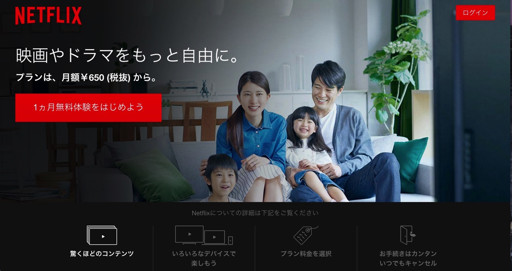
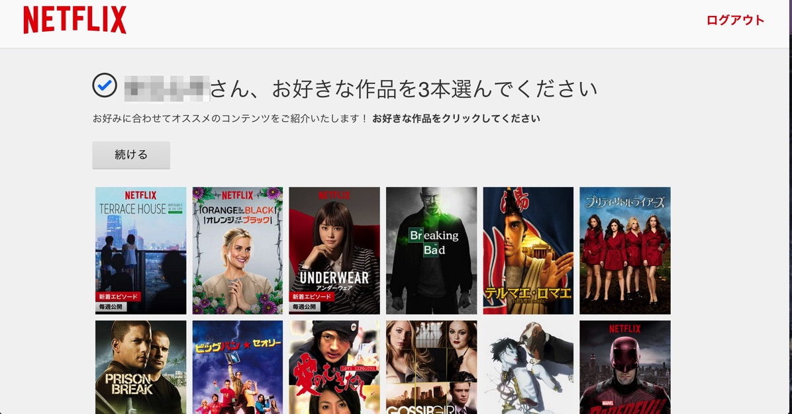
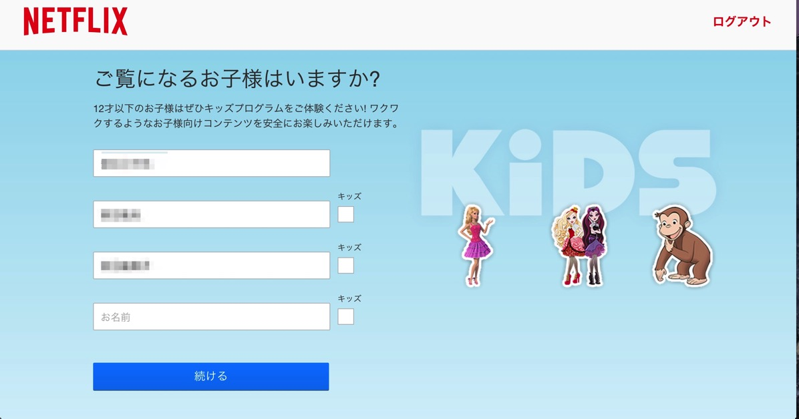

---
categories:
- Netflix
date: Wed, 02 Sep 2015 15:52:24 +0000
slug: post-8344
tags:
- Netflix
title: Netflixってhuluと比べてどうなの？料金、画質はほぼ同等！
---

ようやくリリースしたNetflixですが、さっそく色々と見ております！本日は「Netflixとは」という形の記事です。海外ドラマをレンタルDVD屋さんを利用してる方は、ぜひこの機会に乗り換えてみてはいかがでしょうか。<!--more--><h2>Netflixとは</h2>

Netflixとは、すでに日本で普及しているhuluなどと同じように<strong>PCやスマホ、ゲーム機などでドラマや映画が見放題の動画配信サービス</strong>です。

アメリカでは、huluよりもシェアが高くレンタルDVDショップやケーブルTVですらNetflixに置き換えられつつあるそうです。それくらい普及している大型サービスが満を持して、日本上陸となりました。

<h3>料金は？</h3>

Netflixの料金体系は今の所3種類。金額は税抜

[table id=18 /]

ちなみに<strong>huluが933円</strong>（税抜）です。画質はHD(720p)です。ということで<strong>Netflixのスタンダードとほぼ同額、同等の画質</strong>ということになります。

<h3>ラインナップは？</h3>

海外ドラマは、豊富。しかも、もともと<strong>ハウスオブカードなんかはNetflixのオリジナルドラマ</strong>だったりして、オリジナル作品もいくつかあります。

huluにあってNetflixにないものや、その逆もしばしばありますが、<strong>概ね海外ドラマに関してはかぶっています。</strong>

また注目なのがアニメです。今回初めて配信された<strong>まどかマギカやキルラキルといったものが見られます。</strong>このへんはhuluにはないのでアドバンテージと言えるでしょう。

ただ、huluの方が勝っているカテゴリもありました。それは<strong>ドキュメンタリー番組です。</strong>

「世界遺産」や動物番組、さらにはナショナルジオグラフィックのコンテンツが多数あります。huluは今後もドキュメンタリーコンテンツに力を入れていくことが発表されていますので、このへんは期待できそうです。

個人的にはディスカバリーチャンネルで放送されていた「アメリカンチョッパー」と「サバイバルゲーム」がみたいです！

<h2>Netflixの登録方法から視聴までの流れ</h2>

<h3>登録</h3>

現在キャンペーン中で1ヶ月間無料で視聴ができます。

<a href="https://www.netflix.com/jp/">https://www.netflix.com/jp/</a>

氏名や支払い情報等を入力すれば、すぐに利用できるようになります。

ちなみに<strong>Netflixの強みの一つがストロングなサジェスト機能です。</strong>
本国アメリカでは、かなりのコンテンツ量があるらしく玉石混交らしいです。そんな中趣味嗜好や過去の閲覧履歴から<strong>最適な関連動画を紹介してくれるとのことです。</strong>

ということで、まずは最初に3つほど好きな動画を聞かれます。

また、利用される方を複数名登録することができます。そのため、ユーザーを変更すれば、その人のおすすめ情報が他人に表示されることはないようです。

あくまで、利用しているユーザーに向けたおすすめがなされるようです。

なお、お子様が家庭にいる場合はキッズ項目にチェックをいれましょう。まずいものが見えなくなります。

<h3>視聴方法</h3>

PC、スマホ、ゲーム機、テレビ等で見ることができます。

専用の機会を新たに購入しなければならないということはありません。
これからどんどん出てくるとおもいますが、Netflix内蔵のテレビなども発売されることでしょう。

なお、スマホやPCで見ているコンテンツをテレビに映し出す方法もいくつかあります。

Netflixをテレビで見る方法

<h2>huluと比べてどうか</h2>

正直、今の段階では甲乙つけがたいという感じです。

おそらくぼくは両方入ったままになると思います。

huluにないコンテンツをNetflixで見て、Netflixにないものをhuluで探すという感じの使い方になるかなと思いました。

<h2><a href="https://twitter.com/s_s_p_y" target="_blank">しんぺー</a> はこう思った。</h2>

あとはAmazonプライムビデオのラインナップも気になるところです。
ぼくはもともとプライム会員なので、無料で使えます。だから、この３社のサービスをじっくり吟味したいと思います！

と言ったところで本日は以上になります。おやすみなさい。