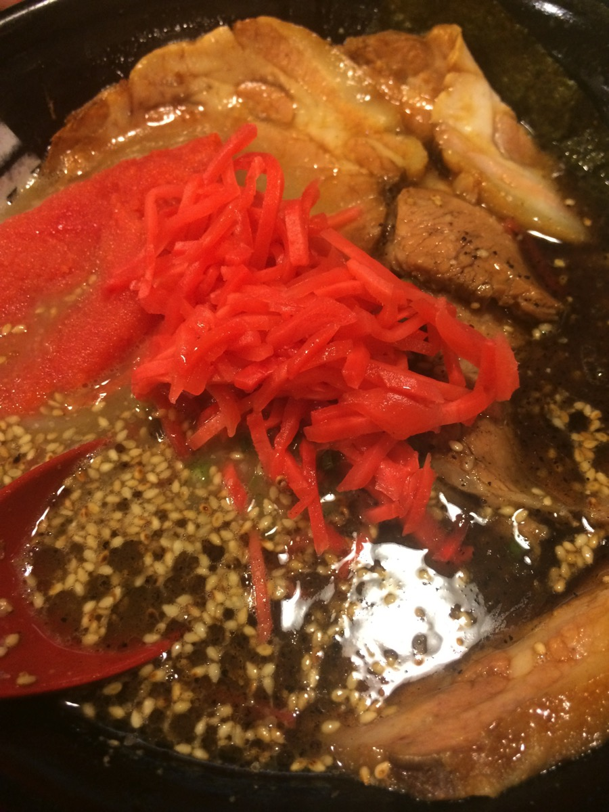
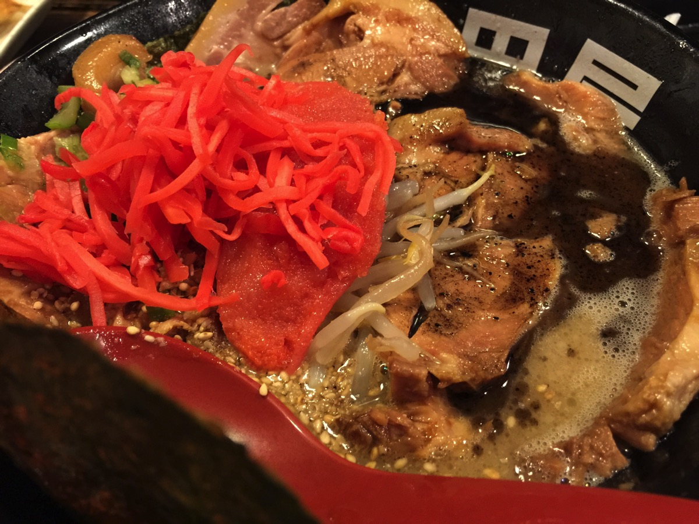

---
categories:
- sukekiyo
date: Wed, 09 Sep 2015 14:00:00 +0000
slug: post-8357
tags:
- sukekiyo
title: sukekiyo学祭公演の後にぜひYuchiに寄ってもらいたいと思うくら美味い相模原のラーメン屋
---

さて、先日これまためっちゃくちゃ驚くニュースが駆け抜けましたね。なんとsukekiyoが麻布大学の学祭でLIVEをやるという・・・いやーどんな経緯でそうなったのかめちゃくちゃ気になるわー
で、麻布大学って麻布にあるのかなーとか思ったらなんと相模原方面！！だったらあのラーメン屋の近くだなということで、ぼくの大好きなラーメン屋をご紹介したいと思います。LIVE後に是非立ち寄ってみてください。<!--more--><h2>sukekiyo初の学祭公演</h2>

<h3>公演詳細</h3>

10月24日(土)	神奈川県	麻布大学 麻布獣医学園アリーナ
17:30/18:00
オールスタンディング/観覧無料

麻布大学へのアクセスはこちら

<iframe src="https://www.google.com/maps/embed?pb=!1m18!1m12!1m3!1d3245.108707136117!2d139.38897579999997!3d35.575708599999984!2m3!1f0!2f0!3f0!3m2!1i1024!2i768!4f13.1!3m3!1m2!1s0x6018fd0c71cbf63f%3A0x3d64fca01f4cf7a9!2z6bq75biD5aSn5a2m!5e0!3m2!1sja!2sjp!4v1441814261618" width="600" height="450" frameborder="0" style="border:0" allowfullscreen></iframe>

詳細はこちらのアカウントをフォローするといいです。

<blockquote class="twitter-tweet" lang="ja">
今日はなんと！情報解禁日です！&#10;10月24日のLIVEの出演アーティストはsukekiyo！25日のお笑いライブの出演芸人は初恋タロー、とにかく明るい安村、はんにゃの3組です！&#10;詳細はホームページへ<a href="http://t.co/za1w1nvtz9">http://t.co/za1w1nvtz9</a>
&mdash; 麻布大学大学祭実行委員会2015 (@azabu_festa) <a href="https://twitter.com/azabu_festa/status/640740573805019136">2015, 9月 7</a></blockquote>

<h3>公演詳細やチケットの入手方法</h3>

要約すると
<ul>
	<li>15:30から並び順で配布開始。</li>
	<li>1000枚程度配布する。</li>
	<li>在学生と一般客は区別して配布する。</li>
</ul>

<blockquote class="twitter-tweet" lang="ja">
本日非常にお問い合わせがおおかったので再度sukekiyoライブについて再度告知させていただきます。10月24日(土)大学祭開場10:00～整理券配布15:30～並び順にて配布、開場17:30～開始18:00～とさせていただきます。大学祭開場前での並びはご遠慮ください。
&mdash; 麻布大学大学祭実行委員会2015 (@azabu_festa) <a href="https://twitter.com/azabu_festa/status/640832576442097664">2015, 9月 7</a></blockquote>

<blockquote class="twitter-tweet" lang="ja">
整理券はお一人様一枚とさせていただきます。当日の整理券は一般のお客様と在学生で分けさせていただきます。在学生の方は整理券配布時に学生証の提示のほうをよろしくお願い致します。整理券のほうは一般・在学生込みで1000枚を目安に作らせて頂きます。
&mdash; 麻布大学大学祭実行委員会2015 (@azabu_festa) <a href="https://twitter.com/azabu_festa/status/640832626144612352">2015, 9月 7</a></blockquote>

<blockquote class="twitter-tweet" lang="ja">
入場に関しては一般のお客様と在学生の方で10名を目安に随時入場とさせていただきます。情報解禁に伴いこちらの準備が遅れてしまい申し訳ありません。Twitterにてご質問等がございましたら随時お答えいたします。
&mdash; 麻布大学大学祭実行委員会2015 (@azabu_festa) <a href="https://twitter.com/azabu_festa/status/640832655274061824">2015, 9月 7</a></blockquote>

<h3>私的予想</h3>

ということで、学祭なんてのはリア充の宴です。クソです。ぼくなんて、自分の大学の学祭なんて一回も行ったことありません。どうせサークル入ってるやつらが自分たちのために出店やったりなんだかんだやって、終わったあとに打ち上げで飲んでパコるためのクソイベントです。リア充ファーック

すいません、話が逸れました

整理券は半分以上はsukekiyoを知りもしない在学生に配布されるでしょう。

うぇーいってノリで会場入って、でファンが棒立ちしてるのみてドン引きみたいなw

まーそんなことはどうでもいいのでダメもとでとりあえず当日行ってみようかな・・・どうしようかな・・・

<h2>ダメでも近くに美味しい美味しいラーメン屋「村田屋」があるよ！！！！</h2>

Yuchiさん、聞こえていますか

ラーメン好きのYuchiさん・・・・聞こえていますか←多分聞こえてない

ぼくがこの世の中で一番好きなラーメン屋をご紹介します。ぜひLIVE終わりに行ってください。

とりあえず、ごたくを並べる前にとりあえず写真をどうぞ

はい、行くたびに同じものしか頼まないんで全部同じ写真です！！！！

ぼくは、明日死ぬと言われたら、このラーメンを最後に食べたいです。

みてください。このスープに浮いてる黒い油
ゴマの焦がし油です。マー油と呼ばれています。

ぼくは、このマー油でもう洗顔したい！！！体も洗いたい！！！なんなら点滴で打ちたい！！！！

そしてみてください！！！このチャーシュー！！！！味がしっかりとしみ込んでいてめちゃくちゃ濃い！

紅生姜をお好みの量ぶち込んでください！！<strong>ぼくはスープの色が変わるほど入れます！！！！</strong>

会社がきつくてきつくて、毎日1時間くらいしか寝られなかった期間が数年前にありました。。。そんなぼくが、その苦難を乗り越えて今こうしていられるのも村田屋のおかげです。

１週間の終わりに、<strong>「あー今週も村田屋に行ける・・・生き残ったんだ・・・」</strong>という戦争終結時の兵士のような心境でぼくは毎週車で30分かけて相模原に通っていました。

1日2回行ったこともあります。

ぜひsukekiyo参列後はこちらのラーメン屋にどうぞ。駅から遠いかもしれませんが、なんとしてもこの味を味わってほしい。。。

目の前にある長浜や隣の天一ではなく、、<strong>村田屋こそ至上！！！！！！！！</strong>

<strong><a href="http://tabelog.com/kanagawa/A1407/A140701/14004589/" target="_blank">村田屋</a></strong>

<strong>関連ランキング：</strong><a href="http://tabelog.com/rstLst/ramen/">ラーメン</a> | <a href="http://tabelog.com/kanagawa/A1407/A140701/R4262/rstLst/">相模原駅</a>

<h2><a href="https://twitter.com/s_s_p_y" target="_blank">しんぺー</a> はこう思った。</h2>

このお店はいわゆる行列ができるお店です。
ほぼ100%店の外まで人が並んでいます。

しかし、驚くほど回転が速いです。

じゃあ、店内は私語厳禁で食べたらすぐに出ないといけないのかというとそんなことはありません。

回転が速いのは店員さんの完璧なフロアコントロールによるものです。

たいてい10分もすれば座ることができます。

そして、注文したラーメンはすぐにでてきます。
スマホをいじっていて、ずっと目の前に置かれたラーメンに気がつかないようなヘマをする合間すらないほど素早くでてきます。

ということで、、、、、ぜひ！！！！！ぜひ！！！！！村田屋に！！！！！！！！Yuchiさn！！！！

と言ったところで本日は以上になります。おやすみなさい。