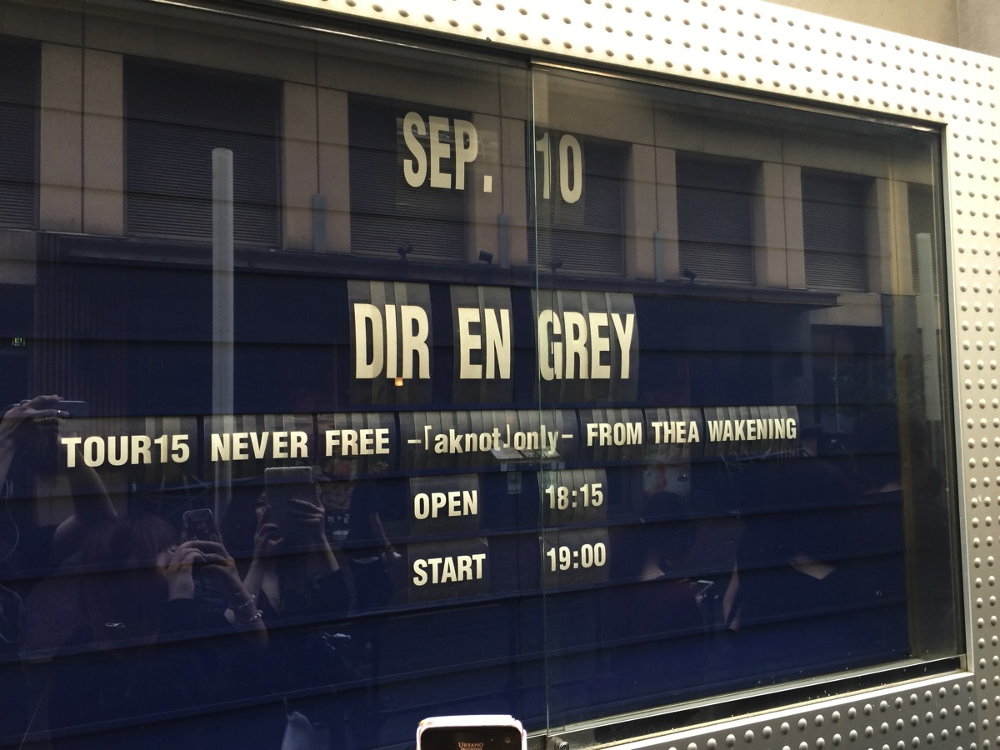
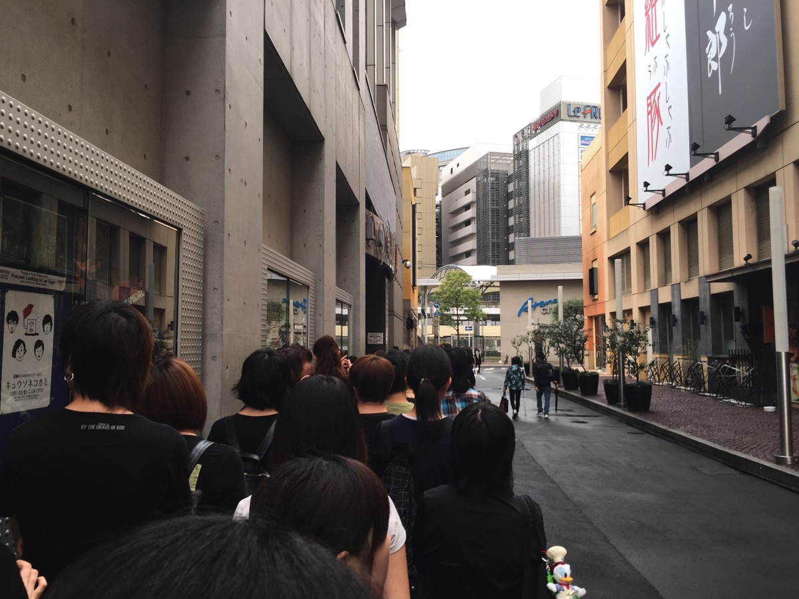
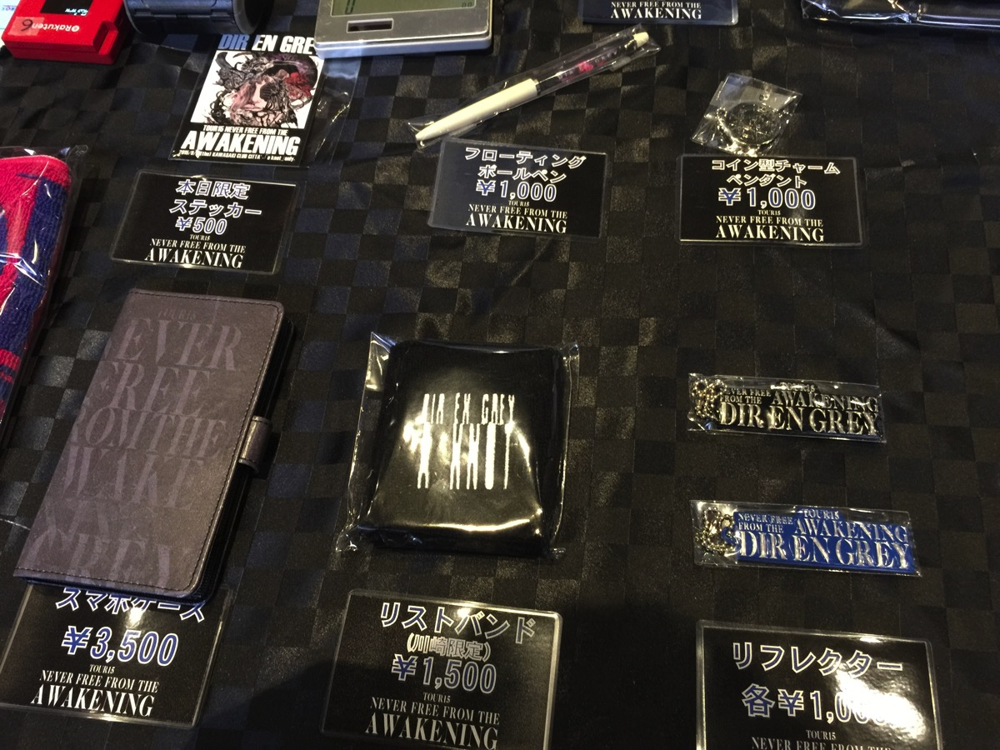
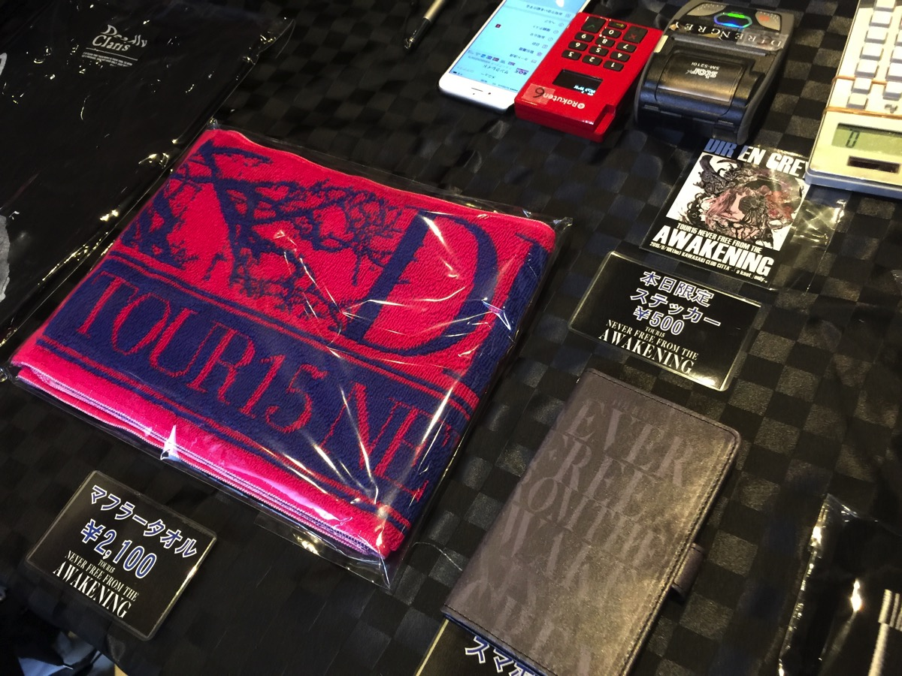
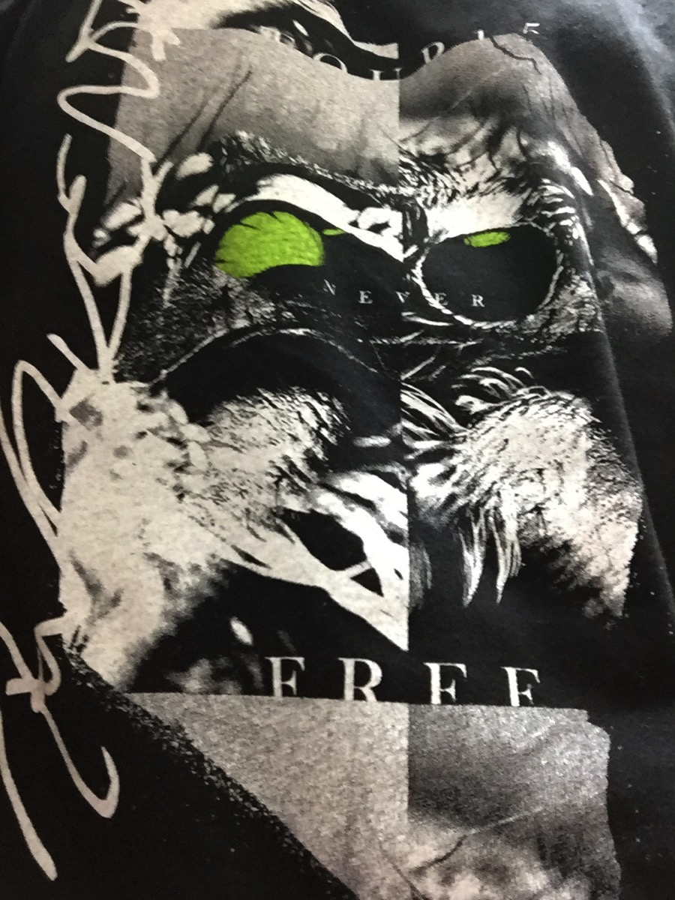
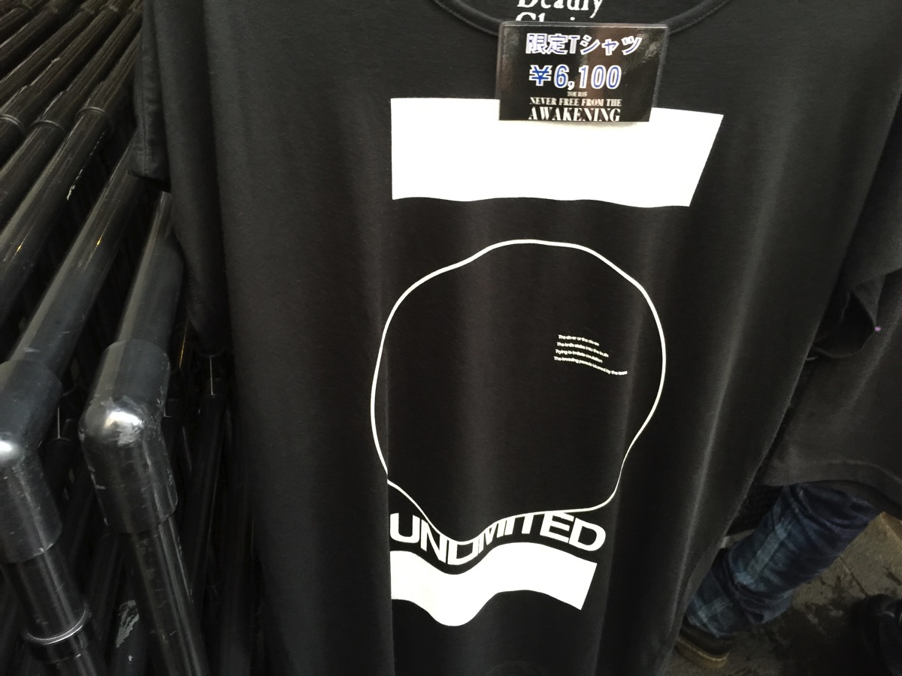
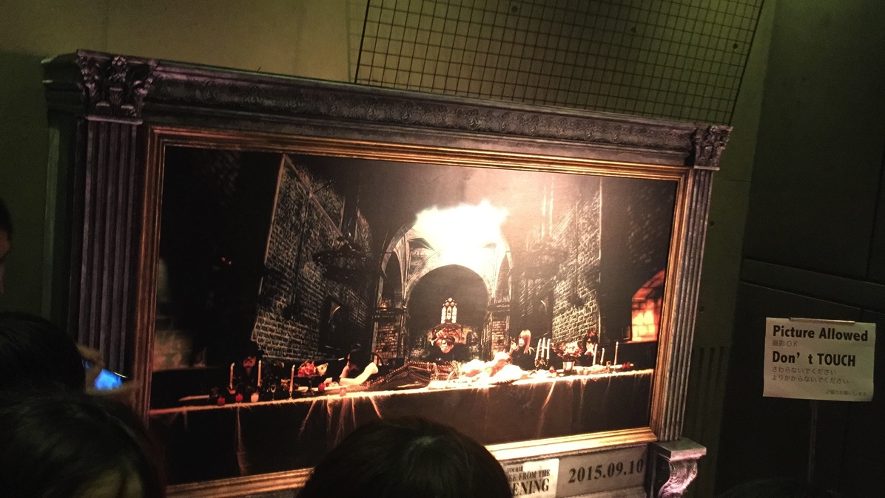

---
categories:
- DIR EN GREYのLIVEレポ
- TOUR15 NEVER FREE FROM THE AWAKENING
date: Thu, 10 Sep 2015 08:28:30 +0000
slug: post-8360
tags:
- DIR EN GREY
- LIVEレポ
title: 【ライブレポ】DIR EN GREY TOUR15 NEVER FREE FROM THE AWAKENING -｢a knot｣only-2015_9_10@CLUB
  CITTA’
---

DIR EN GREYの2015年秋のツアー初日に行ってきました。LIVEらしいLIVEでセトリも素晴らしいものでした。今回ぼくは参戦は1日のみですが、武道館へと続く素晴らしいツアーになるんじゃないかと感じました。本日はそのLIVEレポです。<!--more--><h2>TOUR15 NEVER FREE FROM THE AWAKENING@CLUB CITTA’ -｢a knot｣only- 9/10</h2>

今回のツアーは、春のツアー「THE UNSTOPPABLE LIFE」同様、アルバム「ARCHE」の流れを組むものです。思い返せば、あの頃は、冬が終わりやっと暖かくなったくらいでしたね。いやそうだっったっけ？もはやそれすら覚えてないくらい前のように感じます。

参考：<a href="https://www.warawareotoko.com/2015/04/02/post-7466/">【LIVEレポ】DIR EN GREY TOU2015 THE UNSTOPPABLE LIFE@CLUB CHITTA-a knot only-</a>

ただ、ファイナルで京が言った「このツアー全会場で120%でやろうとしてたけど、今日くらいしかできなくて、、、次のツアーはできるようにしたい。だから、お前らもそのつもりで来てください。それまでお前らも生きているように！」って言葉だけを鮮明に覚えています。

参考：<a href="https://www.warawareotoko.com/2015/05/12/post-7784/">【LIVEレポ】DIR EN GREY TOUR2015 THE UNSTOPPABLE LIFE ファイナル@新木場スタジオコースト</a>

今、読み返したら前回も台風来てたのか。嵐を呼ぶバンドだな。

<h3>今回のツアー日程</h3>

2015/9/10(木)	神奈川県	CLUB CITTA’ -｢a knot｣only- 18:15/19:00
2015/9/11(金)	神奈川県	CLUB CITTA’ -｢a knot｣only- 18:15/19:00
2015/9/15(火)	愛知県	Zepp Nagoya	★	18:15/19:00
2015/9/17(木)	京都府	KBSホール	18:15/19:00
2015/9/18(金)	京都府	KBSホール	18:15/19:00
2015/9/20(日)	大阪府	なんばHatch	★	17:15/18:00
2015/9/21(月)	大阪府	なんばHatch	★	17:15/18:00
2015/9/25(金)	広島県	BLUE LIVE 広島	18:15/19:00
2015/9/26(土)	福岡県	Zepp Fukuoka	★	17:15/18:00
2015/9/29(火)	東京都	新木場STUDIO COAST	★	18:15/19:00
2015/9/30(水)	東京都	新木場STUDIO COAST	★	18:15/19:00
2015/10/7(水)	新潟県	新潟LOTS	18:15/19:00	1Fスタンディング
2015/10/8(木)	新潟県	新潟LOTS	18:15/19:00	1Fスタンディング
2015/10/11(日)	北海道	Zepp Sapporo	★	17:15/18:00

まだ一部会場のチケット余っているみたいです。

チケットぴあ

ローチケ.com

このへんにも出品されてるみたいです。
<a href="http://ck.jp.ap.valuecommerce.com/servlet/referral?sid=3041033&pid=882660047&vc_url=http%3A%2F%2Fauctions.search.yahoo.co.jp%2Fsearch%3Fauccat%3D%26tab_ex%3Dcommerce%26ei%3Dutf-8%26p%3Ddir%2Ben%2Bgrey%2B%25E3%2583%2581%25E3%2582%25B1%25E3%2583%2583%25E3%2583%2588%26x%3D0%26y%3D0" target="_blank" rel="noopener noreferrer">ヤフオク</a>

<a href="http://ck.jp.ap.valuecommerce.com/servlet/referral?sid=3041033&pid=883513198" target="_blank" rel="noopener noreferrer">チケットキャンプ</a>

あとはTwitterで探して、直接取引きがよろしいかと思います。個人的にはTwitterで探すのが一番いいかと思います。

<h3>物販</h3>

注目は、限定Tシャツのデザインとスマホケースの作り、あとは通称<strong>「うにペン」</strong>ことフローティングボールペンです。

DIR EN GREYはいつになったらツアーグッズの通販をするのでしょうか。。。
ツアーTシャツ並んでも買えないことよくあるので、通販してほしいです。大量に購入しても、ロッカーに預けたりホテル戻ったりする手間があると思うので通販なら楽なのに。

発送はツアー初日か直前とかにすればよい。

ちなみにチッタの物販列は長くなると道路向かい側の駐車場的なところに移されます。ここが空気がこもった場所で、人間が大量にいると暑いこと暑いこと

スマホケースの仕様ですが、どうもケースにスマホを<strong>貼り付ける</strong>ようになってるらしいです。しかも一度つけたら外せないらしい・・・ちなみにカメラホールはありませんが、撮影はできるように貼り付け部分が折り返せるようになってるみたいです。

うにペンことフローティングボールペンは、ボールペンの持つ部分のところにDIR EN GREYと文字が書いてあって液体が入っています。その中にウニというかウィルスをイメージしたものが一つ入っています。これが<strong>フローティングする</strong>わけです。

Tシャツは普段使いできるくらいのいい感じのデザインです。

そしてこちらが、限定Tシャツです。Twitter上ではすこぶる評判が悪かったようですが、即完売しておりました。よく言えばシンプルなデザインです。

<h3>会場内のセット</h3>

入場してステージ入る前に「<a href="http://www.amazon.co.jp/gp/product/B00SRVC3QI/ref=as_li_ss_tl?ie=UTF8&camp=247&creative=7399&creativeASIN=B00SRVC3QI&linkCode=as2&tag=warawareotoko-22">Average Sorrow</a>」に出てきたシーンの写真が飾られていました。

ここは撮影OK

ステージは、照明器具がつけられた骨組みがステージ後方から前方に来るほど高くなるように設置されていました。

バックには9枚の布。その裏にはおそらくLEDのスクリーン。
ここに映像や歌詩が映し出されていましたが、近すぎてあまり目がいきませんでしたが、今回映像での演出は少なかった気がします。

メンバーの機材は最低限最小限だったみたいで、Dieのアンプもいつもよりもすくなく、小さいものでした。Toshiyaのアンプに至っては、無かったのかぼくからは見えませんでした。

<h3>メンバーの衣装</h3>

Dieは<strong>スギゾーを思わせる赤銅色の髪</strong>
メイクはバッチリで目のした真っ黒でした。いつものフードではなく、薄手の軽装でした。

Shinyaは白髪に近い金髪で、ばっさりと短い髪型になっていました。これまた白い薄手の服装。ただし、<strong>女子力がさらに強化された気がします。</strong>

Toshiyaはスナフキン帽子をかぶって登場。いつの間にかとった帽子の下はロングで真ん中分け。ただし、ストパーをかけすぎちゃった女子みたいな感じの髪質でした。メイクは目の周り真っ黒で目頭はキラッキラしてました。ちょっと青がかっていかにも舞台メイク！みたいな感じでした。足元はクロムハーツのハイカットのスニーカー。タイツを履いた<strong>足首はそれはそれは細かったです。</strong>

薫はタレパンダのようなバッチリメイクに薄手の<strong>布</strong>。

京はオーバーサイズの薄手のノースリーブジャケット（のようなもの）
指だけの手袋と<strong>ランドセルの肩にかける部分だけのやつ</strong>
とアクセサリーというか<strong>例の紐</strong>を少々
あとイヤモニはしていないようでした。左耳に耳栓のようなものをしているだけでした。

また、髪の毛は黒で側頭部は刈り上げのツーブロック。白いカラコンで、目の周りと頬から胸にかけて黒く塗っていました。
ちょうどゾンビが人に噛み付いて、顔に血がついた状態。そんな感じでした。

なお、本編途中メンバーがはけた時には、頬から下の黒は拭き取られ、さらにアンコールの時は完全スッピンになっていました。

<h3>セットリスト</h3>

Behind　a Vacantimage
Sustain the untruth
OBSCURE
DOZING GREEN
Merciless
朔
てふてふ
濤声
VINUSHKA
and Zero
Chain repulsion
Revelation of mankind
鱗

EN.
304
THE FINAL
激闇
CHILD PREY
Un deux

どうやらツアータイトルを引用している禍夜想は演奏なしでした。ファイナルまでやらないのかな？

初日こんなんだと明日はどんなものになるんでしょうか。
というかこれはknot only（ファンクラブ限定）だから、こんなにセトリなのかな？？

否。そんなことはない。関係なくセトリ組んでくるのがDIR EN GREYだ。

参考：<a href="https://www.warawareotoko.com/2015/05/18/post-7814/">【DIR EN GREY】「THE UNSTOPPABLE LIFE」全セトリ</a>

<h3>こぼれ話</h3>

なぜか20分以上押しました。ひたすら待っている時間が辛かったです。何があったんでしょうかね？台風関係での交通機関の乱れを考慮でもしたのかな？

でも開場もほんのすこしだけ押しました。会場内設営関係での遅れってアナウンスがありましたが。。。メンバーに何かトラブルでもなければいいのですが。

そうそうトラブルと言えば、前半2曲目くらいに薫が上手に来ようとしたタイミングで、京が振り返りぶつかっていました。

お互い「ごめんw」みたいな感じになっていました。スモーク内での出来事なので、近くにいた人しか見えなかったかもしれません。<strong>しかも、後半の方でもぶつかりかけてました。</strong>

さらに、薫関連ですが指の調子が悪化しているみたいで、とうとうピックが握れなくなったようです。

ぼくの位置から見える範囲では、親指になんらかの方法でピックを貼り付けて、さらに人差し指から中指にかけて黒いサポーターのようなもので固定していました。ギターは親指のピックか、他の指の爪で弾いていました。それでも表情には曇りが一切なくいつも通りに見えました。

個人的な見解ですが、薫はギターなんか弾けなくても、多分ギターヒーローだなって思いました。

そして、最後の最後薫から一言「きいつけてかえってな」
タイミング的にDieを見ていたので誰が言ったのかわかりませんでしたw

でも、天災に見舞われる各地の状況を見ての一言だと思います。

指だいじょうかな・・・

<h2><a href="https://twitter.com/s_s_p_y" target="_blank" rel="noopener noreferrer">しんぺー</a> はこう思った。</h2>

さて、ツアーはまだ始まったばかりです。今日からDIRと虜の新たなツアーがスタートします。皆様おケガをなさらずに体調管理をしっかりとして、首に湿布をしっかりと貼って、これからに備えましょう！！

と言ったところで本日は以上になります。おやすみなさい。